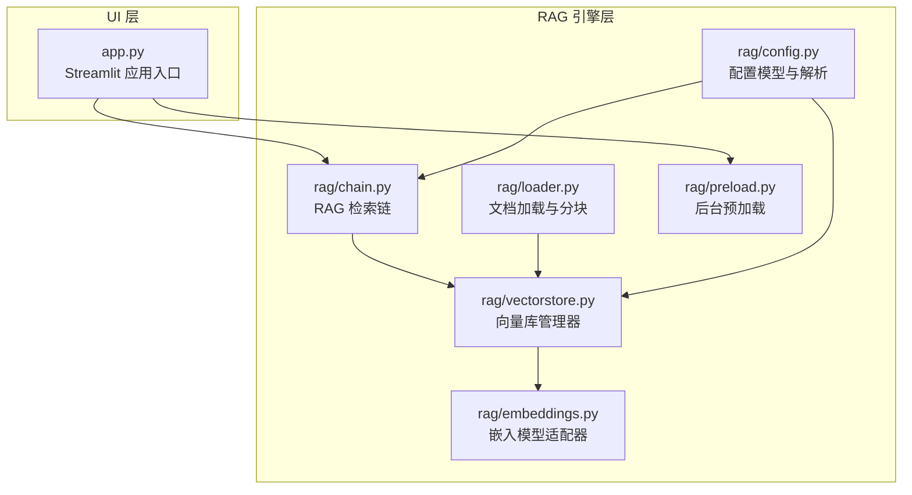
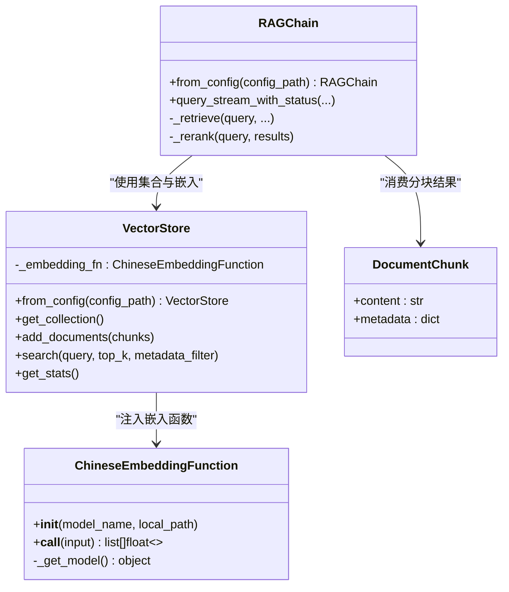
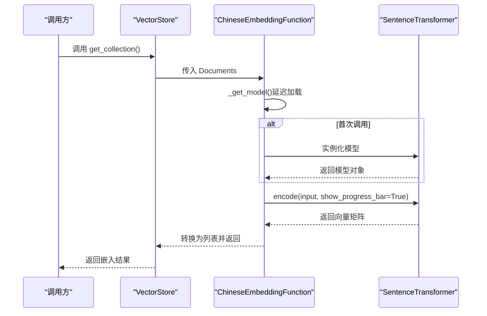
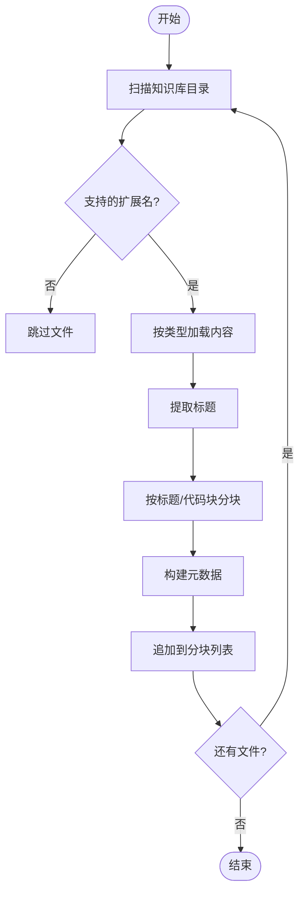
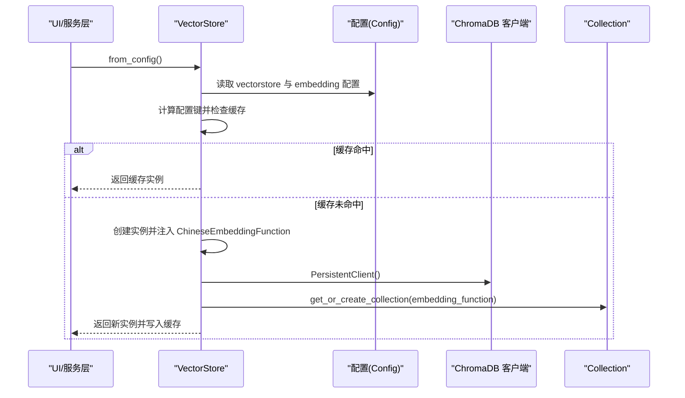
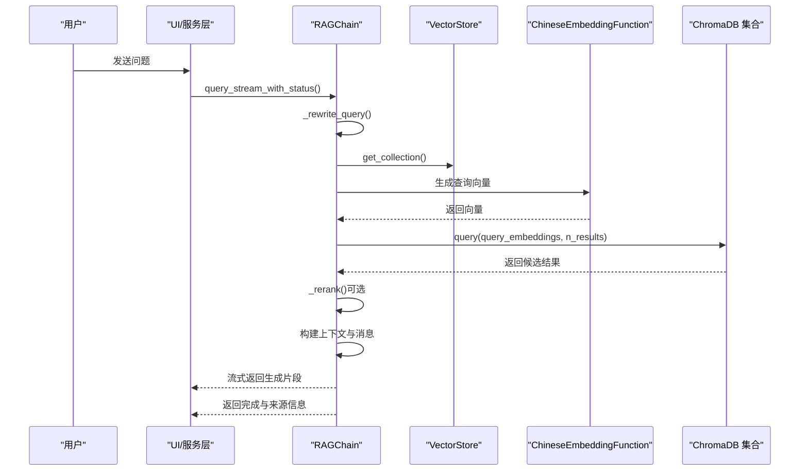
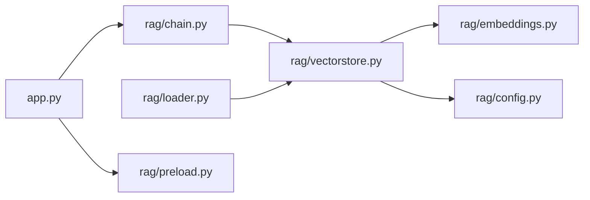

# 适配器模式应用

<cite>
**本文引用的文件**
- [rag/embeddings.py](file://rag/embeddings.py)
- [rag/vectorstore.py](file://rag/vectorstore.py)
- [rag/config.py](file://rag/config.py)
- [rag/loader.py](file://rag/loader.py)
- [rag/chain.py](file://rag/chain.py)
- [rag/preload.py](file://rag/preload.py)
- [app.py](file://app.py)
- [tests/test_embeddings.py](file://tests/test_embeddings.py)
- [tests/test_vectorstore.py](file://tests/test_vectorstore.py)
</cite>

## 目录
1. [简介](#简介)
2. [项目结构](#项目结构)
3. [核心组件](#核心组件)
4. [架构总览](#架构总览)
5. [详细组件分析](#详细组件分析)
6. [依赖关系分析](#依赖关系分析)
7. [性能考量](#性能考量)
8. [故障排查指南](#故障排查指南)
9. [结论](#结论)

## 简介
本文件聚焦知识管理系统中“适配器模式”的落地实践，围绕两类适配场景展开：
- 嵌入模型适配器：将第三方库（sentence-transformers）的模型封装为 ChromaDB 兼容的 EmbeddingFunction 接口，屏蔽底层差异，统一对外调用。
- 知识服务适配器：在文档加载与分块阶段，对不同数据源（Markdown、TXT、PDF）进行标准化处理，统一输出结构化的 DocumentChunk，供后续向量化与检索使用。

通过适配器模式，系统实现了：
- 接口不兼容问题的化解：将外部库的特定方法签名转换为统一接口，便于上层调用。
- 第三方库的无缝集成：无需修改上层逻辑即可替换或升级嵌入模型。
- 扩展性与兼容性的提升：新增模型或数据源只需实现对应适配器，不影响现有代码。

## 项目结构
项目采用“UI 层 → 服务层 → RAG 引擎层”的分层组织，其中 RAG 引擎层包含配置、嵌入、向量库、文档加载、检索链等模块。适配器主要分布在嵌入与加载两个环节。

图表来源
- [app.py:1-189](file://app.py#L1-L189)
- [rag/config.py:1-185](file://rag/config.py#L1-L185)
- [rag/embeddings.py:1-48](file://rag/embeddings.py#L1-L48)
- [rag/vectorstore.py:1-209](file://rag/vectorstore.py#L1-L209)
- [rag/loader.py:1-259](file://rag/loader.py#L1-L259)
- [rag/chain.py:1-651](file://rag/chain.py#L1-L651)
- [rag/preload.py:1-73](file://rag/preload.py#L1-L73)

章节来源
- [app.py:1-189](file://app.py#L1-L189)
- [rag/config.py:1-185](file://rag/config.py#L1-L185)

## 核心组件
- 嵌入模型适配器（ChineseEmbeddingFunction）
  - 作用：将 sentence-transformers 的模型封装为 ChromaDB 兼容的 EmbeddingFunction 接口，支持在线与离线两种加载方式，并提供延迟加载与进度日志。
  - 关键点：遵循 EmbeddingFunction 协议，实现 __call__ 方法；内部持有 SentenceTransformer 实例，首次调用时按配置加载模型。
- 向量库适配器（VectorStore）
  - 作用：封装 ChromaDB 客户端与集合操作，统一文档入库、检索、统计与切换集合等能力；内置全局单例缓存，避免重复加载嵌入模型。
  - 关键点：构造时注入 ChineseEmbeddingFunction；提供 from_config 工厂方法与全局缓存逻辑。
- 文档加载适配器（DocumentChunk 与加载函数）
  - 作用：对 Markdown、TXT、PDF 等多种数据源进行标准化，统一输出 DocumentChunk 结构，包含 content 与 metadata。
  - 关键点：按标题与代码块边界进行分块，保留元数据（来源、标题、索引、类型），并对 PDF 进行两套库的兼容加载。
- RAG 检索链（RAGChain）
  - 作用：串联检索、重排序、上下文构建与 LLM 调用，支持混合检索（向量+BM25）、RRF 融合与流式生成。
  - 关键点：通过 VectorStore 获取集合与嵌入函数；在检索阶段调用嵌入函数生成查询向量。

章节来源
- [rag/embeddings.py:19-48](file://rag/embeddings.py#L19-L48)
- [rag/vectorstore.py:24-209](file://rag/vectorstore.py#L24-L209)
- [rag/loader.py:22-259](file://rag/loader.py#L22-L259)
- [rag/chain.py:174-651](file://rag/chain.py#L174-L651)

## 架构总览
下图展示了适配器在系统中的位置与交互关系，突出嵌入模型适配器与向量库适配器如何向上层屏蔽第三方库差异。

图表来源
- [rag/embeddings.py:19-48](file://rag/embeddings.py#L19-L48)
- [rag/vectorstore.py:24-209](file://rag/vectorstore.py#L24-L209)
- [rag/loader.py:22-259](file://rag/loader.py#L22-L259)
- [rag/chain.py:174-651](file://rag/chain.py#L174-L651)

## 详细组件分析

### 嵌入模型适配器（SentenceTransformerAdapter）
- 设计思路
  - 采用“协议适配”思想：第三方库的模型方法签名与 ChromaDB 的 EmbeddingFunction 协议不一致，通过适配器在 __call__ 中桥接调用，统一输入输出。
  - 延迟加载策略：首次调用 __call__ 时才实例化底层模型，减少启动开销与资源占用。
  - 配置驱动：支持在线模型名与本地路径两种加载方式，满足网络受限与离线部署场景。
- 接口转换机制
  - 输入：Documents（字符串列表）。
  - 输出：二维浮点数组（每条记录对应一个向量）。
  - 转换过程：通过 _get_model 获取 SentenceTransformer 实例，调用 encode 方法生成向量，再转换为列表形式。
- 错误处理策略
  - 模型加载阶段的日志提示与异常捕获，避免阻塞主线程。
  - 单元测试覆盖默认初始化、本地路径覆盖与延迟加载行为，保证接口稳定性。
- 多语言模型支持
  - 通过配置项选择不同模型名或本地路径，实现多语言模型的平滑切换与替换。

图表来源
- [rag/vectorstore.py:36](file://rag/vectorstore.py#L36)
- [rag/embeddings.py:31-47](file://rag/embeddings.py#L31-L47)

章节来源
- [rag/embeddings.py:19-48](file://rag/embeddings.py#L19-L48)
- [tests/test_embeddings.py:8-30](file://tests/test_embeddings.py#L8-L30)

### 知识服务适配器（文档加载与分块）
- 设计思路
  - 将不同文件类型的读取与解析过程标准化为统一的数据结构 DocumentChunk，包含 content 与 metadata。
  - 对 Markdown 按标题与代码块边界进行语义分块，对 PDF 进行两套库的兼容加载，提升鲁棒性。
- 数据标准化流程
  - 读取文件内容（PDF 使用 pymupdf 或 fallback 到 fitz）。
  - 提取标题作为元数据的一部分。
  - 按 chunk_size 与 chunk_overlap 进行分块，保留元数据字段（来源、标题、索引、类型）。
- 错误处理策略
  - 对无法读取的文件记录警告并跳过，避免中断整个加载流程。
  - PDF 加载失败时抛出 ImportError 并给出安装指引，便于用户快速定位问题。

图表来源
- [rag/loader.py:131-197](file://rag/loader.py#L131-L197)

章节来源
- [rag/loader.py:18-259](file://rag/loader.py#L18-L259)

### 向量库适配器（VectorStore）
- 设计思路
  - 将 ChromaDB 的客户端与集合操作封装为统一接口，屏蔽底层细节。
  - 通过全局单例缓存避免重复加载嵌入模型，提升性能与一致性。
- 关键能力
  - 延迟初始化客户端与集合。
  - 支持增量更新（同 ID 删除后新增）。
  - 提供统计、切换集合、清空等辅助能力。
- 与适配器的协作
  - 构造时注入 ChineseEmbeddingFunction，确保向量化过程与上层解耦。
  - 提供 from_config 工厂方法，从配置读取向量库与嵌入参数，形成稳定的装配入口。

图表来源
- [rag/vectorstore.py:181-209](file://rag/vectorstore.py#L181-L209)
- [rag/config.py:58-70](file://rag/config.py#L58-L70)

章节来源
- [rag/vectorstore.py:24-209](file://rag/vectorstore.py#L24-L209)
- [tests/test_vectorstore.py:13-146](file://tests/test_vectorstore.py#L13-L146)

### RAG 检索链（适配器在检索阶段的应用）
- 设计思路
  - 在检索阶段通过 VectorStore 获取嵌入函数，统一生成查询向量，从而与向量库中的嵌入模型保持一致。
  - 支持混合检索（向量+BM25）与 RRF 融合，提升召回质量。
- 适配器参与点
  - 检索调用：RAGChain._retrieve 中直接调用 embedding_fn([query]) 生成查询向量。
  - 结果融合：向量与 BM25 结果通过内容哈希去重并按 RRF 分数融合。
- 错误处理与降级
  - 检索失败时返回错误状态；无匹配时走兜底提示，仍可由 LLM 基于通用知识回答。
  - LLM 流式调用失败时自动降级为非流式，必要时进行指数退避重试。

图表来源
- [rag/chain.py:250-313](file://rag/chain.py#L250-L313)
- [rag/chain.py:437-569](file://rag/chain.py#L437-L569)
- [rag/vectorstore.py:57-59](file://rag/vectorstore.py#L57-L59)
- [rag/embeddings.py:41-47](file://rag/embeddings.py#L41-L47)

章节来源
- [rag/chain.py:174-651](file://rag/chain.py#L174-L651)

## 依赖关系分析
- 组件耦合与内聚
  - VectorStore 与 ChineseEmbeddingFunction：高内聚，通过组合注入嵌入函数，职责清晰。
  - RAGChain 与 VectorStore：通过接口耦合，不关心底层嵌入实现细节。
  - Loader 与 VectorStore：Loader 负责标准化数据，VectorStore 负责持久化与检索，边界明确。
- 外部依赖与集成点
  - sentence-transformers：用于嵌入模型与 CrossEncoder reranker。
  - ChromaDB：用于向量存储与检索。
  - OpenAI SDK：用于 LLM 调用。
- 循环依赖
  - 未发现循环依赖；各模块职责单一，导入方向自上而下。

图表来源
- [rag/chain.py:14-16](file://rag/chain.py#L14-L16)
- [rag/vectorstore.py:12-15](file://rag/vectorstore.py#L12-L15)
- [rag/loader.py:12-13](file://rag/loader.py#L12-L13)
- [app.py:15-17](file://app.py#L15-L17)

章节来源
- [rag/chain.py:1-651](file://rag/chain.py#L1-L651)
- [rag/vectorstore.py:1-209](file://rag/vectorstore.py#L1-L209)
- [rag/loader.py:1-259](file://rag/loader.py#L1-L259)
- [app.py:1-189](file://app.py#L1-L189)

## 性能考量
- 延迟加载与缓存
  - 嵌入模型与 reranker 模型均采用延迟加载与类级别缓存，避免重复初始化带来的性能损耗。
- 全局单例缓存
  - VectorStore.from_config 通过配置键缓存实例，确保同一配置只加载一次嵌入模型，降低内存与时间开销。
- 检索优化
  - 向量检索结合 BM25 与 RRF 融合，提升召回质量；对低相关度结果进行标注与降权，减少无效上下文拼接。
- I/O 与解析
  - PDF 解析采用两套库兼容方案，提高成功率；分块策略兼顾语义完整性与性能。

## 故障排查指南
- 嵌入模型加载失败
  - 现象：首次调用报错或长时间无响应。
  - 排查：确认网络可达性与 HF_ENDPOINT 环境变量设置；检查模型名或本地路径是否正确。
  - 参考：嵌入函数的延迟加载与日志提示。
- 向量库初始化异常
  - 现象：创建集合或客户端时报错。
  - 排查：确认持久化目录权限与磁盘空间；检查配置项（集合名、持久化路径）是否有效。
  - 参考：VectorStore 的延迟初始化与 from_config 缓存逻辑。
- 文档加载失败
  - 现象：某些文件无法读取或解析。
  - 排查：确认文件编码与格式；PDF 需要安装 pymupdf；检查文件是否存在与可读。
  - 参考：加载函数对异常的捕获与跳过策略。
- 检索无结果或质量差
  - 现象：查询无匹配或结果相关性低。
  - 排查：调整 top_k 与距离阈值；确认嵌入模型与数据源匹配；必要时启用 BM25 与 reranker。
  - 参考：RAGChain 的检索与重排序流程。

章节来源
- [rag/embeddings.py:31-39](file://rag/embeddings.py#L31-L39)
- [rag/vectorstore.py:40-55](file://rag/vectorstore.py#L40-L55)
- [rag/loader.py:101-118](file://rag/loader.py#L101-L118)
- [rag/chain.py:250-313](file://rag/chain.py#L250-L313)

## 结论
通过在嵌入与加载两个关键环节引入适配器模式，知识管理系统实现了：
- 接口统一：上层仅需面向抽象接口，屏蔽第三方库差异。
- 平滑升级：更换嵌入模型或新增数据源只需实现适配器，不影响现有业务逻辑。
- 可靠性与可维护性：延迟加载、缓存与完善的错误处理提升了系统稳定性。

未来扩展建议：
- 新增嵌入模型：实现新的 EmbeddingFunction 子类并注入到 VectorStore。
- 新增数据源：在加载模块中增加新格式的解析与分块逻辑，统一输出 DocumentChunk。
- 配置驱动：进一步完善配置项与环境变量替换，提升部署灵活性。