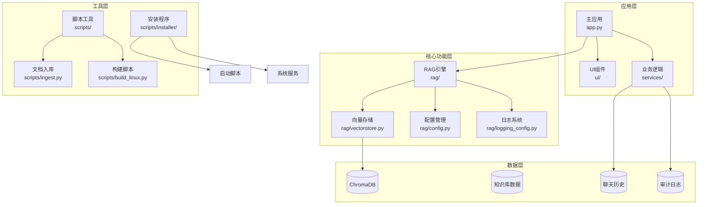
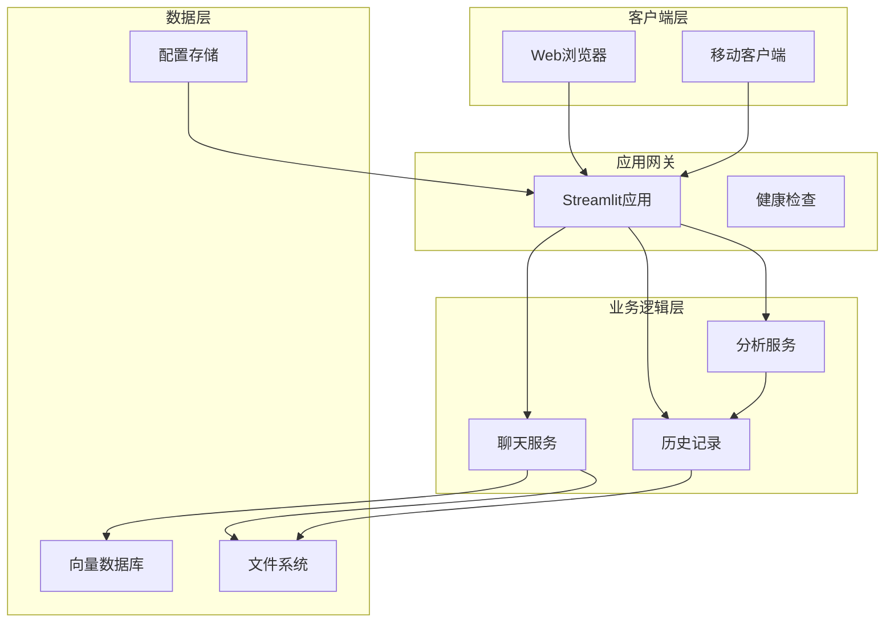
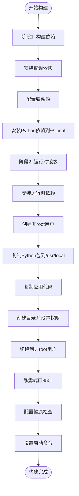
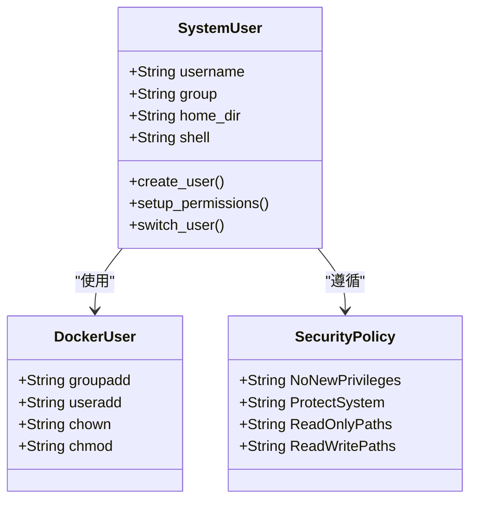
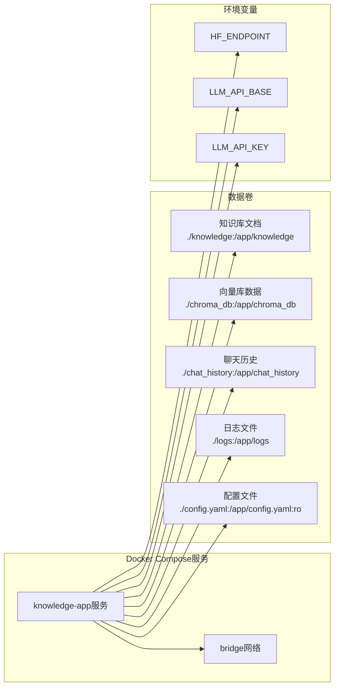
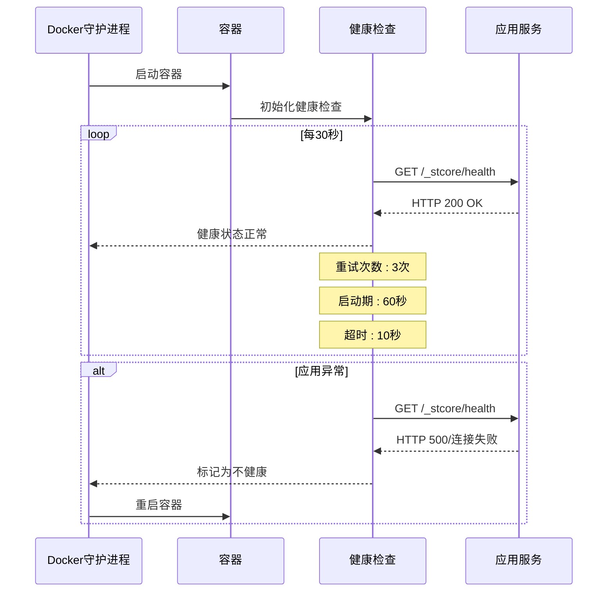
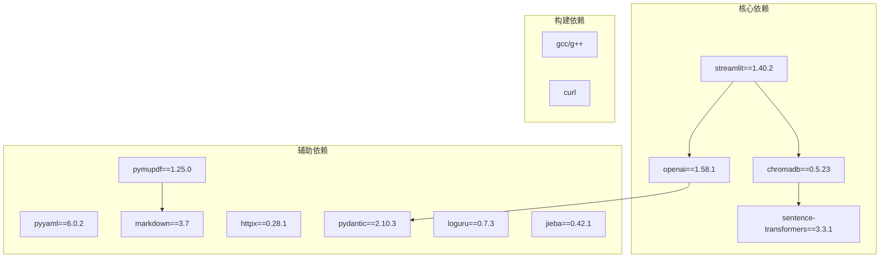
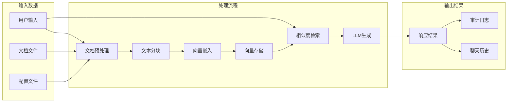
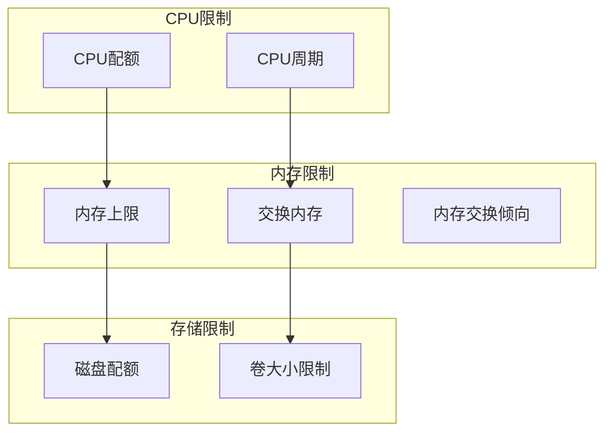
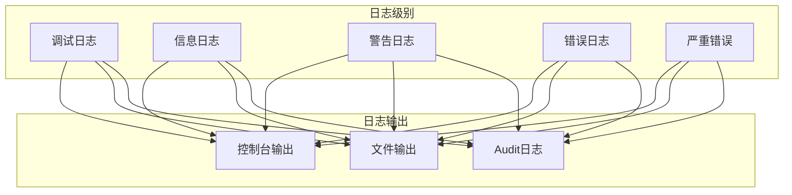

# Docker容器化部署

<cite>
**本文档引用的文件**
- [Dockerfile](file://Dockerfile)
- [.dockerignore](file://.dockerignore)
- [docker-compose.yml](file://docker-compose.yml)
- [app.py](file://app.py)
- [requirements.txt](file://requirements.txt)
- [requirements-dev.txt](file://requirements-dev.txt)
- [config.yaml](file://config.yaml)
- [rag/config.py](file://rag/config.py)
- [rag/logging_config.py](file://rag/logging_config.py)
- [scripts/ingest.py](file://scripts/ingest.py)
- [rag/vectorstore.py](file://rag/vectorstore.py)
- [scripts/installer/linux/launch.sh](file://scripts/installer/linux/launch.sh)
- [scripts/installer/linux/knowledge-assistant.service](file://scripts/installer/linux/knowledge-assistant.service)
</cite>

## 更新摘要
**变更内容**
- 更新多阶段构建流程，优化构建阶段和运行时阶段的分离
- 新增非root用户运行的安全配置
- 改进系统依赖安装策略，减少运行时依赖
- 增强镜像安全性，添加安全限制和权限控制
- 优化运行时配置，提升容器性能和稳定性

## 目录
1. [简介](#简介)
2. [项目结构](#项目结构)
3. [核心组件](#核心组件)
4. [架构概览](#架构概览)
5. [详细组件分析](#详细组件分析)
6. [依赖关系分析](#依赖关系分析)
7. [性能考虑](#性能考虑)
8. [故障排除指南](#故障排除指南)
9. [结论](#结论)
10. [附录](#附录)

## 简介

本指南详细说明了知识库智能问答系统的Docker容器化部署方案。该系统基于Python 3.11构建，使用Streamlit作为Web界面，集成了RAG（检索增强生成）功能，支持向量数据库ChromaDB和多种文档格式处理。

系统采用**多阶段Docker构建**，确保镜像体积最小化和安全性优化。通过docker-compose进行编排，支持环境变量配置、数据持久化和网络隔离。**非root用户运行**策略提升了容器安全性，配合**系统依赖优化**减少了运行时镜像的复杂性。

## 项目结构

项目采用模块化架构，主要包含以下核心模块：



**图表来源**
- [app.py:1-189](file://app.py#L1-L189)
- [rag/config.py:1-199](file://rag/config.py#L1-L199)
- [rag/vectorstore.py:1-209](file://rag/vectorstore.py#L1-L209)

**章节来源**
- [app.py:1-189](file://app.py#L1-L189)
- [README.md:1-3](file://README.md#L1-L3)

## 核心组件

### Docker镜像构建

系统采用**两阶段Docker构建策略**，实现了构建时依赖和运行时依赖的完全分离：

**第一阶段（构建阶段）**
- 基础镜像：python:3.11-slim
- 安装编译工具链（gcc, g++, curl）
- 配置国内镜像源（通过构建参数控制）
- 安装Python依赖包到用户目录（~/.local）

**第二阶段（运行阶段）**
- 基础镜像：python:3.11-slim（仅运行时依赖）
- 仅安装必要的运行时系统依赖
- 创建专用非root用户（knowledge）
- 复制构建阶段的Python包
- 设置目录权限和所有权
- 配置健康检查和启动命令

### 环境配置

系统支持多种配置方式：

**静态配置**：通过config.yaml文件设置基础参数
**动态配置**：通过环境变量覆盖配置项
**容器特定配置**：通过Docker环境变量和卷挂载

**章节来源**
- [Dockerfile:1-68](file://Dockerfile#L1-L68)
- [config.yaml:1-62](file://config.yaml#L1-L62)
- [rag/config.py:127-160](file://rag/config.py#L127-L160)

## 架构概览

系统采用微服务架构，主要组件包括：



**图表来源**
- [app.py:54-86](file://app.py#L54-L86)
- [rag/vectorstore.py:181-209](file://rag/vectorstore.py#L181-L209)
- [rag/logging_config.py:86-129](file://rag/logging_config.py#L86-L129)

## 详细组件分析

### Dockerfile多阶段构建流程



**图表来源**
- [Dockerfile:2-68](file://Dockerfile#L2-L68)

#### 构建阶段详解

**阶段1：构建依赖**
- 使用python:3.11-slim作为基础镜像
- 安装gcc、g++、curl等编译工具
- 配置国内镜像源（通过USE_MIRROR构建参数控制）
- 使用--no-cache-dir避免缓存污染
- 将Python包安装到用户目录（~/.local）以避免权限问题

**阶段2：运行时优化**
- 重新使用python:3.11-slim作为基础镜像
- 仅安装必要的运行时依赖（curl）
- 创建专用用户组和用户（knowledge）
- 复制构建阶段的Python包到/usr/local
- 设置工作目录和权限

#### 用户权限管理

系统采用最小权限原则：



**图表来源**
- [Dockerfile:35-52](file://Dockerfile#L35-L52)
- [scripts/installer/linux/knowledge-assistant.service:5-26](file://scripts/installer/linux/knowledge-assistant.service#L5-L26)

**更新** 新增了专门的非root用户运行配置，提升了容器安全性

### docker-compose编排配置



**图表来源**
- [docker-compose.yml:3-60](file://docker-compose.yml#L3-L60)
- [docker-compose.yml:20-30](file://docker-compose.yml#L20-L30)

#### 端口映射和网络配置

- 主应用端口：8501:8501（TCP）
- 网络模式：bridge驱动
- 重启策略：unless-stopped
- 网络隔离：专用网络知识库网络

#### 数据持久化策略

系统通过多个数据卷实现关键数据的持久化：

| 数据类型 | 挂载路径 | 用途 | 访问权限 |
|---------|----------|------|----------|
| 知识库文档 | ./knowledge:/app/knowledge | 用户上传的文档 | 读写 |
| 向量库数据 | ./chroma_db:/app/chroma_db | ChromaDB持久化 | 读写 |
| 聊天历史 | ./chat_history:/app/chat_history | 用户对话记录 | 读写 |
| 日志文件 | ./logs:/app/logs | 应用日志和审计日志 | 读写 |
| 配置文件 | ./config.yaml:/app/config.yaml:ro | 应用配置 | 只读 |

**章节来源**
- [docker-compose.yml:13-30](file://docker-compose.yml#L13-L30)
- [.dockerignore:12-18](file://.dockerignore#L12-L18)

### 健康检查机制



**图表来源**
- [Dockerfile:57-59](file://Dockerfile#L57-L59)

健康检查配置参数说明：

- 间隔时间：30秒
- 超时时间：10秒  
- 启动等待：60秒
- 重试次数：3次
- 检查端点：http://localhost:8501/_stcore/health

**更新** 健康检查机制更加完善，支持更精确的应用状态检测

### 配置管理系统

系统采用多层次配置管理：

```mermaid
flowchart TD
ConfigFile[config.yaml配置文件] --> EnvResolver[环境变量解析器]
EnvResolver --> PydanticModel[Pydantic配置模型]
PydanticModel --> RuntimeConfig[运行时配置]
subgraph "环境变量支持"
ENV1[${LLM_API_BASE}]
ENV2[${LLM_API_KEY}]
ENV3[${HF_ENDPOINT}]
ENV4[${ENV_VAR:-默认值}]
end
ENV1 --> EnvResolver
ENV2 --> EnvResolver
ENV3 --> EnvResolver
ENV4 --> EnvResolver
subgraph "配置验证"
Validator[字段验证器]
Defaults[默认值设置]
TypeCheck[类型检查]
end
PydanticModel --> Validator
PydanticModel --> Defaults
PydanticModel --> TypeCheck
```

**图表来源**
- [rag/config.py:21-43](file://rag/config.py#L21-L43)
- [rag/config.py:127-160](file://rag/config.py#L127-L160)

#### 配置优先级

1. **环境变量**（最高优先级）
2. **config.yaml文件**（中间优先级）
3. **代码默认值**（最低优先级）

**章节来源**
- [rag/config.py:138-150](file://rag/config.py#L138-L150)
- [config.yaml:1-62](file://config.yaml#L1-L62)

## 依赖关系分析

### Python依赖管理

系统使用requirements.txt管理Python依赖：



**图表来源**
- [requirements.txt:1-12](file://requirements.txt#L1-L12)

**更新** 新增了jieba中文分词库，增强了中文处理能力

### 数据流分析



**图表来源**
- [scripts/ingest.py:25-58](file://scripts/ingest.py#L25-L58)
- [rag/vectorstore.py:89-142](file://rag/vectorstore.py#L89-L142)

**章节来源**
- [requirements.txt:1-12](file://requirements.txt#L1-L12)
- [scripts/ingest.py:17-22](file://scripts/ingest.py#L17-L22)

## 性能考虑

### 镜像优化策略

1. **多阶段构建**：减少最终镜像大小
2. **精简基础镜像**：使用python:3.11-slim
3. **依赖缓存**：利用Docker层缓存机制
4. **非root用户**：提高容器安全性

**更新** 新增了构建阶段和运行时阶段的完全分离，进一步优化了镜像大小

### 运行时性能优化

1. **向量库缓存**：避免重复加载embedding模型
2. **增量更新**：支持文档的增量入库
3. **连接池管理**：优化数据库连接
4. **内存管理**：合理配置Python内存参数

### 资源限制建议



**更新** 增加了系统依赖优化，减少了运行时镜像的复杂性

## 故障排除指南

### 常见问题及解决方案

**问题1：容器启动后立即退出**
- 检查健康检查配置
- 验证端口占用情况
- 查看应用启动日志

**问题2：文档无法入库**
- 检查文档格式支持
- 验证向量模型可用性
- 确认磁盘空间充足

**问题3：聊天功能异常**
- 检查LLM API配置
- 验证网络连接
- 查看错误日志

**更新** 新增了非root用户运行相关的故障排除指导

### 日志收集和分析

系统提供多层级日志支持：



**图表来源**
- [rag/logging_config.py:46-75](file://rag/logging_config.py#L46-L75)
- [rag/logging_config.py:86-129](file://rag/logging_config.py#L86-L129)

### 监控指标

建议监控以下关键指标：

1. **应用层面**：响应时间、错误率、并发数
2. **系统层面**：CPU使用率、内存使用率、磁盘I/O
3. **业务层面**：查询量、向量库大小、用户活跃度

**章节来源**
- [rag/logging_config.py:106-129](file://rag/logging_config.py#L106-L129)

## 结论

本Docker容器化部署方案提供了完整的知识库智能问答系统部署解决方案。通过**多阶段构建**、**最小权限原则**和**完善的配置管理**，确保了系统的安全性、可维护性和可扩展性。

**更新后的关键优势**：
- **安全性**：非root用户运行，最小权限原则，系统依赖优化
- **可维护性**：清晰的配置层次和环境变量支持
- **可扩展性**：模块化设计，支持水平扩展
- **可观测性**：完整的日志和健康检查机制
- **性能优化**：多阶段构建减少镜像大小，运行时依赖最小化

## 附录

### 生产环境部署最佳实践

1. **镜像安全**
   - 定期更新基础镜像
   - 使用只读根文件系统
   - 配置seccomp和AppArmor

2. **资源配置**
   - 为不同服务设置合理的资源限制
   - 配置适当的重启策略
   - 使用负载均衡和副本数

3. **数据保护**
   - 定期备份向量库数据
   - 配置数据加密传输
   - 实施访问控制和审计

4. **监控告警**
   - 配置应用性能监控
   - 设置健康检查告警
   - 实施日志聚合和分析

**更新** 新增了非root用户运行和系统依赖优化的最佳实践

### 快速启动命令

```bash
# 构建镜像
docker build -t knowledge-assistant:latest .

# 启动容器
docker run -d \
  --name knowledge-app \
  --restart unless-stopped \
  -p 8501:8501 \
  -v ./knowledge:/app/knowledge \
  -v ./chroma_db:/app/chroma_db \
  -v ./chat_history:/app/chat_history \
  -v ./logs:/app/logs \
  -v ./config.yaml:/app/config.yaml:ro \
  -e HF_ENDPOINT=https://hf-mirror.com \
  -e LLM_API_BASE=${LLM_API_BASE:-https://open.bigmodel.cn/api/paas/v4} \
  -e LLM_API_KEY=${LLM_API_KEY:-EMPTY} \
  knowledge-assistant:latest
```

**更新** 增加了环境变量配置选项

### 环境变量参考

| 环境变量 | 默认值 | 说明 |
|---------|--------|------|
| HF_ENDPOINT | https://hf-mirror.com | HuggingFace镜像源地址 |
| LLM_API_BASE | https://open.bigmodel.cn/api/paas/v4 | LLM API基础URL |
| LLM_API_KEY | EMPTY | LLM API密钥 |
| PYTHONUNBUFFERED | 1 | Python输出缓冲控制 |
| MODEL_ROOT | model | 本地模型根目录 |

**更新** 新增了MODEL_ROOT环境变量，支持离线模型部署

### 系统服务配置

```bash
[Unit]
Description=知识库智能问答系统 (Knowledge Assistant RAG Service)
After=network.target

[Service]
Type=simple
User=knowledge-assistant
Group=knowledge-assistant
WorkingDirectory=/opt/knowledge-assistant/app
ExecStart=/opt/knowledge-assistant/python/bin/python3 -m streamlit run app.py \
    --server.port 8501 \
    --server.address 0.0.0.0 \
    --server.headless true \
    --browser.gatherUsageStats false \
    --server.enableCORS false
Restart=on-failure
RestartSec=5

# 环境变量
Environment=HF_ENDPOINT=https://hf-mirror.com

# 安全限制
NoNewPrivileges=true
ProtectSystem=strict
ReadWritePaths=/var/lib/knowledge-assistant /var/log/knowledge-assistant

[Install]
WantedBy=multi-user.target
```

**更新** 新增了完整的系统服务配置，支持systemd管理