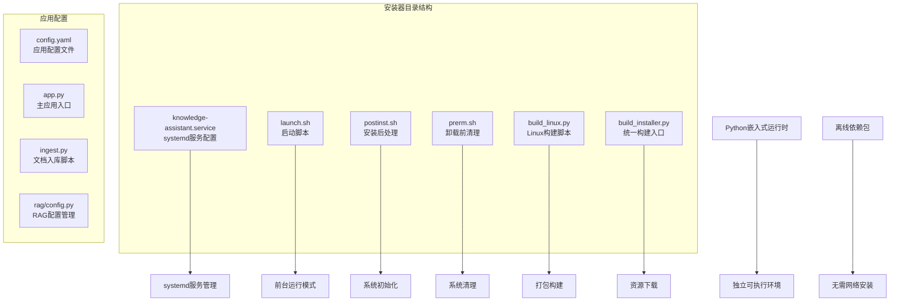
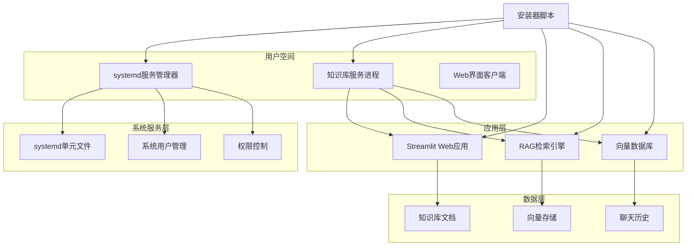
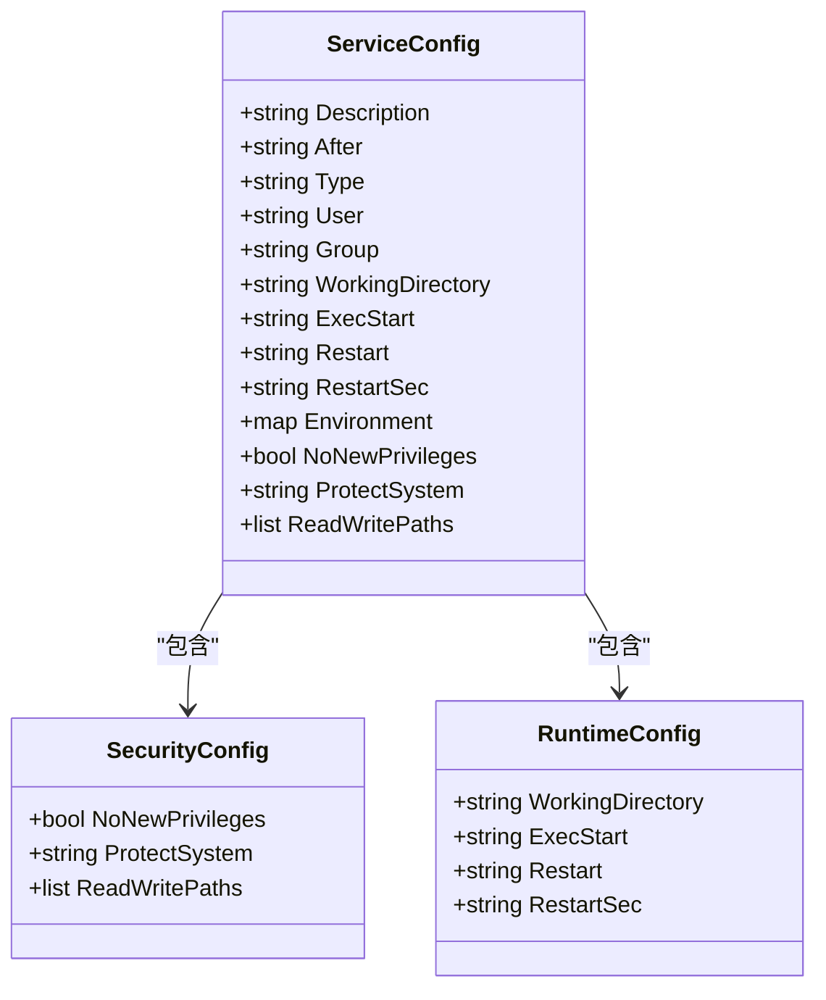
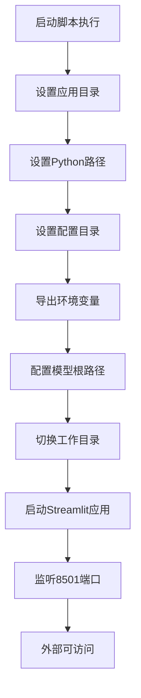
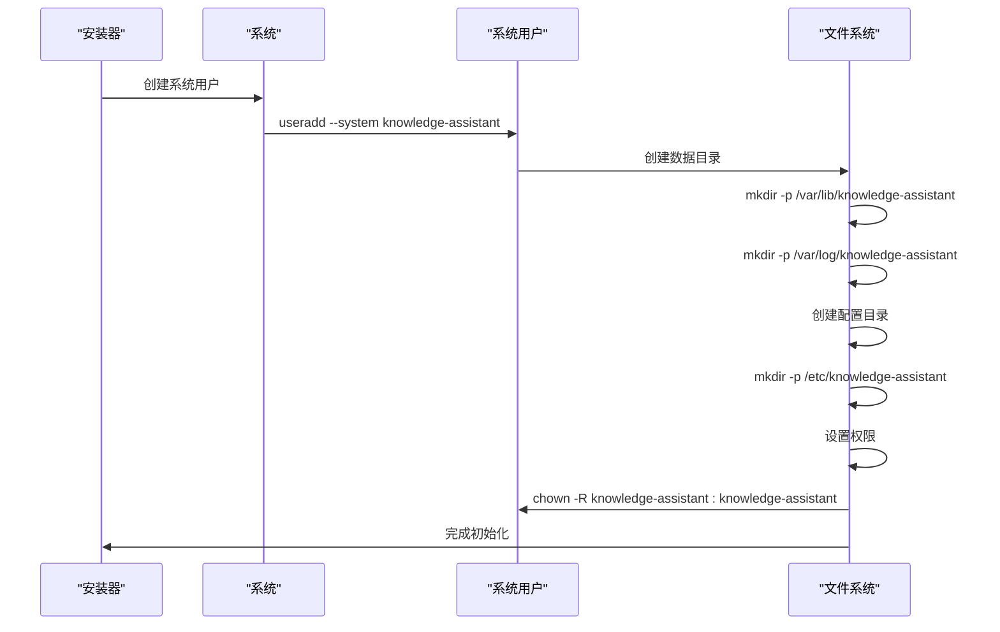
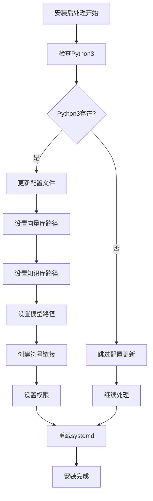
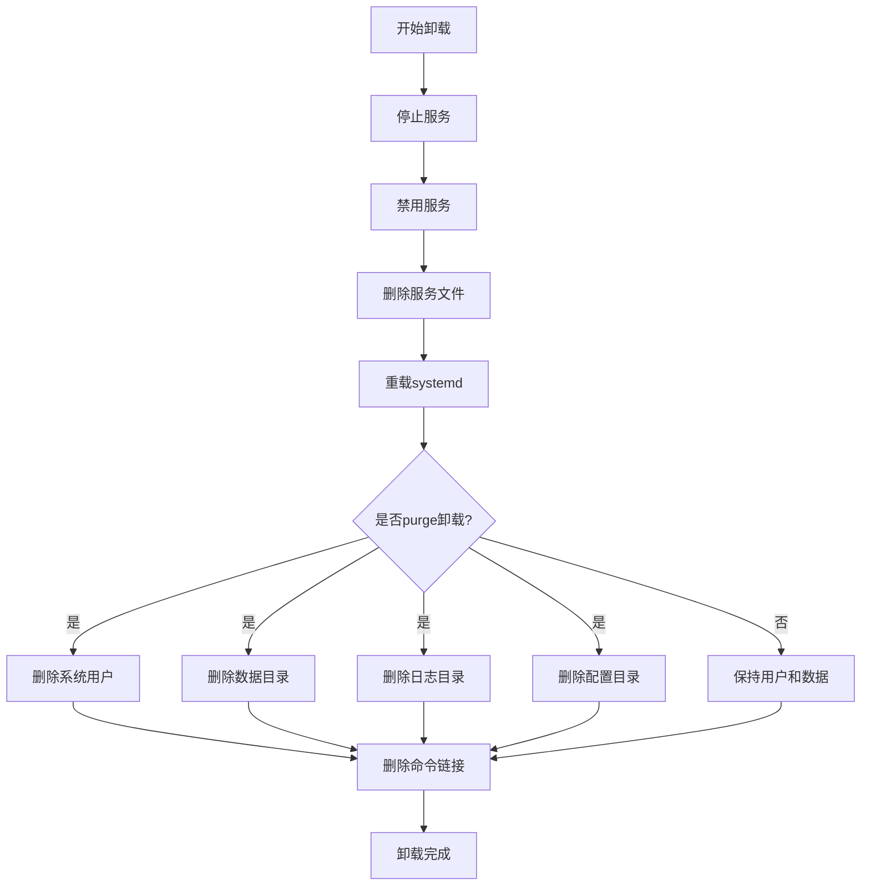
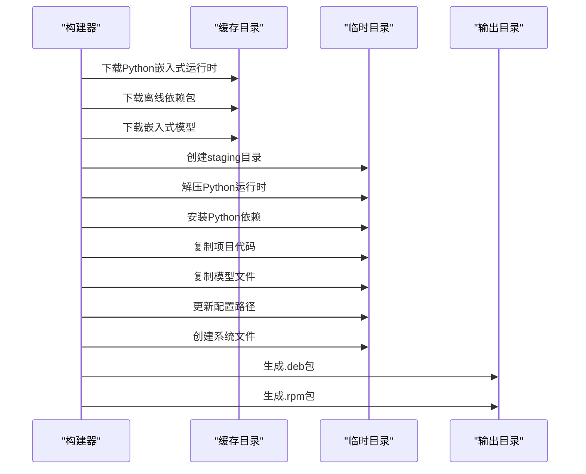
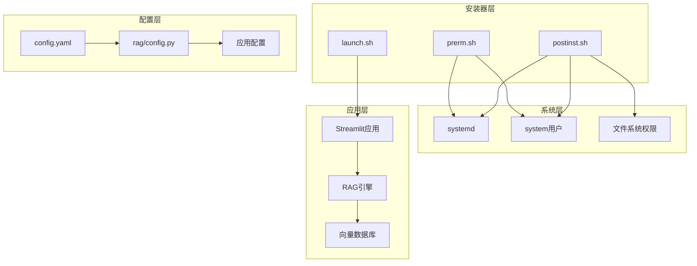

# Linux安装器

<cite>
**本文引用的文件**
- [knowledge-assistant.service](file://scripts/installer/linux/knowledge-assistant.service)
- [launch.sh](file://scripts/installer/linux/launch.sh)
- [postinst.sh](file://scripts/installer/linux/postinst.sh)
- [prerm.sh](file://scripts/installer/linux/prerm.sh)
- [build_linux.py](file://scripts/build_linux.py)
- [build_installer.py](file://scripts/build_installer.py)
- [config.yaml](file://config.yaml)
- [app.py](file://app.py)
- [ingest.py](file://scripts/ingest.py)
- [config.py](file://rag/config.py)
</cite>

## 目录
1. [简介](#简介)
2. [项目结构](#项目结构)
3. [核心组件](#核心组件)
4. [架构概览](#架构概览)
5. [详细组件分析](#详细组件分析)
6. [依赖关系分析](#依赖关系分析)
7. [性能考虑](#性能考虑)
8. [故障排除指南](#故障排除指南)
9. [结论](#结论)

## 简介

Linux安装器是知识库智能问答系统的核心部署组件，负责将完整的应用程序打包、安装和配置为可运行的服务。该安装器基于systemd服务管理器，提供了完整的Linux系统集成解决方案，包括服务注册、开机自启、权限管理和日志配置等功能。

本安装器采用现代化的打包策略，使用Python嵌入式运行时和离线依赖管理，确保在各种Linux环境中的一致性和可靠性。通过精心设计的安装脚本和配置文件，系统管理员可以轻松地在生产环境中部署和维护知识库问答服务。

## 项目结构

Linux安装器位于项目的`scripts/installer/linux/`目录下，包含以下关键文件：

**图表来源**
- [knowledge-assistant.service:1-29](file://scripts/installer/linux/knowledge-assistant.service#L1-L29)
- [build_linux.py:1-253](file://scripts/build_linux.py#L1-L253)

**章节来源**
- [knowledge-assistant.service:1-29](file://scripts/installer/linux/knowledge-assistant.service#L1-L29)
- [build_linux.py:1-253](file://scripts/build_linux.py#L1-L253)

## 核心组件

Linux安装器由四个主要组件构成，每个组件都有特定的功能和职责：

### systemd服务配置组件
- **服务文件**: `knowledge-assistant.service` - 定义systemd服务的完整配置
- **服务类型**: simple类型，支持自动重启机制
- **用户权限**: 使用专用系统用户运行，增强安全性
- **工作目录**: `/opt/knowledge-assistant/app`

### 启动脚本组件
- **启动脚本**: `launch.sh` - 提供前台运行模式的启动脚本
- **环境变量**: 设置离线模型根路径环境变量（MODEL_ROOT），指向本地模型目录
- **端口配置**: 默认监听8501端口，支持外部访问
- **Streamlit配置**: 禁用CORS，优化生产环境

### 安装后处理组件
- **postinst.sh**: Debian/Ubuntu包安装后的处理脚本
- **用户管理**: 自动创建专用系统用户
- **目录结构**: 初始化数据、日志和配置目录
- **权限设置**: 正确设置文件和目录权限
- **配置更新**: 动态修改配置文件中的路径

### 卸载前清理组件
- **prerm.sh**: 包卸载前的清理脚本
- **服务停止**: 安全停止和禁用服务
- **文件清理**: 删除系统文件和符号链接
- **用户管理**: 支持完全清理系统用户

**章节来源**
- [knowledge-assistant.service:1-29](file://scripts/installer/linux/knowledge-assistant.service#L1-L29)
- [launch.sh:1-26](file://scripts/installer/linux/launch.sh#L1-L26)
- [postinst.sh:1-72](file://scripts/installer/linux/postinst.sh#L1-L72)
- [prerm.sh:1-25](file://scripts/installer/linux/prerm.sh#L1-L25)

## 架构概览

Linux安装器采用分层架构设计，确保了模块化和可维护性：

**图表来源**
- [knowledge-assistant.service:1-29](file://scripts/installer/linux/knowledge-assistant.service#L1-L29)
- [app.py:1-189](file://app.py#L1-L189)

该架构实现了以下关键特性：
- **隔离性**: 专用系统用户运行服务，限制权限范围
- **稳定性**: systemd自动重启机制，提高服务可用性
- **可扩展性**: 模块化设计，便于功能扩展
- **安全性**: 最小权限原则，严格的安全限制

## 详细组件分析

### systemd服务配置分析

#### 服务文件参数详解

**图表来源**
- [knowledge-assistant.service:1-29](file://scripts/installer/linux/knowledge-assistant.service#L1-L29)

**服务配置参数**:
- **描述信息**: 知识库智能问答系统服务
- **依赖关系**: 网络就绪后启动
- **执行类型**: simple类型，适合长期运行服务
- **用户权限**: knowledge-assistant专用用户
- **工作目录**: 应用程序根目录
- **重启策略**: 失败后5秒自动重启

**安全配置**:
- **权限限制**: NoNewPrivileges=true，防止提权
- **系统保护**: ProtectSystem=strict，限制对系统目录的写入
- **路径访问**: 明确声明可读写的路径

**章节来源**
- [knowledge-assistant.service:1-29](file://scripts/installer/linux/knowledge-assistant.service#L1-L29)

#### 启动脚本环境变量配置

启动脚本通过环境变量确保正确的运行时配置：

**图表来源**
- [launch.sh:1-26](file://scripts/installer/linux/launch.sh#L1-L26)

**环境变量设置**:
- **MODEL_ROOT**: 指定离线模型根路径，本地模型存在时优先离线加载
- **工作目录**: 切换到应用程序目录
- **端口配置**: 8501端口，0.0.0.0地址允许外部访问

**章节来源**
- [launch.sh:1-26](file://scripts/installer/linux/launch.sh#L1-L26)

### 安装后处理脚本分析

#### 用户和权限管理

安装后处理脚本负责完整的系统初始化：

**图表来源**
- [postinst.sh:1-72](file://scripts/installer/linux/postinst.sh#L1-L72)

**用户管理流程**:
- **系统用户创建**: `knowledge-assistant`专用用户，无登录权限
- **目录结构**: 数据、日志、配置分离管理
- **权限设置**: 严格的文件权限控制

**配置管理**:
- **路径更新**: 动态修改配置文件中的绝对路径
- **符号链接**: 创建配置文件符号链接，便于维护
- **首次安装**: 仅在首次安装时创建配置文件

**章节来源**
- [postinst.sh:1-72](file://scripts/installer/linux/postinst.sh#L1-L72)

#### 依赖检查和配置更新

**图表来源**
- [postinst.sh:34-52](file://scripts/installer/linux/postinst.sh#L34-L52)

**配置更新机制**:
- **动态路径**: 根据安装位置动态更新配置
- **YAML处理**: 使用Python解析和修改配置文件
- **路径映射**: 
  - 向量库: `/var/lib/knowledge-assistant/chroma_db`
  - 知识库: `/var/lib/knowledge-assistant/knowledge`
  - 模型: `/opt/knowledge-assistant/model`

**章节来源**
- [postinst.sh:34-52](file://scripts/installer/linux/postinst.sh#L34-L52)

### 卸载前清理脚本分析

#### 清理流程设计

**图表来源**
- [prerm.sh:1-25](file://scripts/installer/linux/prerm.sh#L1-L25)

**清理策略**:
- **服务管理**: 安全停止和禁用服务
- **文件清理**: 删除systemd服务文件和命令链接
- **选择性清理**: 支持保留用户和数据的卸载

**章节来源**
- [prerm.sh:1-25](file://scripts/installer/linux/prerm.sh#L1-L25)

### 构建系统分析

#### Linux安装包构建流程

**图表来源**
- [build_linux.py:20-253](file://scripts/build_linux.py#L20-L253)

**构建流程特点**:
- **离线安装**: 所有依赖预先下载，支持无网络环境
- **多平台支持**: 同时生成Debian和RedHat包
- **资源管理**: 智能缓存和资源复用
- **自动化测试**: 包含错误处理和回退机制

**章节来源**
- [build_linux.py:20-253](file://scripts/build_linux.py#L20-L253)
- [build_installer.py:1-260](file://scripts/build_installer.py#L1-L260)

## 依赖关系分析

Linux安装器的依赖关系体现了清晰的层次结构：

**图表来源**
- [postinst.sh:1-72](file://scripts/installer/linux/postinst.sh#L1-L72)
- [prerm.sh:1-25](file://scripts/installer/linux/prerm.sh#L1-L25)
- [config.py:1-185](file://rag/config.py#L1-L185)

**依赖关系特点**:
- **低耦合**: 各组件职责明确，相互独立
- **向上依赖**: 应用层依赖配置层，但不反向依赖
- **向下依赖**: 安装器依赖系统服务，但不依赖应用层
- **可替换性**: 配置层支持运行时切换

**章节来源**
- [config.py:1-185](file://rag/config.py#L1-L185)

## 性能考虑

Linux安装器在设计时充分考虑了性能和可靠性：

### 启动性能优化
- **快速启动**: systemd服务配置支持快速重启
- **内存管理**: Streamlit应用的内存使用优化
- **并发处理**: 多轮对话支持并发请求处理

### 资源管理
- **磁盘空间**: 向量数据库的压缩存储策略
- **离线模型**: 离线本地模型完全消除网络下载消耗
- **CPU使用**: 智能的预加载机制避免重复计算

### 可靠性保障
- **自动恢复**: 失败后5秒自动重启
- **健康检查**: 定期的状态检查机制
- **日志监控**: 完整的日志记录和分析

## 故障排除指南

### 常见问题及解决方案

#### 服务启动失败
**症状**: `systemctl start knowledge-assistant` 失败
**排查步骤**:
1. 检查服务状态: `systemctl status knowledge-assistant`
2. 查看日志: `journalctl -u knowledge-assistant -n 50`
3. 验证配置: `cat /etc/knowledge-assistant/config.yaml`
4. 检查权限: `ls -la /var/lib/knowledge-assistant`

#### 权限问题
**症状**: 无法访问知识库或向量数据库
**解决方案**:
1. 检查用户权限: `id knowledge-assistant`
2. 验证目录权限: `ls -la /var/lib/knowledge-assistant`
3. 重新设置权限: `chown -R knowledge-assistant:knowledge-assistant /var/lib/knowledge-assistant`

#### 端口冲突
**症状**: 端口8501被占用
**解决方法**:
1. 查找占用进程: `lsof -i :8501`
2. 修改配置: 在`/etc/knowledge-assistant/config.yaml`中修改端口
3. 重启服务: `systemctl restart knowledge-assistant`

#### 模型加载失败
**症状**: 启动时报错找不到模型文件
**排查步骤**:
1. 检查模型目录: `ls -la /opt/knowledge-assistant/model`
2. 验证环境变量: `echo $MODEL_ROOT`
3. 重新下载模型: `knowledge-ingest`

**章节来源**
- [postinst.sh:54-58](file://scripts/installer/linux/postinst.sh#L54-L58)
- [prerm.sh:18-24](file://scripts/installer/linux/prerm.sh#L18-L24)

### 日志分析

#### 日志位置
- **服务日志**: `/var/log/knowledge-assistant/`
- **系统日志**: `journalctl -u knowledge-assistant`
- **应用日志**: Streamlit内置日志

#### 日志格式
- **时间戳**: ISO 8601格式
- **级别**: INFO/WARNING/ERROR
- **上下文**: 请求ID和用户信息

**章节来源**
- [knowledge-assistant.service:25-25](file://scripts/installer/linux/knowledge-assistant.service#L25-L25)

## 结论

Linux安装器为知识库智能问答系统提供了完整、可靠的部署解决方案。通过精心设计的systemd服务配置、启动脚本和安装器脚本，系统管理员可以轻松地在各种Linux环境中部署和维护服务。

### 主要优势
- **安全性**: 专用系统用户和严格权限控制
- **可靠性**: 自动重启机制和健康检查
- **易用性**: 简化的安装和卸载流程
- **可维护性**: 清晰的配置管理和日志系统

### 技术特色
- **离线安装**: 完全离线的依赖管理和安装过程
- **多平台支持**: 同时支持Debian和RedHat系发行版
- **自动化程度高**: 从资源下载到包生成的全流程自动化
- **配置灵活**: 支持运行时配置热更新

该安装器不仅满足了当前的知识库问答需求，还为未来的功能扩展和系统升级奠定了坚实的基础。通过遵循最佳实践和安全标准，确保了系统的长期稳定运行。