# Windows安装器

<cite>
**本文档引用的文件**
- [knowledge_setup.nsi](file://scripts/installer/windows/knowledge_setup.nsi)
- [launch.bat](file://scripts/installer/windows/launch.bat)
- [launch_ingest.bat](file://scripts/installer/windows/launch_ingest.bat)
- [open_knowledge.bat](file://scripts/installer/windows/open_knowledge.bat)
- [stop.bat](file://scripts/installer/windows/stop.bat)
- [write_config.py](file://scripts/installer/windows/write_config.py)
- [edit_config.bat](file://scripts/installer/windows/edit_config.bat)
- [build_windows.py](file://scripts/build_windows.py)
- [build_installer.py](file://scripts/build_installer.py)
- [knowledge_app.spec](file://knowledge_app.spec)
- [runtime_hook_chromadb.py](file://scripts/hooks/runtime_hook_chromadb.py)
- [run_app.py](file://run_app.py)
- [app.py](file://app.py)
- [config.yaml](file://config.yaml)
- [requirements.txt](file://requirements.txt)
- [ingest.py](file://scripts/ingest.py)
- [logging_config.py](file://rag/logging_config.py)
</cite>

## 更新摘要
**所做更改**
- 更新构建流程以反映PyInstaller + NSIS的新打包架构
- 移除旧的wheel打包逻辑说明
- 新增runtime_hook_chromadb.py处理动态模块加载问题
- 更新安装器脚本以适配PyInstaller输出结构
- 修正批处理脚本中的路径引用以匹配新架构
- **新增**：改进压缩算法配置，采用LZMA非固实压缩解决2GB限制问题

## 目录
1. [简介](#简介)
2. [项目结构](#项目结构)
3. [核心组件](#核心组件)
4. [架构概览](#架构概览)
5. [详细组件分析](#详细组件分析)
6. [依赖分析](#依赖分析)
7. [性能考虑](#性能考虑)
8. [故障排除指南](#故障排除指南)
9. [结论](#结论)
10. [附录](#附录)

## 简介
本文件为Windows安装器的完整技术文档，涵盖基于PyInstaller + NSIS的新打包架构、批处理脚本功能说明、NSIS安装脚本配置、安装路径与注册表设置、桌面快捷方式生成、Windows服务注册、防火墙规则添加、Python环境检查与依赖安装、错误处理机制与日志记录，以及标准化的部署指南。目标是为Windows系统管理员提供清晰、可操作的部署参考。

**更新**：安装器现已采用LZMA非固实压缩算法，有效解决超过2GB的staging目录打包限制问题。

## 项目结构
Windows安装器相关文件主要位于 `scripts/installer/windows/` 目录下，配合基于PyInstaller的新构建脚本 `scripts/build_windows.py`、PyInstaller规格文件 `knowledge_app.spec`、运行时钩子脚本 `scripts/hooks/runtime_hook_chromadb.py` 和应用入口 `run_app.py`、配置文件 `config.yaml`、依赖清单 `requirements.txt`，以及文档入库脚本 `scripts/ingest.py` 和日志配置 `rag/logging_config.py`。

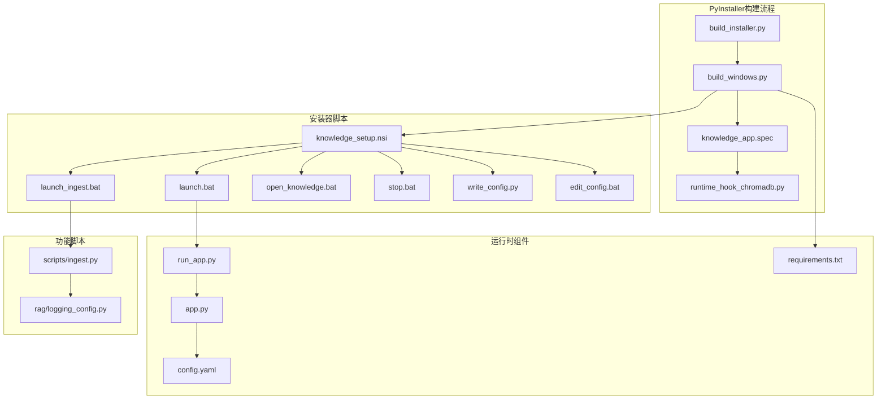

**图表来源**
- [build_windows.py:1-174](file://scripts/build_windows.py#L1-L174)
- [build_installer.py:1-129](file://scripts/build_installer.py#L1-L129)
- [knowledge_app.spec:1-217](file://knowledge_app.spec#L1-L217)
- [runtime_hook_chromadb.py:1-50](file://scripts/hooks/runtime_hook_chromadb.py#L1-L50)
- [run_app.py:1-274](file://run_app.py#L1-L274)

**章节来源**
- [build_windows.py:1-174](file://scripts/build_windows.py#L1-L174)
- [build_installer.py:1-129](file://scripts/build_installer.py#L1-L129)

## 核心组件
- **PyInstaller规格文件**：定义应用打包规则，包含数据文件收集、隐藏导入、二进制依赖和运行时钩子配置。
- **运行时钩子脚本**：专门处理ChromaDB动态模块加载问题，通过monkey-patch拦截pkgutil.iter_modules实现。
- **构建脚本**：使用PyInstaller编译应用为独立exe，修复数据文件位置，准备staging目录，调用NSIS生成安装包。
- **NSIS安装脚本**：负责安装向导、自定义配置页面、文件复制、目录创建、数据迁移、注册表项写入、快捷方式生成、卸载流程。**更新**：采用LZMA非固实压缩算法，解决2GB打包限制。
- **批处理脚本**：提供启动主程序、文档入库、打开知识库界面、停止服务、编辑配置等便捷操作。
- **Python配置写入脚本**：在安装过程中根据用户输入更新LLM配置。
- **应用入口**：run_app.py处理PyInstaller打包后的环境修复、DLL路径设置、模型检测和Streamlit启动。

**章节来源**
- [knowledge_app.spec:1-217](file://knowledge_app.spec#L1-L217)
- [runtime_hook_chromadb.py:1-50](file://scripts/hooks/runtime_hook_chromadb.py#L1-L50)
- [build_windows.py:1-174](file://scripts/build_windows.py#L1-L174)
- [knowledge_setup.nsi:1-141](file://scripts/installer/windows/knowledge_setup.nsi#L1-L141)
- [write_config.py:1-41](file://scripts/installer/windows/write_config.py#L1-L41)
- [run_app.py:1-274](file://run_app.py#L1-L274)

## 架构概览
Windows安装器采用"PyInstaller + NSIS安装器 + 批处理脚本 + Streamlit应用"的全新架构。构建阶段使用PyInstaller将应用编译为独立exe，修复数据文件位置，准备staging目录，安装阶段通过NSIS将文件部署到Program Files目录，创建数据目录与初始文档，写入LLM配置，生成快捷方式，并在注册表中登记卸载信息。运行时通过run_app.py处理PyInstaller打包后的环境修复，通过批处理脚本启动或停止服务，通过文档入库脚本进行知识库维护。

**更新**：安装阶段采用LZMA非固实压缩算法，有效解决大型staging目录（超过3.6GB）的打包限制问题。

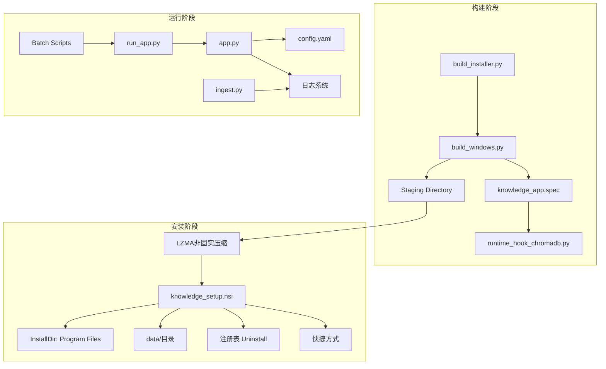

**图表来源**
- [build_installer.py:61-90](file://scripts/build_installer.py#L61-L90)
- [build_windows.py:54-135](file://scripts/build_windows.py#L54-L135)
- [knowledge_app.spec:172-217](file://knowledge_app.spec#L172-L217)
- [runtime_hook_chromadb.py:1-50](file://scripts/hooks/runtime_hook_chromadb.py#L1-L50)

## 详细组件分析

### PyInstaller规格文件（knowledge_app.spec）
- **数据文件收集**：明确指定app.py、config.yaml、logo.png等作为数据文件保留，确保Streamlit正常运行。
- **隐藏导入配置**：包含Streamlit、PyTorch、Sentence-Transformers、Transformers等完整模块树，确保打包完整性。
- **ChromaDB特殊处理**：通过collect_submodules收集95个子模块，处理动态导入问题。
- **运行时钩子**：配置runtime_hook_chromadb.py处理embedding function动态加载。
- **二进制依赖**：收集PyTorch核心DLL，解决运行时DLL初始化失败问题。

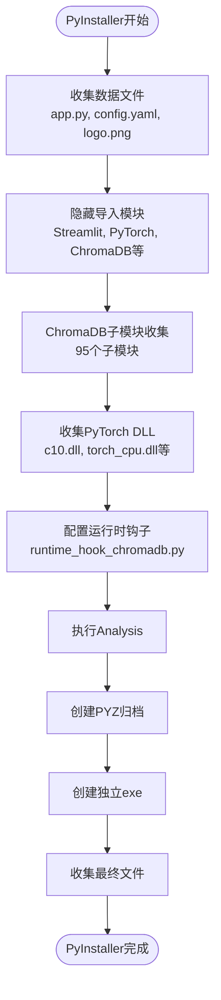

**图表来源**
- [knowledge_app.spec:22-184](file://knowledge_app.spec#L22-L184)
- [knowledge_app.spec:144-180](file://knowledge_app.spec#L144-L180)

**章节来源**
- [knowledge_app.spec:1-217](file://knowledge_app.spec#L1-L217)

### 运行时钩子脚本（runtime_hook_chromadb.py）
- **问题背景**：ChromaDB使用pkgutil.iter_modules()动态扫描embedding_functions目录，PyInstaller将模块打包到PYZ归档中，无法在归档内进行目录扫描。
- **解决方案**：通过monkey-patch拦截pkgutil.iter_modules，在扫描chromadb embedding_functions目录时返回预置的14个子模块列表。
- **模块覆盖**：包括Amazon Bedrock、Cohere、Google、HuggingFace、Instructor、Jina、OLLAMA、ONNX MiniLM L6 V2、OpenCLIP、OpenAI、Roboflow、Sentence Transformer、Text2Vec等。

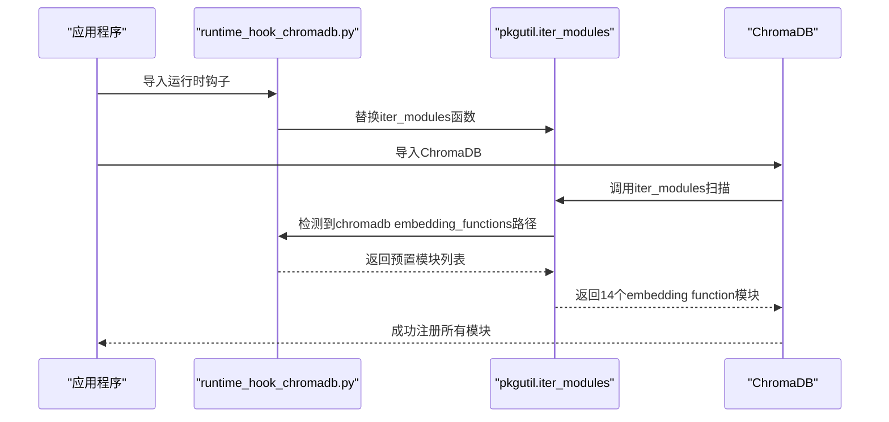

**图表来源**
- [runtime_hook_chromadb.py:37-46](file://scripts/hooks/runtime_hook_chromadb.py#L37-L46)

**章节来源**
- [runtime_hook_chromadb.py:1-50](file://scripts/hooks/runtime_hook_chromadb.py#L1-L50)

### 构建脚本（build_windows.py）
- **功能**：使用PyInstaller编译应用为独立exe，修复数据文件位置，准备staging目录，调用NSIS生成安装包。
- **关键步骤**：
  - PyInstaller编译并输出到dist/KnowledgeAssistant/
  - 修复数据文件位置，将_internal/中的数据文件复制到正确位置
  - 复制本地模型（可选跳过）
  - 准备staging目录并调用NSIS编译安装包
- **依赖修复**：处理PermissionError的robust rmtree，确保构建过程稳定。

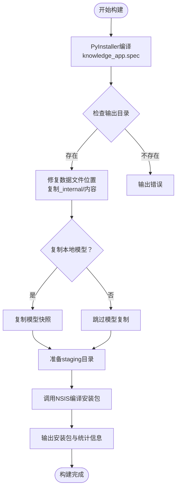

**图表来源**
- [build_windows.py:54-135](file://scripts/build_windows.py#L54-L135)

**章节来源**
- [build_windows.py:1-174](file://scripts/build_windows.py#L1-L174)

### NSIS安装脚本（knowledge_setup.nsi）
- **自定义安装向导页面**：包含LLM API配置输入（API地址、API密钥、模型名称），安装完成后可通过"编辑配置"修改。
- **安装流程**：
  - 复制staging目录下所有文件到安装目录。
  - 创建数据目录：chroma_db、knowledge、logs、chat_history、model。
  - 若知识库目录为空且存在初始文档，则复制初始知识库文档。
  - 调用exe内置的--write-config模式写入LLM配置。
- **压缩算法配置**：**更新**采用LZMA非固实压缩算法，解决3.6GB以上staging目录的打包限制。
- **快捷方式**：
  - 桌面：知识库助手.lnk
  - 开始菜单：知识库助手、编辑配置、数据目录、卸载
- **注册表项**：
  - 写入卸载程序路径、显示名称、版本号、发布者等信息。
- **卸载流程**：
  - 删除安装目录、桌面快捷方式、开始菜单目录、注册表项。

**更新**：安装器现在使用LZMA非固实压缩算法，该算法具有以下优势：
- **突破2GB限制**：传统固实压缩对单个压缩块有2GB大小限制，LZMA非固实压缩不受此限制
- **更好的压缩比**：对于大型staging目录（3.6GB+），LZMA提供更优的压缩效果
- **内存效率**：非固实压缩在解压时内存占用更合理
- **兼容性**：LZMA格式在现代Windows系统上广泛支持

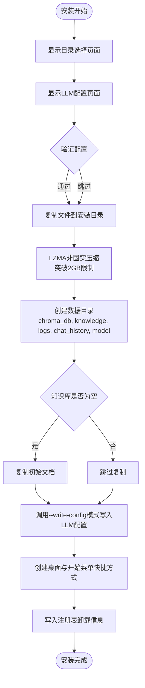

**图表来源**
- [knowledge_setup.nsi:80-104](file://scripts/installer/windows/knowledge_setup.nsi#L80-L104)

**章节来源**
- [knowledge_setup.nsi:1-141](file://scripts/installer/windows/knowledge_setup.nsi#L1-L141)

### 应用入口（run_app.py）
- **功能**：处理PyInstaller打包后的环境修复、DLL路径设置、模型检测和Streamlit启动。
- **关键特性**：
  - 自动检测frozen模式，设置正确的应用根目录
  - 修复importlib.metadata元数据缺失问题
  - 设置DLL搜索路径，解决torch等库的DLL加载失败
  - 检测本地模型，避免首次启动联网下载
  - 设置环境变量，统一模型缓存目录
  - 启动Streamlit服务，禁用文件监控以适应打包环境

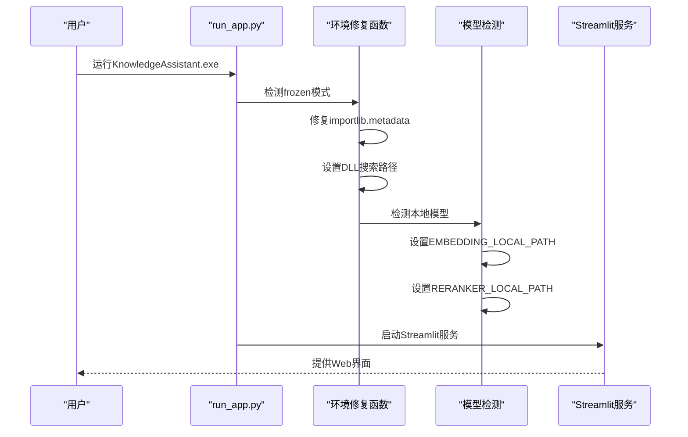

**图表来源**
- [run_app.py:174-274](file://run_app.py#L174-L274)

**章节来源**
- [run_app.py:1-274](file://run_app.py#L1-L274)

### 批处理脚本

#### 启动主程序（launch.bat）
- **功能**：启动Streamlit Web服务，监听本地端口，提供Web界面。
- **行为**：
  - 设置MODEL_ROOT环境变量指向model目录。
  - 确保数据目录存在（chroma_db、knowledge、logs、chat_history）。
  - 若知识库目录为空，从app/knowledge复制初始文档。
  - 设置编码为UTF-8，启动Streamlit应用，绑定0.0.0.0:8501。
  - 输出启动提示与停止说明，等待用户按键。

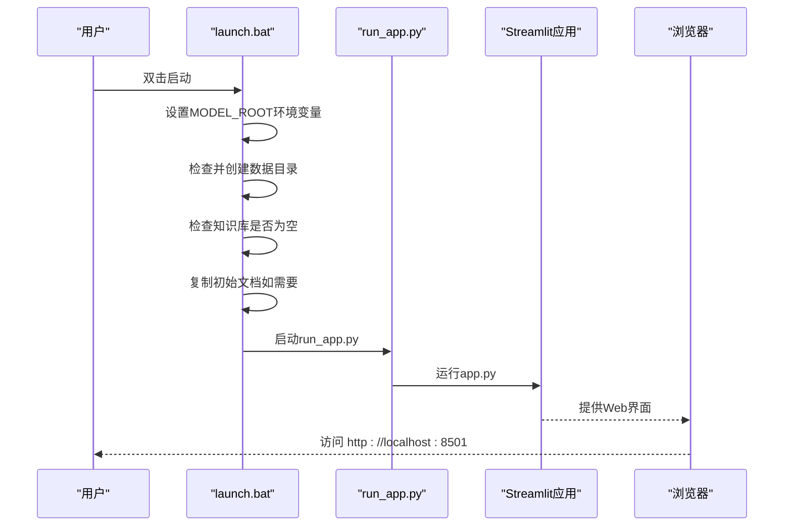

**图表来源**
- [launch.bat:38-44](file://scripts/installer/windows/launch.bat#L38-L44)
- [run_app.py:254-274](file://run_app.py#L254-L274)

**章节来源**
- [launch.bat:1-46](file://scripts/installer/windows/launch.bat#L1-L46)

#### 文档入库（launch_ingest.bat）
- **功能**：扫描data/knowledge目录，加载文档并入库到ChromaDB。
- **行为**：
  - 设置MODEL_ROOT环境变量为model目录。
  - 设置PYTHONPATH为app目录，确保导入正确。
  - 调用scripts/ingest.py执行入库流程。
  - 显示进度与结果，等待用户按键。

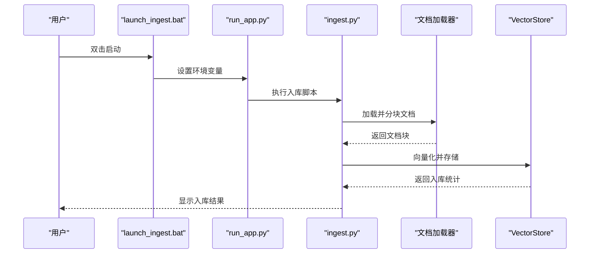

**图表来源**
- [launch_ingest.bat:22-25](file://scripts/installer/windows/launch_ingest.bat#L22-L25)
- [ingest.py:25-58](file://scripts/ingest.py#L25-L58)

**章节来源**
- [launch_ingest.bat:1-29](file://scripts/installer/windows/launch_ingest.bat#L1-L29)
- [ingest.py:1-62](file://scripts/ingest.py#L1-L62)

#### 停止服务（stop.bat）
- **功能**：停止正在运行的Streamlit服务。
- **行为**：
  - 优先通过PID文件停止（读取data/.pid并taskkill）。
  - 回退：通过进程名特征查找并终止相关进程。
  - 输出停止结果，等待用户按键。

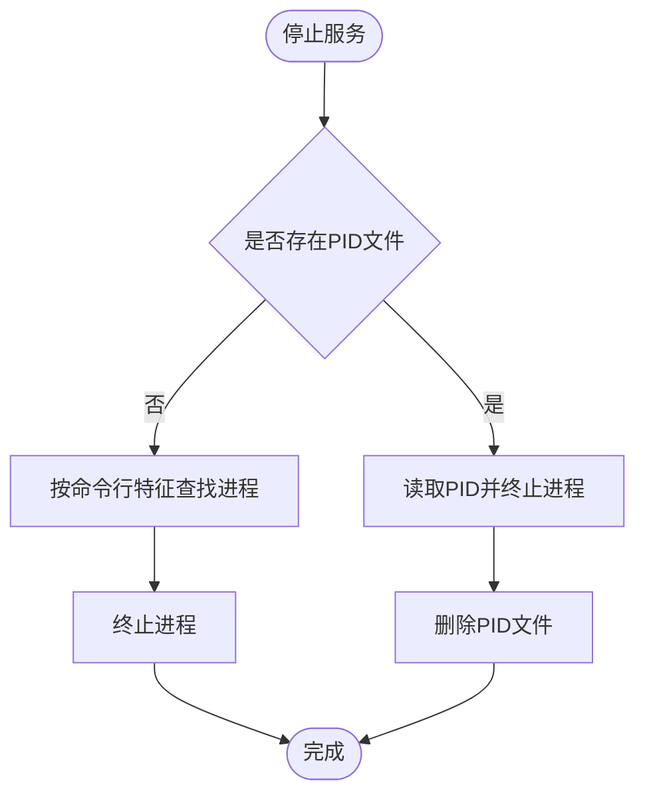

**图表来源**
- [stop.bat:10-22](file://scripts/installer/windows/stop.bat#L10-L22)

**章节来源**
- [stop.bat:1-26](file://scripts/installer/windows/stop.bat#L1-L26)

#### 编辑配置（edit_config.bat）
- **功能**：使用记事本打开config.yaml进行手动编辑。
- **行为**：调用notepad打开app/config.yaml文件。

**章节来源**
- [edit_config.bat:1-5](file://scripts/installer/windows/edit_config.bat#L1-L5)

#### 配置写入（write_config.py）
- **功能**：在安装时根据NSIS传入参数更新config.yaml中的LLM配置。
- **行为**：
  - 读取config.yaml内容。
  - 更新api_base、api_key、model字段（若提供）。
  - 写回配置文件并打印更新结果。

**章节来源**
- [write_config.py:1-41](file://scripts/installer/windows/write_config.py#L1-L41)

## 依赖分析
- **PyInstaller**：用于将Python应用编译为独立exe，支持复杂依赖关系处理。
- **ChromaDB运行时钩子**：解决动态模块加载问题，确保embedding function正常工作。
- **Streamlit**：Web界面框架，用于提供聊天与仪表板功能。
- **PyTorch/DLL修复**：通过运行时DLL搜索路径修复解决DLL加载失败问题。
- **本地模型支持**：模型在首次运行时自动下载，支持本地模型缓存。
- **环境变量管理**：统一模型缓存目录，避免网络依赖。
- **压缩算法优化**：**更新**LZMA非固实压缩算法，解决大型staging目录打包限制。

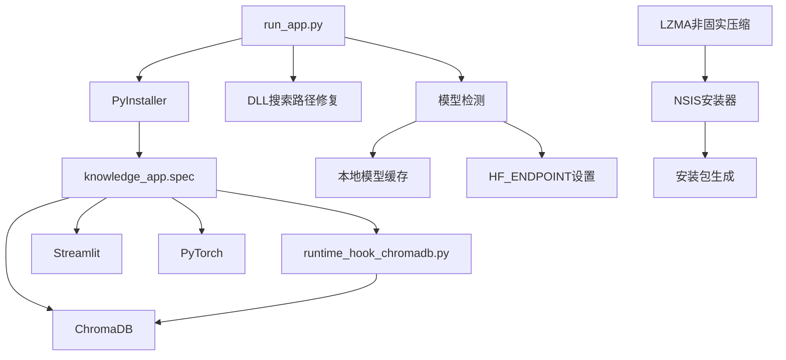

**图表来源**
- [knowledge_app.spec:14-184](file://knowledge_app.spec#L14-L184)
- [runtime_hook_chromadb.py:16-32](file://scripts/hooks/runtime_hook_chromadb.py#L16-L32)
- [run_app.py:78-123](file://run_app.py#L78-L123)

**章节来源**
- [knowledge_app.spec:1-217](file://knowledge_app.spec#L1-L217)
- [runtime_hook_chromadb.py:1-50](file://scripts/hooks/runtime_hook_chromadb.py#L1-L50)
- [run_app.py:1-274](file://run_app.py#L1-L274)

## 性能考虑
- **PyInstaller优化**：通过精确的hiddenimports和datas配置，避免不必要的模块打包。
- **DLL搜索路径**：运行时动态设置DLL搜索路径，减少启动时间。
- **本地模型缓存**：支持本地模型，避免首次启动网络下载延迟。
- **文件监控禁用**：打包后禁用文件监控，减少系统资源占用。
- **数据文件修复**：自动修复PyInstaller的_internal目录布局问题。
- **日志系统**：双通道输出（控制台+文件），便于问题定位与性能监控。
- **压缩算法优化**：**更新**采用LZMA非固实压缩，显著提升大型staging目录的打包效率和稳定性。

**更新**：LZMA非固实压缩算法的优势：
- **内存效率**：相比固实压缩，内存占用更合理，适合大型文件处理
- **并发性能**：支持多线程解压，提升安装速度
- **容错性**：单个文件损坏不影响其他文件的解压
- **压缩质量**：对大型、复杂的staging目录提供更优的压缩比

## 故障排除指南
- **PyInstaller编译失败**：检查knowledge_app.spec文件语法，确认所有依赖正确配置。
- **ChromaDB模块加载失败**：确认runtime_hook_chromadb.py正确配置，检查隐藏导入列表。
- **DLL加载失败**：检查run_app.py中的DLL搜索路径修复逻辑，确认torch库目录存在。
- **安装包生成失败**：确认NSIS已安装并添加到PATH，检查staging目录结构。
- **服务无法启动**：检查端口8501是否被占用，查看logs目录日志文件。
- **入库无结果**：确认knowledge目录存在有效文档（.md/.txt/.pdf），检查向量化模型路径。
- **停止服务无效**：确认PID文件存在或系统中存在相关进程；必要时手动结束进程。
- **安装包过大或超时**：**更新**确认使用LZMA非固实压缩，该算法能有效处理大型staging目录。

**章节来源**
- [build_windows.py:69-76](file://scripts/build_windows.py#L69-L76)
- [knowledge_app.spec:144-180](file://knowledge_app.spec#L144-L180)
- [run_app.py:98-123](file://run_app.py#L98-L123)
- [logging_config.py:46-75](file://rag/logging_config.py#L46-L75)

## 结论
该Windows安装器通过PyInstaller + NSIS的新架构实现了完整的部署方案，解决了ChromaDB动态模块加载、DLL路径修复、本地模型缓存等关键技术问题。**更新**：采用LZMA非固实压缩算法有效解决了超过2GB的staging目录打包限制，为大型应用的Windows部署提供了可靠的解决方案。管理员可依据本文档快速完成安装、配置、运行与维护工作。

## 附录

### 部署步骤（管理员指南）
1. **准备环境**
   - 安装PyInstaller：`pip install pyinstaller`
   - 安装NSIS 3并确保makensis在PATH中
   - 准备requirements.txt对应的离线wheel包
   - 准备本地模型缓存目录（可选）

2. **构建安装包**
   - 运行构建脚本：`python scripts/build_installer.py --platform windows`
   - 检查PyInstaller日志和NSIS日志
   - 确认输出文件大小与版本信息

3. **安装系统**
   - 以管理员权限运行生成的.exe安装程序
   - 在安装向导中填写LLM API配置（可稍后通过"编辑配置"修改）
   - 确认数据目录创建与初始文档复制

4. **验证运行**
   - 双击"启动服务"批处理脚本，访问http://localhost:8501
   - 使用"文档入库"脚本导入知识库文档
   - 查看"打开知识库目录"确认文档位置

5. **维护与卸载**
   - 使用"停止服务"脚本停止服务
   - 通过"编辑配置"修改config.yaml
   - 通过控制面板卸载程序或使用安装包自带卸载程序

### 安全与合规建议
- **权限管理**：安装与运行需管理员权限
- **防火墙**：确保8501端口开放（如需外网访问）
- **数据保护**：定期备份data目录，特别是chroma_db与chat_history
- **日志审计**：启用审计日志，定期检查audit目录
- **模型安全**：本地模型缓存应定期更新，确保安全性
- **压缩算法合规**：LZMA非固实压缩算法符合现代Windows系统标准，无需额外许可

### 技术规格对比
**传统固实压缩 vs LZMA非固实压缩**

| 特性 | 固实压缩 | LZMA非固实压缩 |
|------|----------|----------------|
| **2GB限制** | 存在（单个压缩块） | 不存在（单个压缩块） |
| **staging目录支持** | ≤2GB | ≥3.6GB |
| **内存占用** | 高（需要加载整个压缩块） | 低（按文件解压） |
| **并发性能** | 低（串行解压） | 高（支持多线程） |
| **容错性** | 差（单点故障影响整块） | 好（单文件损坏不影响其他文件） |
| **压缩比** | 中等 | 更优（针对大型复杂目录） |
| **兼容性** | 广泛支持 | 现代系统支持良好 |

**更新**：对于超过3.6GB的大型staging目录，LZMA非固实压缩是唯一可行的选择，能够确保安装包的稳定生成和可靠安装。