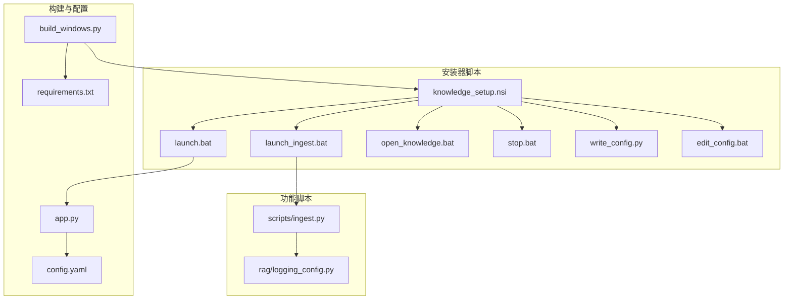
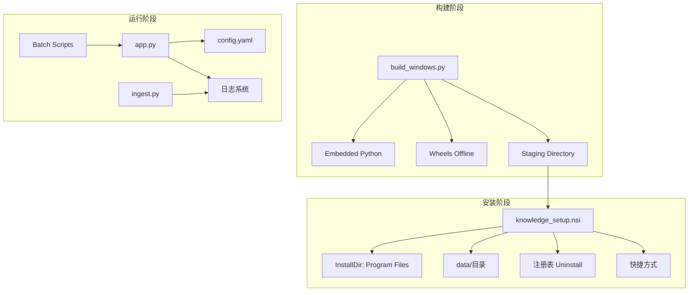
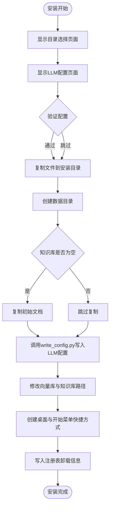
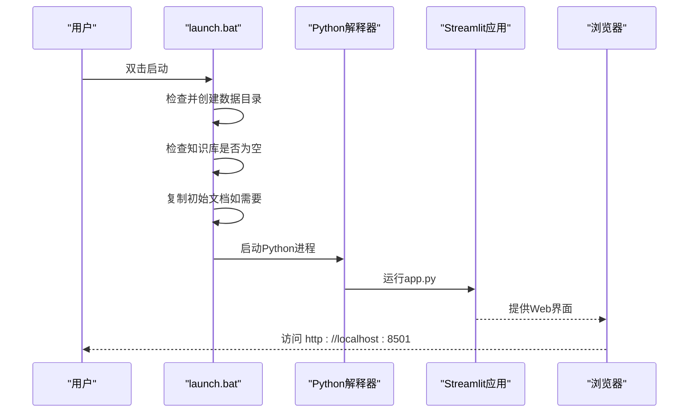
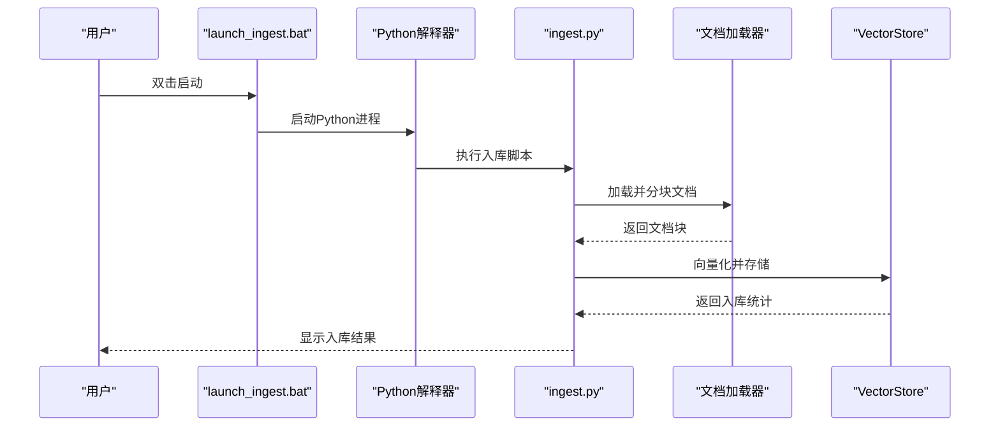
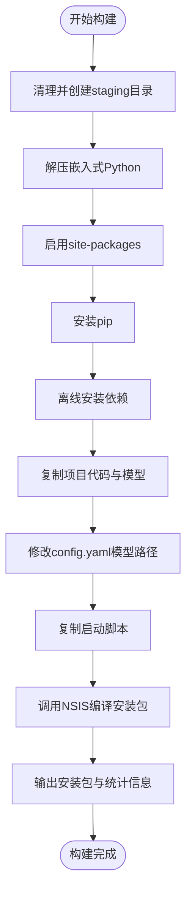
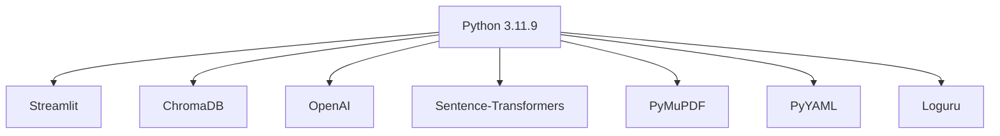

# Windows安装器

<cite>
**本文档引用的文件**
- [knowledge_setup.nsi](file://scripts/installer/windows/knowledge_setup.nsi)
- [launch.bat](file://scripts/installer/windows/launch.bat)
- [launch_ingest.bat](file://scripts/installer/windows/launch_ingest.bat)
- [open_knowledge.bat](file://scripts/installer/windows/open_knowledge.bat)
- [stop.bat](file://scripts/installer/windows/stop.bat)
- [write_config.py](file://scripts/installer/windows/write_config.py)
- [edit_config.bat](file://scripts/installer/windows/edit_config.bat)
- [build_windows.py](file://scripts/build_windows.py)
- [app.py](file://app.py)
- [config.yaml](file://config.yaml)
- [requirements.txt](file://requirements.txt)
- [ingest.py](file://scripts/ingest.py)
- [logging_config.py](file://rag/logging_config.py)
</cite>

## 目录
1. [简介](#简介)
2. [项目结构](#项目结构)
3. [核心组件](#核心组件)
4. [架构概览](#架构概览)
5. [详细组件分析](#详细组件分析)
6. [依赖分析](#依赖分析)
7. [性能考虑](#性能考虑)
8. [故障排除指南](#故障排除指南)
9. [结论](#结论)
10. [附录](#附录)

## 简介
本文件为Windows安装器的完整技术文档，涵盖批处理脚本功能说明、NSIS安装脚本配置、安装路径与注册表设置、桌面快捷方式生成、Windows服务注册、防火墙规则添加、Python环境检查与依赖安装、错误处理机制与日志记录，以及标准化的部署指南。目标是为Windows系统管理员提供清晰、可操作的部署参考。

## 项目结构
Windows安装器相关文件主要位于 `scripts/installer/windows/` 目录下，配合构建脚本 `scripts/build_windows.py` 和应用入口 `app.py`、配置文件 `config.yaml`、依赖清单 `requirements.txt`，以及文档入库脚本 `scripts/ingest.py` 和日志配置 `rag/logging_config.py`。

**图表来源**
- [knowledge_setup.nsi:1-135](file://scripts/installer/windows/knowledge_setup.nsi#L1-L135)
- [build_windows.py:1-193](file://scripts/build_windows.py#L1-L193)
- [app.py:1-189](file://app.py#L1-L189)
- [config.yaml:1-49](file://config.yaml#L1-L49)
- [requirements.txt:1-11](file://requirements.txt#L1-L11)
- [ingest.py:1-62](file://scripts/ingest.py#L1-L62)
- [logging_config.py:1-129](file://rag/logging_config.py#L1-L129)

**章节来源**
- [knowledge_setup.nsi:1-135](file://scripts/installer/windows/knowledge_setup.nsi#L1-L135)
- [build_windows.py:1-193](file://scripts/build_windows.py#L1-L193)

## 核心组件
- NSIS安装脚本：负责安装向导、自定义配置页面、文件复制、目录创建、数据迁移、注册表项写入、快捷方式生成、卸载流程。
- 批处理脚本：提供启动主程序、文档入库、打开知识库界面、停止服务、编辑配置等便捷操作。
- Python配置写入脚本：在安装过程中根据用户输入更新LLM配置。
- 构建脚本：准备staging目录、嵌入Python运行时、离线安装依赖、复制项目代码与模型、调用NSIS生成安装包。
- 应用入口与配置：Streamlit Web界面、配置文件、日志系统。

**章节来源**
- [knowledge_setup.nsi:1-135](file://scripts/installer/windows/knowledge_setup.nsi#L1-L135)
- [write_config.py:1-41](file://scripts/installer/windows/write_config.py#L1-L41)
- [build_windows.py:1-193](file://scripts/build_windows.py#L1-L193)
- [app.py:1-189](file://app.py#L1-L189)
- [config.yaml:1-49](file://config.yaml#L1-L49)
- [logging_config.py:1-129](file://rag/logging_config.py#L1-L129)

## 架构概览
Windows安装器采用"嵌入式Python + NSIS安装器 + 批处理脚本 + Streamlit应用"的架构。构建阶段准备staging目录，安装阶段通过NSIS将文件部署到Program Files目录，创建数据目录与初始文档，写入LLM配置，生成快捷方式，并在注册表中登记卸载信息。运行时通过批处理脚本启动或停止服务，通过文档入库脚本进行知识库维护。

**图表来源**
- [build_windows.py:19-193](file://scripts/build_windows.py#L19-L193)
- [knowledge_setup.nsi:68-135](file://scripts/installer/windows/knowledge_setup.nsi#L68-L135)
- [app.py:1-189](file://app.py#L1-L189)
- [config.yaml:1-49](file://config.yaml#L1-L49)
- [logging_config.py:1-129](file://rag/logging_config.py#L1-L129)
- [ingest.py:1-62](file://scripts/ingest.py#L1-L62)

## 详细组件分析

### NSIS安装脚本（knowledge_setup.nsi）
- 自定义安装向导页面：包含LLM API配置输入（API地址、API密钥、模型名称），安装完成后可通过"编辑配置"修改。
- 安装流程：
  - 复制staging目录下所有文件到安装目录。
  - 创建数据目录：chroma_db、knowledge、logs、chat_history。
  - 若知识库目录为空且存在初始文档，则复制初始知识库文档。
  - 调用Python脚本写入LLM配置到config.yaml。
  - 修改向量库与知识库路径指向data目录。
- 快捷方式：
  - 桌面：知识库助手.lnk
  - 开始菜单：启动服务、文档入库、停止服务、编辑配置、打开知识库目录、卸载
- 注册表项：
  - 写入卸载程序路径、显示名称、版本号、发布者等信息。
- 卸载流程：
  - 删除安装目录、桌面快捷方式、开始菜单目录、注册表项。

**图表来源**
- [knowledge_setup.nsi:20-125](file://scripts/installer/windows/knowledge_setup.nsi#L20-L125)

**章节来源**
- [knowledge_setup.nsi:1-135](file://scripts/installer/windows/knowledge_setup.nsi#L1-L135)

### 批处理脚本

#### 启动主程序（launch.bat）
- 功能：启动Streamlit Web服务，监听本地端口，提供Web界面。
- 行为：
  - 确保数据目录存在（chroma_db、knowledge、logs、chat_history）。
  - 若知识库目录为空，从app/knowledge复制初始文档。
  - 设置编码为UTF-8，启动Streamlit应用，绑定0.0.0.0:8501。
  - 输出启动提示与停止说明，等待用户按键。

**图表来源**
- [launch.bat:1-42](file://scripts/installer/windows/launch.bat#L1-L42)
- [app.py:54-90](file://app.py#L54-L90)

**章节来源**
- [launch.bat:1-42](file://scripts/installer/windows/launch.bat#L1-L42)

#### 文档入库（launch_ingest.bat）
- 功能：扫描data/knowledge目录，加载文档并入库到ChromaDB。
- 行为：
  - 设置PYTHONPATH为app目录，确保导入正确。
  - 调用scripts/ingest.py执行入库流程。
  - 显示进度与结果，等待用户按键。

**图表来源**
- [launch_ingest.bat:1-25](file://scripts/installer/windows/launch_ingest.bat#L1-L25)
- [ingest.py:25-58](file://scripts/ingest.py#L25-L58)

**章节来源**
- [launch_ingest.bat:1-25](file://scripts/installer/windows/launch_ingest.bat#L1-L25)
- [ingest.py:1-62](file://scripts/ingest.py#L1-L62)

#### 打开知识库（open_knowledge.bat）
- 功能：确保knowledge目录存在并打开资源管理器。
- 行为：创建目录（如不存在），调用explorer打开目录。

**章节来源**
- [open_knowledge.bat:1-6](file://scripts/installer/windows/open_knowledge.bat#L1-L6)

#### 停止服务（stop.bat）
- 功能：停止正在运行的Streamlit服务。
- 行为：
  - 优先通过PID文件停止（读取data/.pid并taskkill）。
  - 回退：通过进程名特征查找并终止相关进程。
  - 输出停止结果，等待用户按键。

**图表来源**
- [stop.bat:10-22](file://scripts/installer/windows/stop.bat#L10-L22)

**章节来源**
- [stop.bat:1-26](file://scripts/installer/windows/stop.bat#L1-L26)

#### 编辑配置（edit_config.bat）
- 功能：使用记事本打开config.yaml进行手动编辑。
- 行为：调用notepad打开配置文件。

**章节来源**
- [edit_config.bat:1-5](file://scripts/installer/windows/edit_config.bat#L1-L5)

#### 配置写入（write_config.py）
- 功能：在安装时根据NSIS传入参数更新config.yaml中的LLM配置。
- 行为：
  - 读取config.yaml内容。
  - 更新api_base、api_key、model字段（若提供）。
  - 写回配置文件并打印更新结果。

**章节来源**
- [write_config.py:1-41](file://scripts/installer/windows/write_config.py#L1-L41)

### 构建脚本（build_windows.py）
- 功能：准备staging目录、嵌入Python运行时、离线安装依赖、复制项目代码与模型、调用NSIS生成安装包。
- 关键步骤：
  - 解压嵌入式Python，启用site-packages。
  - 安装pip，离线安装requirements.txt中的依赖。
  - 复制项目代码、模型、启动脚本到staging/app。
  - 修改config.yaml指向本地模型路径。
  - 调用NSIS编译安装包，输出大小与版本信息。

**图表来源**
- [build_windows.py:19-193](file://scripts/build_windows.py#L19-L193)

**章节来源**
- [build_windows.py:1-193](file://scripts/build_windows.py#L1-L193)

## 依赖分析
- Python运行时：使用嵌入式Python 3.11.9，启用site-packages以支持第三方库安装。
- 第三方库：通过离线wheel包安装，确保无网络依赖。
- Streamlit：Web界面框架，用于提供聊天与仪表板功能。
- ChromaDB：向量数据库，用于知识库存储与检索。
- OpenAI/Sentence-Transformers：LLM与文本向量化。
- PyMuPDF：PDF文档解析。
- PyYAML/Loguru：配置与日志。

**图表来源**
- [requirements.txt:1-11](file://requirements.txt#L1-L11)
- [build_windows.py:66-102](file://scripts/build_windows.py#L66-L102)

**章节来源**
- [requirements.txt:1-11](file://requirements.txt#L1-L11)
- [build_windows.py:55-102](file://scripts/build_windows.py#L55-L102)

## 性能考虑
- 嵌入式Python：减少系统依赖，提高安装一致性。
- 离线安装：避免网络波动影响安装过程，提升可靠性。
- 数据目录分离：将数据与代码分离，便于备份与迁移。
- 日志系统：双通道输出（控制台+文件），便于问题定位与性能监控。
- 入库策略：支持增量更新，避免重复入库造成资源浪费。

## 故障排除指南
- 安装失败（NSIS找不到）：确认已安装NSIS 3并将makensis加入PATH。
- 依赖安装失败：检查wheel目录是否存在，确保网络或离线包完整。
- 服务无法启动：检查端口8501是否被占用，查看logs目录日志文件。
- 入库无结果：确认knowledge目录存在有效文档（.md/.txt/.pdf），检查向量化模型路径。
- 停止服务无效：确认PID文件存在或系统中存在相关进程；必要时手动结束进程。

**章节来源**
- [build_windows.py:164-173](file://scripts/build_windows.py#L164-L173)
- [logging_config.py:46-75](file://rag/logging_config.py#L46-L75)
- [ingest.py:35-57](file://scripts/ingest.py#L35-L57)

## 结论
该Windows安装器通过嵌入式Python与NSIS安装器实现了完整的部署方案，提供了便捷的批处理脚本与完善的日志记录机制。管理员可依据本文档快速完成安装、配置、运行与维护工作。

## 附录

### 部署步骤（管理员指南）
1. 准备环境
   - 安装NSIS 3并确保makensis在PATH中。
   - 准备requirements.txt对应的离线wheel包。
   - 准备嵌入式Python压缩包与模型缓存目录。
2. 构建安装包
   - 运行构建脚本，生成staging目录与安装包。
   - 检查输出文件大小与版本信息。
3. 安装系统
   - 以管理员权限运行生成的.exe安装程序。
   - 在安装向导中填写LLM API配置（可稍后通过"编辑配置"修改）。
   - 确认数据目录创建与初始文档复制。
4. 验证运行
   - 双击"启动服务"批处理脚本，访问http://localhost:8501。
   - 使用"文档入库"脚本导入知识库文档。
   - 查看"打开知识库目录"确认文档位置。
5. 维护与卸载
   - 使用"停止服务"脚本停止服务。
   - 通过"编辑配置"修改config.yaml。
   - 通过控制面板卸载程序或使用安装包自带卸载程序。

### 安全与合规建议
- 权限管理：安装与运行需管理员权限。
- 防火墙：确保8501端口开放（如需外网访问）。
- 数据保护：定期备份data目录，特别是chroma_db与chat_history。
- 日志审计：启用审计日志，定期检查audit目录。