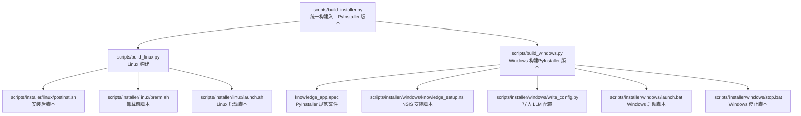
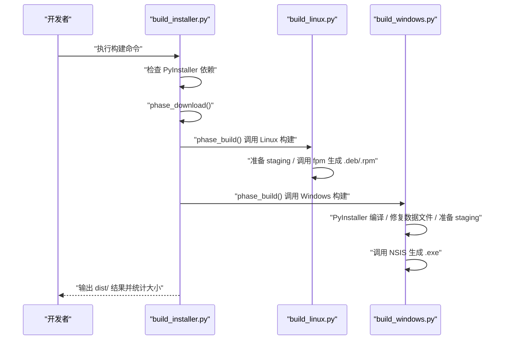
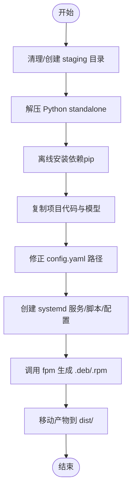
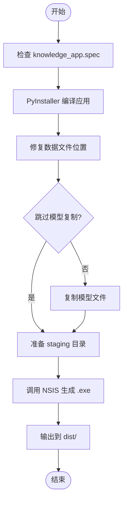
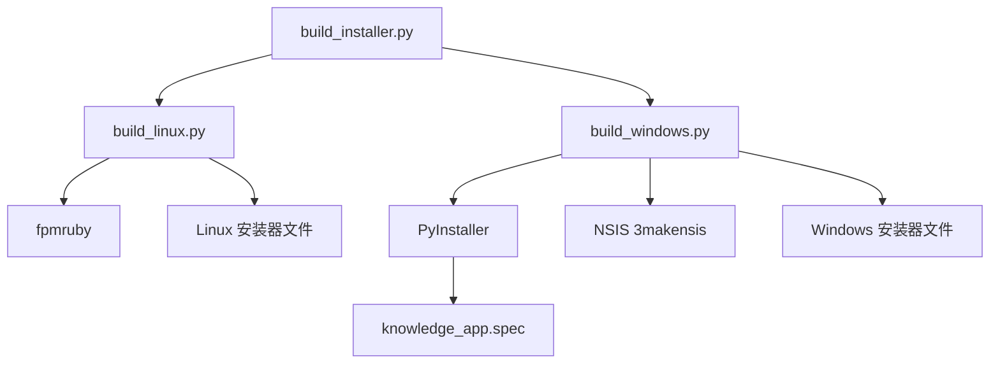

# 安装器构建工具

<cite>
**本文引用的文件**
- [build_installer.py](file://scripts/build_installer.py)
- [build_linux.py](file://scripts/build_linux.py)
- [build_windows.py](file://scripts/build_windows.py)
- [knowledge_app.spec](file://knowledge_app.spec)
- [knowledge_setup.nsi](file://scripts/installer/windows/knowledge_setup.nsi)
- [write_config.py](file://scripts/installer/windows/write_config.py)
- [launch.bat](file://scripts/installer/windows/launch.bat)
- [stop.bat](file://scripts/installer/windows/stop.bat)
- [postinst.sh](file://scripts/installer/linux/postinst.sh)
- [prerm.sh](file://scripts/installer/linux/prerm.sh)
- [launch.sh](file://scripts/installer/linux/launch.sh)
</cite>

## 更新摘要
**所做更改**
- 新增 PyInstaller 编译流程说明，替代传统 Python 运行时打包
- 更新 Windows 构建流程：从嵌入式 Python 改为 PyInstaller 编译
- 新增 PyInstaller 规范文件配置说明
- 更新依赖检查：PyInstaller 替代 Python standalone
- 新增快速调试模式：--skip-models 参数
- 更新 NSIS 安装脚本：支持 PyInstaller 编译后的目录结构

## 目录
1. [简介](#简介)
2. [项目结构](#项目结构)
3. [核心组件](#核心组件)
4. [架构总览](#架构总览)
5. [详细组件分析](#详细组件分析)
6. [依赖分析](#依赖分析)
7. [性能考虑](#性能考虑)
8. [故障排查指南](#故障排查指南)
9. [结论](#结论)
10. [附录](#附录)

## 简介
本指南面向开发者，系统讲解"安装器构建工具"的现代化功能与使用方法。该工具现已采用 PyInstaller 编译和 NSIS 打包的新架构，支持命令行参数、构建配置、输出目录、跨平台安装包生成、安装包元数据配置、依赖文件指定、安装向导界面定制、构建环境准备、Python 虚拟环境配置、第三方工具依赖、构建过程监控、失败排查、日志分析与输出验证，以及自动化构建流程最佳实践。

## 项目结构
安装器构建工具位于 scripts 目录下，核心入口为 build_installer.py；针对不同平台的构建逻辑分别封装在 build_linux.py 与 build_windows.py 中；安装器模板与脚本位于 scripts/installer 目录，包含 Windows 的 NSIS 脚本与 Linux 的 postinst/prerm 以及启动脚本等。新增了 PyInstaller 规范文件 knowledge_app.spec。

**图表来源**
- [build_installer.py:1-129](file://scripts/build_installer.py#L1-L129)
- [build_linux.py:1-253](file://scripts/build_linux.py#L1-L253)
- [build_windows.py:1-174](file://scripts/build_windows.py#L1-L174)
- [knowledge_app.spec:1-217](file://knowledge_app.spec#L1-L217)

**章节来源**
- [build_installer.py:1-129](file://scripts/build_installer.py#L1-L129)
- [build_linux.py:1-253](file://scripts/build_linux.py#L1-L253)
- [build_windows.py:1-174](file://scripts/build_windows.py#L1-L174)

## 核心组件
- **统一构建入口**：负责解析命令行参数、检查 PyInstaller 依赖、准备输出目录、调度各平台构建脚本，并汇总输出结果。
- **平台构建器**：
  - **Linux**：准备 staging 目录，调用 fpm 生成 .deb/.rpm 安装包。
  - **Windows**：使用 PyInstaller 编译应用为独立 exe，修复数据文件位置，准备 staging 目录，调用 NSIS 生成 .exe 安装包。
- **PyInstaller 规范文件**：定义应用打包规则，包括数据文件、隐藏导入、二进制文件收集等。
- **安装器模板与脚本**：Windows 使用 NSIS 脚本与自定义页面；Linux 使用 postinst/prerm 与启动脚本；两者均包含启动、入库、停止等辅助脚本。

**章节来源**
- [build_installer.py:33-58](file://scripts/build_installer.py#L33-L58)
- [build_linux.py:20-253](file://scripts/build_linux.py#L20-L253)
- [build_windows.py:37-174](file://scripts/build_windows.py#L37-L174)
- [knowledge_app.spec:1-217](file://knowledge_app.spec#L1-L217)

## 架构总览
构建流程分为四个阶段：依赖检查、下载资源、构建 Linux、构建 Windows。统一入口根据平台参数选择性执行，Windows 采用 PyInstaller 编译流程。

**图表来源**
- [build_installer.py:61-91](file://scripts/build_installer.py#L61-L91)
- [build_linux.py:20-253](file://scripts/build_linux.py#L20-L253)
- [build_windows.py:37-174](file://scripts/build_windows.py#L37-L174)

## 详细组件分析

### 统一构建入口 build_installer.py
- **功能概述**
  - 支持目标平台：windows、linux、both，默认 windows。
  - 支持跳过模型复制：--skip-models 参数用于快速调试。
  - 检查 PyInstaller 依赖：确保 PyInstaller 已正确安装。
  - 调度平台构建器：分别执行 Linux 与 Windows 的构建流程。
- **关键行为**
  - **依赖检查阶段**：验证 PyInstaller 版本，检查 NSIS（Windows）。
  - **构建阶段**：导入平台构建模块并传入根目录、缓存目录、输出目录、安装器模板目录。
  - **输出**：打印 dist/ 下产物及大小。
- **命令示例**
  - 构建全部平台：python scripts/build_installer.py --platform both
  - 仅 Windows：python scripts/build_installer.py --platform windows
  - 仅 Linux：python scripts/build_installer.py --platform linux
  - 跳过模型复制：python scripts/build_installer.py --platform both --skip-models

**章节来源**
- [build_installer.py:93-129](file://scripts/build_installer.py#L93-L129)

### Linux 安装包构建 build_linux.py
- **功能概述**
  - 准备 staging 目录，调用 fpm 生成 .deb/.rpm 安装包。
- **关键步骤**
  - 解压 Python standalone 并定位可执行文件。
  - 使用 pip --no-index --find-links 离线安装 requirements.txt。
  - 复制项目代码与模型，修正 config.yaml 路径。
  - 创建 systemd 服务、启动脚本、入库/停止命令、配置文件与 postinst/prerm。
  - 调用 fpm 生成 .deb 与 .rpm，移动至 dist/。
- **元数据与输出**
  - 包名：knowledge-assistant
  - 版本：来自 config.yaml 的 version 字段
  - 输出：dist/knowledge-assistant_{ver}_amd64.deb 与 knowledge-assistant-{ver}.rpm
- **第三方工具依赖**
  - ruby + fpm
  - 可选：rpm 工具链以生成 .rpm

**图表来源**
- [build_linux.py:20-253](file://scripts/build_linux.py#L20-L253)

**章节来源**
- [build_linux.py:1-253](file://scripts/build_linux.py#L1-L253)

### Windows 安装包构建 build_windows.py
- **功能概述**
  - 使用 PyInstaller 编译应用为独立 exe，修复数据文件位置，准备 staging 目录，调用 NSIS 生成 .exe 安装包。
- **关键步骤**
  - **PyInstaller 编译**：使用 knowledge_app.spec 编译应用，输出 dist/KnowledgeAssistant/ 目录。
  - **修复数据文件位置**：将 _internal/ 目录中的数据文件复制到正确位置。
  - **模型处理**：可选择跳过模型复制（--skip-models）。
  - **准备 staging 目录**：复制 PyInstaller 输出到 staging 目录。
  - **调用 NSIS**：生成 .exe 安装包，输出至 dist/。
- **元数据与输出**
  - 包名：knowledge-setup-{version}-windows.exe
  - 版本：来自 config.yaml 的 version 字段
- **第三方工具依赖**
  - PyInstaller（已通过依赖检查）
  - NSIS 3（makensis 在 PATH）

**图表来源**
- [build_windows.py:37-174](file://scripts/build_windows.py#L37-L174)

**章节来源**
- [build_windows.py:1-174](file://scripts/build_windows.py#L1-L174)

### PyInstaller 规范文件 knowledge_app.spec
- **功能概述**
  - 定义应用打包规则，使用 PyInstaller 将 Python 应用编译为独立 exe。
- **关键配置**
  - **数据文件**：包含 app.py、config.yaml、logo.png、knowledge/、data/knowledge/ 等。
  - **隐藏导入**：包含 streamlit、torch、sentence_transformers、chromadb 等模块。
  - **二进制文件**：收集 PyTorch 动态库。
  - **排除模块**：排除 matplotlib、pandas、numpy.tests 等大型库。
- **输出**
  - dist/KnowledgeAssistant/（单目录模式）

**章节来源**
- [knowledge_app.spec:1-217](file://knowledge_app.spec#L1-L217)

### Windows 安装器模板与脚本
- **NSIS 安装脚本 knowledge_setup.nsi**
  - 自定义安装向导页面：LLM API 地址、密钥、模型名称。
  - 安装阶段：复制 PyInstaller 打包的应用目录，创建数据目录，写入 LLM 配置。
  - 快捷方式：桌面与开始菜单。
  - 卸载信息与卸载段。
- **写入配置脚本 write_config.py**
  - 接收参数：config_path、api_base、api_key、model。
  - 更新 config.yaml 中的 llm 配置项。
- **启动/停止脚本**
  - launch.bat：确保数据目录存在，复制初始知识库文档，启动 Streamlit。
  - stop.bat：优先通过 PID 文件停止，回退通过进程特征查找。

**章节来源**
- [knowledge_setup.nsi:1-138](file://scripts/installer/windows/knowledge_setup.nsi#L1-L138)
- [write_config.py:1-41](file://scripts/installer/windows/write_config.py#L1-L41)
- [launch.bat:1-46](file://scripts/installer/windows/launch.bat#L1-L46)
- [stop.bat:1-26](file://scripts/installer/windows/stop.bat#L1-L26)

### Linux 安装器模板与脚本
- **postinst.sh**
  - 创建系统用户与数据/日志/聊天历史目录。
  - 首次安装复制初始知识库文档与配置文件。
  - 更新配置文件路径，符号链接配置文件，设置权限，重载 systemd。
- **prerm.sh**
  - 停止并禁用服务，删除 systemd 服务文件与命令链接，支持 purge 时删除用户与数据目录。
- **launch.sh**
  - 前台运行 Streamlit，监听 0.0.0.0:8501，关闭统计与 CORS。

**章节来源**
- [postinst.sh:1-76](file://scripts/installer/linux/postinst.sh#L1-L76)
- [prerm.sh:1-25](file://scripts/installer/linux/prerm.sh#L1-L25)
- [launch.sh:1-24](file://scripts/installer/linux/launch.sh#L1-L24)

## 依赖分析
- **构建入口对平台构建器的依赖**：通过动态导入模块实现解耦。
- **平台构建器对第三方工具的依赖**：
  - **Linux**：ruby + fpm；可选 rpm 工具链。
  - **Windows**：PyInstaller（已通过依赖检查）+ NSIS 3（makensis）。
- **运行时依赖**：
  - **PyInstaller**：Windows 使用 PyInstaller 编译独立 exe，无需预下载 Python 运行时。
  - **依赖下载策略**：Linux 仍使用离线安装策略；Windows 通过 PyInstaller 收集依赖。
  - **模型下载**：Sentence Transformers 下载本地 embedding 模型，镜像源可配置。

**图表来源**
- [build_installer.py:33-58](file://scripts/build_installer.py#L33-L58)
- [build_linux.py:194-201](file://scripts/build_linux.py#L194-L201)
- [build_windows.py:141-148](file://scripts/build_windows.py#L141-L148)

**章节来源**
- [build_installer.py:33-58](file://scripts/build_installer.py#L33-L58)
- [build_linux.py:194-201](file://scripts/build_linux.py#L194-L201)
- [build_windows.py:141-148](file://scripts/build_windows.py#L141-L148)

## 性能考虑
- **PyInstaller 优势**：编译后独立运行，无需预下载 Python 运行时，减少安装包体积。
- **资源复用**：使用 --skip-models 可避免重复复制模型文件，显著缩短二次构建时间。
- **依赖安装优化**：PyInstaller 自动收集依赖，减少手动配置；Linux 仍采用离线安装减少网络波动影响。
- **模型下载**：首次下载模型耗时较长，建议在 CI 中预热缓存。
- **输出验证**：构建完成后自动统计产物大小，便于容量评估与发布检查。

## 故障排查指南
- **未找到 PyInstaller**
  - 现象：提示 PyInstaller 未安装，给出安装指令。
  - 处理：运行 pip install pyinstaller。
  - 参考：[build_installer.py:33-58](file://scripts/build_installer.py#L33-L58)
- **未找到 makensis（Windows）**
  - 现象：提示未找到 makensis，给出安装与 PATH 配置指引。
  - 处理：安装 NSIS 3 并将目录加入 PATH，或手动执行生成命令。
  - 参考：[build_windows.py:141-148](file://scripts/build_windows.py#L141-L148)
- **PyInstaller 编译失败**
  - 现象：PyInstaller 编译失败，检查日志文件 build/pyinstaller.log。
  - 处理：查看日志末尾内容，检查 knowledge_app.spec 配置。
  - 参考：[build_windows.py:54-76](file://scripts/build_windows.py#L54-L76)
- **knowledge_app.spec 不存在**
  - 现象：找不到 PyInstaller 规范文件。
  - 处理：确保 knowledge_app.spec 文件存在。
  - 参考：[build_windows.py:50-53](file://scripts/build_windows.py#L50-L53)
- **NSIS 编译失败**
  - 现象：NSIS 编译失败，检查日志文件 build/nsis.log。
  - 处理：查看日志内容，检查安装器脚本配置。
  - 参考：[build_windows.py:158-166](file://scripts/build_windows.py#L158-L166)
- **Linux fpm 未找到**
  - 现象：提示未找到 fpm，给出 gem install fpm 指引。
  - 处理：安装 Ruby 并执行 gem install fpm，或手动在 staging 目录执行 fpm 命令。
  - 参考：[build_linux.py:194-201](file://scripts/build_linux.py#L194-L201)
- **输出验证**
  - 检查 dist/ 是否包含目标产物；查看构建日志末尾的文件大小统计。
  - 参考：[build_installer.py:121-125](file://scripts/build_installer.py#L121-L125)

**章节来源**
- [build_installer.py:33-58](file://scripts/build_installer.py#L33-L58)
- [build_windows.py:54-76](file://scripts/build_windows.py#L54-L76)
- [build_windows.py:141-148](file://scripts/build_windows.py#L141-L148)
- [build_windows.py:158-166](file://scripts/build_windows.py#L158-L166)
- [build_linux.py:194-201](file://scripts/build_linux.py#L194-L201)
- [build_installer.py:121-125](file://scripts/build_installer.py#L121-L125)

## 结论
该安装器构建工具通过 PyInstaller 编译和 NSIS 打包的新架构，实现了跨平台离线安装包的现代化生成。Windows 平台采用 PyInstaller 编译独立 exe，无需预下载 Python 运行时；Linux 平台继续使用 fpm 生成 .deb/.rpm 包。配合 NSIS 与 fpm、PyInstaller 与本地模型，能够在无外网环境下完成完整的安装包构建。遵循本文提供的环境准备、参数使用、故障排查与最佳实践，可高效稳定地交付 Windows 与 Linux 平台的安装包。

## 附录

### 命令行参数与使用方法
- **目标平台**
  - --platform windows | linux | both（默认 windows）
- **跳过模型复制**
  - --skip-models：跳过模型文件复制，加速调试构建
- **示例**
  - 构建全部平台：python scripts/build_installer.py --platform both
  - 仅 Windows：python scripts/build_installer.py --platform windows
  - 仅 Linux：python scripts/build_installer.py --platform linux
  - 跳过模型复制：python scripts/build_installer.py --platform both --skip-models

**章节来源**
- [build_installer.py:93-99](file://scripts/build_installer.py#L93-L99)

### 构建环境准备与第三方工具依赖
- **Windows**
  - PyInstaller（pip install pyinstaller）
  - NSIS 3（makensis 在 PATH）
- **Linux**
  - Ruby + fpm
  - 可选：rpm 工具链（用于 .rpm）
- **PyInstaller 规范文件**
  - knowledge_app.spec（随项目提供）

**章节来源**
- [build_installer.py:10-18](file://scripts/build_installer.py#L10-L18)
- [build_windows.py:1-8](file://scripts/build_windows.py#L1-L8)
- [build_linux.py:5-10](file://scripts/build_linux.py#L5-L10)

### 输出目录与产物
- **输出目录**：dist/
- **Windows**
  - knowledge-setup-{version}-windows.exe
- **Linux**
  - knowledge-assistant_{version}_amd64.deb
  - knowledge-assistant-{version}.rpm（如具备 rpm 工具链）

**章节来源**
- [build_installer.py:15-18](file://scripts/build_installer.py#L15-L18)
- [build_linux.py:204-244](file://scripts/build_linux.py#L204-L244)
- [build_windows.py:168](file://scripts/build_windows.py#L168)

### 安装包元数据与配置
- **Windows**
  - NSIS 安装脚本定义应用名、版本、安装目录、请求权限级别。
  - 自定义安装向导页面：LLM API 地址、密钥、模型名称。
  - 安装后写入配置：通过 write_config.py 更新 config.yaml。
- **Linux**
  - fpm 参数：包名、版本、架构、描述、维护者、系统服务集成。
  - postinst/prerm：创建用户与目录、符号链接配置、设置权限、重载 systemd。

**章节来源**
- [knowledge_setup.nsi:18-25](file://scripts/installer/windows/knowledge_setup.nsi#L18-L25)
- [knowledge_setup.nsi:26-76](file://scripts/installer/windows/knowledge_setup.nsi#L26-L76)
- [knowledge_setup.nsi:101-104](file://scripts/installer/windows/knowledge_setup.nsi#L101-L104)
- [write_config.py:11-33](file://scripts/installer/windows/write_config.py#L11-L33)
- [build_linux.py:204-236](file://scripts/build_linux.py#L204-L236)
- [postinst.sh:10-75](file://scripts/installer/linux/postinst.sh#L10-L75)
- [prerm.sh:5-24](file://scripts/installer/linux/prerm.sh#L5-L24)

### PyInstaller 配置与优化
- **数据文件收集**
  - 包含 app.py、config.yaml、logo.png、knowledge/、data/knowledge/
- **隐藏导入模块**
  - 包含 streamlit、torch、sentence_transformers、chromadb 等
- **二进制文件处理**
  - 收集 PyTorch 动态库，解决运行时 DLL 初始化失败问题
- **排除大型库**
  - 排除 matplotlib、pandas、numpy.tests 等以减小体积

**章节来源**
- [knowledge_app.spec:22-53](file://knowledge_app.spec#L22-L53)
- [knowledge_app.spec:65-148](file://knowledge_app.spec#L65-L148)
- [knowledge_app.spec:158-170](file://knowledge_app.spec#L158-L170)

### 安装向导界面定制
- **Windows**
  - 自定义页面包含 LLM API 地址、密钥、模型名称输入框。
  - 安装阶段写入配置并创建数据目录。
- **Linux**
  - 通过 postinst 脚本完成路径修正与权限设置，无需图形化向导。

**章节来源**
- [knowledge_setup.nsi:26-76](file://scripts/installer/windows/knowledge_setup.nsi#L26-L76)
- [knowledge_setup.nsi:87-104](file://scripts/installer/windows/knowledge_setup.nsi#L87-L104)
- [postinst.sh:22-50](file://scripts/installer/linux/postinst.sh#L22-L50)

### 构建过程监控与日志分析
- **进度提示**：每个阶段打印明确的步骤信息与状态。
- **日志文件**
  - PyInstaller：build/pyinstaller.log
  - NSIS：build/nsis.log
- **失败处理**：记录 stderr 输出，必要时回退到逐个安装或手动执行命令。
- **输出验证**：构建完成后列出 dist/ 下产物及其大小。

**章节来源**
- [build_windows.py:59-76](file://scripts/build_windows.py#L59-L76)
- [build_windows.py:158-166](file://scripts/build_windows.py#L158-L166)
- [build_linux.py:247-250](file://scripts/build_linux.py#L247-L250)
- [build_windows.py:168-173](file://scripts/build_windows.py#L168-L173)
- [build_installer.py:121-125](file://scripts/build_installer.py#L121-L125)

### 自动化构建流程最佳实践
- **CI/CD 流水线**
  - 预热缓存：PyInstaller 已包含依赖，无需预下载 Python 运行时。
  - 分阶段构建：先 Linux 后 Windows，或并行构建。
  - 产物归档：上传 dist/ 产物与日志。
- **环境隔离**
  - 使用独立 Python 环境执行构建脚本，避免全局依赖污染。
- **版本管理**
  - 通过 config.yaml 的 version 字段统一管理版本号，避免硬编码。
- **稳定性保障**
  - 使用 --skip-models 提升稳定性与速度。
  - 对关键步骤增加重试与回退逻辑（脚本已内置）。
- **PyInstaller 优化**
  - 定期更新 knowledge_app.spec 以包含最新依赖。
  - 监控编译日志，及时发现依赖问题。