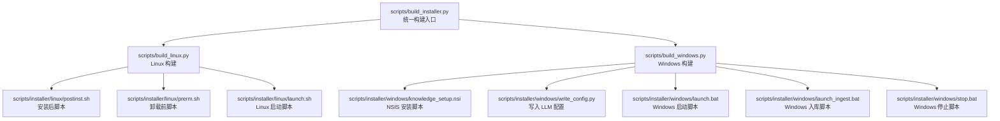
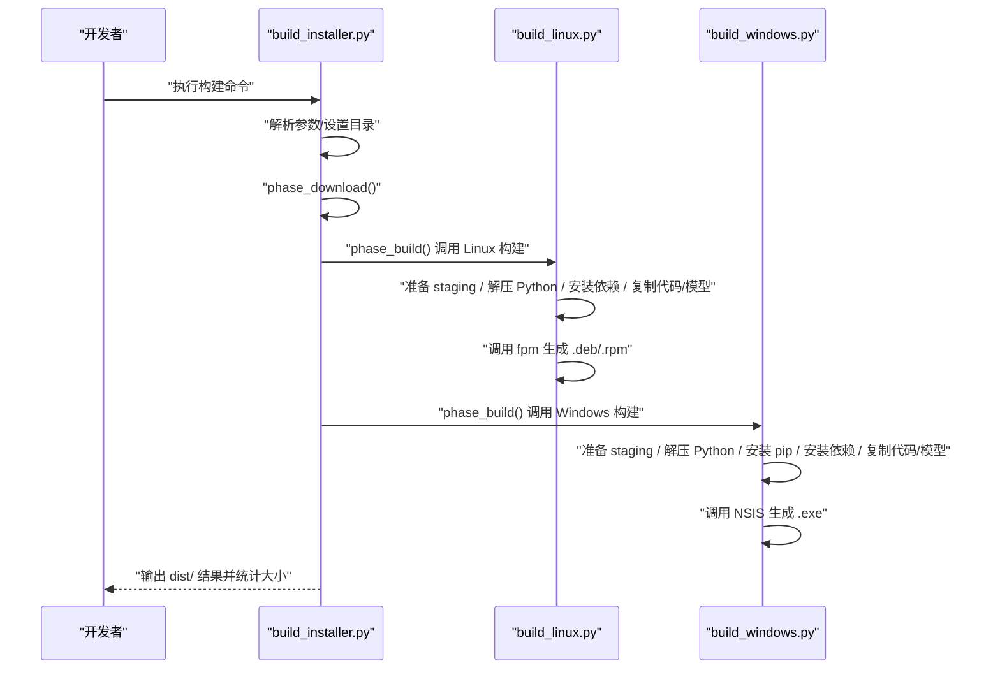
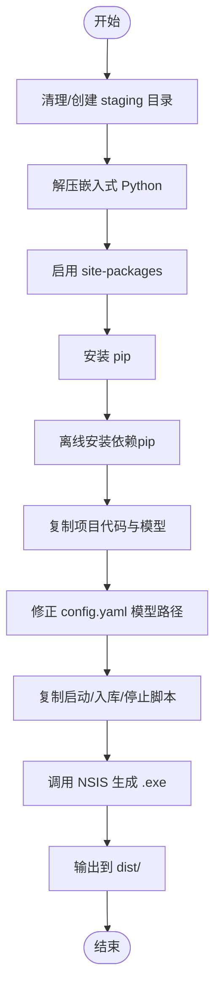
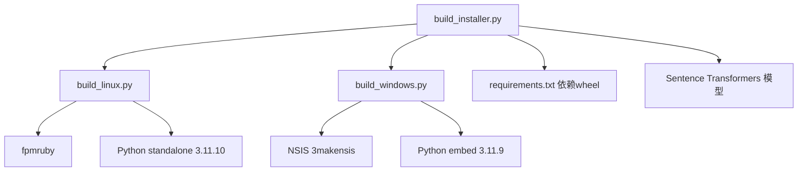

# 安装器构建工具

<cite>
**本文引用的文件**
- [build_installer.py](file://scripts/build_installer.py)
- [build_linux.py](file://scripts/build_linux.py)
- [build_windows.py](file://scripts/build_windows.py)
- [knowledge_setup.nsi](file://scripts/installer/windows/knowledge_setup.nsi)
- [write_config.py](file://scripts/installer/windows/write_config.py)
- [launch.bat](file://scripts/installer/windows/launch.bat)
- [launch_ingest.bat](file://scripts/installer/windows/launch_ingest.bat)
- [stop.bat](file://scripts/installer/windows/stop.bat)
- [postinst.sh](file://scripts/installer/linux/postinst.sh)
- [prerm.sh](file://scripts/installer/linux/prerm.sh)
- [launch.sh](file://scripts/installer/linux/launch.sh)
</cite>

## 目录
1. [简介](#简介)
2. [项目结构](#项目结构)
3. [核心组件](#核心组件)
4. [架构总览](#架构总览)
5. [详细组件分析](#详细组件分析)
6. [依赖分析](#依赖分析)
7. [性能考虑](#性能考虑)
8. [故障排查指南](#故障排查指南)
9. [结论](#结论)
10. [附录](#附录)

## 简介
本指南面向开发者，系统讲解“安装器构建工具”的功能与使用方法，涵盖命令行参数、构建配置、输出目录、跨平台安装包生成、安装包元数据配置、依赖文件指定、安装向导界面定制、构建环境准备、Python 虚拟环境配置、第三方工具依赖、构建过程监控、失败排查、日志分析与输出验证，以及自动化构建流程最佳实践。

## 项目结构
安装器构建工具位于 scripts 目录下，核心入口为 build_installer.py；针对不同平台的构建逻辑分别封装在 build_linux.py 与 build_windows.py 中；安装器模板与脚本位于 scripts/installer 目录，包含 Windows 的 NSIS 脚本与 Linux 的 postinst/prerm 以及启动脚本等。

图表来源
- [build_installer.py:1-260](file://scripts/build_installer.py#L1-L260)
- [build_linux.py:1-253](file://scripts/build_linux.py#L1-L253)
- [build_windows.py:1-193](file://scripts/build_windows.py#L1-L193)
- [knowledge_setup.nsi:1-135](file://scripts/installer/windows/knowledge_setup.nsi#L1-L135)
- [write_config.py:1-41](file://scripts/installer/windows/write_config.py#L1-L41)
- [launch.bat:1-42](file://scripts/installer/windows/launch.bat#L1-L42)
- [launch_ingest.bat:1-25](file://scripts/installer/windows/launch_ingest.bat#L1-L25)
- [stop.bat:1-26](file://scripts/installer/windows/stop.bat#L1-L26)
- [postinst.sh:1-72](file://scripts/installer/linux/postinst.sh#L1-L72)
- [prerm.sh:1-25](file://scripts/installer/linux/prerm.sh#L1-L25)
- [launch.sh:1-26](file://scripts/installer/linux/launch.sh#L1-L26)

章节来源
- [build_installer.py:1-260](file://scripts/build_installer.py#L1-L260)
- [build_linux.py:1-253](file://scripts/build_linux.py#L1-L253)
- [build_windows.py:1-193](file://scripts/build_windows.py#L1-L193)

## 核心组件
- 统一构建入口：负责解析命令行参数、准备缓存与输出目录、调度各平台构建脚本，并汇总输出结果。
- 平台构建器：
  - Linux：准备 staging 目录，离线安装依赖，复制项目代码与模型，生成 .deb/.rpm 并调用 fpm。
  - Windows：准备 staging 目录，解压嵌入式 Python，离线安装依赖，复制项目代码与模型，生成 .exe 并调用 NSIS。
- 安装器模板与脚本：Windows 使用 NSIS 脚本与自定义页面；Linux 使用 postinst/prerm 与启动脚本；两者均包含启动、入库、停止等辅助脚本。

章节来源
- [build_installer.py:230-260](file://scripts/build_installer.py#L230-L260)
- [build_linux.py:20-253](file://scripts/build_linux.py#L20-L253)
- [build_windows.py:19-193](file://scripts/build_windows.py#L19-L193)

## 架构总览
构建流程分为三个阶段：下载资源、构建 Linux、构建 Windows。统一入口根据平台参数选择性执行。

图表来源
- [build_installer.py:165-248](file://scripts/build_installer.py#L165-L248)
- [build_linux.py:20-253](file://scripts/build_linux.py#L20-L253)
- [build_windows.py:19-193](file://scripts/build_windows.py#L19-L193)

## 详细组件分析

### 统一构建入口 build_installer.py
- 功能概述
  - 支持目标平台：windows、linux、both，默认 both。
  - 支持跳过下载：--skip-download 复用 build_cache 中的资源。
  - 自动下载：Python 运行时、wheel 依赖、embedding 模型、get-pip.py。
  - 调度平台构建器：分别执行 Linux 与 Windows 的构建流程。
- 关键行为
  - 下载阶段：按平台下载 wheel、CPU 版 torch、Python 运行时与 get-pip.py。
  - 构建阶段：导入平台构建模块并传入根目录、缓存目录、输出目录、安装器模板目录。
  - 输出：打印 dist/ 下产物及大小。
- 命令示例
  - 构建全部平台：python scripts/build_installer.py --platform both
  - 仅 Windows：python scripts/build_installer.py --platform windows
  - 仅 Linux：python scripts/build_installer.py --platform linux
  - 跳过下载：python scripts/build_installer.py --platform both --skip-download

章节来源
- [build_installer.py:1-260](file://scripts/build_installer.py#L1-L260)

### Linux 安装包构建 build_linux.py
- 功能概述
  - 准备 staging 目录，解压 Python standalone，离线安装依赖，复制项目代码与模型，生成 .deb/.rpm。
- 关键步骤
  - 解压 Python standalone 并定位可执行文件。
  - 使用 pip --no-index --find-links 离线安装 requirements.txt。
  - 复制项目代码与模型，修正 config.yaml 路径。
  - 创建 systemd 服务、启动脚本、入库/停止命令、配置文件与 postinst/prerm。
  - 调用 fpm 生成 .deb 与 .rpm，移动至 dist/。
- 元数据与输出
  - 包名：knowledge-assistant
  - 版本：来自 config.yaml 的 version 字段
  - 输出：dist/knowledge-assistant_{ver}_amd64.deb 与 knowledge-assistant-{ver}.rpm
- 第三方工具依赖
  - ruby + fpm
  - 可选：rpm 工具链以生成 .rpm

图表来源
- [build_linux.py:20-253](file://scripts/build_linux.py#L20-L253)

章节来源
- [build_linux.py:1-253](file://scripts/build_linux.py#L1-L253)

### Windows 安装包构建 build_windows.py
- 功能概述
  - 准备 staging 目录，解压嵌入式 Python，安装 pip，离线安装依赖，复制项目代码与模型，生成 .exe 并调用 NSIS。
- 关键步骤
  - 解压 python-{version}-embed-amd64.zip，启用 site-packages。
  - 安装 pip（优先使用缓存的 get-pip.py，否则回退）。
  - 离线安装依赖，复制项目代码与模型，修正 config.yaml 模型路径。
  - 复制启动、入库、停止等批处理脚本。
  - 调用 NSIS 生成 .exe，输出至 dist/。
- 元数据与输出
  - 包名：knowledge-setup-{version}-windows.exe
  - 版本：来自 config.yaml 的 version 字段
- 第三方工具依赖
  - NSIS 3（makensis 在 PATH）

图表来源
- [build_windows.py:19-193](file://scripts/build_windows.py#L19-L193)

章节来源
- [build_windows.py:1-193](file://scripts/build_windows.py#L1-L193)

### Windows 安装器模板与脚本
- NSIS 安装脚本 knowledge_setup.nsi
  - 自定义安装向导页面：LLM API 地址、密钥、模型名称。
  - 安装阶段：复制文件、创建数据目录、写入 LLM 配置、修改向量库与知识库路径。
  - 快捷方式：桌面与开始菜单。
  - 卸载信息与卸载段。
- 写入配置脚本 write_config.py
  - 接收参数：config_path、api_base、api_key、model。
  - 更新 config.yaml 中的 llm 配置项。
- 启动/入库/停止脚本
  - launch.bat：确保数据目录存在，复制初始知识库文档，启动 Streamlit。
  - launch_ingest.bat：扫描 data\knowledge 并执行入库。
  - stop.bat：优先通过 PID 文件停止，回退通过进程特征查找。

章节来源
- [knowledge_setup.nsi:1-135](file://scripts/installer/windows/knowledge_setup.nsi#L1-L135)
- [write_config.py:1-41](file://scripts/installer/windows/write_config.py#L1-L41)
- [launch.bat:1-42](file://scripts/installer/windows/launch.bat#L1-L42)
- [launch_ingest.bat:1-25](file://scripts/installer/windows/launch_ingest.bat#L1-L25)
- [stop.bat:1-26](file://scripts/installer/windows/stop.bat#L1-L26)

### Linux 安装器模板与脚本
- postinst.sh
  - 创建系统用户与数据/日志/聊天历史目录。
  - 首次安装复制初始知识库文档与配置文件。
  - 更新配置文件路径，符号链接配置文件，设置权限，重载 systemd。
- prerm.sh
  - 停止并禁用服务，删除 systemd 服务文件与命令链接，支持 purge 时删除用户与数据目录。
- launch.sh
  - 前台运行 Streamlit，监听 0.0.0.0:8501，关闭统计与 CORS。

章节来源
- [postinst.sh:1-72](file://scripts/installer/linux/postinst.sh#L1-L72)
- [prerm.sh:1-25](file://scripts/installer/linux/prerm.sh#L1-L25)
- [launch.sh:1-26](file://scripts/installer/linux/launch.sh#L1-L26)

## 依赖分析
- 构建入口对平台构建器的依赖：通过动态导入模块实现解耦。
- 平台构建器对第三方工具的依赖：
  - Linux：ruby + fpm；可选 rpm 工具链。
  - Windows：NSIS 3（makensis）。
- 运行时依赖：
  - Python 版本：Windows 使用嵌入式 Python 3.11.9；Linux 使用 standalone 3.11.10。
  - 依赖下载策略：优先按平台下载 wheel，失败则回退通用下载；torch 优先 CPU 版索引。
  - 模型下载：Sentence Transformers 下载本地 embedding 模型，支持离线路径配置。

图表来源
- [build_installer.py:35-48](file://scripts/build_installer.py#L35-L48)
- [build_linux.py:194-201](file://scripts/build_linux.py#L194-L201)
- [build_windows.py:164-173](file://scripts/build_windows.py#L164-L173)

章节来源
- [build_installer.py:35-48](file://scripts/build_installer.py#L35-L48)
- [build_linux.py:194-201](file://scripts/build_linux.py#L194-L201)
- [build_windows.py:164-173](file://scripts/build_windows.py#L164-L173)

## 性能考虑
- 资源复用：使用 --skip-download 可避免重复下载，显著缩短二次构建时间。
- 依赖安装优化：离线安装减少网络波动影响；若单个包安装失败，脚本会尝试逐个安装以提升成功率。
- 模型下载：首次下载模型耗时较长，建议在 CI 中预热缓存。
- 输出验证：构建完成后自动统计产物大小，便于容量评估与发布检查。

## 故障排查指南
- 未找到 makensis（Windows）
  - 现象：提示未找到 makensis，给出安装与 PATH 配置指引。
  - 处理：安装 NSIS 3 并将目录加入 PATH，或手动执行生成命令。
  - 参考：[build_windows.py:164-173](file://scripts/build_windows.py#L164-L173)
- 未找到 fpm（Linux）
  - 现象：提示未找到 fpm，给出 gem install fpm 指引。
  - 处理：安装 Ruby 并执行 gem install fpm，或手动在 staging 目录执行 fpm 命令。
  - 参考：[build_linux.py:194-201](file://scripts/build_linux.py#L194-L201)
- pip 安装失败
  - 现象：离线安装失败，脚本尝试逐个安装。
  - 处理：检查 requirements.txt 与 wheels 目录是否完整；确认平台匹配。
  - 参考：[build_linux.py:85-98](file://scripts/build_linux.py#L85-L98)、[build_windows.py:87-101](file://scripts/build_windows.py#L87-L101)
- 缺少 Python standalone/wheel 模型
  - 现象：找不到缓存文件，构建提前退出。
  - 处理：先执行下载阶段，确保缓存目录存在对应文件。
  - 参考：[build_linux.py:32-35](file://scripts/build_linux.py#L32-L35)、[build_windows.py:32-35](file://scripts/build_windows.py#L32-L35)
- 模型下载失败或超时
  - 现象：模型下载缓慢或失败。
  - 处理：使用离线本地模型（通过 model_root 配置）；或在线环境检查网络连通性。
  - 参考：[build_installer.py:137](file://scripts/build_installer.py#L137)
- 输出验证
  - 检查 dist/ 是否包含目标产物；查看构建日志末尾的文件大小统计。
  - 参考：[build_installer.py:253-256](file://scripts/build_installer.py#L253-L256)

章节来源
- [build_windows.py:164-173](file://scripts/build_windows.py#L164-L173)
- [build_linux.py:194-201](file://scripts/build_linux.py#L194-L201)
- [build_linux.py:85-98](file://scripts/build_linux.py#L85-L98)
- [build_windows.py:87-101](file://scripts/build_windows.py#L87-L101)
- [build_linux.py:32-35](file://scripts/build_linux.py#L32-L35)
- [build_windows.py:32-35](file://scripts/build_windows.py#L32-L35)
- [build_installer.py:137](file://scripts/build_installer.py#L137)
- [build_installer.py:253-256](file://scripts/build_installer.py#L253-L256)

## 结论
该安装器构建工具通过统一入口与平台专用构建器，实现了跨平台离线安装包的自动化生成。配合 NSIS 与 fpm、嵌入式 Python 与本地模型，能够在无外网环境下完成完整的安装包构建。遵循本文提供的环境准备、参数使用、故障排查与最佳实践，可高效稳定地交付 Windows 与 Linux 平台的安装包。

## 附录

### 命令行参数与使用方法
- 目标平台
  - --platform windows | linux | both（默认 both）
- 跳过下载
  - --skip-download：复用 build_cache 中的资源
- 示例
  - 构建全部平台：python scripts/build_installer.py --platform both
  - 仅 Windows：python scripts/build_installer.py --platform windows
  - 仅 Linux：python scripts/build_installer.py --platform linux
  - 跳过下载：python scripts/build_installer.py --platform both --skip-download

章节来源
- [build_installer.py:230-236](file://scripts/build_installer.py#L230-L236)

### 构建环境准备与第三方工具依赖
- Windows
  - NSIS 3（makensis 在 PATH）
- Linux
  - Ruby + fpm
  - 可选：rpm 工具链（用于 .rpm）
- Python 运行时
  - Windows：python-{version}-embed-amd64.zip
  - Linux：standalone 3.11.10
- 依赖与模型
  - requirements.txt 对应 wheel 文件
  - Sentence Transformers 模型（支持离线本地路径）

章节来源
- [build_installer.py:11-18](file://scripts/build_installer.py#L11-L18)
- [build_linux.py:5-9](file://scripts/build_linux.py#L5-L9)
- [build_windows.py:4-6](file://scripts/build_windows.py#L4-L6)
- [build_installer.py:35-48](file://scripts/build_installer.py#L35-L48)

### 输出目录与产物
- 输出目录：dist/
- Windows
  - knowledge-setup-{version}-windows.exe
- Linux
  - knowledge-assistant_{version}_amd64.deb
  - knowledge-assistant-{version}.rpm（如具备 rpm 工具链）

章节来源
- [build_installer.py:15-18](file://scripts/build_installer.py#L15-L18)
- [build_linux.py:204-244](file://scripts/build_linux.py#L204-L244)
- [build_windows.py:187-192](file://scripts/build_windows.py#L187-L192)

### 安装包元数据与配置
- Windows
  - NSIS 安装脚本定义应用名、版本、安装目录、请求权限级别。
  - 自定义安装向导页面：LLM API 地址、密钥、模型名称。
  - 安装后写入配置：通过 write_config.py 更新 config.yaml。
- Linux
  - fpm 参数：包名、版本、架构、描述、维护者、系统服务集成。
  - postinst/prerm：创建用户与目录、符号链接配置、设置权限、重载 systemd。

章节来源
- [knowledge_setup.nsi:12-16](file://scripts/installer/windows/knowledge_setup.nsi#L12-L16)
- [knowledge_setup.nsi:20-66](file://scripts/installer/windows/knowledge_setup.nsi#L20-L66)
- [knowledge_setup.nsi:90-98](file://scripts/installer/windows/knowledge_setup.nsi#L90-L98)
- [write_config.py:11-33](file://scripts/installer/windows/write_config.py#L11-L33)
- [build_linux.py:204-236](file://scripts/build_linux.py#L204-L236)
- [postinst.sh:10-58](file://scripts/installer/linux/postinst.sh#L10-L58)
- [prerm.sh:5-24](file://scripts/installer/linux/prerm.sh#L5-L24)

### 依赖文件指定与下载策略
- 依赖来源
  - requirements.txt
  - 平台匹配：win_amd64 / manylinux2014_x86_64
  - torch CPU 版：从 CPU 索引下载并替换通用 wheel
- 回退机制
  - 平台下载失败时回退到通用下载
  - pip 安装失败时逐个安装

章节来源
- [build_installer.py:61-129](file://scripts/build_installer.py#L61-L129)
- [build_linux.py:77-98](file://scripts/build_linux.py#L77-L98)
- [build_windows.py:79-101](file://scripts/build_windows.py#L79-L101)

### 安装向导界面定制
- Windows
  - 自定义页面包含 LLM API 地址、密钥、模型名称输入框。
  - 安装阶段写入配置并修改向量库与知识库路径。
- Linux
  - 通过 postinst 脚本完成路径修正与权限设置，无需图形化向导。

章节来源
- [knowledge_setup.nsi:20-66](file://scripts/installer/windows/knowledge_setup.nsi#L20-L66)
- [knowledge_setup.nsi:90-98](file://scripts/installer/windows/knowledge_setup.nsi#L90-L98)
- [postinst.sh:27-52](file://scripts/installer/linux/postinst.sh#L27-L52)

### 构建过程监控与日志分析
- 进度提示：每个阶段打印明确的步骤信息与状态。
- 失败处理：记录 stderr 输出，必要时回退到逐个安装或手动执行命令。
- 输出验证：构建完成后列出 dist/ 下产物及其大小。

章节来源
- [build_linux.py:85-98](file://scripts/build_linux.py#L85-L98)
- [build_windows.py:87-101](file://scripts/build_windows.py#L87-L101)
- [build_linux.py:220-227](file://scripts/build_linux.py#L220-L227)
- [build_windows.py:182-185](file://scripts/build_windows.py#L182-L185)
- [build_installer.py:253-256](file://scripts/build_installer.py#L253-L256)

### 自动化构建流程最佳实践
- CI/CD 流水线
  - 预热缓存：下载 Python standalone、wheel、模型，放入 build_cache。
  - 分阶段构建：先 Linux 后 Windows，或并行构建。
  - 产物归档：上传 dist/ 产物与日志。
- 环境隔离
  - 使用独立 Python 环境执行构建脚本，避免全局依赖污染。
- 版本管理
  - 通过 config.yaml 的 version 字段统一管理版本号，避免硬编码。
- 稳定性保障
  - 使用 --skip-download 提升稳定性与速度。
  - 对关键步骤增加重试与回退逻辑（脚本已内置）。