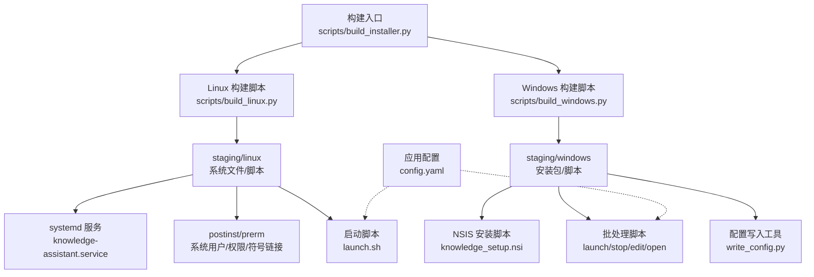
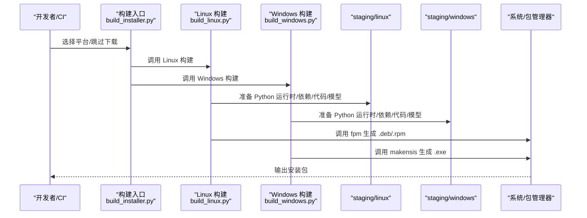
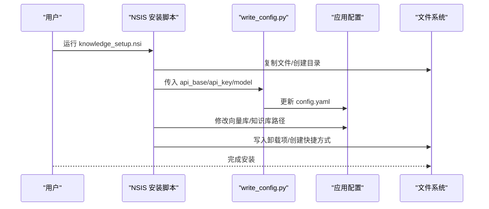
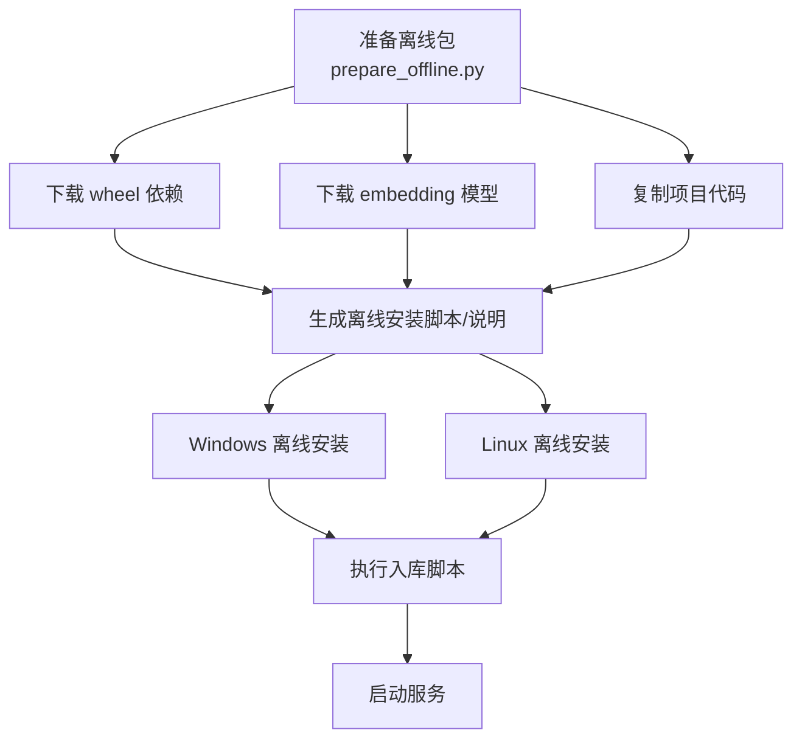
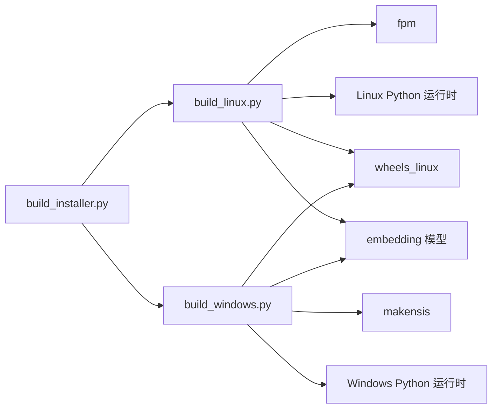

# 安装部署脚本

<cite>
**本文引用的文件**
- [scripts/build_installer.py](file://scripts/build_installer.py)
- [scripts/build_linux.py](file://scripts/build_linux.py)
- [scripts/build_windows.py](file://scripts/build_windows.py)
- [scripts/prepare_offline.py](file://scripts/prepare_offline.py)
- [scripts/ingest.py](file://scripts/ingest.py)
- [scripts/installer/linux/knowledge-assistant.service](file://scripts/installer/linux/knowledge-assistant.service)
- [scripts/installer/linux/postinst.sh](file://scripts/installer/linux/postinst.sh)
- [scripts/installer/linux/prerm.sh](file://scripts/installer/linux/prerm.sh)
- [scripts/installer/linux/launch.sh](file://scripts/installer/linux/launch.sh)
- [scripts/installer/windows/knowledge_setup.nsi](file://scripts/installer/windows/knowledge_setup.nsi)
- [scripts/installer/windows/write_config.py](file://scripts/installer/windows/write_config.py)
- [scripts/installer/windows/launch.bat](file://scripts/installer/windows/launch.bat)
- [scripts/installer/windows/stop.bat](file://scripts/installer/windows/stop.bat)
- [scripts/installer/windows/edit_config.bat](file://scripts/installer/windows/edit_config.bat)
- [scripts/installer/windows/open_knowledge.bat](file://scripts/installer/windows/open_knowledge.bat)
- [config.yaml](file://config.yaml)
</cite>

## 目录
1. [简介](#简介)
2. [项目结构](#项目结构)
3. [核心组件](#核心组件)
4. [架构总览](#架构总览)
5. [详细组件分析](#详细组件分析)
6. [依赖关系分析](#依赖关系分析)
7. [性能与容量规划](#性能与容量规划)
8. [故障排查指南](#故障排查指南)
9. [结论](#结论)
10. [附录](#附录)

## 简介
本操作手册面向系统管理员，提供“知识库智能问答系统”的标准化安装部署流程，覆盖以下能力：
- Linux 与 Windows 平台的安装器生成与自动部署
- 系统依赖检查与环境准备
- 安装器配置文件、服务注册、开机自启、防火墙规则建议
- 离线安装包制作与批量部署方案
- 升级更新机制与卸载清理流程
- 安装前检查清单与常见问题处理

## 项目结构
围绕安装部署的核心文件组织如下：
- 构建入口与平台脚本：scripts/build_installer.py、scripts/build_linux.py、scripts/build_windows.py
- 离线打包与安装：scripts/prepare_offline.py、scripts/ingest.py
- Linux 安装器：systemd 服务、postinst/prerm、启动脚本
- Windows 安装器：NSIS 脚本、批处理脚本、配置写入工具
- 应用配置：config.yaml

图表来源
- [scripts/build_installer.py:1-260](file://scripts/build_installer.py#L1-L260)
- [scripts/build_linux.py:1-253](file://scripts/build_linux.py#L1-L253)
- [scripts/build_windows.py:1-193](file://scripts/build_windows.py#L1-L193)
- [scripts/installer/linux/knowledge-assistant.service:1-29](file://scripts/installer/linux/knowledge-assistant.service#L1-L29)
- [scripts/installer/linux/postinst.sh:1-72](file://scripts/installer/linux/postinst.sh#L1-L72)
- [scripts/installer/linux/prerm.sh:1-25](file://scripts/installer/linux/prerm.sh#L1-L25)
- [scripts/installer/linux/launch.sh:1-26](file://scripts/installer/linux/launch.sh#L1-L26)
- [scripts/installer/windows/knowledge_setup.nsi:1-135](file://scripts/installer/windows/knowledge_setup.nsi#L1-L135)
- [scripts/installer/windows/write_config.py:1-41](file://scripts/installer/windows/write_config.py#L1-L41)
- [scripts/installer/windows/launch.bat:1-42](file://scripts/installer/windows/launch.bat#L1-L42)
- [scripts/installer/windows/stop.bat:1-26](file://scripts/installer/windows/stop.bat#L1-L26)
- [scripts/installer/windows/edit_config.bat:1-5](file://scripts/installer/windows/edit_config.bat#L1-L5)
- [scripts/installer/windows/open_knowledge.bat:1-6](file://scripts/installer/windows/open_knowledge.bat#L1-L6)
- [config.yaml:1-46](file://config.yaml#L1-L46)

章节来源
- [scripts/build_installer.py:1-260](file://scripts/build_installer.py#L1-L260)
- [scripts/build_linux.py:1-253](file://scripts/build_linux.py#L1-L253)
- [scripts/build_windows.py:1-193](file://scripts/build_windows.py#L1-L193)
- [scripts/installer/linux/knowledge-assistant.service:1-29](file://scripts/installer/linux/knowledge-assistant.service#L1-L29)
- [scripts/installer/linux/postinst.sh:1-72](file://scripts/installer/linux/postinst.sh#L1-L72)
- [scripts/installer/linux/prerm.sh:1-25](file://scripts/installer/linux/prerm.sh#L1-L25)
- [scripts/installer/linux/launch.sh:1-26](file://scripts/installer/linux/launch.sh#L1-L26)
- [scripts/installer/windows/knowledge_setup.nsi:1-135](file://scripts/installer/windows/knowledge_setup.nsi#L1-L135)
- [scripts/installer/windows/write_config.py:1-41](file://scripts/installer/windows/write_config.py#L1-L41)
- [scripts/installer/windows/launch.bat:1-42](file://scripts/installer/windows/launch.bat#L1-L42)
- [scripts/installer/windows/stop.bat:1-26](file://scripts/installer/windows/stop.bat#L1-L26)
- [scripts/installer/windows/edit_config.bat:1-5](file://scripts/installer/windows/edit_config.bat#L1-L5)
- [scripts/installer/windows/open_knowledge.bat:1-6](file://scripts/installer/windows/open_knowledge.bat#L1-L6)
- [config.yaml:1-46](file://config.yaml#L1-L46)

## 核心组件
- 离线安装包构建工具：统一入口负责下载依赖、模型与运行时，并调用平台脚本生成安装包。
- Linux 安装器：基于 fpm 生成 .deb/.rpm，包含 systemd 服务、postinst/prerm、启动脚本与符号链接命令。
- Windows 安装器：基于 NSIS 生成 .exe，包含安装向导、批处理脚本、配置写入工具。
- 离线部署打包：在联网环境打包 wheel、模型与项目代码，生成双端离线安装脚本与说明。
- 文档入库脚本：扫描知识库目录，分块、向量化并写入向量库。

章节来源
- [scripts/build_installer.py:1-260](file://scripts/build_installer.py#L1-L260)
- [scripts/build_linux.py:1-253](file://scripts/build_linux.py#L1-L253)
- [scripts/build_windows.py:1-193](file://scripts/build_windows.py#L1-L193)
- [scripts/prepare_offline.py:1-259](file://scripts/prepare_offline.py#L1-L259)
- [scripts/ingest.py:1-62](file://scripts/ingest.py#L1-L62)

## 架构总览
下图展示安装包构建与部署的关键流程：

图表来源
- [scripts/build_installer.py:200-228](file://scripts/build_installer.py#L200-L228)
- [scripts/build_linux.py:191-252](file://scripts/build_linux.py#L191-L252)
- [scripts/build_windows.py:160-192](file://scripts/build_windows.py#L160-L192)

## 详细组件分析

### Linux 安装器与服务
- systemd 服务文件定义了服务类型、用户组、工作目录、启动参数与安全限制。
- postinst 脚本负责：
  - 创建系统用户与数据/日志/配置目录
  - 首次安装复制初始知识库文档
  - 写入并符号链接配置文件，修正路径
  - 设置权限与可执行位，重载 systemd
- prerm 脚本负责：
  - 停止并禁用服务
  - 删除服务文件与命令符号链接
  - 支持 purge 时删除用户与数据/日志/配置目录

图表来源
- [scripts/installer/linux/postinst.sh:10-61](file://scripts/installer/linux/postinst.sh#L10-L61)
- [scripts/installer/linux/prerm.sh:5-24](file://scripts/installer/linux/prerm.sh#L5-L24)
- [scripts/installer/linux/knowledge-assistant.service:5-28](file://scripts/installer/linux/knowledge-assistant.service#L5-L28)

章节来源
- [scripts/installer/linux/knowledge-assistant.service:1-29](file://scripts/installer/linux/knowledge-assistant.service#L1-L29)
- [scripts/installer/linux/postinst.sh:1-72](file://scripts/installer/linux/postinst.sh#L1-L72)
- [scripts/installer/linux/prerm.sh:1-25](file://scripts/installer/linux/prerm.sh#L1-L25)

### Windows 安装器与批处理
- NSIS 安装脚本：
  - 安装向导包含 LLM API 配置页面，支持空值（安装后可编辑）
  - 复制文件、创建数据目录、复制初始知识库文档
  - 调用 write_config.py 写入配置，再修改 config.yaml 的路径
  - 写入卸载项到注册表，创建桌面与开始菜单快捷方式
- 批处理脚本：
  - launch.bat：确保数据目录存在，必要时复制初始文档，启动 Streamlit
  - stop.bat：优先通过 PID 文件，回退进程名匹配终止
  - edit_config.bat/open_knowledge.bat：打开配置与知识库目录
- 配置写入工具 write_config.py：解析命令行参数，更新 config.yaml 对应字段

图表来源
- [scripts/installer/windows/knowledge_setup.nsi:38-99](file://scripts/installer/windows/knowledge_setup.nsi#L38-L99)
- [scripts/installer/windows/write_config.py:11-31](file://scripts/installer/windows/write_config.py#L11-L31)
- [scripts/installer/windows/launch.bat:10-39](file://scripts/installer/windows/launch.bat#L10-L39)
- [scripts/installer/windows/stop.bat:10-22](file://scripts/installer/windows/stop.bat#L10-L22)
- [scripts/installer/windows/edit_config.bat:1-5](file://scripts/installer/windows/edit_config.bat#L1-L5)
- [scripts/installer/windows/open_knowledge.bat:1-6](file://scripts/installer/windows/open_knowledge.bat#L1-L6)

章节来源
- [scripts/installer/windows/knowledge_setup.nsi:1-135](file://scripts/installer/windows/knowledge_setup.nsi#L1-L135)
- [scripts/installer/windows/write_config.py:1-41](file://scripts/installer/windows/write_config.py#L1-L41)
- [scripts/installer/windows/launch.bat:1-42](file://scripts/installer/windows/launch.bat#L1-L42)
- [scripts/installer/windows/stop.bat:1-26](file://scripts/installer/windows/stop.bat#L1-L26)
- [scripts/installer/windows/edit_config.bat:1-5](file://scripts/installer/windows/edit_config.bat#L1-L5)
- [scripts/installer/windows/open_knowledge.bat:1-6](file://scripts/installer/windows/open_knowledge.bat#L1-L6)

### 离线安装包制作与批量部署
- prepare_offline.py：
  - 下载 wheel 依赖、下载 embedding 模型、复制项目代码
  - 生成 Windows 与 Linux 两套离线安装脚本与部署说明
- 批量部署建议：
  - 将 knowledge_offline/ 拷贝至各目标机
  - Windows：直接运行 install_offline.bat；Linux：赋予执行权限后运行 install_offline.sh
  - 入库：在各自 venv 中执行 scripts/ingest.py
  - 启动：在各自 venv 中执行 streamlit run app.py --server.port 8501

图表来源
- [scripts/prepare_offline.py:32-227](file://scripts/prepare_offline.py#L32-L227)

章节来源
- [scripts/prepare_offline.py:1-259](file://scripts/prepare_offline.py#L1-L259)

### 文档入库与配置
- ingest.py：
  - 设置离线模型环境变量
  - 读取配置，扫描知识库目录，分块、向量化并写入向量库
  - 支持增量更新，记录日志与统计
- config.yaml：
  - LLM API 配置、Embedding 模型、向量库持久化目录、知识库目录与分块策略等
  - UI 与审计日志、速率限制等

章节来源
- [scripts/ingest.py:1-62](file://scripts/ingest.py#L1-L62)
- [config.yaml:1-46](file://config.yaml#L1-L46)

## 依赖关系分析
- 构建工具链：
  - Linux：ruby + fpm（生成 .deb/.rpm），需 rpm 工具链以构建 .rpm
  - Windows：NSIS 3（makensis）
- 运行时与依赖：
  - Linux：独立 Python 运行时（standalone），离线安装依赖 wheel
  - Windows：嵌入式 Python（embed），离线安装依赖 wheel
- 模型与数据：
  - embedding 模型随安装包或离线包提供，路径在安装后被正确指向

图表来源
- [scripts/build_installer.py:11-13](file://scripts/build_installer.py#L11-L13)
- [scripts/build_linux.py:5-8](file://scripts/build_linux.py#L5-L8)
- [scripts/build_windows.py:5](file://scripts/build_windows.py#L5)

章节来源
- [scripts/build_installer.py:11-13](file://scripts/build_installer.py#L11-L13)
- [scripts/build_linux.py:5-8](file://scripts/build_linux.py#L5-L8)
- [scripts/build_windows.py:5](file://scripts/build_windows.py#L5)

## 性能与容量规划
- 向量库容量：根据知识库文档数量与分块策略估算 chroma_db 占用空间。
- 模型占用：embedding 模型约数百 MB，部署于本地磁盘即可。
- 并发与速率限制：config.yaml 提供速率限制配置，可根据业务并发调整。
- 网络与模型：优先使用离线本地模型，减少网络依赖。

[本节为通用指导，无需特定文件引用]

## 故障排查指南
- Linux 安装失败（fpm 未找到）
  - 现象：构建 .deb/.rpm 时报错找不到 fpm
  - 处理：安装 Ruby 并执行 gem install fpm，或手动在 staging 目录运行 fpm 命令
  - 参考：[scripts/build_linux.py:194-201](file://scripts/build_linux.py#L194-L201)
- Windows 安装失败（NSIS 未找到）
  - 现象：构建 .exe 报错找不到 makensis
  - 处理：安装 NSIS 3 并将 NSIS 目录加入 PATH，重新运行
  - 参考：[scripts/build_windows.py:164-173](file://scripts/build_windows.py#L164-L173)
- 依赖安装失败（离线 pip）
  - 现象：pip install 失败或部分包无法安装
  - 处理：回退到逐个安装策略，确认 wheels 目录完整性
  - 参考：[scripts/build_linux.py:88-98](file://scripts/build_linux.py#L88-L98)、[scripts/build_windows.py:87-101](file://scripts/build_windows.py#L87-L101)
- 配置路径错误
  - 现象：服务启动后无法找到模型或向量库
  - 处理：确认 postinst/prerm 是否正确修改 config.yaml 路径，或离线安装脚本是否更新本地路径
  - 参考：[scripts/installer/linux/postinst.sh:34-46](file://scripts/installer/linux/postinst.sh#L34-L46)、[scripts/prepare_offline.py:168-176](file://scripts/prepare_offline.py#L168-L176)
- 服务无法启动或端口占用
  - 现象：Streamlit 端口 8501 被占用或服务状态异常
  - 处理：检查端口占用、防火墙放行、systemd 状态与日志
  - 参考：[scripts/installer/linux/knowledge-assistant.service:10-15](file://scripts/installer/linux/knowledge-assistant.service#L10-L15)
- Windows 进程停止失败
  - 现象：stop.bat 无法终止服务
  - 处理：确认 PID 文件是否存在，或使用任务管理器按命令行特征终止
  - 参考：[scripts/installer/windows/stop.bat:10-22](file://scripts/installer/windows/stop.bat#L10-L22)

章节来源
- [scripts/build_linux.py:194-201](file://scripts/build_linux.py#L194-L201)
- [scripts/build_windows.py:164-173](file://scripts/build_windows.py#L164-L173)
- [scripts/build_linux.py:88-98](file://scripts/build_linux.py#L88-L98)
- [scripts/build_windows.py:87-101](file://scripts/build_windows.py#L87-L101)
- [scripts/installer/linux/postinst.sh:34-46](file://scripts/installer/linux/postinst.sh#L34-L46)
- [scripts/prepare_offline.py:168-176](file://scripts/prepare_offline.py#L168-L176)
- [scripts/installer/linux/knowledge-assistant.service:10-15](file://scripts/installer/linux/knowledge-assistant.service#L10-L15)
- [scripts/installer/windows/stop.bat:10-22](file://scripts/installer/windows/stop.bat#L10-L22)

## 结论
通过统一的安装包构建与离线部署方案，系统管理员可在不同平台快速完成安装、配置、入库与启动。建议在生产环境中结合防火墙放行、开机自启与日志监控，确保服务稳定运行。

[本节为总结，无需特定文件引用]

## 附录

### 安装前检查清单（Linux）
- 已安装 Ruby 与 fpm，可选安装 rpm 工具链
- 已准备 Python standalone 运行时与 wheels
- 已准备 embedding 模型
- 确认系统用户 knowledge-assistant 不存在或可创建
- 确认端口 8501 未被占用

章节来源
- [scripts/build_linux.py:5-8](file://scripts/build_linux.py#L5-L8)
- [scripts/installer/linux/postinst.sh:10-13](file://scripts/installer/linux/postinst.sh#L10-L13)
- [scripts/installer/linux/knowledge-assistant.service:10-15](file://scripts/installer/linux/knowledge-assistant.service#L10-L15)

### 安装前检查清单（Windows）
- 已安装 NSIS 3，makensis 在 PATH 中
- 已准备 Python embed 运行时与 wheels
- 已准备 embedding 模型
- 确认以管理员身份运行安装包
- 确认端口 8501 未被占用

章节来源
- [scripts/build_windows.py:5](file://scripts/build_windows.py#L5)
- [scripts/installer/windows/knowledge_setup.nsi:18](file://scripts/installer/windows/knowledge_setup.nsi#L18)
- [scripts/installer/windows/launch.bat:34-39](file://scripts/installer/windows/launch.bat#L34-L39)

### 升级更新机制
- 重新运行构建入口以生成新版本安装包
- Linux：更新 .deb/.rpm 后执行包管理器升级
- Windows：重新运行 .exe 安装程序，覆盖安装会更新文件与配置
- 入库：升级后可再次执行入库脚本进行增量更新

章节来源
- [scripts/build_installer.py:230-256](file://scripts/build_installer.py#L230-L256)
- [scripts/ingest.py:51-57](file://scripts/ingest.py#L51-L57)

### 卸载清理流程
- Linux：执行包管理器卸载，prerm 会停止服务、删除服务文件与命令符号链接；purge 时删除用户与数据/日志/配置目录
- Windows：运行卸载程序或通过控制面板卸载，删除注册表项与快捷方式

章节来源
- [scripts/installer/linux/prerm.sh:5-24](file://scripts/installer/linux/prerm.sh#L5-L24)
- [scripts/installer/windows/knowledge_setup.nsi:129-134](file://scripts/installer/windows/knowledge_setup.nsi#L129-L134)

### 防火墙规则配置建议
- 放行端口 8501（TCP）用于 Web 访问
- 如使用外部 LLM API，请放行出站 HTTPS 请求
- 如使用本地推理服务（如 vLLM），放行相应端口

[本节为通用建议，无需特定文件引用]