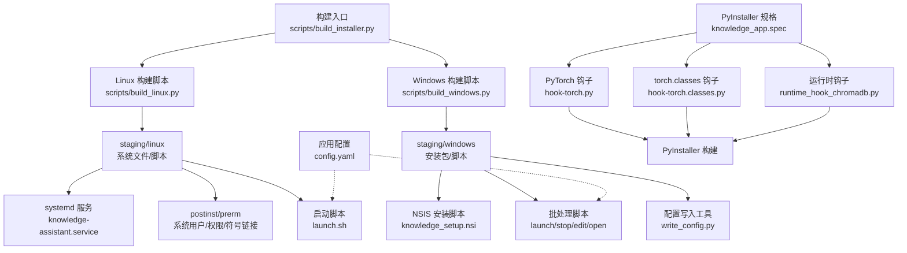
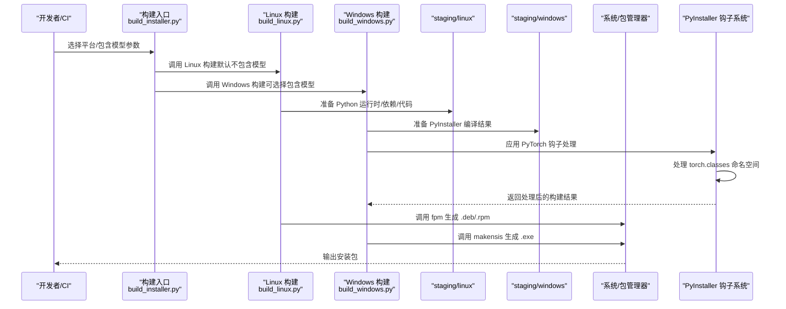
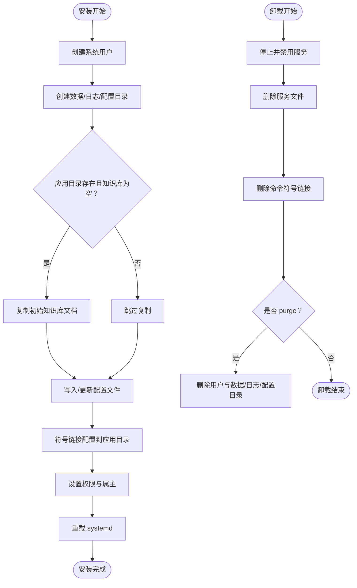
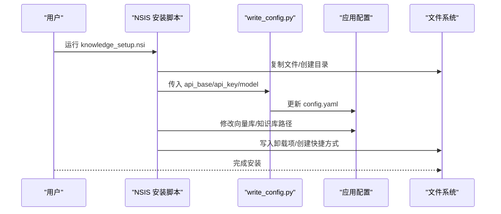
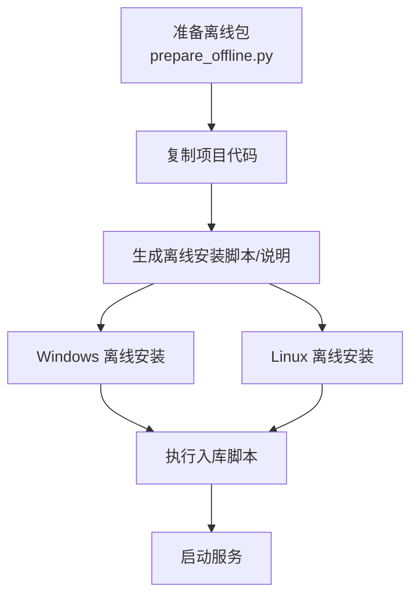
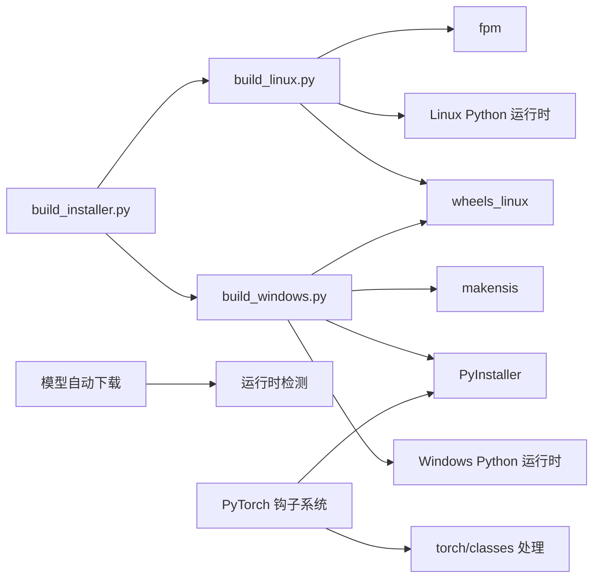

# 安装部署脚本

<cite>
**本文引用的文件**
- [scripts/build_installer.py](file://scripts/build_installer.py)
- [scripts/build_linux.py](file://scripts/build_linux.py)
- [scripts/build_windows.py](file://scripts/build_windows.py)
- [scripts/prepare_offline.py](file://scripts/prepare_offline.py)
- [scripts/ingest.py](file://scripts/ingest.py)
- [scripts/installer/linux/knowledge-assistant.service](file://scripts/installer/linux/knowledge-assistant.service)
- [scripts/installer/linux/postinst.sh](file://scripts/installer/linux/postinst.sh)
- [scripts/installer/linux/prerm.sh](file://scripts/installer/linux/prerm.sh)
- [scripts/installer/linux/launch.sh](file://scripts/installer/linux/launch.sh)
- [scripts/installer/windows/knowledge_setup.nsi](file://scripts/installer/windows/knowledge_setup.nsi)
- [scripts/installer/windows/write_config.py](file://scripts/installer/windows/write_config.py)
- [scripts/installer/windows/launch.bat](file://scripts/installer/windows/launch.bat)
- [scripts/installer/windows/stop.bat](file://scripts/installer/windows/stop.bat)
- [scripts/installer/windows/edit_config.bat](file://scripts/installer/windows/edit_config.bat)
- [scripts/installer/windows/open_knowledge.bat](file://scripts/installer/windows/open_knowledge.bat)
- [config.yaml](file://config.yaml)
- [knowledge_app.spec](file://knowledge_app.spec)
- [scripts/hooks/hook-torch.py](file://scripts/hooks/hook-torch.py)
- [scripts/hooks/hook-torch.classes.py](file://scripts/hooks/hook-torch.classes.py)
- [scripts/hooks/runtime_hook_chromadb.py](file://scripts/hooks/runtime_hook_chromadb.py)
</cite>

## 更新摘要
**变更内容**
- 新增 PyInstaller hook-torch.py 和 hook-torch.classes.py 文件，专门解决 torch.classes 命名空间的兼容性问题
- 更新了 PyInstaller 规格文件，集成 torch 相关的钩子文件和排除模块配置
- 增强了 PyTorch 生态系统的打包兼容性，消除了构建过程中的警告信息
- 完善了 PyInstaller 钩子系统的文档说明

## 目录
1. [简介](#简介)
2. [项目结构](#项目结构)
3. [核心组件](#核心组件)
4. [架构总览](#架构总览)
5. [详细组件分析](#详细组件分析)
6. [依赖关系分析](#依赖关系分析)
7. [性能与容量规划](#性能与容量规划)
8. [故障排查指南](#故障排查指南)
9. [结论](#结论)
10. [附录](#附录)

## 简介
本操作手册面向系统管理员，提供"知识库智能问答系统"的标准化安装部署流程，覆盖以下能力：
- Linux 与 Windows 平台的安装器生成与自动部署
- 系统依赖检查与环境准备
- 安装器配置文件、服务注册、开机自启、防火墙规则建议
- 离线安装包制作与批量部署方案
- 升级更新机制与卸载清理流程
- 安装前检查清单与常见问题处理

**更新** 本版本重点介绍了新的安装器构建脚本重构，包括参数变更、默认行为调整以及 PyTorch 生态系统的兼容性增强。

## 项目结构
围绕安装部署的核心文件组织如下：
- 构建入口与平台脚本：scripts/build_installer.py、scripts/build_linux.py、scripts/build_windows.py
- 离线打包与安装：scripts/prepare_offline.py、scripts/ingest.py
- Linux 安装器：systemd 服务、postinst/prerm、启动脚本
- Windows 安装器：NSIS 脚本、批处理脚本、配置写入工具
- **新增** PyInstaller 钩子系统：torch 相关钩子文件、运行时钩子
- 应用配置：config.yaml
- PyInstaller 规格文件：knowledge_app.spec

**图表来源**
- [scripts/build_installer.py:1-129](file://scripts/build_installer.py#L1-L129)
- [scripts/build_linux.py:1-254](file://scripts/build_linux.py#L1-L254)
- [scripts/build_windows.py:1-171](file://scripts/build_windows.py#L1-L171)
- [scripts/installer/linux/knowledge-assistant.service:1-29](file://scripts/installer/linux/knowledge-assistant.service#L1-L29)
- [scripts/installer/linux/postinst.sh:1-76](file://scripts/installer/linux/postinst.sh#L1-L76)
- [scripts/installer/linux/prerm.sh:1-25](file://scripts/installer/linux/prerm.sh#L1-L25)
- [scripts/installer/linux/launch.sh:1-26](file://scripts/installer/linux/launch.sh#L1-L26)
- [scripts/installer/windows/knowledge_setup.nsi:1-141](file://scripts/installer/windows/knowledge_setup.nsi#L1-L141)
- [scripts/installer/windows/write_config.py:1-41](file://scripts/installer/windows/write_config.py#L1-L41)
- [scripts/installer/windows/launch.bat:1-42](file://scripts/installer/windows/launch.bat#L1-L42)
- [scripts/installer/windows/stop.bat:1-26](file://scripts/installer/windows/stop.bat#L1-L26)
- [scripts/installer/windows/edit_config.bat:1-5](file://scripts/installer/windows/edit_config.bat#L1-L5)
- [scripts/installer/windows/open_knowledge.bat:1-6](file://scripts/installer/windows/open_knowledge.bat#L1-L6)
- [config.yaml:1-94](file://config.yaml#L1-L94)
- [knowledge_app.spec:1-212](file://knowledge_app.spec#L1-L212)
- [scripts/hooks/hook-torch.py:1-9](file://scripts/hooks/hook-torch.py#L1-L9)
- [scripts/hooks/hook-torch.classes.py:1-8](file://scripts/hooks/hook-torch.classes.py#L1-L8)
- [scripts/hooks/runtime_hook_chromadb.py:1-50](file://scripts/hooks/runtime_hook_chromadb.py#L1-L50)

**章节来源**
- [scripts/build_installer.py:1-129](file://scripts/build_installer.py#L1-L129)
- [scripts/build_linux.py:1-254](file://scripts/build_linux.py#L1-L254)
- [scripts/build_windows.py:1-171](file://scripts/build_windows.py#L1-L171)
- [scripts/installer/linux/knowledge-assistant.service:1-29](file://scripts/installer/linux/knowledge-assistant.service#L1-L29)
- [scripts/installer/linux/postinst.sh:1-76](file://scripts/installer/linux/postinst.sh#L1-L76)
- [scripts/installer/linux/prerm.sh:1-25](file://scripts/installer/linux/prerm.sh#L1-L25)
- [scripts/installer/linux/launch.sh:1-26](file://scripts/installer/linux/launch.sh#L1-L26)
- [scripts/installer/windows/knowledge_setup.nsi:1-141](file://scripts/installer/windows/knowledge_setup.nsi#L1-L141)
- [scripts/installer/windows/write_config.py:1-41](file://scripts/installer/windows/write_config.py#L1-L41)
- [scripts/installer/windows/launch.bat:1-42](file://scripts/installer/windows/launch.bat#L1-L42)
- [scripts/installer/windows/stop.bat:1-26](file://scripts/installer/windows/stop.bat#L1-L26)
- [scripts/installer/windows/edit_config.bat:1-5](file://scripts/installer/windows/edit_config.bat#L1-L5)
- [scripts/installer/windows/open_knowledge.bat:1-6](file://scripts/installer/windows/open_knowledge.bat#L1-L6)
- [config.yaml:1-94](file://config.yaml#L1-L94)
- [knowledge_app.spec:1-212](file://knowledge_app.spec#L1-L212)

## 核心组件
- **统一构建入口**：scripts/build_installer.py 提供统一的安装包构建接口，支持 Windows 和 Linux 平台，新增 `--include-models` 参数控制模型打包行为。
- **Linux 安装器**：基于 fpm 生成 .deb/.rpm，包含 systemd 服务、postinst/prerm、启动脚本与符号链接命令。
- **Windows 安装器**：基于 NSIS 生成 .exe，包含安装向导、批处理脚本、配置写入工具，支持 PyInstaller 编译。
- **离线部署打包**：在联网环境打包 wheel、模型与项目代码，生成双端离线安装脚本与说明。
- **文档入库脚本**：扫描知识库目录，分块、向量化并写入向量库。
- **PyInstaller 规格文件**：定义应用打包规范，包含数据文件、隐藏导入和排除模块。
- **PyInstaller 钩子系统**：**新增** 专门处理 PyTorch 生态系统的兼容性问题，包括 torch 和 torch.classes 命名空间的处理。

**更新** 新版本增强了 PyTorch 生态系统的兼容性，通过专用钩子文件解决构建过程中的警告问题。

**章节来源**
- [scripts/build_installer.py:61-98](file://scripts/build_installer.py#L61-L98)
- [scripts/build_linux.py:20-254](file://scripts/build_linux.py#L20-L254)
- [scripts/build_windows.py:37-171](file://scripts/build_windows.py#L37-L171)
- [scripts/prepare_offline.py:1-168](file://scripts/prepare_offline.py#L1-L168)
- [scripts/ingest.py:1-67](file://scripts/ingest.py#L1-L67)
- [knowledge_app.spec:1-212](file://knowledge_app.spec#L1-L212)
- [scripts/hooks/hook-torch.py:1-9](file://scripts/hooks/hook-torch.py#L1-L9)
- [scripts/hooks/hook-torch.classes.py:1-8](file://scripts/hooks/hook-torch.classes.py#L1-L8)

## 架构总览
下图展示安装包构建与部署的关键流程：

**图表来源**
- [scripts/build_installer.py:61-90](file://scripts/build_installer.py#L61-L90)
- [scripts/build_linux.py:194-253](file://scripts/build_linux.py#L194-L253)
- [scripts/build_windows.py:134-170](file://scripts/build_windows.py#L134-L170)
- [scripts/hooks/hook-torch.py:1-9](file://scripts/hooks/hook-torch.py#L1-L9)
- [scripts/hooks/hook-torch.classes.py:1-8](file://scripts/hooks/hook-torch.classes.py#L1-L8)

## 详细组件分析

### Linux 安装器与服务
- systemd 服务文件定义了服务类型、用户组、工作目录、启动参数与安全限制。
- postinst 脚本负责：
  - 创建系统用户与数据/日志/配置目录
  - 首次安装复制初始知识库文档
  - 写入并符号链接配置文件，修正路径
  - 设置权限与可执行位，重载 systemd
- prerm 脚本负责：
  - 停止并禁用服务
  - 删除服务文件与命令符号链接
  - 支持 purge 时删除用户与数据/日志/配置目录

**图表来源**
- [scripts/installer/linux/postinst.sh:10-75](file://scripts/installer/linux/postinst.sh#L10-L75)
- [scripts/installer/linux/prerm.sh:5-24](file://scripts/installer/linux/prerm.sh#L5-L24)
- [scripts/installer/linux/knowledge-assistant.service:5-28](file://scripts/installer/linux/knowledge-assistant.service#L5-L28)

**章节来源**
- [scripts/installer/linux/knowledge-assistant.service:1-29](file://scripts/installer/linux/knowledge-assistant.service#L1-L29)
- [scripts/installer/linux/postinst.sh:1-76](file://scripts/installer/linux/postinst.sh#L1-L76)
- [scripts/installer/linux/prerm.sh:1-25](file://scripts/installer/linux/prerm.sh#L1-L25)

### Windows 安装器与批处理
- **NSIS 安装脚本**：
  - 安装向导包含 LLM API 配置页面，支持空值（安装后可编辑）
  - 复制文件、创建数据目录、复制初始知识库文档
  - 调用 write_config.py 写入配置，再修改 config.yaml 的路径
  - 写入卸载项到注册表，创建桌面与开始菜单快捷方式
- **批处理脚本**：
  - launch.bat：确保数据目录存在，必要时复制初始文档，启动 Streamlit
  - stop.bat：优先通过 PID 文件，回退进程名匹配终止
  - edit_config.bat/open_knowledge.bat：打开配置与知识库目录
- **配置写入工具** write_config.py：解析命令行参数，更新 config.yaml 对应字段

**图表来源**
- [scripts/installer/windows/knowledge_setup.nsi:38-107](file://scripts/installer/windows/knowledge_setup.nsi#L38-L107)
- [scripts/installer/windows/write_config.py:11-31](file://scripts/installer/windows/write_config.py#L11-L31)
- [scripts/installer/windows/launch.bat:10-39](file://scripts/installer/windows/launch.bat#L10-L39)
- [scripts/installer/windows/stop.bat:10-22](file://scripts/installer/windows/stop.bat#L10-L22)
- [scripts/installer/windows/edit_config.bat:1-5](file://scripts/installer/windows/edit_config.bat#L1-L5)
- [scripts/installer/windows/open_knowledge.bat:1-6](file://scripts/installer/windows/open_knowledge.bat#L1-L6)

**章节来源**
- [scripts/installer/windows/knowledge_setup.nsi:1-141](file://scripts/installer/windows/knowledge_setup.nsi#L1-L141)
- [scripts/installer/windows/write_config.py:1-41](file://scripts/installer/windows/write_config.py#L1-L41)
- [scripts/installer/windows/launch.bat:1-42](file://scripts/installer/windows/launch.bat#L1-L42)
- [scripts/installer/windows/stop.bat:1-26](file://scripts/installer/windows/stop.bat#L1-L26)
- [scripts/installer/windows/edit_config.bat:1-5](file://scripts/installer/windows/edit_config.bat#L1-L5)
- [scripts/installer/windows/open_knowledge.bat:1-6](file://scripts/installer/windows/open_knowledge.bat#L1-L6)

### PyInstaller 钩子系统
**新增** PyInstaller 钩子系统专门处理 PyTorch 生态系统的兼容性问题：

- **hook-torch.py**：PyTorch 主钩子文件，声明排除 torch.classes 命名空间，防止 PyInstaller 在模块图构建过程中尝试分析 C++ 扩展命名空间
- **hook-torch.classes.py**：专门针对 torch.classes 命名空间的钩子文件，明确告诉 PyInstaller 跳过分析这个 C++ 扩展命名空间
- **runtime_hook_chromadb.py**：运行时钩子，解决 ChromaDB 动态模块发现的问题

这些钩子文件通过 knowledge_app.spec 中的 hookspath 配置被 PyInstaller 自动加载，确保构建过程的稳定性和准确性。

**章节来源**
- [scripts/hooks/hook-torch.py:1-9](file://scripts/hooks/hook-torch.py#L1-L9)
- [scripts/hooks/hook-torch.classes.py:1-8](file://scripts/hooks/hook-torch.classes.py#L1-L8)
- [scripts/hooks/runtime_hook_chromadb.py:1-50](file://scripts/hooks/runtime_hook_chromadb.py#L1-L50)
- [knowledge_app.spec:173](file://knowledge_app.spec#L173)

### 离线安装包制作与批量部署
- **prepare_offline.py**：
  - 直接将当前项目目录（含虚拟环境和本地模型缓存）打包为 zip
  - 生成离线部署说明文档
- **批量部署建议**：
  - 将 knowledge_offline/ 拷贝至各目标机
  - Windows：直接运行 install_offline.bat；Linux：赋予执行权限后运行 install_offline.sh
  - 入库：在各自 venv 中执行 scripts/ingest.py
  - 启动：在各自 venv 中执行 streamlit run app.py --server.port 8501

**图表来源**
- [scripts/prepare_offline.py:77-167](file://scripts/prepare_offline.py#L77-L167)

**章节来源**
- [scripts/prepare_offline.py:1-168](file://scripts/prepare_offline.py#L1-L168)

### 文档入库与配置
- **ingest.py**：
  - 设置国内镜像环境变量
  - 读取配置，扫描知识库目录，分块、向量化并写入向量库
  - 支持增量更新，记录日志与统计
- **config.yaml**：
  - LLM API 配置、Embedding 模型、向量库持久化目录、知识库目录与分块策略等
  - UI 与审计日志、速率限制等
  - **新增** 模型根目录配置，支持运行时自动下载模型

**章节来源**
- [scripts/ingest.py:1-67](file://scripts/ingest.py#L1-L67)
- [config.yaml:1-94](file://config.yaml#L1-L94)

### 模型自动下载机制
**新增** 新版本引入了智能的模型自动下载机制：

- **默认行为**：安装包默认不包含模型文件，运行时自动从 HuggingFace 下载
- **配置支持**：通过 `model_root`、`EMBEDDING_LOCAL_PATH`、`RERANKER_LOCAL_PATH` 环境变量控制模型路径
- **检测机制**：启动时自动检测本地模型是否存在，避免重复下载
- **镜像支持**：自动使用国内镜像加速下载，提升网络稳定性

**章节来源**
- [config.yaml:7-32](file://config.yaml#L7-L32)
- [scripts/ingest.py:14-20](file://scripts/ingest.py#L14-L20)

## 依赖关系分析
- **构建工具链**：
  - Linux：ruby + fpm（生成 .deb/.rpm），需 rpm 工具链以构建 .rpm
  - Windows：NSIS 3（makensis），PyInstaller
- **运行时与依赖**：
  - Linux：独立 Python 运行时（standalone），离线安装依赖 wheel
  - Windows：嵌入式 Python（embed），离线安装依赖 wheel
- **模型与数据**：
  - **更新** 模型默认不打包，运行时自动下载，路径在安装后被正确指向
- **PyTorch 生态系统**：
  - **新增** 通过专用钩子文件确保 PyTorch 相关模块的正确打包和运行时兼容性

**图表来源**
- [scripts/build_installer.py:11-13](file://scripts/build_installer.py#L11-L13)
- [scripts/build_linux.py:5-8](file://scripts/build_linux.py#L5-L8)
- [scripts/build_windows.py:5-8](file://scripts/build_windows.py#L5-L8)
- [scripts/hooks/hook-torch.py:1-9](file://scripts/hooks/hook-torch.py#L1-L9)
- [scripts/hooks/hook-torch.classes.py:1-8](file://scripts/hooks/hook-torch.classes.py#L1-L8)

**章节来源**
- [scripts/build_installer.py:11-13](file://scripts/build_installer.py#L11-L13)
- [scripts/build_linux.py:5-8](file://scripts/build_linux.py#L5-L8)
- [scripts/build_windows.py:5-8](file://scripts/build_windows.py#L5-L8)

## 性能与容量规划
- **向量库容量**：根据知识库文档数量与分块策略估算 chroma_db 占用空间。
- **模型占用**：embedding 模型约数百 MB，部署于本地磁盘即可。
- **并发与速率限制**：config.yaml 提供速率限制配置，可根据业务并发调整。
- **网络与镜像**：默认使用国内镜像加速模型下载，建议在内网环境保持可用性。
- **安装包大小优化**：**更新** 默认不包含模型，显著减小安装包体积，提升分发效率。
- **PyTorch 性能**：**新增** 通过钩子系统确保 PyTorch 相关模块的正确打包，避免运行时兼容性问题。

**更新** 新版本通过移除模型打包大幅减少了安装包大小，并增强了 PyTorch 生态系统的兼容性。

## 故障排查指南
- **Linux 安装失败（fpm 未找到）**
  - 现象：构建 .deb/.rpm 时报错找不到 fpm
  - 处理：安装 Ruby 并执行 gem install fpm，或手动在 staging 目录运行 fpm 命令
  - 参考：[scripts/build_linux.py:197-204](file://scripts/build_linux.py#L197-L204)
- **Windows 安装失败（NSIS 未找到）**
  - 现象：构建 .exe 报错找不到 makensis
  - 处理：安装 NSIS 3 并将 NSIS 目录加入 PATH，重新运行
  - 参考：[scripts/build_windows.py:138-145](file://scripts/build_windows.py#L138-L145)
- **PyInstaller 编译失败**
  - 现象：应用编译过程中出现错误
  - 处理：检查 knowledge_app.spec 配置，查看 build/pyinstaller.log 获取详细错误信息
  - 参考：[knowledge_app.spec:1-212](file://knowledge_app.spec#L1-L212)
- **PyTorch 相关警告或错误**
  - 现象：构建过程中出现 torch.classes 相关的警告或错误
  - 处理：确认 PyInstaller 钩子文件已正确应用，检查 hook-torch.py 和 hook-torch.classes.py 的配置
  - 参考：[scripts/hooks/hook-torch.py:1-9](file://scripts/hooks/hook-torch.py#L1-L9)、[scripts/hooks/hook-torch.classes.py:1-8](file://scripts/hooks/hook-torch.classes.py#L1-L8)
- **依赖安装失败（离线 pip）**
  - 现象：pip install 失败或部分包无法安装
  - 处理：回退到逐个安装策略，确认 wheels 目录完整性
  - 参考：[scripts/build_linux.py:85-98](file://scripts/build_linux.py#L85-L98)、[scripts/build_windows.py:87-101](file://scripts/build_windows.py#L87-L101)
- **配置路径错误**
  - 现象：服务启动后无法找到模型或向量库
  - 处理：确认 postinst/prerm 是否正确修改 config.yaml 路径，或离线安装脚本是否更新本地路径
  - 参考：[scripts/installer/linux/postinst.sh:33-50](file://scripts/installer/linux/postinst.sh#L33-L50)、[scripts/prepare_offline.py:129-161](file://scripts/prepare_offline.py#L129-L161)
- **服务无法启动或端口占用**
  - 现象：Streamlit 端口 8501 被占用或服务状态异常
  - 处理：检查端口占用、防火墙放行、systemd 状态与日志
  - 参考：[scripts/installer/linux/knowledge-assistant.service:10-15](file://scripts/installer/linux/knowledge-assistant.service#L10-L15)
- **Windows 进程停止失败**
  - 现象：stop.bat 无法终止服务
  - 处理：确认 PID 文件是否存在，或使用任务管理器按命令行特征终止
  - 参考：[scripts/installer/windows/stop.bat:10-22](file://scripts/installer/windows/stop.bat#L10-L22)
- **模型下载失败**
  - 现象：运行时无法下载模型
  - 处理：检查网络连接，确认 HF_ENDPOINT 环境变量设置，验证 MODEL_ROOT 路径
  - 参考：[config.yaml:7-32](file://config.yaml#L7-L32)、[scripts/ingest.py:14-20](file://scripts/ingest.py#L14-L20)

**更新** 新增了 PyTorch 相关的故障排查指南。

**章节来源**
- [scripts/build_linux.py:197-204](file://scripts/build_linux.py#L197-L204)
- [scripts/build_windows.py:138-145](file://scripts/build_windows.py#L138-L145)
- [knowledge_app.spec:1-212](file://knowledge_app.spec#L1-L212)
- [scripts/hooks/hook-torch.py:1-9](file://scripts/hooks/hook-torch.py#L1-L9)
- [scripts/hooks/hook-torch.classes.py:1-8](file://scripts/hooks/hook-torch.classes.py#L1-L8)
- [scripts/build_linux.py:85-98](file://scripts/build_linux.py#L85-L98)
- [scripts/build_windows.py:87-101](file://scripts/build_windows.py#L87-L101)
- [scripts/installer/linux/postinst.sh:33-50](file://scripts/installer/linux/postinst.sh#L33-L50)
- [scripts/prepare_offline.py:129-161](file://scripts/prepare_offline.py#L129-L161)
- [scripts/installer/linux/knowledge-assistant.service:10-15](file://scripts/installer/linux/knowledge-assistant.service#L10-L15)
- [scripts/installer/windows/stop.bat:10-22](file://scripts/installer/windows/stop.bat#L10-L22)
- [config.yaml:7-32](file://config.yaml#L7-L32)
- [scripts/ingest.py:14-20](file://scripts/ingest.py#L14-L20)

## 结论
通过统一的安装包构建与离线部署方案，系统管理员可在不同平台快速完成安装、配置、入库与启动。**更新** 新版本的重构显著改进了安装体验：默认不打包模型，运行时自动下载，大幅减小安装包体积；同时提供了更灵活的 `--include-models` 参数控制，满足不同部署场景的需求。**新增** PyInstaller 钩子系统的引入进一步增强了 PyTorch 生态系统的兼容性，消除了构建过程中的警告信息，确保应用的稳定运行。建议在生产环境中结合防火墙放行、开机自启与日志监控，确保服务稳定运行。

## 附录

### 安装前检查清单（Linux）
- 已安装 Ruby 与 fpm，可选安装 rpm 工具链
- 已准备 Python standalone 运行时与 wheels
- 已准备 embedding 模型（如需要包含在安装包中）
- 确认系统用户 knowledge-assistant 不存在或可创建
- 确认端口 8501 未被占用

**更新** 新版本默认不需要准备模型文件。

**章节来源**
- [scripts/build_linux.py:5-8](file://scripts/build_linux.py#L5-L8)
- [scripts/installer/linux/postinst.sh:10-13](file://scripts/installer/linux/postinst.sh#L10-L13)
- [scripts/installer/linux/knowledge-assistant.service:10-15](file://scripts/installer/linux/knowledge-assistant.service#L10-L15)

### 安装前检查清单（Windows）
- 已安装 NSIS 3，makensis 在 PATH 中
- 已准备 Python embed 运行时与 wheels
- 已准备 embedding 模型（如需要包含在安装包中）
- 确认以管理员身份运行安装包
- 确认端口 8501 未被占用

**更新** 新版本默认不需要准备模型文件。

**章节来源**
- [scripts/build_windows.py:5-8](file://scripts/build_windows.py#L5-L8)
- [scripts/installer/windows/knowledge_setup.nsi:18](file://scripts/installer/windows/knowledge_setup.nsi#L18)
- [scripts/installer/windows/launch.bat:34-39](file://scripts/installer/windows/launch.bat#L34-L39)

### 升级更新机制
- 重新运行构建入口以生成新版本安装包
- Linux：更新 .deb/.rpm 后执行包管理器升级
- Windows：重新运行 .exe 安装程序，覆盖安装会更新文件与配置
- 入库：升级后可再次执行入库脚本进行增量更新
- **更新** 模型：新版本支持运行时自动下载，无需重新打包

**更新** 新版本的升级机制更加简洁，支持运行时模型自动更新。

**章节来源**
- [scripts/build_installer.py:230-256](file://scripts/build_installer.py#L230-L256)
- [scripts/ingest.py:51-57](file://scripts/ingest.py#L51-L57)

### 卸载清理流程
- Linux：执行包管理器卸载，prerm 会停止服务、删除服务文件与命令符号链接；purge 时删除用户与数据/日志/配置目录
- Windows：运行卸载程序或通过控制面板卸载，删除注册表项与快捷方式

**章节来源**
- [scripts/installer/linux/prerm.sh:5-24](file://scripts/installer/linux/prerm.sh#L5-L24)
- [scripts/installer/windows/knowledge_setup.nsi:125-140](file://scripts/installer/windows/knowledge_setup.nsi#L125-L140)

### 防火墙规则配置建议
- 放行端口 8501（TCP）用于 Web 访问
- 如使用外部 LLM API，请放行出站 HTTPS 请求
- 如使用本地推理服务（如 vLLM），放行相应端口
- **更新** 如需在线下载模型，放行 HuggingFace 镜像站点访问
- **新增** 如使用 PyTorch 相关功能，确保网络访问不受限制

**更新** 新版本可能需要访问 HuggingFace 镜像站点，新增了 PyTorch 相关的网络访问建议。

### 构建参数详解
**新增** 详细的构建参数说明：

- **--platform**：选择目标平台（windows、linux、both，默认 windows）
- **--include-models**：将模型文件也打包进安装包（默认不打包，运行时自动下载）

**章节来源**
- [scripts/build_installer.py:94-98](file://scripts/build_installer.py#L94-L98)

### 模型配置最佳实践
**新增** 模型配置的推荐做法：

- **开发环境**：使用 `--include-models` 参数，确保开发机离线可用
- **生产环境**：默认不包含模型，利用运行时自动下载功能
- **内网环境**：提前下载模型到本地，通过环境变量指定路径
- **性能优化**：合理设置 `top_n` 参数平衡检索精度与性能

**章节来源**
- [config.yaml:24-36](file://config.yaml#L24-L36)
- [scripts/build_installer.py:97-98](file://scripts/build_installer.py#L97-L98)

### PyInstaller 钩子系统配置
**新增** PyInstaller 钩子系统的详细配置说明：

- **hook-torch.py**：在 torch 层级声明排除 torch.classes，防止 PyInstaller 在模块图构建过程中尝试分析 C++ 扩展命名空间
- **hook-torch.classes.py**：专门针对 torch.classes 命名空间的钩子，明确告诉 PyInstaller 跳过分析
- **runtime_hook_chromadb.py**：运行时钩子，解决 ChromaDB 动态模块发现的问题
- **配置位置**：在 knowledge_app.spec 中通过 hookspath 指定钩子文件目录

这些钩子文件确保了 PyTorch 生态系统的兼容性，消除了构建过程中的警告信息，提高了应用的稳定性和可靠性。

**章节来源**
- [scripts/hooks/hook-torch.py:1-9](file://scripts/hooks/hook-torch.py#L1-L9)
- [scripts/hooks/hook-torch.classes.py:1-8](file://scripts/hooks/hook-torch.classes.py#L1-L8)
- [scripts/hooks/runtime_hook_chromadb.py:1-50](file://scripts/hooks/runtime_hook_chromadb.py#L1-L50)
- [knowledge_app.spec:173](file://knowledge_app.spec#L173)