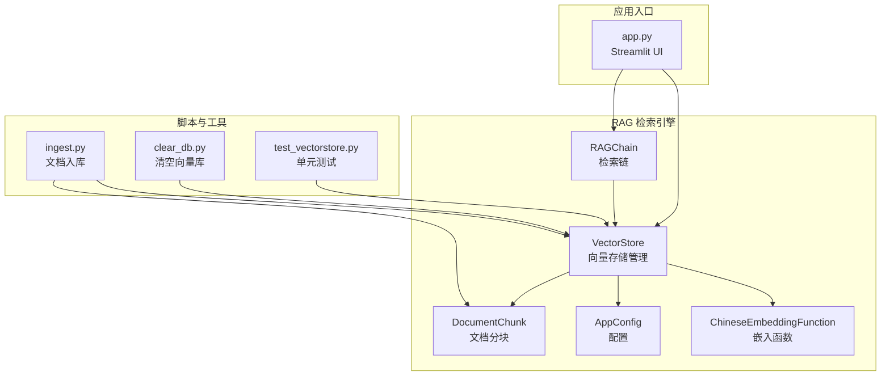
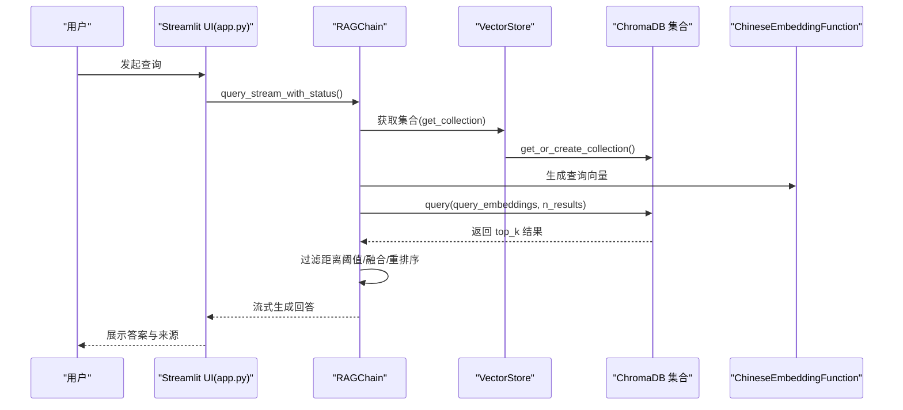
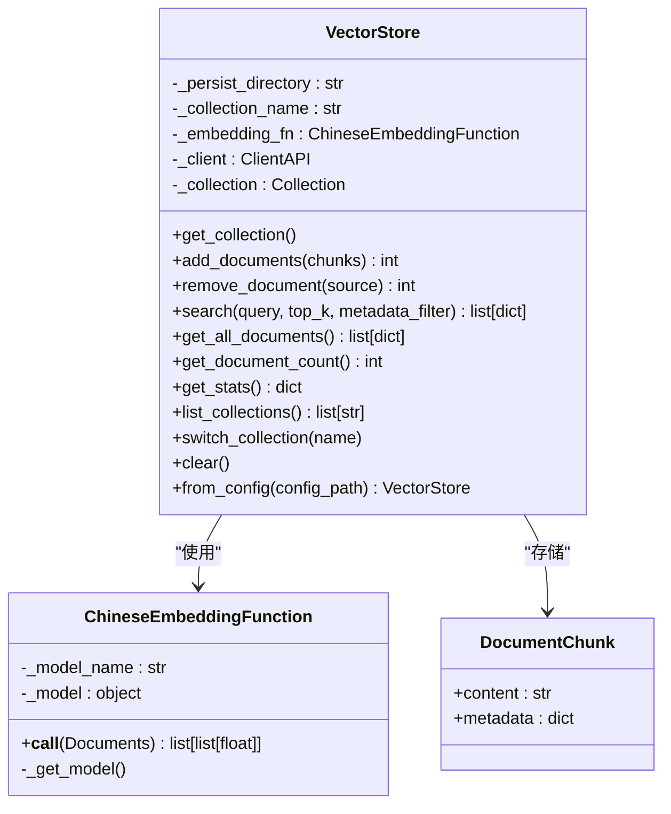
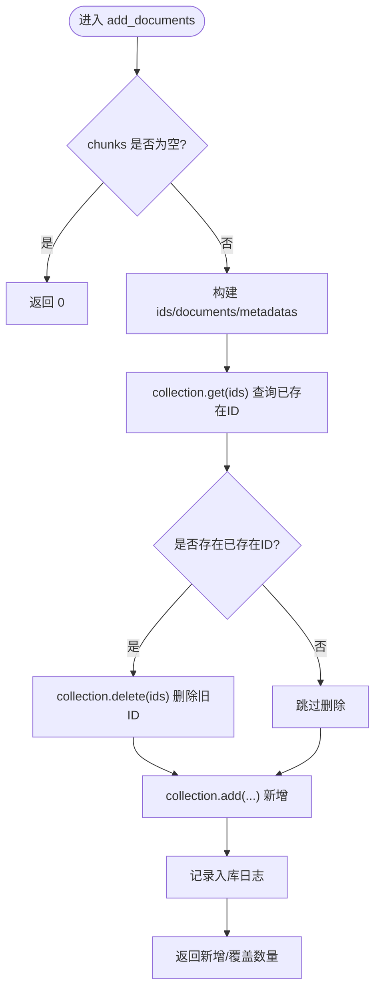
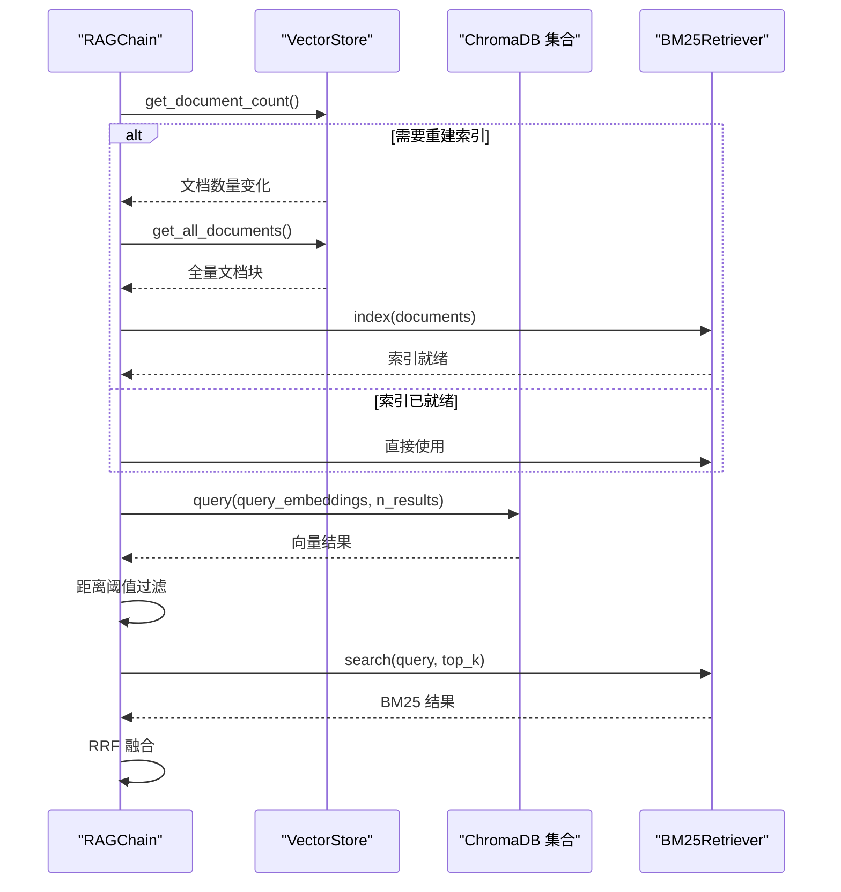
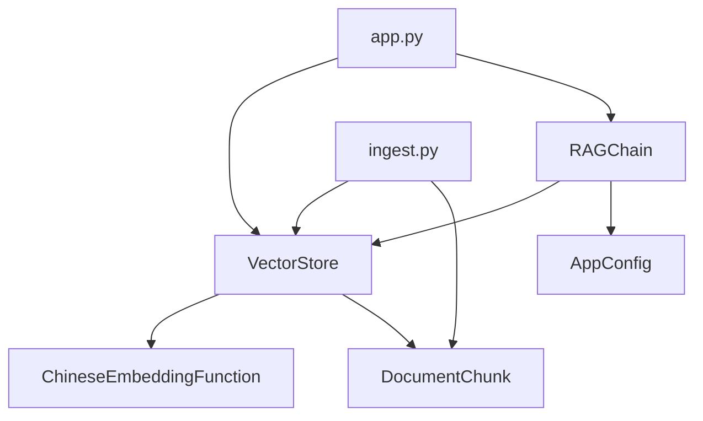

# 向量存储管理

<cite>
**本文档引用的文件**
- [rag/vectorstore.py](file://rag/vectorstore.py)
- [rag/embeddings.py](file://rag/embeddings.py)
- [rag/config.py](file://rag/config.py)
- [rag/loader.py](file://rag/loader.py)
- [rag/chain.py](file://rag/chain.py)
- [scripts/ingest.py](file://scripts/ingest.py)
- [tests/test_vectorstore.py](file://tests/test_vectorstore.py)
- [config.yaml](file://config.yaml)
- [app.py](file://app.py)
- [scripts/clear_db.py](file://scripts/clear_db.py)
</cite>

## 目录
1. [简介](#简介)
2. [项目结构](#项目结构)
3. [核心组件](#核心组件)
4. [架构总览](#架构总览)
5. [详细组件分析](#详细组件分析)
6. [依赖关系分析](#依赖关系分析)
7. [性能考虑](#性能考虑)
8. [故障排除指南](#故障排除指南)
9. [结论](#结论)
10. [附录](#附录)

## 简介
本指南面向向量存储管理，围绕 VectorStore 类的设计架构、ChromaDB 集成方式、文档块存储策略展开，深入解析 add_documents 方法的实现原理、增量更新机制与重复文档处理，覆盖向量库初始化、连接管理、事务处理与回滚机制，并提供相似度计算、查询优化、索引维护策略，以及大规模数据处理、内存使用优化、性能调优建议，最后给出向量库备份、恢复、迁移的完整流程。

## 项目结构
本项目采用分层架构，RAG 检索链位于 rag/ 目录，UI 层位于 ui/，业务服务位于 services/，脚本位于 scripts/，测试位于 tests/。向量存储管理主要集中在 rag/vectorstore.py，配合嵌入函数、配置、文档加载与检索链共同工作。

图表来源
- [rag/vectorstore.py:24-209](file://rag/vectorstore.py#L24-L209)
- [rag/embeddings.py:19-48](file://rag/embeddings.py#L19-L48)
- [rag/config.py:103-185](file://rag/config.py#L103-L185)
- [rag/loader.py:22-259](file://rag/loader.py#L22-L259)
- [rag/chain.py:174-651](file://rag/chain.py#L174-L651)
- [scripts/ingest.py:25-62](file://scripts/ingest.py#L25-L62)
- [scripts/clear_db.py:17-37](file://scripts/clear_db.py#L17-L37)
- [tests/test_vectorstore.py:13-146](file://tests/test_vectorstore.py#L13-L146)
- [app.py:163-173](file://app.py#L163-L173)

章节来源
- [rag/vectorstore.py:1-209](file://rag/vectorstore.py#L1-L209)
- [rag/config.py:1-185](file://rag/config.py#L1-L185)
- [scripts/ingest.py:1-62](file://scripts/ingest.py#L1-L62)
- [app.py:1-189](file://app.py#L1-L189)

## 核心组件
- VectorStore：ChromaDB 向量库管理器，负责客户端延迟初始化、集合获取与创建、文档增删查、统计与清空、集合切换与列举。
- ChineseEmbeddingFunction：基于 sentence-transformers 的中文嵌入函数，支持在线与离线模型加载，延迟加载模型并提供向量化能力。
- AppConfig：Pydantic 配置模型，集中管理 LLM、Embedding、VectorStore、Knowledge、RateLimit、UI 等配置项。
- DocumentChunk：文档分块数据结构，包含 content 与 metadata。
- RAGChain：检索增强生成链，整合向量检索、BM25 关键词检索、RRF 融合、交叉编码重排序与 LLM 调用。
- 文档入库脚本 ingest.py：扫描知识库目录，加载、分块、向量化并入库。
- 清空向量库脚本 clear_db.py：交互式清空向量库。
- 单元测试 test_vectorstore.py：验证 VectorStore 的核心行为，包括重复文档覆盖、集合切换、统计与搜索。

章节来源
- [rag/vectorstore.py:24-209](file://rag/vectorstore.py#L24-L209)
- [rag/embeddings.py:19-48](file://rag/embeddings.py#L19-L48)
- [rag/config.py:103-185](file://rag/config.py#L103-L185)
- [rag/loader.py:22-259](file://rag/loader.py#L22-L259)
- [rag/chain.py:174-651](file://rag/chain.py#L174-L651)
- [scripts/ingest.py:25-62](file://scripts/ingest.py#L25-L62)
- [scripts/clear_db.py:17-37](file://scripts/clear_db.py#L17-L37)
- [tests/test_vectorstore.py:13-146](file://tests/test_vectorstore.py#L13-L146)

## 架构总览
VectorStore 通过延迟初始化的 PersistentClient 连接 ChromaDB，使用 ChineseEmbeddingFunction 生成向量，以 DocumentChunk 为最小存储单元，集合名可动态切换。RAGChain 在检索阶段调用 VectorStore 的集合进行向量检索，并结合 BM25 与 RRF 融合提升召回质量；同时提供查询改写、上下文预算计算、流式与非流式 LLM 调用及重试机制。

图表来源
- [rag/chain.py:250-312](file://rag/chain.py#L250-L312)
- [rag/vectorstore.py:47-59](file://rag/vectorstore.py#L47-L59)
- [rag/embeddings.py:41-47](file://rag/embeddings.py#L41-L47)

章节来源
- [rag/chain.py:174-651](file://rag/chain.py#L174-L651)
- [rag/vectorstore.py:24-209](file://rag/vectorstore.py#L24-L209)
- [rag/embeddings.py:19-48](file://rag/embeddings.py#L19-L48)

## 详细组件分析

### VectorStore 类设计与实现
- 初始化与延迟初始化
  - persist_directory 与 collection_name 作为核心参数，embedding_fn 由 ChineseEmbeddingFunction 提供。
  - _get_client 延迟创建目录并实例化 PersistentClient，避免不必要的资源占用。
  - _get_collection 延迟获取或创建集合，确保 embedding_function 注入。
- 文档块存储策略
  - 使用 DocumentChunk 作为最小存储单元，content 为文档片段，metadata 包含 source、title、chunk_index、file_type 等。
  - ID 采用 "source_chunk_index" 组合，便于按来源路径删除与增量更新。
- 增量更新与重复文档处理
  - add_documents 为每个 chunk 生成唯一 ID，先查询现有 ID 列表，若存在则删除旧 ID，再批量新增，实现“覆盖式”增量更新。
  - remove_document 通过 metadata 中的 source 字段定位并删除对应分块。
- 查询与过滤
  - search 支持 top_k 与 metadata_filter，返回 content、metadata、distance。
  - get_all_documents 返回全部文档块，便于构建 BM25 索引。
- 统计与管理
  - get_document_count、get_stats、list_collections、switch_collection、clear 等方法支撑运维与监控。
- 全局单例缓存
  - from_config 通过全局缓存避免重复创建 VectorStore 实例与重复加载嵌入模型，提升启动效率。

图表来源
- [rag/vectorstore.py:24-209](file://rag/vectorstore.py#L24-L209)
- [rag/embeddings.py:19-48](file://rag/embeddings.py#L19-L48)
- [rag/loader.py:22-27](file://rag/loader.py#L22-L27)

章节来源
- [rag/vectorstore.py:24-209](file://rag/vectorstore.py#L24-L209)
- [rag/embeddings.py:19-48](file://rag/embeddings.py#L19-L48)
- [rag/loader.py:22-259](file://rag/loader.py#L22-L259)

### add_documents 方法实现原理与增量更新机制
- 输入与准备
  - 接收 DocumentChunk 列表，遍历生成 ids、documents、metadatas。
- 增量更新策略
  - 先通过 collection.get(ids=ids) 查询已存在 ID，若存在则 collection.delete(ids=existing_ids) 删除旧记录，再 collection.add(...) 新增，实现“同 ID 覆盖”。
- 重复文档处理
  - 由于 ID 由 source_chunk_index 组成，同一 source 的相同 chunk_index 会被覆盖；不同 source 或不同 chunk_index 的同内容不会互相覆盖。
- 返回值与日志
  - 返回新增/覆盖的文档数量，并记录入库日志。

图表来源
- [rag/vectorstore.py:89-112](file://rag/vectorstore.py#L89-L112)

章节来源
- [rag/vectorstore.py:89-112](file://rag/vectorstore.py#L89-L112)

### 相似度计算、查询优化与索引维护
- 相似度计算
  - 向量检索使用 collection.query(query_embeddings=..., n_results=...)，返回 documents、metadatas、distances。
  - distance 字段可用于阈值过滤，降低噪声结果。
- 查询优化
  - RAGChain 在检索阶段先进行距离阈值过滤，再结合 BM25 关键词检索与 RRF 融合，提升召回与排序质量。
  - 通过 _ensure_bm25_ready 延迟构建 BM25 索引，与向量库同步，避免重复构建。
- 索引维护
  - 当文档数量变化时重建 BM25 索引；BM25Retriever 内置简易中文分词与 IDF 计算。
  - VectorStore.get_all_documents 为 BM25 索引提供全量文档块。

图表来源
- [rag/chain.py:206-222](file://rag/chain.py#L206-L222)
- [rag/chain.py:250-312](file://rag/chain.py#L250-L312)
- [rag/vectorstore.py:61-61](file://rag/vectorstore.py#L61-L61)

章节来源
- [rag/chain.py:53-134](file://rag/chain.py#L53-L134)
- [rag/chain.py:206-222](file://rag/chain.py#L206-L222)
- [rag/chain.py:250-312](file://rag/chain.py#L250-L312)
- [rag/vectorstore.py:61-61](file://rag/vectorstore.py#L61-L61)

### 连接管理、事务处理与回滚机制
- 连接管理
  - _get_client 延迟初始化 PersistentClient，首次访问时创建持久化目录。
  - _get_collection 延迟获取集合，确保 embedding_function 注入。
- 事务与回滚
  - ChromaDB 的 add/delete 操作在单次调用内原子性地更新集合，但未提供显式的事务提交/回滚 API。
  - 增量更新通过“先删后加”的方式实现幂等覆盖，避免重复插入；若中途失败，可再次调用 add_documents 完成覆盖。
- 集合切换与清理
  - switch_collection 支持多知识库场景；clear 通过 delete_collection 删除集合并重置内部引用。

章节来源
- [rag/vectorstore.py:40-59](file://rag/vectorstore.py#L40-L59)
- [rag/vectorstore.py:83-122](file://rag/vectorstore.py#L83-L122)
- [rag/vectorstore.py:171-179](file://rag/vectorstore.py#L171-L179)

### 文档块存储策略与元数据设计
- 存储单元
  - DocumentChunk 作为最小存储单元，metadata 包含 source、title、chunk_index、file_type 等字段，便于溯源与过滤。
- 分块策略
  - loader.load_documents 支持 .md/.txt/.pdf，按标题与段落边界切分，保留代码块完整性，支持 overlap。
- 元数据过滤
  - search 支持 where 条件过滤，remove_document 通过 source 删除整文件分块。

章节来源
- [rag/loader.py:22-259](file://rag/loader.py#L22-L259)
- [rag/vectorstore.py:124-124](file://rag/vectorstore.py#L124-L124)

### 向量库初始化与配置
- 配置来源
  - config.yaml 定义 vectorstore、embedding、knowledge 等配置；AppConfig 使用 Pydantic 校验与默认值。
  - VectorStore.from_config 从配置创建实例并缓存，避免重复加载嵌入模型。
- 初始化流程
  - ingest.py 读取配置，加载文档分块，调用 VectorStore.add_documents 入库。

章节来源
- [config.yaml:16-28](file://config.yaml#L16-L28)
- [rag/config.py:103-185](file://rag/config.py#L103-L185)
- [rag/vectorstore.py:181-209](file://rag/vectorstore.py#L181-L209)
- [scripts/ingest.py:25-58](file://scripts/ingest.py#L25-L58)

## 依赖关系分析
- 组件耦合
  - VectorStore 依赖 ChineseEmbeddingFunction 与 DocumentChunk，对外暴露集合与检索接口。
  - RAGChain 依赖 VectorStore 与 AppConfig，内部组合 BM25Retriever 与 CrossEncoder 重排序。
  - ingest.py 依赖 VectorStore 与 DocumentChunk，负责批量入库。
- 外部依赖
  - ChromaDB：持久化与向量检索。
  - sentence-transformers：中文嵌入模型。
  - streamlit：UI 展示与仪表盘。

图表来源
- [rag/vectorstore.py:12-15](file://rag/vectorstore.py#L12-L15)
- [rag/chain.py:14-16](file://rag/chain.py#L14-L16)
- [scripts/ingest.py:17-20](file://scripts/ingest.py#L17-L20)
- [app.py:163-173](file://app.py#L163-L173)

章节来源
- [rag/vectorstore.py:1-209](file://rag/vectorstore.py#L1-L209)
- [rag/chain.py:1-651](file://rag/chain.py#L1-L651)
- [scripts/ingest.py:1-62](file://scripts/ingest.py#L1-L62)
- [app.py:1-189](file://app.py#L1-L189)

## 性能考虑
- 模型加载与缓存
  - ChineseEmbeddingFunction 延迟加载模型，首次加载耗时较长，建议在预热阶段提前触发加载。
  - VectorStore.from_config 全局单例缓存，避免重复加载嵌入模型。
- 向量检索优化
  - RAGChain 检索阶段先进行距离阈值过滤，减少后续重排序负担。
  - n_results 设为 top_k 的倍数，再进行阈值过滤，提高召回质量。
- BM25 索引复用
  - _ensure_bm25_ready 仅在文档数量变化时重建索引，避免频繁重建。
- 上下文预算与裁剪
  - _calc_context_budget 与 _build_context 根据上下文窗口动态裁剪，防止超出 LLM 上下文限制。
- 流式与重试
  - LLM 调用支持流式与非流式，失败时指数退避重试，提升稳定性。

章节来源
- [rag/embeddings.py:31-47](file://rag/embeddings.py#L31-L47)
- [rag/vectorstore.py:181-209](file://rag/vectorstore.py#L181-L209)
- [rag/chain.py:206-222](file://rag/chain.py#L206-L222)
- [rag/chain.py:250-312](file://rag/chain.py#L250-L312)
- [rag/chain.py:405-418](file://rag/chain.py#L405-L418)
- [rag/chain.py:570-643](file://rag/chain.py#L570-L643)

## 故障排除指南
- 常见问题与处理
  - 模型加载失败：检查 HF_ENDPOINT 环境变量与网络连通性；确认模型名或本地路径正确。
  - 向量库目录权限：确保 persist_directory 可写；首次访问会自动创建目录。
  - 检索无结果：检查 distance_threshold 设置是否过高；确认文档已成功入库。
  - BM25 索引构建失败：检查 get_all_documents 是否返回空；确认集合中有文档。
  - LLM 调用失败：检查 api_base、api_key、model 配置；查看重试日志。
- 清理与恢复
  - 使用 clear_db.py 交互式清空向量库，谨慎操作。
  - 若需完全重置，删除 persist_directory 后重新入库。

章节来源
- [scripts/clear_db.py:17-37](file://scripts/clear_db.py#L17-L37)
- [rag/chain.py:470-512](file://rag/chain.py#L470-L512)

## 结论
VectorStore 通过延迟初始化、集合管理与“先删后加”的增量更新策略，实现了高效稳定的向量存储；结合 ChineseEmbeddingFunction 与 RAGChain 的混合检索、阈值过滤、BM25 与 RRF 融合，显著提升了检索质量与用户体验。配合全局单例缓存与合理的上下文预算控制，系统在大规模数据场景下具备良好的性能与可维护性。

## 附录

### 大规模数据处理与内存优化建议
- 分批入库：将大量 DocumentChunk 分批传入 add_documents，避免单次请求过大。
- 并发与队列：在上游加载阶段使用并发或队列机制，减少等待时间。
- 磁盘空间：定期清理不再使用的集合或旧版本数据，释放磁盘空间。
- 模型缓存：确保嵌入模型与 reranker 模型在类级别缓存，避免重复加载。

### 备份、恢复与迁移流程
- 备份
  - 直接复制 persist_directory（包含集合数据）至安全位置。
- 恢复
  - 将备份目录复制回原 persist_directory，重启服务后即可恢复。
- 迁移
  - 在目标环境配置相同 vectorstore.persist_directory 与 collection_name；
  - 复制 persist_directory 至目标路径；
  - 如需切换集合，使用 switch_collection 或在配置中修改 collection_name 后重新加载。

章节来源
- [rag/vectorstore.py:83-87](file://rag/vectorstore.py#L83-L87)
- [config.yaml:16-19](file://config.yaml#L16-L19)