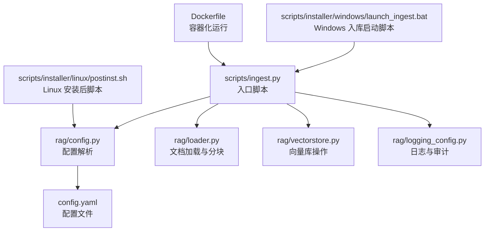
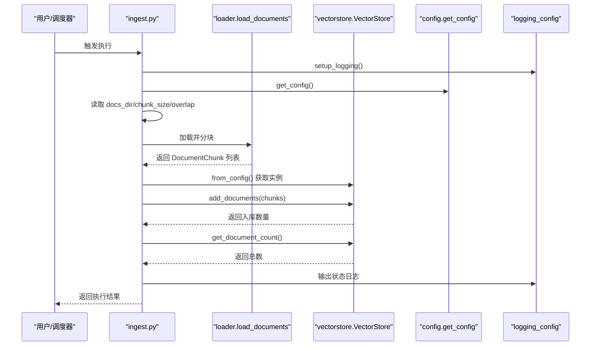
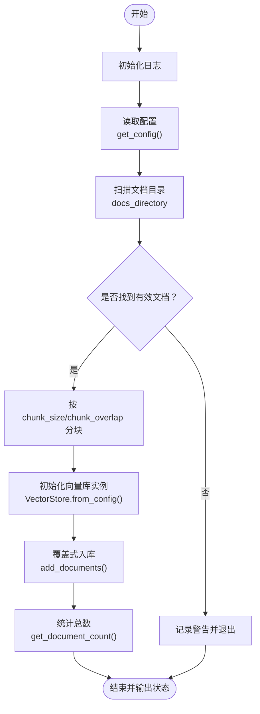
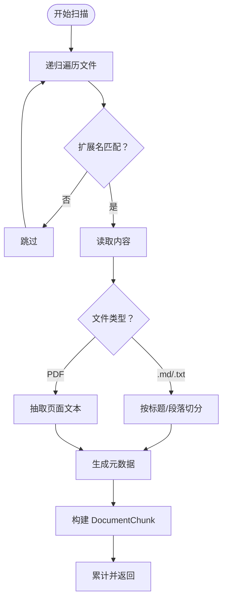
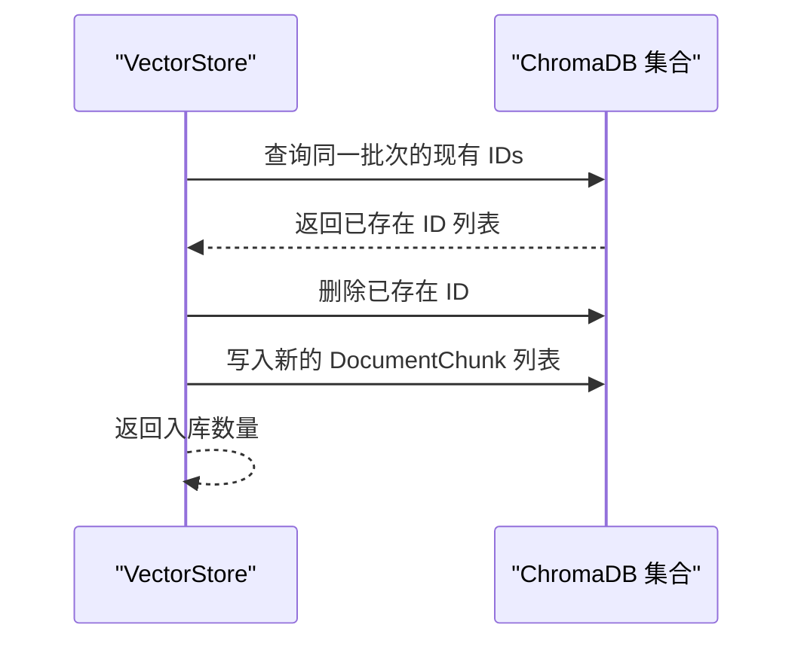
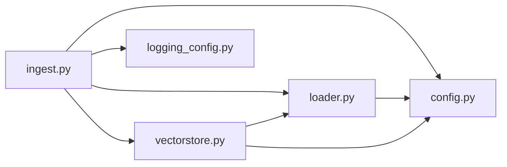

# 批量入库脚本

<cite>
**本文引用的文件**
- [scripts/ingest.py](file://scripts/ingest.py)
- [rag/config.py](file://rag/config.py)
- [rag/logging_config.py](file://rag/logging_config.py)
- [rag/loader.py](file://rag/loader.py)
- [rag/vectorstore.py](file://rag/vectorstore.py)
- [config.yaml](file://config.yaml)
- [scripts/installer/windows/launch_ingest.bat](file://scripts/installer/windows/launch_ingest.bat)
- [scripts/installer/linux/postinst.sh](file://scripts/installer/linux/postinst.sh)
- [scripts/installer/linux/prerm.sh](file://scripts/installer/linux/prerm.sh)
- [scripts/installer/linux/launch.sh](file://scripts/installer/linux/launch.sh)
- [Dockerfile](file://Dockerfile)
- [scripts/clear_db.py](file://scripts/clear_db.py)
</cite>

## 目录
1. [简介](#简介)
2. [项目结构](#项目结构)
3. [核心组件](#核心组件)
4. [架构总览](#架构总览)
5. [详细组件分析](#详细组件分析)
6. [依赖关系分析](#依赖关系分析)
7. [性能考虑](#性能考虑)
8. [故障排查指南](#故障排查指南)
9. [结论](#结论)
10. [附录](#附录)

## 简介
本指南面向“批量入库脚本”的使用者与运维人员，围绕 scripts/ingest.py 的执行流程、命令行参数与环境变量、文档扫描逻辑、增量更新策略、错误恢复机制、日志与进度跟踪、状态报告、部署与定时任务、监控告警、性能优化与资源监控、自动化与 CI/CD 最佳实践进行系统化说明。

## 项目结构
- 批量入库入口脚本位于 scripts/ingest.py，负责扫描知识库目录、分块、向量化并写入向量库。
- 配置由 rag/config.py 提供，支持从 config.yaml 读取并进行环境变量替换。
- 文档加载与分块逻辑在 rag/loader.py，支持 .md/.txt/.pdf。
- 向量库操作在 rag/vectorstore.py，基于 ChromaDB，支持增量更新与集合切换。
- 日志系统在 rag/logging_config.py，提供控制台与文件双通道输出，并支持审计日志。
- Windows/Linux 安装器与启动脚本提供部署与服务化支持。
- Dockerfile 提供容器化运行方式。

**图表来源**
- [scripts/ingest.py:1-62](file://scripts/ingest.py#L1-L62)
- [rag/config.py:1-185](file://rag/config.py#L1-L185)
- [rag/loader.py:1-259](file://rag/loader.py#L1-L259)
- [rag/vectorstore.py:1-209](file://rag/vectorstore.py#L1-L209)
- [rag/logging_config.py:1-129](file://rag/logging_config.py#L1-L129)
- [config.yaml:1-50](file://config.yaml#L1-L50)
- [scripts/installer/linux/postinst.sh:1-72](file://scripts/installer/linux/postinst.sh#L1-L72)
- [scripts/installer/windows/launch_ingest.bat:1-25](file://scripts/installer/windows/launch_ingest.bat#L1-L25)
- [Dockerfile:1-68](file://Dockerfile#L1-L68)

**章节来源**
- [scripts/ingest.py:1-62](file://scripts/ingest.py#L1-L62)
- [rag/config.py:1-185](file://rag/config.py#L1-L185)
- [rag/loader.py:1-259](file://rag/loader.py#L1-L259)
- [rag/vectorstore.py:1-209](file://rag/vectorstore.py#L1-L209)
- [rag/logging_config.py:1-129](file://rag/logging_config.py#L1-L129)
- [config.yaml:1-50](file://config.yaml#L1-L50)
- [scripts/installer/linux/postinst.sh:1-72](file://scripts/installer/linux/postinst.sh#L1-L72)
- [scripts/installer/windows/launch_ingest.bat:1-25](file://scripts/installer/windows/launch_ingest.bat#L1-L25)
- [Dockerfile:1-68](file://Dockerfile#L1-L68)

## 核心组件
- 入库脚本入口：scripts/ingest.py
  - 初始化日志、读取配置、扫描文档、分块、向量化、写入向量库、输出状态。
- 配置模块：rag/config.py
  - 通过 Pydantic 定义配置模型，支持从 YAML 加载并进行环境变量替换；提供全局单例访问。
- 文档加载与分块：rag/loader.py
  - 支持 .md/.txt/.pdf；按标题与段落切分，保留元数据；支持仅读取元信息的文件清单。
- 向量库：rag/vectorstore.py
  - 基于 ChromaDB 的持久化集合；支持增量更新（按 ID 覆盖）、检索、统计、切换集合等。
- 日志与审计：rag/logging_config.py
  - 控制台彩色输出 + 文件全量日志；提供审计日志写入 JSONL 文件的能力。

**章节来源**
- [scripts/ingest.py:25-57](file://scripts/ingest.py#L25-L57)
- [rag/config.py:103-151](file://rag/config.py#L103-L151)
- [rag/loader.py:131-197](file://rag/loader.py#L131-L197)
- [rag/vectorstore.py:89-112](file://rag/vectorstore.py#L89-L112)
- [rag/logging_config.py:46-83](file://rag/logging_config.py#L46-L83)

## 架构总览
以下序列图展示从入口脚本到各子系统的调用链路与关键步骤。

**图表来源**
- [scripts/ingest.py:25-57](file://scripts/ingest.py#L25-L57)
- [rag/loader.py:131-197](file://rag/loader.py#L131-L197)
- [rag/vectorstore.py:182-209](file://rag/vectorstore.py#L182-L209)
- [rag/config.py:139-151](file://rag/config.py#L139-L151)
- [rag/logging_config.py:46-83](file://rag/logging_config.py#L46-L83)

## 详细组件分析

### 入库脚本执行流程与参数
- 执行入口：scripts/ingest.py
  - 初始化日志、读取配置、扫描目录、分块、向量化、入库、统计与状态输出。
- 关键参数来源：
  - 配置项：docs_directory、chunk_size、chunk_overlap。
  - 配置文件：config.yaml；可通过环境变量替换占位符。
- 环境变量：
  - 离线部署优先：嵌入模型通过 `local_files_only=True` 离线加载，本地路径存在时禁止联网。
  - Windows 启动脚本设置 PYTHONPATH 指向应用目录，确保 Python 能正确导入包。
  - Linux 安装后脚本会将配置文件符号链接到应用目录，并修正路径。

**图表来源**
- [scripts/ingest.py:25-57](file://scripts/ingest.py#L25-L57)
- [rag/config.py:139-151](file://rag/config.py#L139-L151)
- [rag/vectorstore.py:182-209](file://rag/vectorstore.py#L182-L209)

**章节来源**
- [scripts/ingest.py:25-57](file://scripts/ingest.py#L25-L57)
- [config.yaml:25-28](file://config.yaml#L25-L28)
- [scripts/installer/windows/launch_ingest.bat:17-21](file://scripts/installer/windows/launch_ingest.bat#L17-L21)
- [scripts/installer/linux/postinst.sh:34-52](file://scripts/installer/linux/postinst.sh#L34-L52)

### 文档扫描与分块逻辑
- 扫描范围：递归遍历知识库目录，忽略 README.md，仅处理 .md/.txt/.pdf。
- 分块策略：
  - Markdown：优先按二级标题切分；对超长段落按段落边界继续切分，保持代码块完整性；支持重叠。
  - PDF：使用 pymupdf 抽取全部页面文本。
  - 元数据：包含 source、title、chunk_index、file_type。
- 元信息获取：提供仅读取元数据的接口，便于前端展示文件清单。

**图表来源**
- [rag/loader.py:150-197](file://rag/loader.py#L150-L197)
- [rag/loader.py:29-89](file://rag/loader.py#L29-L89)
- [rag/loader.py:101-118](file://rag/loader.py#L101-L118)

**章节来源**
- [rag/loader.py:131-197](file://rag/loader.py#L131-L197)
- [rag/loader.py:29-89](file://rag/loader.py#L29-L89)

### 增量更新策略
- 增量更新实现：
  - 入库前先查询同一批次中已有 ID 的记录并删除，再写入新内容，从而实现“覆盖式更新”。
  - ID 规则：以 source + chunk_index 组合形成唯一 ID。
- 影响范围：
  - 当同一源文件被重复入库时，对应 ID 的旧分块会被删除，新分块写入，保证最终一致性。

**图表来源**
- [rag/vectorstore.py:89-112](file://rag/vectorstore.py#L89-L112)

**章节来源**
- [rag/vectorstore.py:89-112](file://rag/vectorstore.py#L89-L112)

### 错误恢复机制
- 文件读取异常：对单个文件读取失败进行跳过并记录警告日志，不影响整体入库流程。
- 配置缺失：若配置文件不存在，配置模块会抛出明确的异常提示。
- 清库脚本：提供独立脚本用于清空向量库，便于在异常状态下快速恢复。

**章节来源**
- [rag/loader.py:167-171](file://rag/loader.py#L167-L171)
- [rag/config.py:122-124](file://rag/config.py#L122-L124)
- [scripts/clear_db.py:27-33](file://scripts/clear_db.py#L27-L33)

### 日志记录与状态报告
- 日志输出：
  - 控制台：彩色高亮，包含时间与级别。
  - 文件：完整日志，包含时间戳与消息。
- 审计日志：
  - 可配置开关，按天写入 JSONL 文件，记录用户、动作、查询摘要、结果数、耗时等。
- 状态报告：
  - 入库前后分别输出涉及文件数、入库数量、向量库总数等关键指标。

**章节来源**
- [rag/logging_config.py:46-83](file://rag/logging_config.py#L46-L83)
- [rag/logging_config.py:86-129](file://rag/logging_config.py#L86-L129)
- [scripts/ingest.py:35-57](file://scripts/ingest.py#L35-L57)

### 部署与启动方式
- Windows：
  - 通过 launch_ingest.bat 设置 PYTHONPATH 并运行 ingest.py。
- Linux：
  - 安装后脚本 postinst.sh 会创建数据目录、复制并修正配置、建立符号链接、设置权限、重载 systemd。
  - 提供 systemd 服务单元与命令别名，便于服务化与定时任务。
- Docker：
  - 多阶段构建，设置非 root 用户，暴露端口，健康检查，CMD 启动 Web 应用；可配合容器内运行入库脚本。

**章节来源**
- [scripts/installer/windows/launch_ingest.bat:17-21](file://scripts/installer/windows/launch_ingest.bat#L17-L21)
- [scripts/installer/linux/postinst.sh:10-58](file://scripts/installer/linux/postinst.sh#L10-L58)
- [scripts/installer/linux/prerm.sh:13-16](file://scripts/installer/linux/prerm.sh#L13-L16)
- [Dockerfile:35-67](file://Dockerfile#L35-L67)

### 定时任务与自动化
- Linux：
  - 通过 systemd 服务单元与命令别名，结合 cron 或 systemd timer 实现定时入库。
- Windows：
  - 通过计划任务触发 launch_ingest.bat 或直接调用 Python 执行 ingest.py。
- CI/CD：
  - 在流水线中调用 ingest.py，结合 Docker 镜像或虚拟环境，实现“代码变更后自动更新知识库”。

[本节为通用实践建议，不直接分析具体文件，故无“章节来源”]

## 依赖关系分析
- 组件耦合：
  - ingest.py 依赖 config、loader、vectorstore、logging_config。
  - loader 依赖 config 与 logging。
  - vectorstore 依赖 config、embeddings、loader 的 DocumentChunk。
- 外部依赖：
  - ChromaDB、PyMuPDF（PDF）、Sentence-Transformers 嵌入模型。
- 配置依赖：
  - config.yaml 提供路径、模型、集合名、分块参数等；支持环境变量替换。

**图表来源**
- [scripts/ingest.py:17-21](file://scripts/ingest.py#L17-L21)
- [rag/loader.py:12-13](file://rag/loader.py#L12-L13)
- [rag/vectorstore.py:12-15](file://rag/vectorstore.py#L12-L15)

**章节来源**
- [scripts/ingest.py:17-21](file://scripts/ingest.py#L17-L21)
- [rag/loader.py:12-13](file://rag/loader.py#L12-L13)
- [rag/vectorstore.py:12-15](file://rag/vectorstore.py#L12-L15)

## 性能考虑
- 分块参数调优：
  - chunk_size 与 chunk_overlap 影响召回质量与向量库规模；需结合业务与硬件资源平衡。
- 模型加载缓存：
  - VectorStore.from_config 使用全局单例缓存，避免重复加载嵌入模型，降低冷启动开销。
- I/O 与并发：
  - 建议在高并发场景下限制入库并发度，避免磁盘与内存抖动。
- 存储与索引：
  - ChromaDB 持久化目录建议置于高性能磁盘；定期清理无用集合与历史版本。
- 网络与镜像：
  - 使用离线本地模型可完全避免网络依赖，提升部署稳定性。

[本节为通用性能建议，不直接分析具体文件，故无“章节来源”]

## 故障排查指南
- 常见问题与定位：
  - 未找到文档：检查 docs_directory 是否存在且包含 .md/.txt/.pdf 文件。
  - PDF 解析失败：确认已安装 PyMuPDF；查看日志中文件读取警告。
  - 配置文件缺失：确认 config.yaml 存在且路径正确；检查环境变量替换是否生效。
  - 权限问题：Linux 下检查 data/logs 等目录属主与权限；Windows 下以管理员身份运行。
  - 清库恢复：使用 scripts/clear_db.py 清空向量库，确认数量后重新入库。
- 日志定位：
  - 查看 logs/system.log 与审计日志（logs/audit/YYYY-MM-DD.jsonl）。
- 重启与验证：
  - Linux：systemctl restart knowledge-assistant；Docker：重启容器；Windows：重启服务或脚本。

**章节来源**
- [scripts/clear_db.py:17-33](file://scripts/clear_db.py#L17-L33)
- [rag/logging_config.py:18-25](file://rag/logging_config.py#L18-L25)

## 结论
批量入库脚本通过清晰的配置驱动、健壮的文档扫描与分块、可靠的增量更新与日志审计，实现了高效稳定的向量库维护能力。结合安装器与容器化方案，可在多种环境中稳定运行，并通过定时任务与 CI/CD 实现自动化与持续更新。

## 附录

### 命令行参数与环境变量
- 命令行：
  - 直接运行：python scripts/ingest.py
  - Windows：使用 scripts/installer/windows/launch_ingest.bat
  - Linux：使用知识库提供的命令别名或 systemd 服务
- 环境变量：
  - 模型加载：嵌入模型默认离线优先（local_files_only=True），本地路径存在时无需网络
  - PYTHONPATH：Windows 启动脚本设置，确保导入路径正确
  - 安装后脚本会将配置文件符号链接到应用目录，避免路径漂移

**章节来源**
- [scripts/ingest.py:12](file://scripts/ingest.py#L12)
- [scripts/installer/windows/launch_ingest.bat:18-19](file://scripts/installer/windows/launch_ingest.bat#L18-L19)
- [scripts/installer/linux/postinst.sh:48-52](file://scripts/installer/linux/postinst.sh#L48-L52)

### 配置项速查
- 知识库配置（knowledge.*）
  - docs_directory：文档目录
  - chunk_size：分块大小
  - chunk_overlap：分块重叠
- 向量库配置（vectorstore.*）
  - persist_directory：持久化目录
  - collection_name：集合名
  - top_k：检索返回条数
  - distance_threshold：相似度阈值
- 嵌入模型配置（embedding.*）
  - model：模型名称
  - local_path：本地模型路径

**章节来源**
- [config.yaml:25-28](file://config.yaml#L25-L28)
- [config.yaml:16-23](file://config.yaml#L16-L23)
- [config.yaml:12-14](file://config.yaml#L12-L14)
- [rag/config.py:72-84](file://rag/config.py#L72-L84)
- [rag/config.py:64-70](file://rag/config.py#L64-L70)
- [rag/config.py:58-62](file://rag/config.py#L58-L62)

### 监控与告警建议
- 进程与资源：
  - 监控 CPU、内存、磁盘 IO；关注入库高峰期的资源峰值。
- 日志与审计：
  - 关注入库失败率、PDF 解析异常、配置加载错误等。
- 健康检查：
  - Web 应用使用健康检查端点；入库脚本可加入返回码与日志分析。
- 告警规则：
  - 入库失败率升高、向量库容量接近阈值、日志中出现高频异常等。

[本节为通用监控建议，不直接分析具体文件，故无“章节来源”]