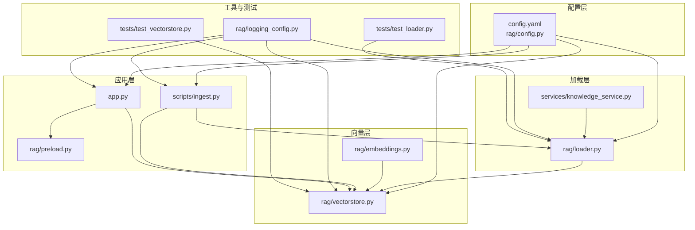
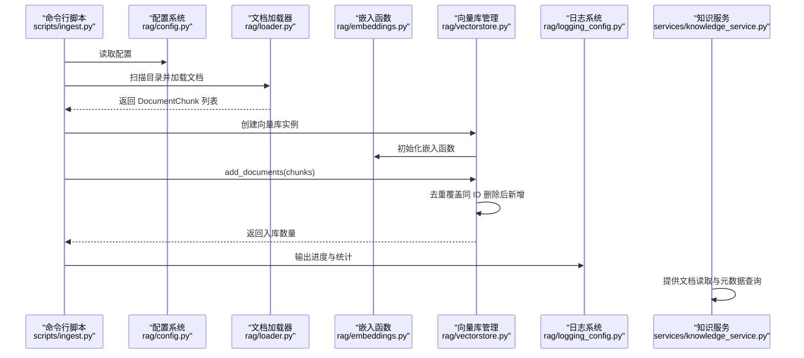
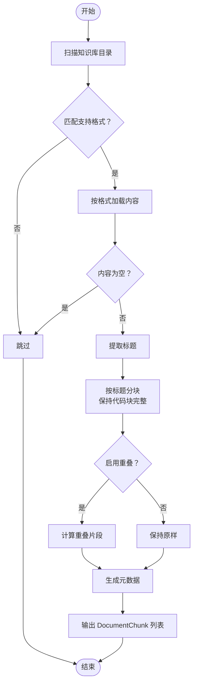
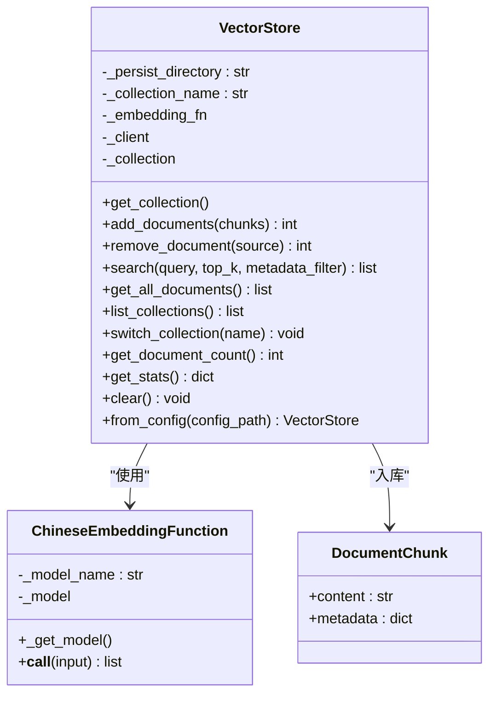
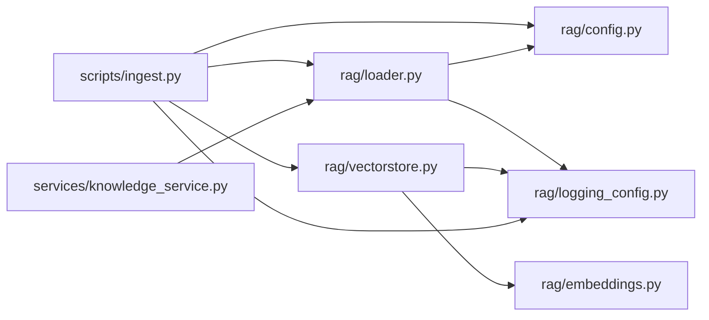

# 文档入库管理

<cite>
**本文引用的文件**
- [rag/loader.py](file://rag/loader.py)
- [rag/vectorstore.py](file://rag/vectorstore.py)
- [rag/embeddings.py](file://rag/embeddings.py)
- [scripts/ingest.py](file://scripts/ingest.py)
- [rag/config.py](file://rag/config.py)
- [config.yaml](file://config.yaml)
- [rag/logging_config.py](file://rag/logging_config.py)
- [services/knowledge_service.py](file://services/knowledge_service.py)
- [rag/preload.py](file://rag/preload.py)
- [tests/test_loader.py](file://tests/test_loader.py)
- [tests/test_vectorstore.py](file://tests/test_vectorstore.py)
</cite>

## 目录
1. [简介](#简介)
2. [项目结构](#项目结构)
3. [核心组件](#核心组件)
4. [架构总览](#架构总览)
5. [详细组件分析](#详细组件分析)
6. [依赖关系分析](#依赖关系分析)
7. [性能考量](#性能考量)
8. [故障排查指南](#故障排查指南)
9. [结论](#结论)
10. [附录](#附录)

## 简介
本指南面向“文档入库管理”的全流程操作，涵盖文档加载器工作原理、支持的文件格式、分块策略配置、批量文档处理流程、增量更新机制、错误恢复策略、文档预处理步骤、元数据提取、向量化存储过程、入库监控与进度跟踪、性能优化建议，以及文档格式转换、编码处理、大文件处理的最佳实践。读者无需深入技术背景即可按步骤完成知识库的构建与维护。

## 项目结构
系统围绕“知识库”主题，采用分层设计：
- 配置层：集中管理 LLM、嵌入模型、向量库、知识库、速率限制、UI 等配置项，并支持环境变量替换。
- 加载层：负责扫描知识库目录、解析文档、提取标题、按语义分块、生成元数据。
- 向量层：封装 ChromaDB，提供集合管理、文档入库、检索、统计与清理能力。
- 应用层：提供命令行入库脚本、Web 界面展示与仪表盘统计。
- 工具与测试：日志、预加载、单元测试保障稳定性与可观测性。

图表来源
- [rag/config.py:117-184](file://rag/config.py#L117-L184)
- [rag/loader.py:131-197](file://rag/loader.py#L131-L197)
- [rag/vectorstore.py:24-209](file://rag/vectorstore.py#L24-L209)
- [rag/embeddings.py:19-48](file://rag/embeddings.py#L19-L48)
- [scripts/ingest.py:25-58](file://scripts/ingest.py#L25-L58)
- [app.py:54-189](file://app.py#L54-L189)
- [rag/preload.py:22-73](file://rag/preload.py#L22-L73)
- [services/knowledge_service.py:16-46](file://services/knowledge_service.py#L16-L46)
- [rag/logging_config.py:46-84](file://rag/logging_config.py#L46-L84)
- [tests/test_loader.py:16-138](file://tests/test_loader.py#L16-L138)
- [tests/test_vectorstore.py:13-146](file://tests/test_vectorstore.py#L13-L146)

章节来源
- [rag/config.py:117-184](file://rag/config.py#L117-L184)
- [config.yaml:1-46](file://config.yaml#L1-L46)
- [scripts/ingest.py:25-58](file://scripts/ingest.py#L25-L58)
- [rag/loader.py:131-197](file://rag/loader.py#L131-L197)
- [rag/vectorstore.py:24-209](file://rag/vectorstore.py#L24-L209)
- [rag/embeddings.py:19-48](file://rag/embeddings.py#L19-L48)
- [services/knowledge_service.py:16-46](file://services/knowledge_service.py#L16-L46)
- [rag/logging_config.py:46-84](file://rag/logging_config.py#L46-L84)
- [rag/preload.py:22-73](file://rag/preload.py#L22-L73)
- [tests/test_loader.py:16-138](file://tests/test_loader.py#L16-L138)
- [tests/test_vectorstore.py:13-146](file://tests/test_vectorstore.py#L13-L146)

## 核心组件
- 文档加载器：扫描知识库目录，识别支持格式，按语义分块，提取元数据，生成 DocumentChunk 列表。
- 向量库管理：封装 ChromaDB，提供集合创建/切换、文档入库、去重覆盖、检索、统计与清理。
- 嵌入函数：封装中文句子向量模型，支持在线/离线加载，带进度提示。
- 入库脚本：统一入口，执行扫描、分块、向量化与入库，输出进度与统计。
- 配置系统：集中管理各模块参数，支持环境变量替换与单例访问。
- 日志系统：统一输出，支持控制台彩色与文件落盘，含审计日志。
- 知识服务：提供文档全文读取与元数据查询能力。
- 预加载：后台线程加载 RAG 链，避免 Streamlit 重渲染导致状态丢失。

章节来源
- [rag/loader.py:131-197](file://rag/loader.py#L131-L197)
- [rag/vectorstore.py:24-209](file://rag/vectorstore.py#L24-L209)
- [rag/embeddings.py:19-48](file://rag/embeddings.py#L19-L48)
- [scripts/ingest.py:25-58](file://scripts/ingest.py#L25-L58)
- [rag/config.py:117-184](file://rag/config.py#L117-L184)
- [rag/logging_config.py:46-84](file://rag/logging_config.py#L46-L84)
- [services/knowledge_service.py:16-46](file://services/knowledge_service.py#L16-L46)
- [rag/preload.py:22-73](file://rag/preload.py#L22-L73)

## 架构总览
下图展示了从“入库脚本”到“向量库”的完整流程，以及与“配置”“日志”“知识服务”的交互关系。

图表来源
- [scripts/ingest.py:25-58](file://scripts/ingest.py#L25-L58)
- [rag/config.py:117-184](file://rag/config.py#L117-L184)
- [rag/loader.py:131-197](file://rag/loader.py#L131-L197)
- [rag/embeddings.py:19-48](file://rag/embeddings.py#L19-L48)
- [rag/vectorstore.py:89-113](file://rag/vectorstore.py#L89-L113)
- [rag/logging_config.py:46-84](file://rag/logging_config.py#L46-L84)
- [services/knowledge_service.py:16-46](file://services/knowledge_service.py#L16-L46)

## 详细组件分析

### 文档加载器（rag/loader.py）
- 支持格式：Markdown(.md)、纯文本(.txt)、PDF(.pdf)。
- 扫描策略：递归遍历知识库目录，排除 README.md，可按文件名集合过滤。
- 预处理与元数据：
  - 从文档首行提取标题；若无则使用文件名。
  - 记录来源相对路径、标题、分块序号、文件类型等元数据。
- 分块策略：
  - 优先按“## 二级标题”切分，保留标题上下文。
  - 保持代码块完整性，不在代码块内截断。
  - 超长段落按段落边界进一步切分，支持重叠（overlap）以增强语义连贯性。
- 错误处理：读取失败跳过并记录告警日志；空内容忽略。
- 元数据查询：提供仅读取元数据的接口，不加载全文，适合前端展示。

图表来源
- [rag/loader.py:131-197](file://rag/loader.py#L131-L197)
- [rag/loader.py:29-89](file://rag/loader.py#L29-L89)
- [rag/loader.py:92-98](file://rag/loader.py#L92-L98)

章节来源
- [rag/loader.py:131-197](file://rag/loader.py#L131-L197)
- [rag/loader.py:29-89](file://rag/loader.py#L29-L89)
- [rag/loader.py:92-98](file://rag/loader.py#L92-L98)

### 向量库管理（rag/vectorstore.py）
- 初始化与延迟加载：首次访问时创建持久化目录与客户端。
- 集合管理：支持获取/创建集合、切换集合、列出集合、清空集合。
- 文档入库：
  - 以“来源路径+分块序号”作为唯一 ID，先删除同名 ID 的旧块，再新增，实现增量更新。
  - 批量入库时统一构造 ids/documents/metadatas，提升效率。
- 检索与过滤：支持 top_k 与元数据 where 过滤，返回内容、元数据与距离。
- 统计与查询：提供总数、文件数统计；支持按来源路径删除；支持导出全部文档。
- 单例缓存：基于配置键缓存 VectorStore 实例，避免重复加载嵌入模型。

图表来源
- [rag/vectorstore.py:24-209](file://rag/vectorstore.py#L24-L209)
- [rag/embeddings.py:19-48](file://rag/embeddings.py#L19-L48)
- [rag/loader.py:22-27](file://rag/loader.py#L22-L27)

章节来源
- [rag/vectorstore.py:24-209](file://rag/vectorstore.py#L24-L209)
- [rag/embeddings.py:19-48](file://rag/embeddings.py#L19-L48)
- [rag/loader.py:22-27](file://rag/loader.py#L22-L27)

### 嵌入函数（rag/embeddings.py）
- 功能：封装 sentence-transformers 的中文模型，适配 ChromaDB 的 EmbeddingFunction 接口。
- 加载策略：延迟加载，首次调用时打印进度提示；支持在线模型名或本地路径。
- 性能：批量编码时显示进度条，便于观察耗时。

章节来源
- [rag/embeddings.py:19-48](file://rag/embeddings.py#L19-L48)

### 入库脚本（scripts/ingest.py）
- 入口职责：配置模型路径、导入项目模块、读取配置、扫描目录、分块、向量化、入库、统计与输出。
- 增量更新：通过 VectorStore 的去重覆盖机制实现。
- 进度与统计：输出涉及文件数、入库数量、向量库总量等信息。

章节来源
- [scripts/ingest.py:25-58](file://scripts/ingest.py#L25-L58)

### 配置系统（rag/config.py 与 config.yaml）
- 配置模型：包含 LLM、嵌入、向量库、知识库、速率限制、UI 等字段，并进行参数校验。
- 环境变量替换：支持 ${VAR} 与 ${VAR:-默认值} 语法，便于容器化部署。
- 单例访问：全局缓存配置实例，避免重复加载。
- 字典兼容：提供 load_config 返回传统字典形式，兼容旧接口。

章节来源
- [rag/config.py:117-184](file://rag/config.py#L117-L184)
- [config.yaml:1-46](file://config.yaml#L1-L46)

### 日志系统（rag/logging_config.py）
- 输出：控制台彩色高亮 + 文件落盘，便于生产与调试。
- 审计日志：按日期切分 JSONL 文件，记录用户行为、查询、答案摘要、耗时等。

章节来源
- [rag/logging_config.py:46-84](file://rag/logging_config.py#L46-L84)
- [rag/logging_config.py:86-129](file://rag/logging_config.py#L86-L129)

### 知识服务（services/knowledge_service.py）
- 全文读取：支持 .md/.txt/.pdf，PDF 使用 pymupdf 解析文本。
- 编码处理：统一 UTF-8 读取；PDF 读取异常时降级处理。
- 元数据查询：配合加载器的元数据接口，用于前端展示文件列表与图标。

章节来源
- [services/knowledge_service.py:16-46](file://services/knowledge_service.py#L16-L46)

### 预加载（rag/preload.py）
- 目标：在后台线程加载 RAG 链，避免 Streamlit 重渲染导致状态丢失。
- 状态：done/loading/error/started 等状态位，幂等启动，线程安全。

章节来源
- [rag/preload.py:22-73](file://rag/preload.py#L22-L73)

## 依赖关系分析
- 组件耦合：
  - 入库脚本依赖配置、加载器与向量库。
  - 向量库依赖嵌入函数与配置。
  - 加载器依赖配置与日志。
  - 知识服务与加载器共享文件格式支持集合。
- 外部依赖：
  - ChromaDB：持久化与检索。
  - sentence-transformers：中文嵌入。
  - pymupdf：PDF 文本提取。
- 循环依赖：未发现循环依赖，模块职责清晰。

图表来源
- [scripts/ingest.py:17-21](file://scripts/ingest.py#L17-L21)
- [rag/config.py:117-184](file://rag/config.py#L117-L184)
- [rag/loader.py:12-15](file://rag/loader.py#L12-L15)
- [rag/vectorstore.py:12-15](file://rag/vectorstore.py#L12-L15)
- [rag/embeddings.py:12](file://rag/embeddings.py#L12)
- [services/knowledge_service.py:6-13](file://services/knowledge_service.py#L6-L13)

章节来源
- [scripts/ingest.py:17-21](file://scripts/ingest.py#L17-L21)
- [rag/config.py:117-184](file://rag/config.py#L117-L184)
- [rag/loader.py:12-15](file://rag/loader.py#L12-L15)
- [rag/vectorstore.py:12-15](file://rag/vectorstore.py#L12-L15)
- [rag/embeddings.py:12](file://rag/embeddings.py#L12)
- [services/knowledge_service.py:6-13](file://services/knowledge_service.py#L6-L13)

## 性能考量
- 分块策略
  - 合理设置 chunk_size 与 chunk_overlap：较大块提升语义完整性，较小块提升检索精度；overlap 增强跨块连贯性但增加向量数量。
  - 保持代码块完整，避免截断导致语法错误。
- 向量库
  - 使用去重覆盖实现增量更新，避免重复入库造成存储浪费。
  - 批量 add_documents 统一构造 ids/documents/metadatas，减少多次往返。
  - 集合切换与清理按需进行，避免频繁重建索引。
- 嵌入模型
  - 首次加载模型耗时较长，建议离线部署或提前触发加载。
  - 使用离线本地模型避免网络依赖，提升部署稳定性。
- 日志与审计
  - 生产环境建议降低控制台日志级别，文件日志保留 DEBUG 级别以便问题定位。
- Web 界面
  - 预加载后台线程避免每次重渲染导致链加载重复执行。
- 大文件处理
  - PDF 文本提取可能较慢，建议分批入库或在 CI/CD 中预处理。
  - 对超大文档，适当增大 chunk_size 并谨慎设置 overlap，平衡召回与性能。

[本节为通用性能建议，不直接分析具体文件]

## 故障排查指南
- 常见问题与处理
  - PDF 无法读取：确认已安装 pymupdf；若仍失败，检查文件损坏或权限问题。
  - 模型下载失败：推荐使用离线本地模型（local_files_only=True）；在线部署时检查网络连通性。
  - 向量库不可用：检查持久化目录权限与磁盘空间；必要时清理集合后重试。
  - 入库无结果：确认 chunk_size 与 overlap 设置合理；检查检索阈值与 top_k。
- 日志定位
  - 查看 logs/system.log 与按日期划分的审计日志文件，定位异常时间点与用户行为。
- 单元测试参考
  - 加载器测试覆盖分块、标题提取、元数据获取等场景。
  - 向量库测试覆盖去重覆盖、集合切换、统计与清理等场景。

章节来源
- [rag/logging_config.py:46-84](file://rag/logging_config.py#L46-L84)
- [rag/logging_config.py:86-129](file://rag/logging_config.py#L86-L129)
- [tests/test_loader.py:16-138](file://tests/test_loader.py#L16-L138)
- [tests/test_vectorstore.py:13-146](file://tests/test_vectorstore.py#L13-L146)

## 结论
通过“入库脚本—加载器—嵌入函数—向量库”的标准化流程，系统实现了对 Markdown、文本与 PDF 的高效入库与检索。合理的分块策略、增量更新机制与完善的日志审计，使得知识库在大规模文档场景下仍能保持稳定与可维护性。结合本文提供的最佳实践与排障建议，可快速构建并持续优化文档入库体系。

[本节为总结性内容，不直接分析具体文件]

## 附录

### 文档格式与编码处理
- 支持格式：.md、.txt、.pdf
- 编码处理：统一 UTF-8；PDF 使用 pymupdf 提取文本
- 格式转换：系统不进行格式转换，建议在入库前将非标准格式转换为上述受支持格式

章节来源
- [rag/loader.py:18-19](file://rag/loader.py#L18-L19)
- [rag/loader.py:101-118](file://rag/loader.py#L101-L118)
- [services/knowledge_service.py:30-45](file://services/knowledge_service.py#L30-L45)

### 分块策略配置
- 关键参数
  - docs_directory：知识库根目录
  - chunk_size：分块最大字符数
  - chunk_overlap：分块重叠字符数
- 建议
  - chunk_size 与 chunk_overlap 的关系：overlap 必须小于 chunk_size
  - 代码块完整性优先于严格长度限制

章节来源
- [rag/config.py:72-84](file://rag/config.py#L72-L84)
- [config.yaml:22-25](file://config.yaml#L22-L25)
- [rag/loader.py:131-135](file://rag/loader.py#L131-L135)

### 增量更新机制
- 原理：以“来源路径+分块序号”为 ID，入库前删除同 ID 的旧块，再新增，实现覆盖更新
- 行为验证：单元测试覆盖重复入库覆盖与统计正确性

章节来源
- [rag/vectorstore.py:105-112](file://rag/vectorstore.py#L105-L112)
- [tests/test_vectorstore.py:50-64](file://tests/test_vectorstore.py#L50-L64)

### 入库监控与进度跟踪
- 入库脚本输出：扫描目录、加载分块、入库数量、向量库总量
- 统计接口：向量库提供统计信息，Web 仪表盘展示文档块与文件数
- 日志：控制台彩色输出与文件落盘，审计日志记录用户行为

章节来源
- [scripts/ingest.py:35-57](file://scripts/ingest.py#L35-L57)
- [rag/vectorstore.py:149-169](file://rag/vectorstore.py#L149-L169)
- [app.py:162-173](file://app.py#L162-L173)
- [rag/logging_config.py:46-84](file://rag/logging_config.py#L46-L84)

### 大文件处理最佳实践
- 分批入库：将超大文档拆分为多个子文档，分别入库
- 预处理：在 CI/CD 中预处理 PDF，生成结构化文本
- 存储优化：合理设置 chunk_size 与 overlap，避免过度切分导致检索碎片化

[本节为通用最佳实践，不直接分析具体文件]