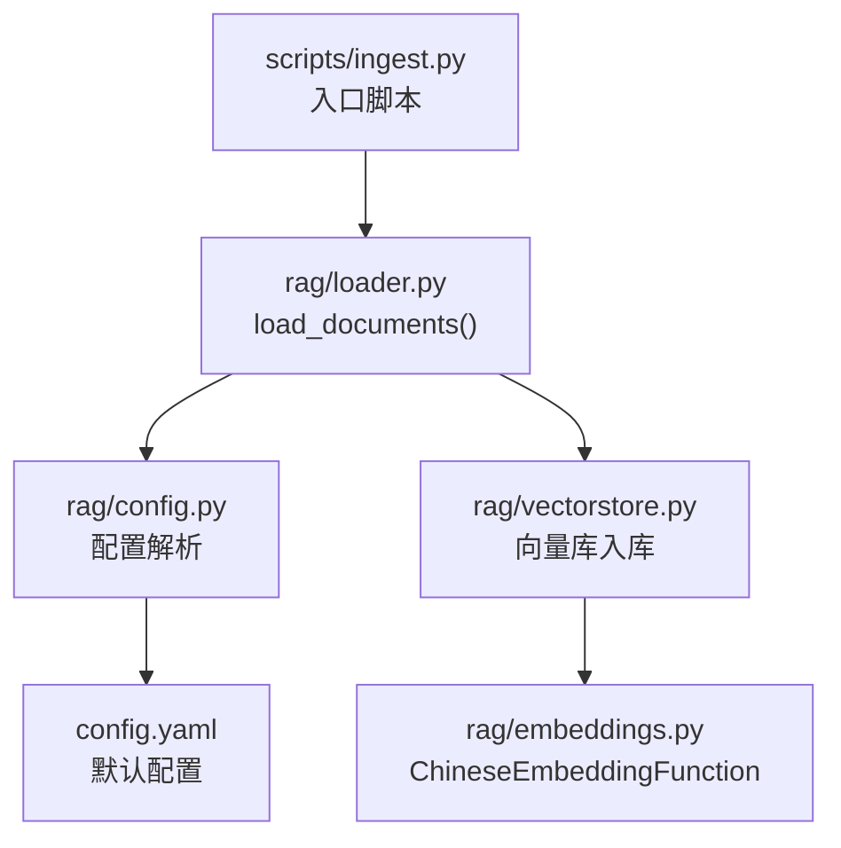
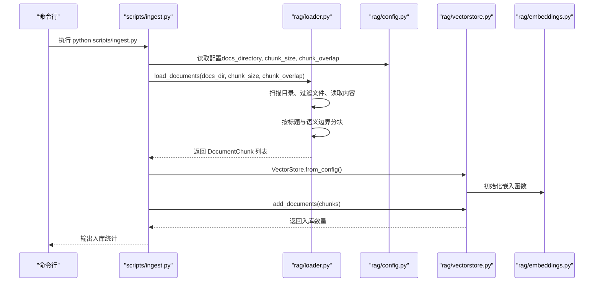
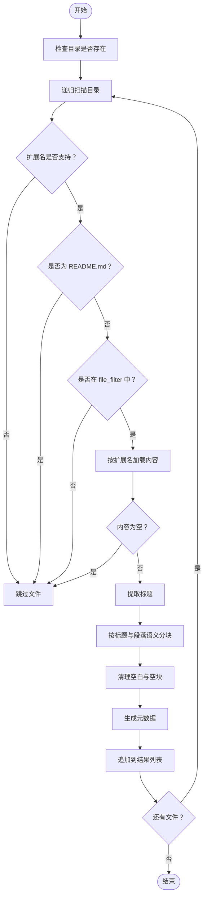
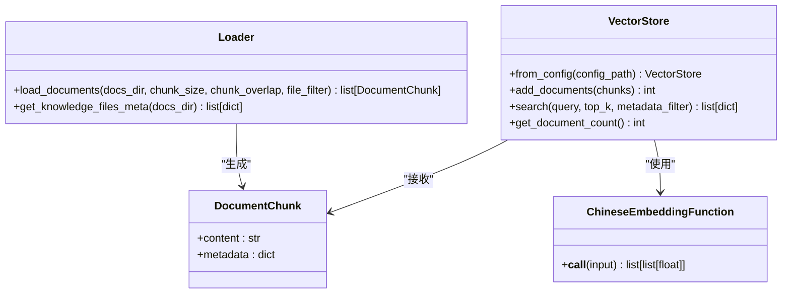

# 文档加载器

<cite>
**本文引用的文件**
- [rag/loader.py](file://rag/loader.py)
- [scripts/ingest.py](file://scripts/ingest.py)
- [rag/vectorstore.py](file://rag/vectorstore.py)
- [rag/config.py](file://rag/config.py)
- [config.yaml](file://config.yaml)
- [rag/embeddings.py](file://rag/embeddings.py)
- [tests/test_loader.py](file://tests/test_loader.py)
- [knowledge/README.md](file://knowledge/README.md)
</cite>

## 目录
1. [简介](#简介)
2. [项目结构](#项目结构)
3. [核心组件](#核心组件)
4. [架构总览](#架构总览)
5. [详细组件分析](#详细组件分析)
6. [依赖关系分析](#依赖关系分析)
7. [性能考量](#性能考量)
8. [故障排查指南](#故障排查指南)
9. [结论](#结论)
10. [附录](#附录)

## 简介
本文档面向“文档加载器”的技术实现，围绕以下目标展开：
- 解释 load_documents 函数的工作原理与控制流
- 说明支持的文件格式（.md、.txt、.pdf）及扫描机制
- 详述文档预处理流程、编码检测与转换、元数据提取规则
- 介绍分块策略配置（chunk_size、chunk_overlap）与文本清理步骤
- 提供格式验证、错误处理机制与性能优化建议
- 包含大文件处理、内存管理、并发加载的最佳实践

## 项目结构
该功能位于 rag 子模块中，配合配置、向量库与入库脚本协同工作：
- 文档加载与分块：rag/loader.py
- 入库脚本：scripts/ingest.py
- 向量库管理：rag/vectorstore.py
- 配置管理：rag/config.py、config.yaml
- 嵌入模型封装：rag/embeddings.py
- 单元测试：tests/test_loader.py
- 示例知识库说明：knowledge/README.md

图表来源
- [scripts/ingest.py:25-57](file://scripts/ingest.py#L25-L57)
- [rag/loader.py:131-197](file://rag/loader.py#L131-L197)
- [rag/config.py:154-184](file://rag/config.py#L154-L184)
- [rag/vectorstore.py:89-112](file://rag/vectorstore.py#L89-L112)
- [rag/embeddings.py:19-47](file://rag/embeddings.py#L19-L47)

章节来源
- [scripts/ingest.py:1-62](file://scripts/ingest.py#L1-L62)
- [rag/loader.py:1-259](file://rag/loader.py#L1-L259)
- [rag/config.py:1-185](file://rag/config.py#L1-L185)
- [config.yaml:1-49](file://config.yaml#L1-L49)
- [rag/vectorstore.py:1-209](file://rag/vectorstore.py#L1-L209)
- [rag/embeddings.py:1-48](file://rag/embeddings.py#L1-L48)

## 核心组件
- 文档加载与分块：负责扫描目录、识别文件类型、读取内容、按标题与语义边界切分、生成分块并附加元数据
- 配置管理：提供知识库配置（文档目录、分块大小、重叠长度等），并进行环境变量替换与校验
- 向量库管理：封装 ChromaDB，支持增量入库、查询与统计
- 入库脚本：串联加载、分块、向量化与入库流程
- 嵌入模型封装：SentenceTransformer 的中文嵌入函数，适配 ChromaDB

章节来源
- [rag/loader.py:131-197](file://rag/loader.py#L131-L197)
- [rag/config.py:72-84](file://rag/config.py#L72-L84)
- [rag/vectorstore.py:89-112](file://rag/vectorstore.py#L89-L112)
- [scripts/ingest.py:25-57](file://scripts/ingest.py#L25-L57)
- [rag/embeddings.py:19-47](file://rag/embeddings.py#L19-L47)

## 架构总览
下图展示从命令行到入库的整体流程，以及各模块间的调用关系。

图表来源
- [scripts/ingest.py:25-57](file://scripts/ingest.py#L25-L57)
- [rag/loader.py:131-197](file://rag/loader.py#L131-L197)
- [rag/config.py:154-184](file://rag/config.py#L154-L184)
- [rag/vectorstore.py:182-209](file://rag/vectorstore.py#L182-L209)
- [rag/embeddings.py:19-47](file://rag/embeddings.py#L19-L47)

## 详细组件分析

### load_documents 函数
- 输入参数
  - docs_dir：知识库目录路径
  - chunk_size：分块最大字符数，默认 500
  - chunk_overlap：分块重叠字符数，默认 50
  - file_filter：可选文件名集合，仅加载匹配文件
- 控制流
  - 校验目录存在性
  - 递归遍历目录，过滤非支持扩展名与 README.md
  - 按扩展名选择加载策略：PDF 使用 PDF 库提取文本；其他文本文件以 UTF-8 编码读取
  - 提取标题（优先取首级标题，否则使用文件名）
  - 按标题与段落语义边界进行分块，支持代码块完整性保护与重叠拼接
  - 为每个分块生成元数据（source、title、chunk_index、file_type），并加入结果列表
- 输出
  - DocumentChunk 列表，每项包含 content 与 metadata 字典

图表来源
- [rag/loader.py:150-197](file://rag/loader.py#L150-L197)
- [rag/loader.py:121-129](file://rag/loader.py#L121-L129)
- [rag/loader.py:101-118](file://rag/loader.py#L101-L118)
- [rag/loader.py:92-98](file://rag/loader.py#L92-L98)
- [rag/loader.py:29-89](file://rag/loader.py#L29-L89)

章节来源
- [rag/loader.py:131-197](file://rag/loader.py#L131-L197)
- [rag/loader.py:29-89](file://rag/loader.py#L29-L89)
- [rag/loader.py:92-98](file://rag/loader.py#L92-L98)
- [rag/loader.py:101-118](file://rag/loader.py#L101-L118)
- [rag/loader.py:121-129](file://rag/loader.py#L121-L129)

### 分块策略与文本清理
- 标题驱动分块：优先按二级标题（##）切分，保留标题作为上下文
- 代码块完整性：在代码块内不进行语义切分，确保代码块标记成对出现
- 语义边界切分：对超长段落按段落（双换行）进一步切分
- 重叠拼接：当启用重叠时，将上一段末尾与当前段开头拼接，提升上下文连续性
- 清理步骤：去除空块与空白，保证分块内容有效

章节来源
- [rag/loader.py:29-89](file://rag/loader.py#L29-L89)
- [tests/test_loader.py:41-66](file://tests/test_loader.py#L41-L66)

### 编码检测与转换
- 文本文件统一以 UTF-8 编码读取
- PDF 文件通过 PDF 库提取文本，内部处理编码细节
- 若读取异常，记录警告并跳过该文件，避免中断整体流程

章节来源
- [rag/loader.py:121-129](file://rag/loader.py#L121-L129)
- [rag/loader.py:101-118](file://rag/loader.py#L101-L118)
- [rag/loader.py:167-171](file://rag/loader.py#L167-L171)

### 元数据提取规则
- source：相对路径（相对于知识库目录）
- title：优先取文档首级标题，否则使用文件名（不含扩展名）
- chunk_index：分块序号（从 0 开始）
- file_type：文件扩展名（小写）

章节来源
- [rag/loader.py:176-193](file://rag/loader.py#L176-L193)

### 文件扫描机制
- 递归扫描知识库目录（rglob）
- 支持扩展名：.md、.txt、.pdf
- 排除 README.md
- 可选 file_filter 限定文件名集合
- PDF 元数据：由于不加载全文，标题采用文件名，大小为文件大小

章节来源
- [rag/loader.py:157-165](file://rag/loader.py#L157-L165)
- [rag/loader.py:200-244](file://rag/loader.py#L200-L244)

### 配置与校验
- 知识库配置项：docs_directory、chunk_size、chunk_overlap
- chunk_overlap 校验：必须小于 chunk_size
- 默认值：docs_directory=./knowledge，chunk_size=500，chunk_overlap=50
- 配置来源：config.yaml，支持环境变量替换（${VAR} 或 ${VAR:-默认值}）

章节来源
- [rag/config.py:72-84](file://rag/config.py#L72-L84)
- [rag/config.py:154-184](file://rag/config.py#L154-L184)
- [config.yaml:24-28](file://config.yaml#L24-L28)

### 入库与向量化
- 入库脚本：scripts/ingest.py
  - 读取配置并调用 load_documents
  - 统计来源文件数量并输出日志
  - 创建 VectorStore 实例并批量入库
- 向量库：rag/vectorstore.py
  - 基于 ChromaDB，支持持久化与集合管理
  - 增量更新：相同 ID 的文档先删除再插入
  - 统计与查询接口
- 嵌入函数：rag/embeddings.py
  - 基于 sentence-transformers 的中文模型
  - 支持在线与离线模式（本地路径）

章节来源
- [scripts/ingest.py:25-57](file://scripts/ingest.py#L25-L57)
- [rag/vectorstore.py:89-112](file://rag/vectorstore.py#L89-L112)
- [rag/embeddings.py:19-47](file://rag/embeddings.py#L19-L47)

## 依赖关系分析

图表来源
- [rag/loader.py:22-27](file://rag/loader.py#L22-L27)
- [rag/loader.py:131-197](file://rag/loader.py#L131-L197)
- [rag/vectorstore.py:24-59](file://rag/vectorstore.py#L24-L59)
- [rag/embeddings.py:19-47](file://rag/embeddings.py#L19-L47)

章节来源
- [rag/loader.py:131-197](file://rag/loader.py#L131-L197)
- [rag/vectorstore.py:24-59](file://rag/vectorstore.py#L24-L59)
- [rag/embeddings.py:19-47](file://rag/embeddings.py#L19-L47)

## 性能考量
- 分块参数
  - chunk_size：越大越利于语义连贯，但可能降低检索精度；建议结合文档复杂度与检索需求调整
  - chunk_overlap：有助于跨边界上下文衔接，但会增加向量库体量；建议适度设置
- 编码与读取
  - 文本文件统一 UTF-8，避免多编码导致的解析开销
  - PDF 逐页提取，注意大文档的内存占用
- 内存管理
  - 采用生成式处理（逐文件、逐块），避免一次性加载全部内容
  - 向量库入库采用批量写入与增量更新，减少重复索引成本
- 并发加载
  - 当前实现为顺序扫描与处理；若需并发，可在文件层面引入线程池或进程池，并注意共享资源（向量库客户端）的线程安全
- 大文件处理
  - PDF 文档建议拆分或分批入库
  - 对超长文本，适当增大 chunk_size 并启用合理重叠，以平衡检索质量与性能

[本节为通用性能建议，不直接分析具体文件，故无章节来源]

## 故障排查指南
- 常见问题与处理
  - PDF 依赖缺失：缺少 PDF 库时抛出导入异常，需安装 pymupdf
    - 参考：[rag/loader.py:104-111](file://rag/loader.py#L104-L111)
  - 读取失败：文件读取异常会记录警告并跳过该文件
    - 参考：[rag/loader.py:167-171](file://rag/loader.py#L167-L171)
  - 配置校验失败：chunk_overlap 不得大于等于 chunk_size
    - 参考：[rag/config.py:78-83](file://rag/config.py#L78-L83)
  - 空目录或无支持文件：返回空结果并输出提示
    - 参考：[scripts/ingest.py:39-41](file://scripts/ingest.py#L39-L41)
- 单元测试参考
  - 分块逻辑、标题提取、元数据获取等均有针对性测试
    - 参考：[tests/test_loader.py:16-82](file://tests/test_loader.py#L16-L82)
    - 参考：[tests/test_loader.py:84-121](file://tests/test_loader.py#L84-L121)

章节来源
- [rag/loader.py:104-111](file://rag/loader.py#L104-L111)
- [rag/loader.py:167-171](file://rag/loader.py#L167-L171)
- [rag/config.py:78-83](file://rag/config.py#L78-L83)
- [scripts/ingest.py:39-41](file://scripts/ingest.py#L39-L41)
- [tests/test_loader.py:16-82](file://tests/test_loader.py#L16-L82)
- [tests/test_loader.py:84-121](file://tests/test_loader.py#L84-L121)

## 结论
文档加载器以清晰的职责划分实现了从知识库目录到向量库的完整链路：扫描与过滤、内容读取、标题驱动分块、元数据生成与入库。通过合理的分块参数与编码策略，兼顾了检索质量与性能。建议在生产环境中结合业务场景微调分块参数，并关注 PDF 大文档的内存与并发处理策略。

[本节为总结性内容，不直接分析具体文件，故无章节来源]

## 附录

### API 定义与行为
- load_documents
  - 输入：docs_dir、chunk_size、chunk_overlap、file_filter
  - 输出：DocumentChunk 列表
  - 行为：扫描目录、过滤文件、按标题与语义边界分块、生成元数据
  - 参考：[rag/loader.py:131-197](file://rag/loader.py#L131-L197)
- get_knowledge_files_meta
  - 输入：docs_dir
  - 输出：文件元数据列表（path、title、size、modified_time、file_type、icon）
  - 行为：仅读取文件头以提取标题，不加载全文
  - 参考：[rag/loader.py:200-244](file://rag/loader.py#L200-L244)

### 配置项说明
- knowledge.docs_directory：知识库目录，默认 ./knowledge
- knowledge.chunk_size：分块大小，默认 500
- knowledge.chunk_overlap：分块重叠，默认 50
- 参考：[config.yaml:24-28](file://config.yaml#L24-L28)，[rag/config.py:72-84](file://rag/config.py#L72-L84)

### 示例知识库说明
- 知识库目录使用方式与文档格式建议
- 参考：[knowledge/README.md:1-29](file://knowledge/README.md#L1-L29)