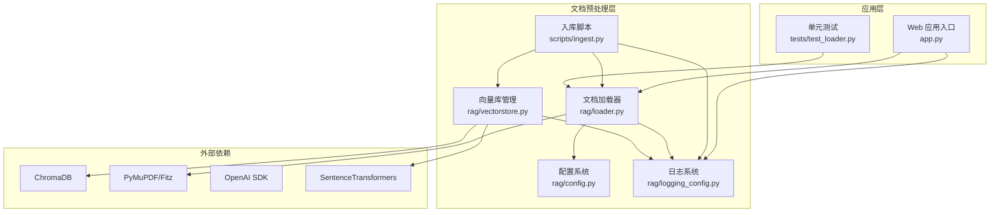
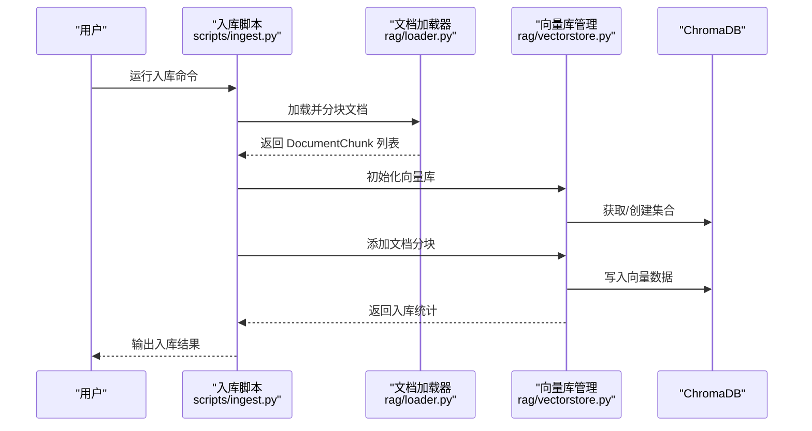
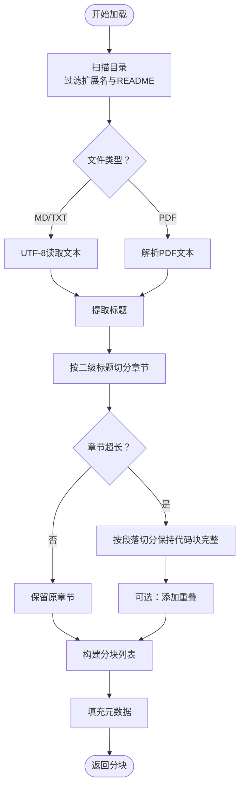
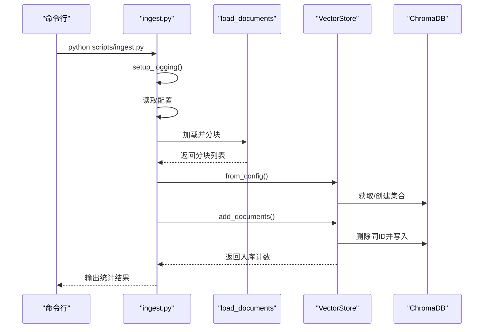
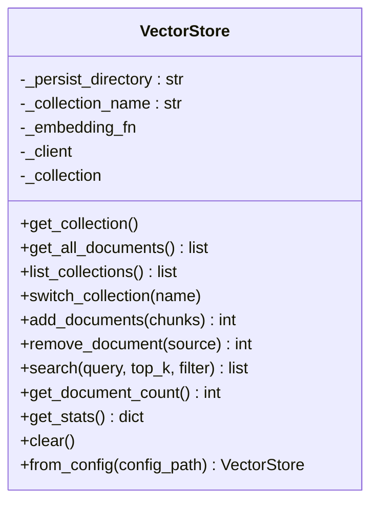
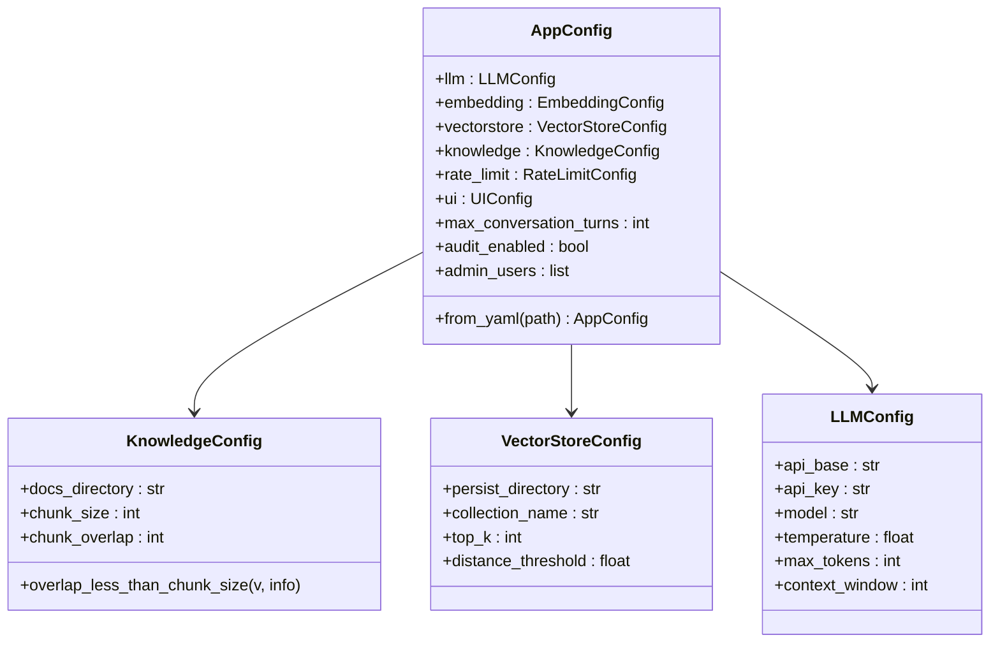
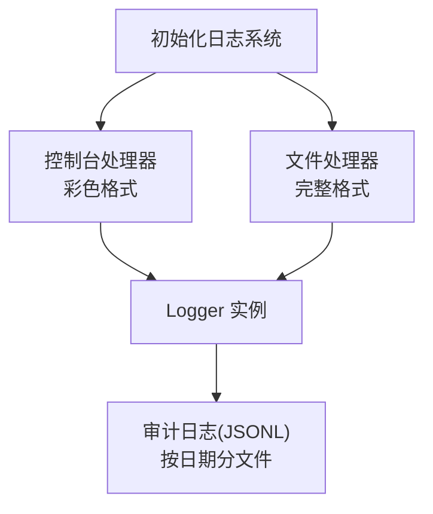
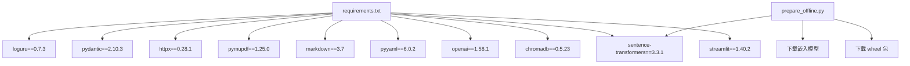

# 文档预处理

<cite>
**本文档引用的文件**
- [rag/loader.py](file://rag/loader.py)
- [scripts/ingest.py](file://scripts/ingest.py)
- [rag/vectorstore.py](file://rag/vectorstore.py)
- [rag/config.py](file://rag/config.py)
- [rag/logging_config.py](file://rag/logging_config.py)
- [tests/test_loader.py](file://tests/test_loader.py)
- [config.yaml](file://config.yaml)
- [requirements.txt](file://requirements.txt)
- [app.py](file://app.py)
- [scripts/prepare_offline.py](file://scripts/prepare_offline.py)
</cite>

## 目录
1. [简介](#简介)
2. [项目结构](#项目结构)
3. [核心组件](#核心组件)
4. [架构概览](#架构概览)
5. [详细组件分析](#详细组件分析)
6. [依赖分析](#依赖分析)
7. [性能考虑](#性能考虑)
8. [故障排除指南](#故障排除指南)
9. [结论](#结论)
10. [附录](#附录)

## 简介
本文件面向文档预处理的完整技术文档，聚焦于知识库文档的加载、分块、元数据提取与保留、格式标准化、编码处理、特殊字符处理、空白字符清理、验证规则、完整性校验、性能优化、内存控制、并发策略、错误处理与异常恢复、日志记录等。通过分析项目中的文档加载器、入库脚本、向量库管理、配置系统与日志系统，形成从数据采集到向量化入库的全链路技术规范。

## 项目结构
该项目采用模块化设计，文档预处理主要涉及以下模块：
- 文档加载与分块：负责扫描知识库目录、按语义切分、提取元数据
- 入库脚本：负责加载文档、分块、向量化并写入向量数据库
- 向量库管理：负责 ChromaDB 的初始化、文档添加、检索与持久化
- 配置系统：提供配置校验、环境变量替换与单例访问
- 日志系统：统一日志输出、审计日志记录
- 测试：覆盖分块逻辑、标题提取、元数据获取等关键行为

**图表来源**
- [rag/loader.py:1-259](file://rag/loader.py#L1-L259)
- [scripts/ingest.py:1-62](file://scripts/ingest.py#L1-L62)
- [rag/vectorstore.py:1-209](file://rag/vectorstore.py#L1-L209)
- [rag/config.py:1-185](file://rag/config.py#L1-L185)
- [rag/logging_config.py:1-129](file://rag/logging_config.py#L1-L129)
- [app.py:1-189](file://app.py#L1-L189)
- [tests/test_loader.py:1-138](file://tests/test_loader.py#L1-L138)

**章节来源**
- [rag/loader.py:1-259](file://rag/loader.py#L1-L259)
- [scripts/ingest.py:1-62](file://scripts/ingest.py#L1-L62)
- [rag/vectorstore.py:1-209](file://rag/vectorstore.py#L1-L209)
- [rag/config.py:1-185](file://rag/config.py#L1-L185)
- [rag/logging_config.py:1-129](file://rag/logging_config.py#L1-L129)
- [app.py:1-189](file://app.py#L1-L189)
- [tests/test_loader.py:1-138](file://tests/test_loader.py#L1-L138)

## 核心组件
- 文档加载器：支持 Markdown、纯文本、PDF；按标题与段落切分；保留元数据；提取标题；编码处理
- 入库脚本：扫描目录、加载分块、向量化、写入向量库；支持增量更新
- 向量库管理：ChromaDB 客户端封装、集合管理、文档增删查、统计信息
- 配置系统：Pydantic 校验、环境变量替换、单例访问
- 日志系统：控制台与文件双输出、审计日志 JSONL 记录

**章节来源**
- [rag/loader.py:131-197](file://rag/loader.py#L131-L197)
- [scripts/ingest.py:25-58](file://scripts/ingest.py#L25-L58)
- [rag/vectorstore.py:89-147](file://rag/vectorstore.py#L89-L147)
- [rag/config.py:139-184](file://rag/config.py#L139-L184)
- [rag/logging_config.py:46-129](file://rag/logging_config.py#L46-L129)

## 架构概览
文档预处理的端到端流程如下：

**图表来源**
- [scripts/ingest.py:25-58](file://scripts/ingest.py#L25-L58)
- [rag/loader.py:131-197](file://rag/loader.py#L131-L197)
- [rag/vectorstore.py:47-112](file://rag/vectorstore.py#L47-L112)

## 详细组件分析

### 文档加载器（rag/loader.py）
- 支持格式：Markdown(.md)、纯文本(.txt)、PDF(.pdf)
- 递归扫描知识库目录，过滤 README.md，支持文件名白名单
- 编码处理：PDF 使用 PDF 解析库读取文本；其他格式以 UTF-8 读取
- 标题提取：从 Markdown 内容提取首个一级标题作为文档标题
- 分块策略：
  - 按二级标题分割章节，保留标题作为上下文
  - 代码块保持完整，不被截断
  - 超长章节按段落进一步切分，支持重叠
- 元数据保留：source（相对路径）、title、chunk_index、file_type
- 异常处理：文件读取失败记录警告并跳过；空内容跳过

**图表来源**
- [rag/loader.py:29-89](file://rag/loader.py#L29-L89)
- [rag/loader.py:131-197](file://rag/loader.py#L131-L197)

**章节来源**
- [rag/loader.py:18-19](file://rag/loader.py#L18-L19)
- [rag/loader.py:92-98](file://rag/loader.py#L92-L98)
- [rag/loader.py:29-89](file://rag/loader.py#L29-L89)
- [rag/loader.py:131-197](file://rag/loader.py#L131-L197)

### 入库脚本（scripts/ingest.py）
- 作用：扫描知识库目录，加载文档并分块，向量化后写入 ChromaDB
- 增量更新：对同 ID 的文档先删除再写入，实现覆盖
- 统计输出：显示涉及文件数量与入库条目数
- 环境配置：配置 MODEL_ROOT 离线模型路径，添加项目根目录到 Python 路径

**图表来源**
- [scripts/ingest.py:25-58](file://scripts/ingest.py#L25-L58)
- [rag/vectorstore.py:89-112](file://rag/vectorstore.py#L89-L112)

**章节来源**
- [scripts/ingest.py:1-62](file://scripts/ingest.py#L1-L62)
- [rag/vectorstore.py:89-112](file://rag/vectorstore.py#L89-L112)

### 向量库管理（rag/vectorstore.py）
- ChromaDB 客户端封装：延迟初始化、集合获取与创建
- 文档添加：支持增量更新（同 ID 覆盖），批量写入
- 检索查询：支持元数据过滤，返回内容、元数据与距离
- 统计信息：文档总数、不同来源文件数
- 单例缓存：相同配置只创建一次实例，避免重复加载嵌入模型

**图表来源**
- [rag/vectorstore.py:24-209](file://rag/vectorstore.py#L24-L209)

**章节来源**
- [rag/vectorstore.py:47-147](file://rag/vectorstore.py#L47-L147)
- [rag/vectorstore.py:181-209](file://rag/vectorstore.py#L181-L209)

### 配置系统（rag/config.py）
- 使用 Pydantic 进行配置校验，字段范围约束
- 支持环境变量替换：${VAR} 或 ${VAR:-default}
- 提供全局单例访问，支持运行时重新加载
- 关键配置项：知识库目录、分块参数、向量库参数、LLM 参数、UI 参数、速率限制

**图表来源**
- [rag/config.py:48-132](file://rag/config.py#L48-L132)
- [rag/config.py:139-184](file://rag/config.py#L139-L184)

**章节来源**
- [rag/config.py:16-44](file://rag/config.py#L16-L44)
- [rag/config.py:72-84](file://rag/config.py#L72-L84)
- [rag/config.py:139-184](file://rag/config.py#L139-L184)
- [config.yaml:1-50](file://config.yaml#L1-L50)

### 日志系统（rag/logging_config.py）
- 控制台彩色输出与文件完整日志双通道
- 审计日志：JSONL 格式，按日期分文件，包含用户名、操作类型、查询摘要、结果数、耗时等
- 可通过配置开关审计日志记录

**图表来源**
- [rag/logging_config.py:46-129](file://rag/logging_config.py#L46-L129)

**章节来源**
- [rag/logging_config.py:46-129](file://rag/logging_config.py#L46-L129)

### 单元测试（tests/test_loader.py）
- 分块逻辑测试：无标题、简单标题、溢出切分、重叠、代码块完整性
- 标题提取测试：H1 标题、无标题、多个 H1
- 元数据获取测试：空目录、MD/TXT 文件、README 过滤、标题提取、类型与内容字段

**章节来源**
- [tests/test_loader.py:16-138](file://tests/test_loader.py#L16-L138)

## 依赖分析
- Python 依赖：Streamlit、ChromaDB、OpenAI SDK、SentenceTransformers、PyYAML、markdown、PyMuPDF、httpx、Pydantic、loguru
- 离线部署：打包 wheel、下载嵌入模型、生成离线安装脚本
- 环境变量：MODEL_ROOT 指定离线模型根路径，支持 `local_files_only` 离线加载

**图表来源**
- [requirements.txt:1-11](file://requirements.txt#L1-L11)
- [scripts/prepare_offline.py:32-59](file://scripts/prepare_offline.py#L32-L59)

**章节来源**
- [requirements.txt:1-11](file://requirements.txt#L1-L11)
- [scripts/prepare_offline.py:230-259](file://scripts/prepare_offline.py#L230-L259)

## 性能考虑
- 分块参数：chunk_size 与 chunk_overlap 需满足 overlap < chunk_size，避免无效切分
- 向量库阈值：distance_threshold 用于过滤低相关度文档块，提升检索质量
- 单例缓存：VectorStore 与 Reranker 模型类级别缓存，减少重复加载开销
- 增量更新：入库时按 ID 删除再写入，避免重复向量化
- 模型加载：默认离线优先（local_files_only=True），本地路径存在时无需网络下载
- 日志级别：生产环境建议 INFO 级别，避免过多 DEBUG 日志影响性能

**章节来源**
- [rag/config.py:78-83](file://rag/config.py#L78-L83)
- [rag/vectorstore.py:181-209](file://rag/vectorstore.py#L181-L209)
- [scripts/ingest.py:51-57](file://scripts/ingest.py#L51-L57)
- [scripts/prepare_offline.py:238-240](file://scripts/prepare_offline.py#L238-L240)

## 故障排除指南
- PDF 读取失败：确认已安装 PDF 解析库；检查文件权限与路径
- 编码问题：确保文本文件为 UTF-8；PDF 由解析库处理
- 空内容跳过：检查文件是否为空或仅含空白字符
- 向量库异常：检查 ChromaDB 持久化目录权限；必要时清空集合后重试
- 审计日志未记录：确认配置中 audit_enabled 为 true
- 离线部署失败：核对 wheel 与模型下载完整性；确保目标机器满足 Python 版本要求

**章节来源**
- [rag/loader.py:101-118](file://rag/loader.py#L101-L118)
- [rag/vectorstore.py:171-179](file://rag/vectorstore.py#L171-L179)
- [rag/logging_config.py:108-129](file://rag/logging_config.py#L108-L129)
- [scripts/prepare_offline.py:190-224](file://scripts/prepare_offline.py#L190-L224)

## 结论
文档预处理模块通过清晰的职责划分与严格的配置校验，实现了从知识库文档到向量库的高效入库流程。其分块策略兼顾语义完整性与代码块完整性，元数据保留便于溯源与统计。配合审计日志与单例缓存机制，在保证可维护性的同时提升了运行效率。建议在实际部署中结合业务场景调整分块参数与阈值，并完善监控与告警体系。

## 附录
- 配置文件示例：包含 LLM、嵌入模型、向量库、知识库、速率限制、UI 等配置项
- 离线部署：一键打包 wheel 与模型，生成跨平台安装脚本

**章节来源**
- [config.yaml:1-50](file://config.yaml#L1-L50)
- [scripts/prepare_offline.py:92-227](file://scripts/prepare_offline.py#L92-L227)