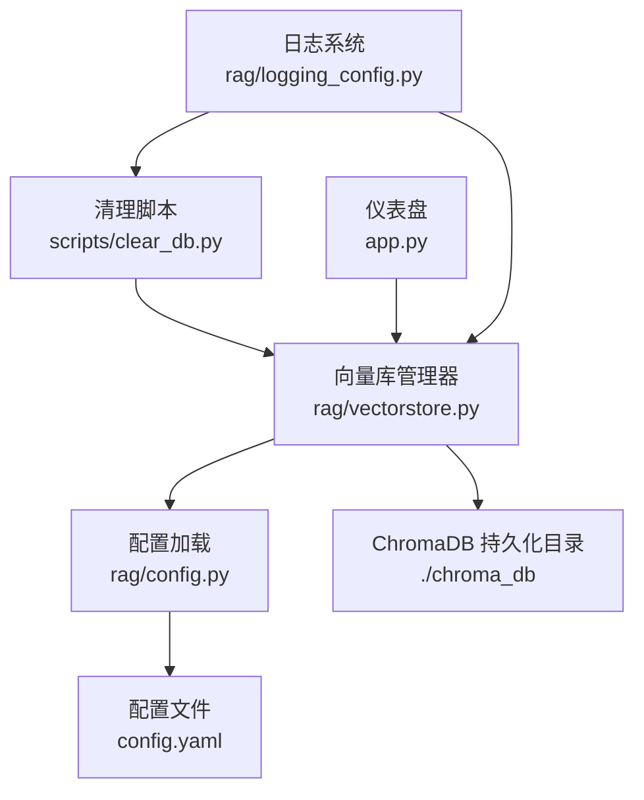
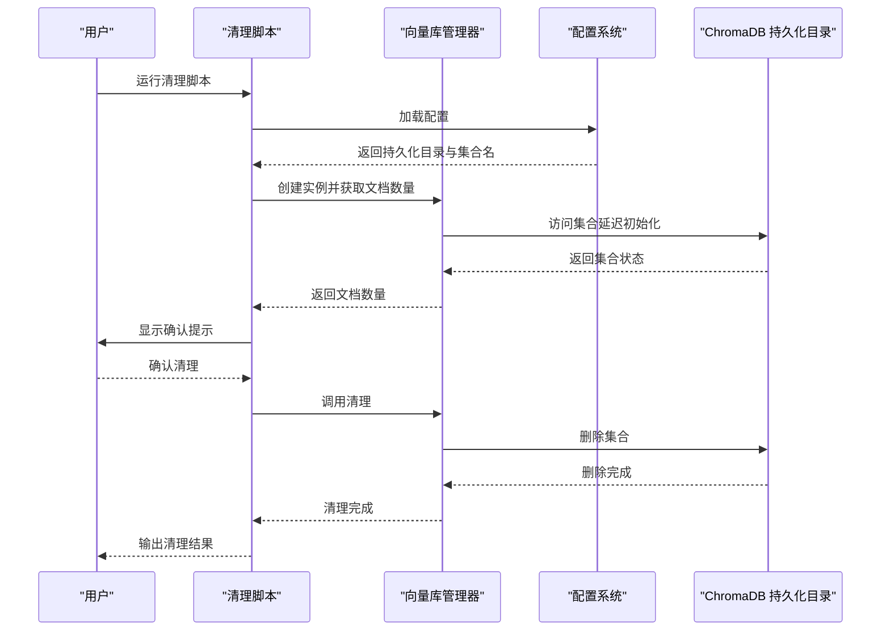
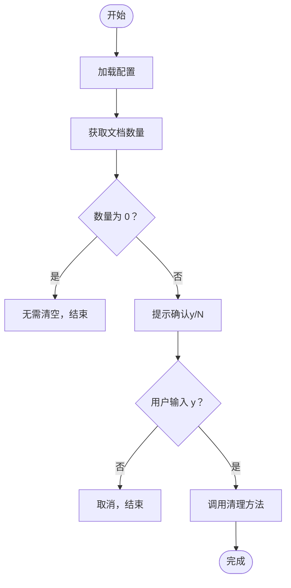
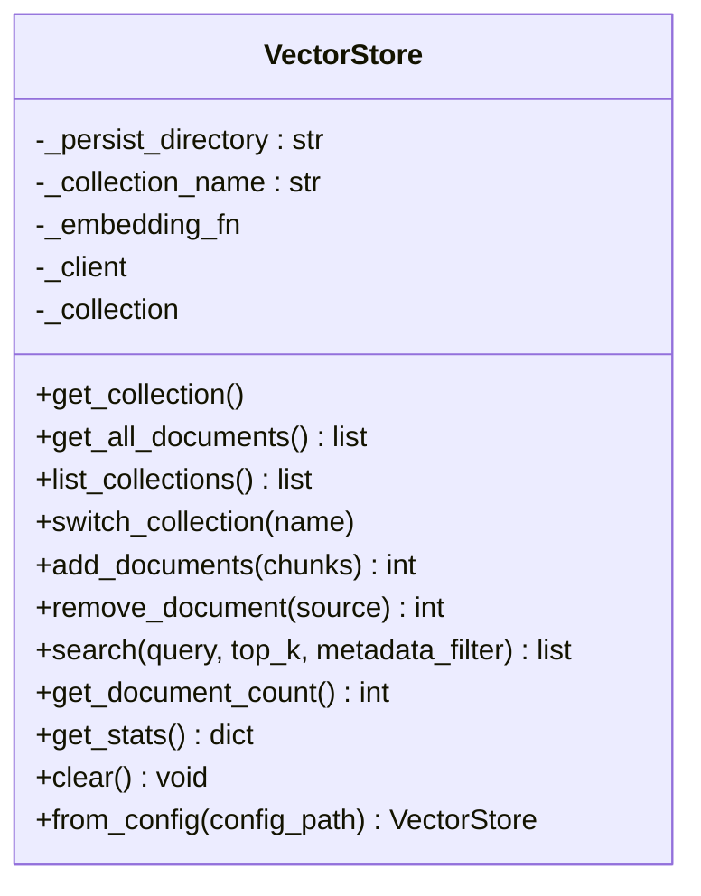
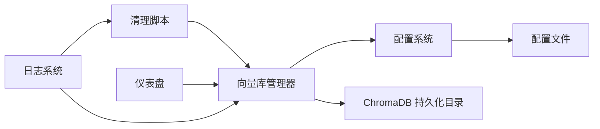

# 数据库清理维护

<cite>
**本文引用的文件**
- [scripts/clear_db.py](file://scripts/clear_db.py)
- [rag/vectorstore.py](file://rag/vectorstore.py)
- [rag/config.py](file://rag/config.py)
- [config.yaml](file://config.yaml)
- [tests/test_vectorstore.py](file://tests/test_vectorstore.py)
- [app.py](file://app.py)
- [rag/logging_config.py](file://rag/logging_config.py)
</cite>

## 目录
1. [简介](#简介)
2. [项目结构](#项目结构)
3. [核心组件](#核心组件)
4. [架构概览](#架构概览)
5. [详细组件分析](#详细组件分析)
6. [依赖分析](#依赖分析)
7. [性能考虑](#性能考虑)
8. [故障排除指南](#故障排除指南)
9. [结论](#结论)
10. [附录](#附录)

## 简介
本指南面向数据库清理维护场景，聚焦于 ChromaDB 向量存储的清理策略与操作流程。文档涵盖：
- 清理脚本的使用方法与安全确认机制
- 批量删除流程与策略（全量清理、增量清理）
- 文档块管理与存储空间回收
- 清理前后验证与审计日志
- 错误处理与回滚建议
- 性能影响与最佳实践

## 项目结构
与数据库清理维护直接相关的文件与职责如下：
- scripts/clear_db.py：命令行清理脚本，提供交互式确认与调用清理逻辑
- rag/vectorstore.py：ChromaDB 向量库管理器，提供集合操作、文档增删、统计与清理能力
- rag/config.py 与 config.yaml：配置加载与解析，决定向量库持久化目录与集合名称
- tests/test_vectorstore.py：清理相关单元测试，验证清理行为
- app.py：仪表盘展示向量库统计信息，便于清理前后的状态核对
- rag/logging_config.py：统一日志输出，支持清理过程与审计日志

**图表来源**
- [scripts/clear_db.py:17-37](file://scripts/clear_db.py#L17-L37)
- [rag/vectorstore.py:181-209](file://rag/vectorstore.py#L181-L209)
- [rag/config.py:118-132](file://rag/config.py#L118-L132)
- [config.yaml:16-22](file://config.yaml#L16-L22)
- [app.py:162-172](file://app.py#L162-L172)
- [rag/logging_config.py:46-76](file://rag/logging_config.py#L46-L76)

**章节来源**
- [scripts/clear_db.py:1-38](file://scripts/clear_db.py#L1-L38)
- [rag/vectorstore.py:1-209](file://rag/vectorstore.py#L1-L209)
- [rag/config.py:1-185](file://rag/config.py#L1-L185)
- [config.yaml:1-49](file://config.yaml#L1-L49)
- [app.py:162-172](file://app.py#L162-L172)
- [rag/logging_config.py:1-129](file://rag/logging_config.py#L1-L129)

## 核心组件
- 清理脚本（scripts/clear_db.py）
  - 作用：提供交互式确认，调用向量库管理器执行清理
  - 关键流程：读取配置 → 获取文档数量 → 交互确认 → 调用清理 → 输出日志
- 向量库管理器（rag/vectorstore.py）
  - 作用：封装 ChromaDB 客户端与集合操作，提供统计、增删、清理等能力
  - 关键方法：get_document_count、clear、get_stats、remove_document
- 配置系统（rag/config.py 与 config.yaml）
  - 作用：解析配置，确定持久化目录与集合名称，供清理脚本与管理器使用
- 仪表盘（app.py）
  - 作用：展示向量库统计信息，辅助清理前后验证
- 日志系统（rag/logging_config.py）
  - 作用：统一输出清理过程日志，支持审计日志

**章节来源**
- [scripts/clear_db.py:17-37](file://scripts/clear_db.py#L17-L37)
- [rag/vectorstore.py:144-179](file://rag/vectorstore.py#L144-L179)
- [rag/vectorstore.py:149-169](file://rag/vectorstore.py#L149-L169)
- [rag/vectorstore.py:114-122](file://rag/vectorstore.py#L114-L122)
- [rag/config.py:118-132](file://rag/config.py#L118-L132)
- [config.yaml:16-22](file://config.yaml#L16-L22)
- [app.py:162-172](file://app.py#L162-L172)
- [rag/logging_config.py:46-76](file://rag/logging_config.py#L46-L76)

## 架构概览
清理流程涉及脚本、配置、向量库管理器与 ChromaDB 持久化目录之间的协作。

**图表来源**
- [scripts/clear_db.py:17-37](file://scripts/clear_db.py#L17-L37)
- [rag/vectorstore.py:181-209](file://rag/vectorstore.py#L181-L209)
- [rag/vectorstore.py:40-55](file://rag/vectorstore.py#L40-L55)
- [rag/vectorstore.py:171-179](file://rag/vectorstore.py#L171-L179)
- [config.yaml:16-22](file://config.yaml#L16-L22)

## 详细组件分析

### 清理脚本（scripts/clear_db.py）
- 功能要点
  - 通过配置系统创建向量库实例
  - 获取当前文档数量并进行空库检查
  - 提供交互式确认（y/N）
  - 调用向量库管理器执行清理并记录日志
- 安全确认机制
  - 若文档数量为 0，直接提示无需清空
  - 若文档数量大于 0，要求用户输入 y 才执行清理
- 批量删除流程
  - 清理脚本本身不遍历删除，而是委托给向量库管理器的清理方法
  - 清理方法通过删除集合实现“全量”效果

**图表来源**
- [scripts/clear_db.py:17-37](file://scripts/clear_db.py#L17-L37)

**章节来源**
- [scripts/clear_db.py:17-37](file://scripts/clear_db.py#L17-L37)

### 向量库管理器（rag/vectorstore.py）
- 文档数量与统计
  - get_document_count：返回集合中文档块数量
  - get_stats：返回集合名、总块数、文件数等统计信息
- 删除与清理
  - remove_document：按来源路径删除对应文档的所有分块
  - clear：删除集合，实现全量清理
- 增量更新与批量删除
  - add_documents：先查询同名文档并删除，再新增，实现增量更新
  - remove_document：按来源路径批量删除

**图表来源**
- [rag/vectorstore.py:24-209](file://rag/vectorstore.py#L24-L209)

**章节来源**
- [rag/vectorstore.py:144-179](file://rag/vectorstore.py#L144-L179)
- [rag/vectorstore.py:149-169](file://rag/vectorstore.py#L149-L169)
- [rag/vectorstore.py:114-122](file://rag/vectorstore.py#L114-L122)
- [rag/vectorstore.py:94-112](file://rag/vectorstore.py#L94-L112)

### 配置系统（rag/config.py 与 config.yaml）
- 配置项
  - vectorstore.persist_directory：ChromaDB 持久化目录
  - vectorstore.collection_name：集合名称
- 作用
  - 为清理脚本与向量库管理器提供一致的配置来源
  - from_config 方法支持全局单例缓存，避免重复加载

**章节来源**
- [rag/config.py:118-132](file://rag/config.py#L118-L132)
- [config.yaml:16-22](file://config.yaml#L16-L22)

### 仪表盘与验证（app.py）
- 仪表盘展示向量库统计信息，可用于清理前后的状态核对
- 展示内容包括：文档块总数、文件数、嵌入模型等

**章节来源**
- [app.py:162-172](file://app.py#L162-L172)

### 日志与审计（rag/logging_config.py）
- 清理脚本与向量库管理器均使用统一日志系统
- 支持控制台彩色输出与文件日志记录
- 审计日志可选开启，用于记录关键操作

**章节来源**
- [rag/logging_config.py:46-76](file://rag/logging_config.py#L46-L76)
- [rag/logging_config.py:86-129](file://rag/logging_config.py#L86-L129)

## 依赖分析
- 清理脚本依赖向量库管理器与配置系统
- 向量库管理器依赖 ChromaDB 客户端与配置系统
- 仪表盘依赖向量库管理器获取统计信息
- 日志系统被清理脚本与向量库管理器共同使用

**图表来源**
- [scripts/clear_db.py:11-12](file://scripts/clear_db.py#L11-L12)
- [rag/vectorstore.py:12-15](file://rag/vectorstore.py#L12-L15)
- [rag/config.py:118-132](file://rag/config.py#L118-L132)
- [config.yaml:16-22](file://config.yaml#L16-L22)
- [app.py:163-167](file://app.py#L163-L170)
- [rag/logging_config.py:46-76](file://rag/logging_config.py#L46-L76)

**章节来源**
- [scripts/clear_db.py:11-12](file://scripts/clear_db.py#L11-L12)
- [rag/vectorstore.py:12-15](file://rag/vectorstore.py#L12-L15)
- [rag/config.py:118-132](file://rag/config.py#L118-L132)
- [config.yaml:16-22](file://config.yaml#L16-L22)
- [app.py:163-170](file://app.py#L163-L170)
- [rag/logging_config.py:46-76](file://rag/logging_config.py#L46-L76)

## 性能考虑
- 清理策略选择
  - 全量清理：通过删除集合一次性回收空间，适合大规模数据清理
  - 增量清理：按来源路径删除文档分块，适合局部数据更新
- 存储空间回收
  - 删除集合后，ChromaDB 持久化目录中的对应数据会被移除
  - 清理完成后可通过仪表盘核对统计信息
- 性能影响与最佳实践
  - 在低峰时段执行清理，避免影响在线检索
  - 清理前进行备份，清理后进行验证
  - 对于频繁更新场景，优先采用增量清理以减少重复向量化成本

[本节为通用指导，无需特定文件分析]

## 故障排除指南
- 常见问题与处理
  - 空库清理：脚本会检测文档数量为 0 的情况并提示无需清空
  - 用户取消：输入非 y 将终止清理流程
  - 清理异常：向量库管理器的清理方法包含异常捕获，确保流程稳定
- 验证与审计
  - 清理前后通过仪表盘核对统计信息
  - 启用审计日志以记录关键操作

**章节来源**
- [scripts/clear_db.py:23-30](file://scripts/clear_db.py#L23-L30)
- [rag/vectorstore.py:171-179](file://rag/vectorstore.py#L171-L179)
- [app.py:162-172](file://app.py#L162-L172)
- [rag/logging_config.py:86-129](file://rag/logging_config.py#L86-L129)

## 结论
本文提供了基于现有代码的数据库清理维护操作指南，重点围绕清理脚本、向量库管理器与配置系统的协作关系，明确了安全确认机制、批量删除流程与验证方法。对于生产环境，建议结合备份与审计策略，选择合适的清理策略并在低峰时段执行，以确保系统稳定性与数据安全。

[本节为总结性内容，无需特定文件分析]

## 附录

### 不同场景下的清理策略
- 全量清理
  - 适用：需要彻底清空向量库，重新导入数据
  - 方法：使用清理脚本确认后删除集合
  - 验证：通过仪表盘确认统计信息清零
- 增量清理
  - 适用：按来源路径删除部分文档分块
  - 方法：调用 remove_document 按来源路径删除
  - 验证：通过 get_stats 核对文件数变化

**章节来源**
- [scripts/clear_db.py:27-33](file://scripts/clear_db.py#L27-L33)
- [rag/vectorstore.py:114-122](file://rag/vectorstore.py#L114-L122)
- [rag/vectorstore.py:149-169](file://rag/vectorstore.py#L149-L169)

### 清理前的数据备份建议
- 备份 ChromaDB 持久化目录（由配置项 vectorstore.persist_directory 指定）
- 备份配置文件（config.yaml），以便回滚时恢复参数

**章节来源**
- [config.yaml:16-22](file://config.yaml#L16-L22)

### 清理后的验证步骤
- 通过仪表盘查看统计信息（文档块数、文件数）
- 执行检索验证，确认清理效果

**章节来源**
- [app.py:162-172](file://app.py#L162-L172)

### 错误处理与回滚机制
- 清理脚本与向量库管理器均具备异常捕获，保证流程稳定
- 回滚建议：恢复备份的持久化目录与配置文件

**章节来源**
- [scripts/clear_db.py:18-19](file://scripts/clear_db.py#L18-L19)
- [rag/vectorstore.py:171-179](file://rag/vectorstore.py#L171-L179)