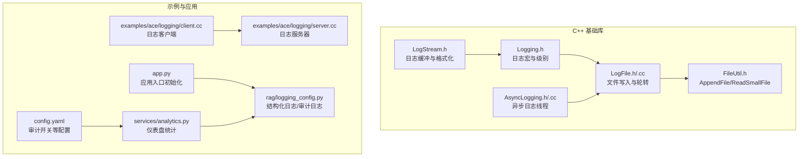
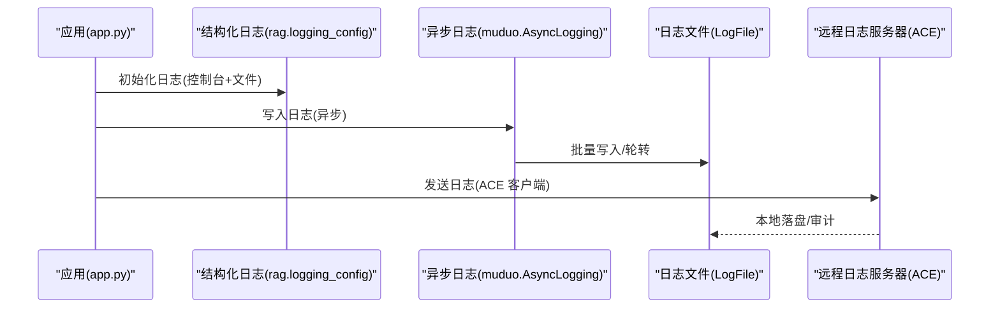
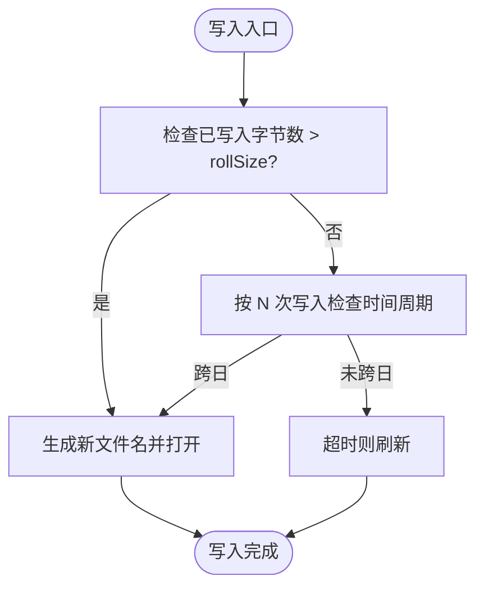
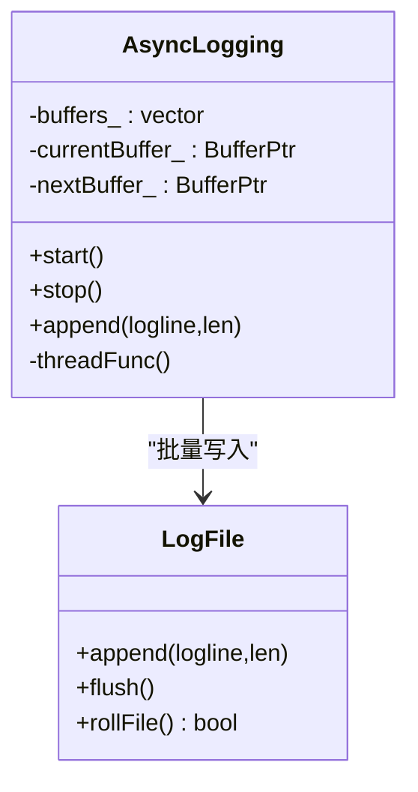
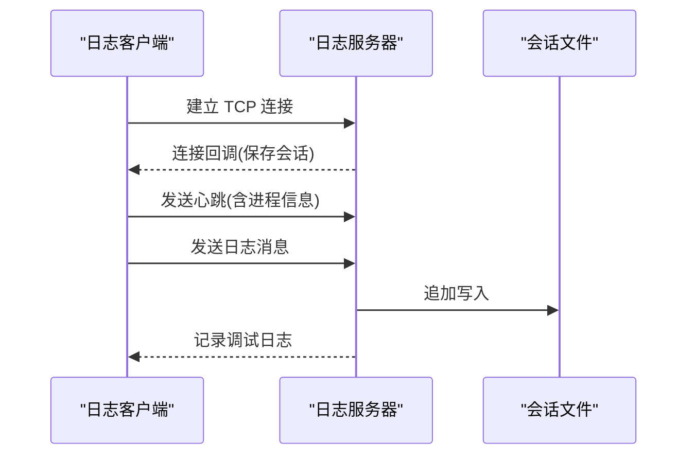
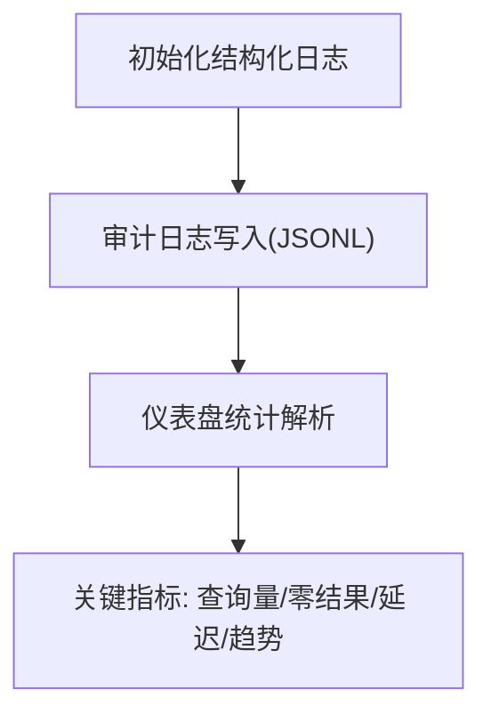
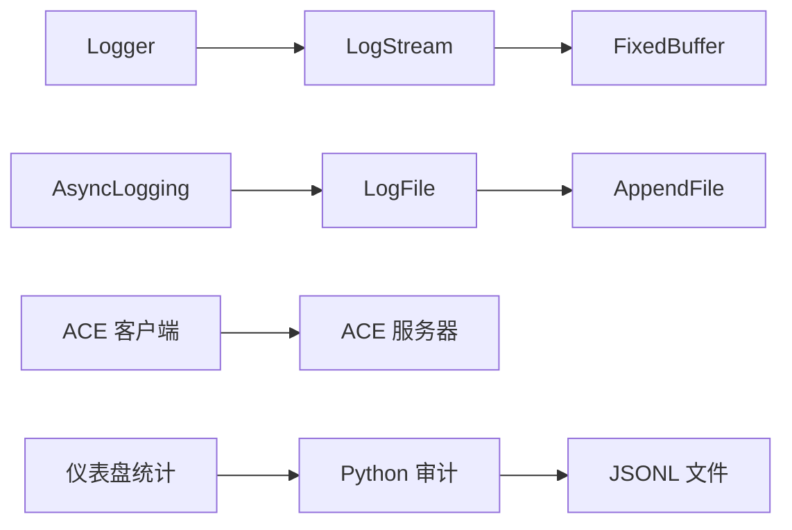

# 日志管理维护

<cite>
**本文引用的文件**
- [muduo/base/Logging.h](file://knowledge/_logging_8h.md)
- [muduo/base/LogFile.h](file://knowledge/_log_file_8h.md)
- [muduo/base/LogFile.cc](file://knowledge/_log_file_8cc.md)
- [muduo/base/AsyncLogging.h](file://knowledge/_async_logging_8h.md)
- [muduo/base/AsyncLogging.cc](file://knowledge/_async_logging_8cc.md)
- [muduo/base/LogStream.h](file://knowledge/_log_stream_8h.md)
- [muduo/base/FileUtil.h](file://knowledge/_file_util_8h.md)
- [examples/ace/logging/server.cc](file://knowledge/ace_2logging_2server_8cc.md)
- [examples/ace/logging/client.cc](file://knowledge/ace_2logging_2client_8cc.md)
- [rag/logging_config.py](file://rag/logging_config.py)
- [services/analytics.py](file://services/analytics.py)
- [app.py](file://app.py)
- [config.yaml](file://config.yaml)
- [muduo/base/tests/Logging_test.cc](file://knowledge/_logging__test_8cc.md)
- [muduo/base/tests/LogFile_test.cc](file://knowledge/_log_file__test_8cc.md)
</cite>

## 目录
1. [简介](#简介)
2. [项目结构](#项目结构)
3. [核心组件](#核心组件)
4. [架构总览](#架构总览)
5. [详细组件分析](#详细组件分析)
6. [依赖分析](#依赖分析)
7. [性能考虑](#性能考虑)
8. [故障排查指南](#故障排查指南)
9. [结论](#结论)
10. [附录](#附录)

## 简介
本操作手册面向日志管理与维护工作，覆盖以下主题：
- 日志配置文件结构与参数说明
- 日志级别设置与输出格式定制
- 日志轮转策略、存储空间管理与保留周期
- 日志分析工具使用、关键指标提取与异常识别
- 日志审计流程、合规性与敏感信息过滤
- 远程日志收集、聚合分析、实时监控与告警机制

本项目同时包含 C++ 与 Python 双栈日志实现：C++ 层提供高性能异步日志与文件轮转；Python 层提供结构化日志、审计日志与可视化分析。

## 项目结构
日志相关代码主要分布在以下区域：
- C++ 基础库：日志流、日志文件写入、异步日志与轮转
- 示例程序：ACE 协议的日志客户端/服务器，演示远程日志收集
- Python 应用层：结构化日志配置、审计日志与仪表盘分析

图表来源
- [muduo/base/Logging.h:119-272](file://knowledge/_logging_8h.md#L119-L272)
- [muduo/base/LogFile.h:50-83](file://knowledge/_log_file_8h.md#L50-L83)
- [muduo/base/LogFile.cc:32-147](file://knowledge/_log_file_8cc.md#L32-L147)
- [muduo/base/AsyncLogging.h:49-100](file://knowledge/_async_logging_8h.md#L49-L100)
- [muduo/base/AsyncLogging.cc:29-150](file://knowledge/_async_logging_8cc.md#L29-L150)
- [muduo/base/LogStream.h:110-199](file://knowledge/_log_stream_8h.md#L110-L199)
- [muduo/base/FileUtil.h:91-111](file://knowledge/_file_util_8h.md#L91-L111)
- [examples/ace/logging/server.cc:126-162](file://knowledge/ace_2logging_2server_8cc.md#L126-L162)
- [examples/ace/logging/client.cc:70-159](file://knowledge/ace_2logging_2client_8cc.md#L70-L159)
- [rag/logging_config.py:46-83](file://rag/logging_config.py#L46-L83)
- [services/analytics.py:17-121](file://services/analytics.py#L17-L121)
- [app.py:72-73](file://app.py#L72-L73)
- [config.yaml:39-40](file://config.yaml#L39-L40)

章节来源
- [muduo/base/Logging.h:119-272](file://knowledge/_logging_8h.md#L119-L272)
- [muduo/base/LogFile.h:50-83](file://knowledge/_log_file_8h.md#L50-L83)
- [muduo/base/AsyncLogging.h:49-100](file://knowledge/_async_logging_8h.md#L49-L100)
- [rag/logging_config.py:46-83](file://rag/logging_config.py#L46-L83)

## 核心组件
- 日志级别与宏：通过枚举与宏在编译期控制日志输出，支持 TRACE/DEBUG/INFO/WARN/ERROR/FATAL 等级别，并提供系统错误级别。
- 日志流与缓冲：固定大小缓冲区按需增长，支持多种基本类型的格式化输出。
- 文件写入与轮转：AppendFile 提供追加写与刷新；LogFile 负责按大小与时间周期滚动文件名。
- 异步日志：AsyncLogging 将日志写入与主线程解耦，通过环形缓冲队列与后台线程批量刷盘，降低写入开销。
- 结构化日志与审计：Python 层提供控制台彩色输出与文件全量输出；审计日志以 JSONL 按日切分，支持关键指标统计。

章节来源
- [muduo/base/Logging.h:130-247](file://knowledge/_logging_8h.md#L130-L247)
- [muduo/base/LogStream.h:54-199](file://knowledge/_log_stream_8h.md#L54-L199)
- [muduo/base/FileUtil.h:91-111](file://knowledge/_file_util_8h.md#L91-L111)
- [muduo/base/LogFile.h:50-83](file://knowledge/_log_file_8h.md#L50-L83)
- [muduo/base/AsyncLogging.h:49-100](file://knowledge/_async_logging_8h.md#L49-L100)
- [rag/logging_config.py:46-83](file://rag/logging_config.py#L46-L83)

## 架构总览
下图展示从应用到日志系统的整体路径，包括本地日志与远程日志收集两条通路。

图表来源
- [app.py:72-73](file://app.py#L72-L73)
- [rag/logging_config.py:46-83](file://rag/logging_config.py#L46-L83)
- [muduo/base/AsyncLogging.cc:73-150](file://knowledge/_async_logging_8cc.md#L73-L150)
- [muduo/base/LogFile.cc:108-147](file://knowledge/_log_file_8cc.md#L108-L147)
- [examples/ace/logging/client.cc:94-106](file://knowledge/ace_2logging_2client_8cc.md#L94-L106)
- [examples/ace/logging/server.cc:102-116](file://knowledge/ace_2logging_2server_8cc.md#L102-L116)

## 详细组件分析

### 日志级别与输出格式
- 日志级别：通过枚举定义 TRACE 到 FATAL 共 6 个级别；宏在编译期判断是否输出，减少不必要的字符串拼接与 IO。
- 输出格式：C++ 侧由 Logger::Impl 负责时间戳、级别、文件名与行号等元信息格式化；Python 侧提供彩色控制台格式化器与标准文件格式化器。
- 系统错误：提供 SYSERR/SYSFATAL 两类便捷宏，自动附加系统错误码。

章节来源
- [muduo/base/Logging.h:130-247](file://knowledge/_logging_8h.md#L130-L247)
- [rag/logging_config.py:27-44](file://rag/logging_config.py#L27-L44)

### 日志轮转策略与存储管理
- 触发条件：按大小滚动（超过 rollSize）、按时间周期滚动（每日 0 点），以及定期刷新（flushInterval）。
- 文件命名：包含时间戳、主机名、进程 ID，确保唯一性与可追溯性。
- 刷新策略：定期 flush 保证突发日志不丢失；在高频写入场景下平衡吞吐与持久化延迟。

图表来源
- [muduo/base/LogFile.cc:79-106](file://knowledge/_log_file_8cc.md#L79-L106)
- [muduo/base/LogFile.cc:108-123](file://knowledge/_log_file_8cc.md#L108-L123)
- [muduo/base/LogFile.cc:125-147](file://knowledge/_log_file_8cc.md#L125-L147)

章节来源
- [muduo/base/LogFile.h:50-83](file://knowledge/_log_file_8h.md#L50-L83)
- [muduo/base/LogFile.cc:79-123](file://knowledge/_log_file_8cc.md#L79-L123)

### 异步日志与性能优化
- 缓冲队列：采用固定大缓冲与环形缓冲向量，避免频繁分配；当缓冲不足时交换至后台线程处理。
- 后台线程：批量写入与刷新，丢弃过长队列以防止阻塞；在极端高负载下输出降级提示。
- 刷新间隔：flushInterval 控制后台线程唤醒频率，兼顾延迟与吞吐。

图表来源
- [muduo/base/AsyncLogging.h:49-100](file://knowledge/_async_logging_8h.md#L49-L100)
- [muduo/base/AsyncLogging.cc:73-150](file://knowledge/_async_logging_8cc.md#L73-L150)
- [muduo/base/LogFile.h:50-83](file://knowledge/_log_file_8h.md#L50-L83)

章节来源
- [muduo/base/AsyncLogging.h:49-100](file://knowledge/_async_logging_8h.md#L49-L100)
- [muduo/base/AsyncLogging.cc:49-150](file://knowledge/_async_logging_8cc.md#L49-L150)

### 远程日志收集与协议
- 协议：基于 ProtobufCodecLite 的自定义日志记录协议，客户端连接服务器后发送心跳与日志消息。
- 服务器：为每个连接建立会话，按远端 IP、时间戳、序号生成唯一日志文件，追加写入。
- 客户端：连接成功后发送心跳，随后将输入文本封装为日志记录发送。

图表来源
- [examples/ace/logging/client.cc:109-134](file://knowledge/ace_2logging_2client_8cc.md#L109-L134)
- [examples/ace/logging/server.cc:147-158](file://knowledge/ace_2logging_2server_8cc.md#L147-L158)
- [examples/ace/logging/server.cc:102-116](file://knowledge/ace_2logging_2server_8cc.md#L102-L116)

章节来源
- [examples/ace/logging/client.cc:70-159](file://knowledge/ace_2logging_2client_8cc.md#L70-L159)
- [examples/ace/logging/server.cc:126-162](file://knowledge/ace_2logging_2server_8cc.md#L126-L162)

### Python 结构化日志与审计
- 结构化日志：控制台彩色输出（级别与时间着色），文件输出完整格式；统一初始化与获取 logger 的入口。
- 审计日志：按日期切分 JSONL 文件，记录用户、动作、查询、结果数、耗时等字段；受配置项控制开关。
- 仪表盘统计：从审计日志解析查询总量、热门查询、零结果率、平均延迟、日趋势等指标。

图表来源
- [rag/logging_config.py:46-83](file://rag/logging_config.py#L46-L83)
- [rag/logging_config.py:86-129](file://rag/logging_config.py#L86-L129)
- [services/analytics.py:17-121](file://services/analytics.py#L17-L121)

章节来源
- [rag/logging_config.py:46-129](file://rag/logging_config.py#L46-L129)
- [services/analytics.py:17-121](file://services/analytics.py#L17-L121)
- [config.yaml:39-40](file://config.yaml#L39-L40)

## 依赖分析
- 组件耦合：
  - Logger 依赖 LogStream 与时间戳；LogStream 依赖固定缓冲区。
  - LogFile 依赖 AppendFile 与进程信息；AsyncLogging 依赖 LogFile。
  - ACE 示例依赖 ProtobufCodecLite 与网络库。
  - Python 审计依赖配置模块与时间模块。
- 外部集成点：
  - ACE 协议用于远程日志传输。
  - JSONL 文件用于审计日志持久化与分析。

图表来源
- [muduo/base/Logging.h:130-247](file://knowledge/_logging_8h.md#L130-L247)
- [muduo/base/LogStream.h:54-199](file://knowledge/_log_stream_8h.md#L54-L199)
- [muduo/base/LogFile.h:50-83](file://knowledge/_log_file_8h.md#L50-L83)
- [muduo/base/FileUtil.h:91-111](file://knowledge/_file_util_8h.md#L91-L111)
- [muduo/base/AsyncLogging.h:49-100](file://knowledge/_async_logging_8h.md#L49-L100)
- [examples/ace/logging/client.cc:70-159](file://knowledge/ace_2logging_2client_8cc.md#L70-L159)
- [examples/ace/logging/server.cc:126-162](file://knowledge/ace_2logging_2server_8cc.md#L126-L162)
- [rag/logging_config.py:86-129](file://rag/logging_config.py#L86-L129)
- [services/analytics.py:17-121](file://services/analytics.py#L17-L121)

章节来源
- [muduo/base/Logging.h:119-272](file://knowledge/_logging_8h.md#L119-L272)
- [muduo/base/AsyncLogging.h:49-100](file://knowledge/_async_logging_8h.md#L49-L100)
- [rag/logging_config.py:46-83](file://rag/logging_config.py#L46-L83)

## 性能考虑
- 异步写入：后台线程批量刷盘，显著降低主线程阻塞；在高并发场景下建议启用异步日志。
- 缓冲策略：固定大缓冲减少系统调用次数；在内存允许范围内适当增大 rollSize 以降低滚动频率。
- 刷新间隔：flushInterval 过短会增加磁盘压力，过长可能导致断电丢失；应根据业务容忍度权衡。
- 文件系统：使用 SSD 或高性能磁盘；避免在日志目录上执行过多同步操作。
- 远程日志：ACE 协议基于 TCP，具备可靠性；注意网络抖动对延迟的影响。

## 故障排查指南
- 日志不落盘或丢失
  - 检查 flushInterval 设置与磁盘写入能力；确认后台线程是否正常启动。
  - 参考：[muduo/base/AsyncLogging.cc:73-150](file://knowledge/_async_logging_8cc.md#L73-L150)
- 日志文件未滚动
  - 检查 rollSize 是否过大或时间周期是否正确；确认时间函数与时区设置。
  - 参考：[muduo/base/LogFile.cc:79-123](file://knowledge/_log_file_8cc.md#L79-L123)
- 审计日志未生成
  - 确认配置项 audit_enabled 已开启；检查日志目录权限与磁盘空间。
  - 参考：[config.yaml:39-40](file://config.yaml#L39-L40)、[rag/logging_config.py:106-129](file://rag/logging_config.py#L106-L129)
- 远程日志无法接收
  - 检查服务器端口监听与连接回调；确认客户端连接参数与协议版本。
  - 参考：[examples/ace/logging/server.cc:126-162](file://knowledge/ace_2logging_2server_8cc.md#L126-L162)、[examples/ace/logging/client.cc:163-186](file://knowledge/ace_2logging_2client_8cc.md#L163-L186)
- 性能异常
  - 使用测试样例评估不同配置下的吞吐与延迟；参考基准测试入口。
  - 参考：[muduo/base/tests/Logging_test.cc:116-212](file://knowledge/_logging__test_8cc.md#L116-L212)、[muduo/base/tests/LogFile_test.cc:85-101](file://knowledge/_log_file__test_8cc.md#L85-L101)

章节来源
- [muduo/base/AsyncLogging.cc:73-150](file://knowledge/_async_logging_8cc.md#L73-L150)
- [muduo/base/LogFile.cc:79-123](file://knowledge/_log_file_8cc.md#L79-L123)
- [rag/logging_config.py:106-129](file://rag/logging_config.py#L106-L129)
- [config.yaml:39-40](file://config.yaml#L39-L40)
- [examples/ace/logging/server.cc:126-162](file://knowledge/ace_2logging_2server_8cc.md#L126-L162)
- [examples/ace/logging/client.cc:163-186](file://knowledge/ace_2logging_2client_8cc.md#L163-L186)
- [muduo/base/tests/Logging_test.cc:116-212](file://knowledge/_logging__test_8cc.md#L116-L212)
- [muduo/base/tests/LogFile_test.cc:85-101](file://knowledge/_log_file__test_8cc.md#L85-L101)

## 结论
本项目提供了从底层 C++ 到上层 Python 的完整日志体系：高性能异步写入、灵活的轮转策略、结构化输出与审计能力，以及可视化分析与远程收集方案。通过合理配置日志级别、输出格式、轮转与保留策略，可在保证性能的同时满足合规与可观测性需求。

## 附录

### 日志配置文件结构与参数说明
- 配置文件位置：config.yaml
- 关键参数
  - llm.*：大模型相关配置（非日志直接相关）
  - embedding/vectorstore/knowledge：检索增强相关配置（非日志直接相关）
  - rate_limit：速率限制（非日志直接相关）
  - audit_enabled：是否启用审计日志（影响审计写入）
  - ui.*：界面标题、副标题、公司信息等（非日志直接相关）

章节来源
- [config.yaml:1-50](file://config.yaml#L1-L50)

### 日志级别设置与输出格式定制
- C++ 级别控制：通过 Logger::setLogLevel 设置全局级别；宏在编译期判断是否展开。
- Python 输出格式：控制台彩色格式器与文件格式器分别定义；可按需调整颜色与字段顺序。
- 时间与时区：支持设置时区，影响日志时间显示。

章节来源
- [muduo/base/Logging.h:184-191](file://knowledge/_logging_8h.md#L184-L191)
- [rag/logging_config.py:27-75](file://rag/logging_config.py#L27-L75)

### 日志轮转策略与保留周期
- 滚动触发：按大小（rollSize）与按时间周期（每日）双重保障。
- 文件命名：包含时间戳、主机名、进程 ID，便于定位与归档。
- 保留策略：建议结合外部工具（如 logrotate）进行压缩与清理，避免无限增长。

章节来源
- [muduo/base/LogFile.cc:108-147](file://knowledge/_log_file_8cc.md#L108-L147)

### 存储空间管理与保留周期设置
- 建议
  - 为日志目录预留充足空间，监控磁盘使用率。
  - 使用外部轮转工具设定最大文件大小、保留份数与压缩策略。
  - 审计日志按日切分，便于按天清理与归档。

章节来源
- [rag/logging_config.py:12-24](file://rag/logging_config.py#L12-L24)

### 日志分析工具使用与关键指标提取
- 工具：Python 仪表盘统计脚本从审计日志解析关键指标。
- 指标：查询总量、零结果查询比例、平均延迟、日趋势、热门查询 Top 10、活跃用户数等。
- 使用方式：在应用中初始化日志后，调用统计函数获取所需视图。

章节来源
- [services/analytics.py:17-121](file://services/analytics.py#L17-L121)

### 异常日志识别技巧
- 常见模式
  - 错误级别集中爆发：关注 ERROR/FATAL 高频时段。
  - 零结果率上升：可能指示检索参数或知识库问题。
  - 平均延迟突增：可能与外部服务或资源瓶颈有关。
- 建议
  - 结合审计日志中的查询原文与耗时字段进行根因分析。
  - 使用仪表盘对比趋势，定位异常发生的时间窗口。

章节来源
- [services/analytics.py:76-103](file://services/analytics.py#L76-L103)

### 日志审计流程与合规性
- 审计内容：用户名、动作类型、查询原文、回答摘要、结果数、耗时等。
- 合规要点：最小化采集、明确保留期限、访问控制与脱敏处理。
- 开关控制：通过配置项统一启停，避免生产环境误开启。

章节来源
- [rag/logging_config.py:86-129](file://rag/logging_config.py#L86-L129)
- [config.yaml:39-40](file://config.yaml#L39-L40)

### 敏感信息过滤
- 建议
  - 在审计日志中对查询原文与回答摘要进行长度截断与必要脱敏。
  - 严格控制审计日志的访问权限与存储介质加密。
  - 审计日志仅记录必要信息，避免采集个人隐私数据。

章节来源
- [rag/logging_config.py:115-128](file://rag/logging_config.py#L115-L128)

### 远程日志收集、聚合分析与实时监控告警
- 远程收集：使用 ACE 协议的客户端/服务器实现跨节点日志汇聚。
- 聚合分析：将多源日志导入集中式平台（如 ELK/Fluentd）进行统一检索与可视化。
- 实时监控与告警：基于日志指标（错误率、延迟、吞吐）设置阈值告警，联动运维流程。

章节来源
- [examples/ace/logging/client.cc:70-159](file://knowledge/ace_2logging_2client_8cc.md#L70-L159)
- [examples/ace/logging/server.cc:126-162](file://knowledge/ace_2logging_2server_8cc.md#L126-L162)