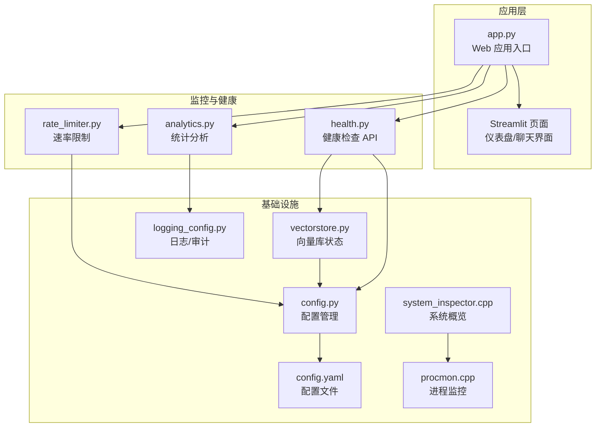
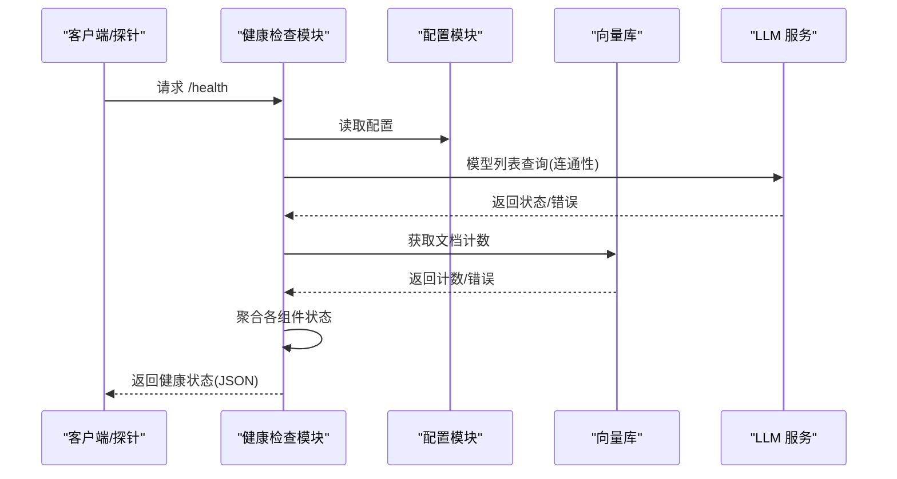
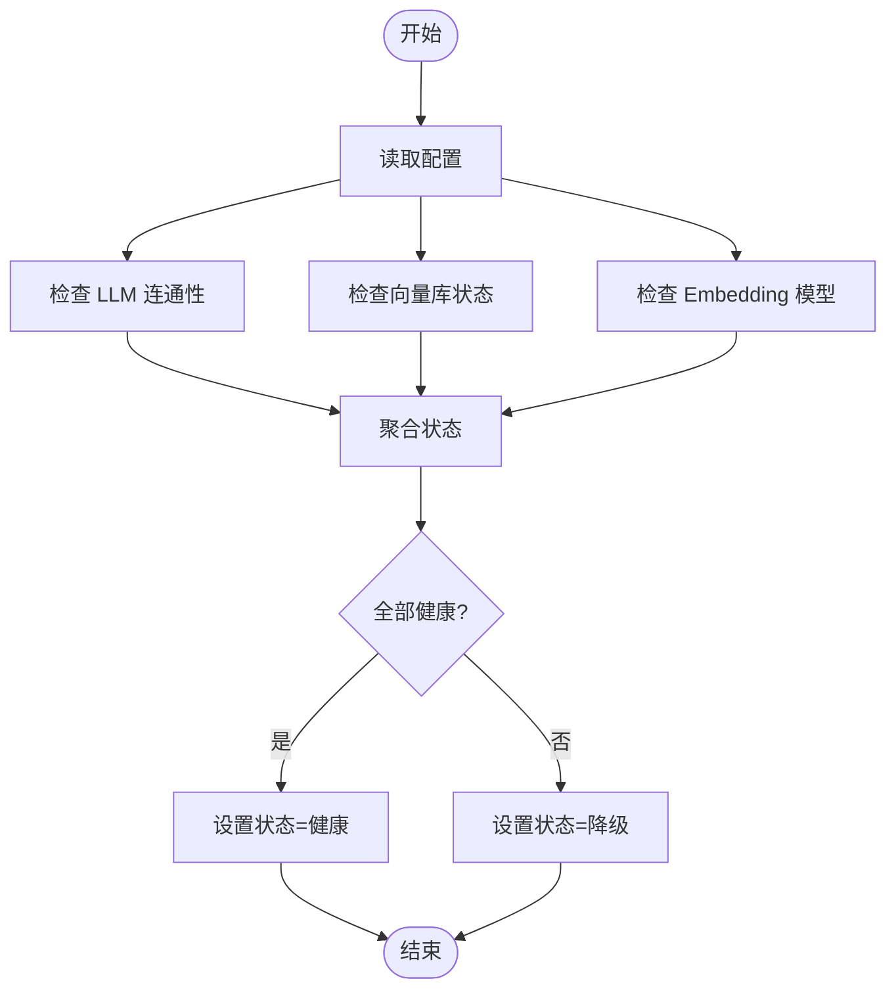
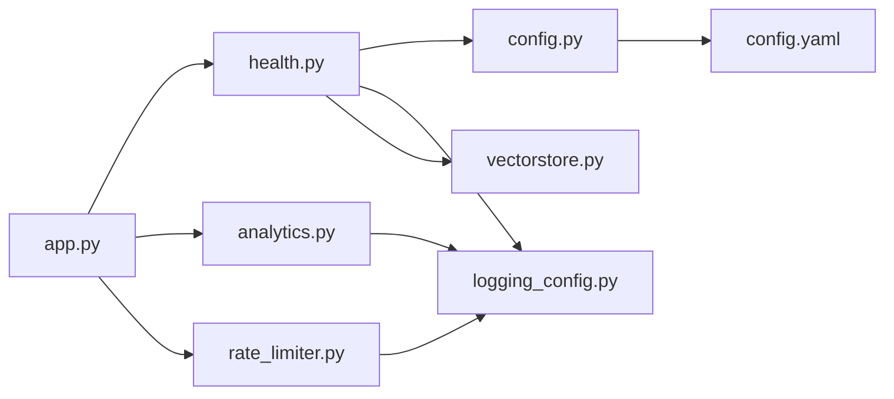

# 系统健康监控

<cite>
**本文档引用的文件**
- [health.py](file://rag/health.py)
- [config.py](file://rag/config.py)
- [logging_config.py](file://rag/logging_config.py)
- [vectorstore.py](file://rag/vectorstore.py)
- [analytics.py](file://services/analytics.py)
- [rate_limiter.py](file://services/rate_limiter.py)
- [config.yaml](file://config.yaml)
- [app.py](file://app.py)
- [system_inspector.cpp](file://knowledge/_system_inspector_8cc.md)
- [procmon.cpp](file://knowledge/procmon_8cc.md)
</cite>

## 目录
1. [简介](#简介)
2. [项目结构](#项目结构)
3. [核心组件](#核心组件)
4. [架构总览](#架构总览)
5. [详细组件分析](#详细组件分析)
6. [依赖关系分析](#依赖关系分析)
7. [性能考量](#性能考量)
8. [故障排查指南](#故障排查指南)
9. [结论](#结论)
10. [附录](#附录)

## 简介
本指南面向系统健康监控，围绕知识库系统的健康检查机制、监控指标、异常检测与告警、可用性保障等方面进行系统化说明。内容涵盖：
- 健康检查机制的配置与使用
- 系统状态检查、资源使用监控、服务可用性检测
- 监控数据采集与可视化
- 常见健康问题诊断、自动恢复与故障转移策略
- 第三方监控工具集成、自定义指标与告警通知渠道配置

## 项目结构
系统健康监控相关能力主要分布在以下模块：
- 健康检查与状态聚合：rag/health.py
- 配置管理与环境变量解析：rag/config.py、config.yaml
- 日志与审计：rag/logging_config.py
- 向量库状态与统计：rag/vectorstore.py
- 仪表盘与统计分析：services/analytics.py
- 速率限制与可用性保障：services/rate_limiter.py
- 系统级进程与资源监控（示例）：knowledge/_system_inspector_8cc.md、knowledge/procmon_8cc.md
- Web 应用入口与页面渲染：app.py

**图表来源**
- [health.py](file://rag/health.py)
- [config.py](file://rag/config.py)
- [logging_config.py](file://rag/logging_config.py)
- [vectorstore.py](file://rag/vectorstore.py)
- [analytics.py](file://services/analytics.py)
- [rate_limiter.py](file://services/rate_limiter.py)
- [config.yaml](file://config.yaml)
- [app.py](file://app.py)
- [system_inspector.cpp](file://knowledge/_system_inspector_8cc.md)
- [procmon.cpp](file://knowledge/procmon_8cc.md)

**章节来源**
- [health.py](file://rag/health.py)
- [config.py](file://rag/config.py)
- [logging_config.py](file://rag/logging_config.py)
- [vectorstore.py](file://rag/vectorstore.py)
- [analytics.py](file://services/analytics.py)
- [rate_limiter.py](file://services/rate_limiter.py)
- [config.yaml](file://config.yaml)
- [app.py](file://app.py)
- [system_inspector.cpp](file://knowledge/_system_inspector_8cc.md)
- [procmon.cpp](file://knowledge/procmon_8cc.md)

## 核心组件
- 健康检查 API：提供统一的健康状态聚合与组件检查能力，包含 LLM 连通性、向量库状态、Embedding 模型状态检查。
- 配置管理：基于 Pydantic 的配置模型，支持环境变量替换与单例访问，覆盖 LLM、Embedding、向量库、知识库、速率限制、UI 等配置。
- 日志与审计：统一日志输出与审计日志写入，支持 JSONL 格式审计文件，便于后续统计分析。
- 向量库状态与统计：提供文档计数、集合统计、检索能力等，支撑健康检查与仪表盘展示。
- 仪表盘与统计分析：从审计日志中提取查询量、热门查询、平均延迟、反馈等指标。
- 速率限制：按用户维度的内存型速率限制器，具备周期性清理机制，保障服务可用性。

**章节来源**
- [health.py](file://rag/health.py)
- [config.py](file://rag/config.py)
- [logging_config.py](file://rag/logging_config.py)
- [vectorstore.py](file://rag/vectorstore.py)
- [analytics.py](file://services/analytics.py)
- [rate_limiter.py](file://services/rate_limiter.py)
- [config.yaml](file://config.yaml)

## 架构总览
健康监控体系采用“组件检查 + 数据采集 + 可视化”的分层设计：
- 组件检查层：独立的健康检查函数，分别针对 LLM、向量库、Embedding 进行连通性与状态验证。
- 数据采集层：审计日志与向量库统计，作为指标来源。
- 可视化层：Streamlit 仪表盘展示关键指标；系统级监控示例提供进程与资源观测。

**图表来源**
- [health.py](file://rag/health.py)
- [config.py](file://rag/config.py)
- [vectorstore.py](file://rag/vectorstore.py)

## 详细组件分析

### 健康检查机制
- 组件检查项
  - LLM 连通性：通过模型列表查询验证 API Base 与密钥配置正确性，并记录延迟。
  - 向量库状态：通过文档计数判断数据库连接与集合可用性。
  - Embedding 模型状态：尝试加载模型以验证本地/远程模型可用性。
- 聚合策略：任一组件异常则整体降级为非健康状态，否则为健康。
- 输出格式：包含总体状态、时间戳、版本号与各组件子状态。

**图表来源**
- [health.py](file://rag/health.py)

**章节来源**
- [health.py](file://rag/health.py)

### 配置管理与环境变量替换
- 配置模型：包含 LLM、Embedding、向量库、知识库、速率限制、UI 等字段，支持字段级校验。
- 环境变量替换：在 YAML 加载后递归替换 ${VAR} 与 ${VAR:-默认值}。
- 单例访问：全局缓存配置实例，避免重复 IO。

**章节来源**
- [config.py](file://rag/config.py)
- [config.yaml](file://config.yaml)

### 日志与审计
- 结构化日志：控制台彩色输出与文件完整日志，统一格式。
- 审计日志：JSONL 文件按日期存储，包含用户、动作、查询、答案预览、结果数、耗时等字段，支持开关控制。

**章节来源**
- [logging_config.py](file://rag/logging_config.py)

### 向量库状态与统计
- 文档计数：通过集合 count 获取向量库文档数量。
- 统计信息：集合名、总块数、不同来源文件数等。
- 单例缓存：避免重复加载嵌入模型，提升性能。

**章节来源**
- [vectorstore.py](file://rag/vectorstore.py)

### 仪表盘与统计分析
- 数据来源：审计日志目录下的 JSONL 文件。
- 指标计算：查询总量、活跃用户、零结果查询、平均结果数、平均延迟、热门查询 Top N、日查询趋势等。
- 权限控制：默认仅统计当前用户，管理员可查看全局。

**章节来源**
- [analytics.py](file://services/analytics.py)

### 速率限制与可用性保障
- 限流算法：基于用户维度的滑动窗口计数，每分钟上限可配置。
- 内存清理：周期性清理不活跃用户记录，防止内存泄漏。
- 异常处理：超过阈值时返回等待时间提示，保证系统稳定。

**章节来源**
- [rate_limiter.py](file://services/rate_limiter.py)

### 系统级监控（示例）
- 系统概览：读取 /proc 文件系统，输出主机、内核、启动时间、负载、内存等信息。
- 进程监控：HTTP 服务器提供 /、/cpu.png、/status、/cmdline 等端点，展示进程状态与资源使用。

**章节来源**
- [system_inspector.cpp](file://knowledge/_system_inspector_8cc.md)
- [procmon.cpp](file://knowledge/procmon_8cc.md)

## 依赖关系分析
健康监控相关模块之间的依赖关系如下：

**图表来源**
- [health.py](file://rag/health.py)
- [config.py](file://rag/config.py)
- [logging_config.py](file://rag/logging_config.py)
- [vectorstore.py](file://rag/vectorstore.py)
- [analytics.py](file://services/analytics.py)
- [rate_limiter.py](file://services/rate_limiter.py)
- [config.yaml](file://config.yaml)
- [app.py](file://app.py)

**章节来源**
- [health.py](file://rag/health.py)
- [config.py](file://rag/config.py)
- [logging_config.py](file://rag/logging_config.py)
- [vectorstore.py](file://rag/vectorstore.py)
- [analytics.py](file://services/analytics.py)
- [rate_limiter.py](file://services/rate_limiter.py)
- [config.yaml](file://config.yaml)
- [app.py](file://app.py)

## 性能考量
- 健康检查开销：仅进行轻量级操作（模型列表查询、文档计数），避免对生产流量造成影响。
- 向量库单例：缓存向量库实例与嵌入模型，减少重复初始化成本。
- 速率限制：滑动窗口算法简单高效，配合周期清理降低内存占用。
- 日志与审计：JSONL 文件按天切分，避免单文件过大；审计日志可按需关闭以降低 IO 压力。

[本节为通用性能建议，无需特定文件引用]

## 故障排查指南
- 健康检查返回降级或异常
  - 检查 LLM 配置（API Base 与密钥）、网络连通性与代理设置。
  - 检查向量库持久化目录权限与磁盘空间。
  - 检查 Embedding 模型下载路径与网络可达性。
- 仪表盘无数据
  - 确认审计日志目录存在且可写，检查审计开关配置。
  - 查看审计日志文件是否按日期生成，确认 JSONL 格式正确。
- 速率限制频繁触发
  - 调整每分钟最大请求数配置，或优化前端重试策略。
  - 关注不活跃用户清理机制是否误删有效用户记录。
- 系统资源异常
  - 使用系统概览与进程监控示例端点检查 CPU、内存、负载与进程状态。
  - 关注 /proc 文件系统读取权限与可用性。

**章节来源**
- [health.py](file://rag/health.py)
- [analytics.py](file://services/analytics.py)
- [rate_limiter.py](file://services/rate_limiter.py)
- [logging_config.py](file://rag/logging_config.py)
- [system_inspector.cpp](file://knowledge/_system_inspector_8cc.md)
- [procmon.cpp](file://knowledge/procmon_8cc.md)

## 结论
本系统通过“健康检查 + 配置管理 + 日志审计 + 速率限制 + 可视化”的组合，构建了完整的健康监控体系。健康检查覆盖核心依赖链路，指标来源于审计日志与向量库统计，结合系统级监控示例，能够快速定位问题并保障服务可用性。建议在生产环境中启用审计日志、合理设置速率限制阈值，并接入第三方监控平台进行持续观测与告警。

[本节为总结性内容，无需特定文件引用]

## 附录

### 健康检查 API 使用方法
- 端点：/health
- 方法：GET
- 返回：包含总体状态、时间戳、版本号与各组件子状态的 JSON 对象
- 适用场景：容器编排就绪探针、健康巡检、自动化运维

**章节来源**
- [health.py](file://rag/health.py)

### 监控指标定义与采集
- 系统状态指标
  - LLM 连通性：状态（健康/不健康）、延迟（ms）
  - 向量库状态：状态（健康/不健康）、文档计数
  - Embedding 模型：状态（健康/不健康）、模型名
- 业务指标
  - 查询总量、活跃用户、零结果查询、平均结果数、平均延迟
  - 热门查询 Top N、日查询趋势
- 数据来源
  - 健康检查：health.py
  - 业务指标：analytics.py 从审计日志聚合

**章节来源**
- [health.py](file://rag/health.py)
- [analytics.py](file://services/analytics.py)
- [logging_config.py](file://rag/logging_config.py)

### 异常检测规则与告警阈值
- 健康状态规则
  - 任一组件异常：整体降级
  - 所有组件健康：整体健康
- 延迟阈值（建议）
  - LLM 连接延迟 > X ms：告警（可根据网络与模型选择调整）
- 资源阈值（建议）
  - 向量库文档计数长时间不增长：告警（可能索引未更新）
- 业务阈值（建议）
  - 平均延迟 > Y ms、零结果比例 > Z%：告警
- 速率限制
  - 触发频率过高：检查前端重试策略与阈值配置

**章节来源**
- [health.py](file://rag/health.py)
- [rate_limiter.py](file://services/rate_limiter.py)
- [analytics.py](file://services/analytics.py)

### 自动恢复与故障转移策略
- 自动恢复
  - 速率限制：周期性清理不活跃用户，释放内存
  - 健康检查：定期重试，异常时记录日志并等待修复
- 故障转移
  - LLM：配置备用 API Base 与密钥，健康检查失败时切换
  - 向量库：支持多集合与增量更新，异常时切换集合或重建索引

**章节来源**
- [rate_limiter.py](file://services/rate_limiter.py)
- [health.py](file://rag/health.py)
- [vectorstore.py](file://rag/vectorstore.py)

### 第三方监控工具集成
- 指标导出
  - 将健康检查 JSON 与审计统计结果导出为 Prometheus 指标或 InfluxDB 行协议
- 可视化
  - Grafana 面板：展示健康状态、延迟、查询量、热门查询、资源使用
- 告警
  - Prometheus Alertmanager：基于阈值规则发送告警
  - 企业微信/钉钉/Webhook：将告警推送到通知渠道

[本节为通用集成建议，无需特定文件引用]