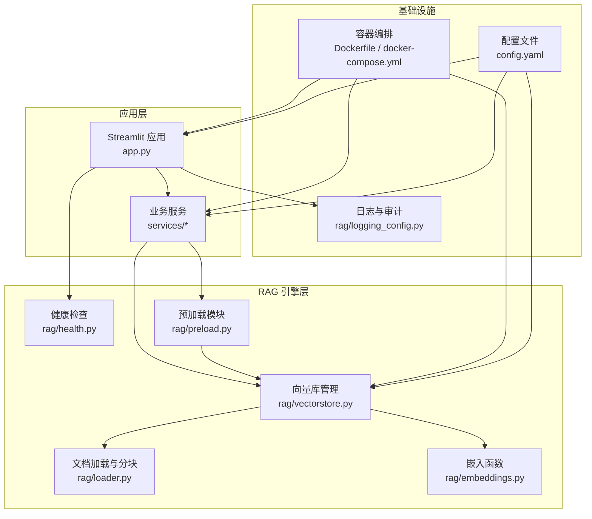
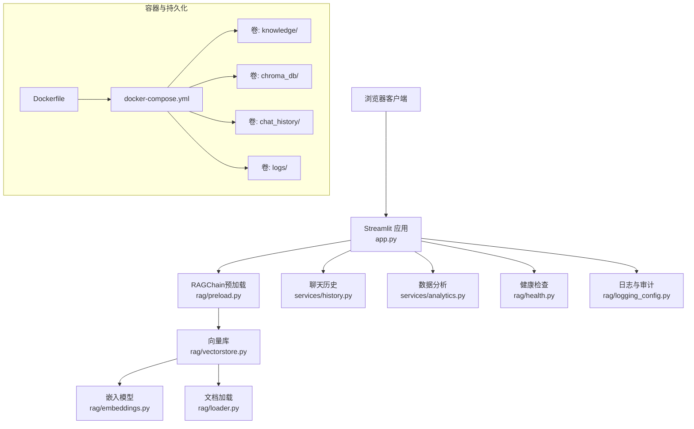
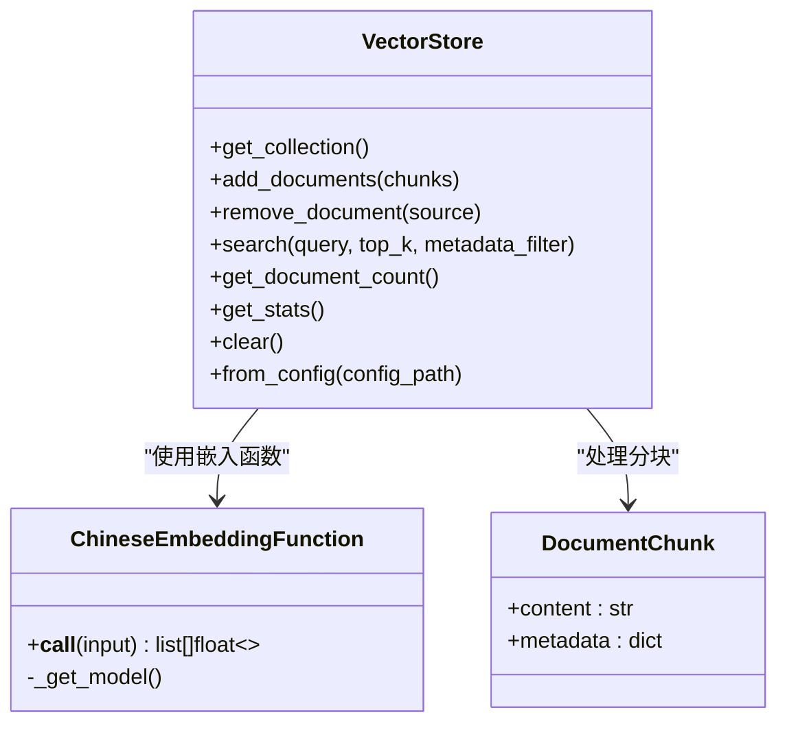
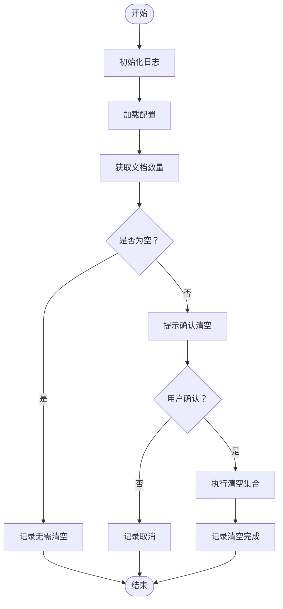
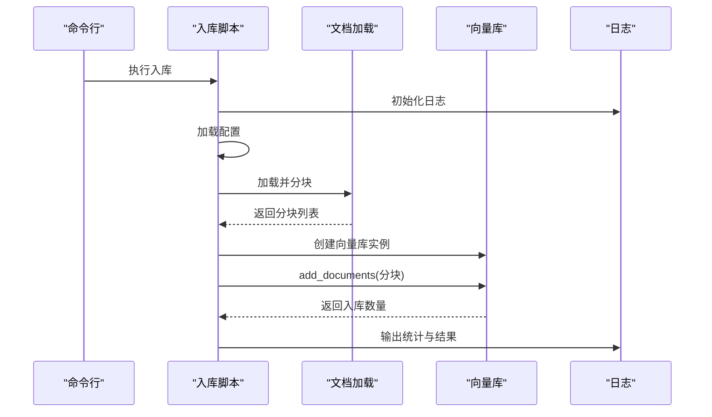
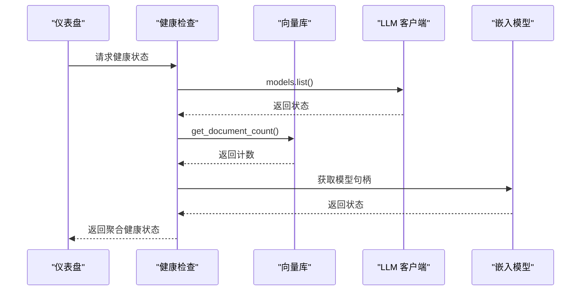
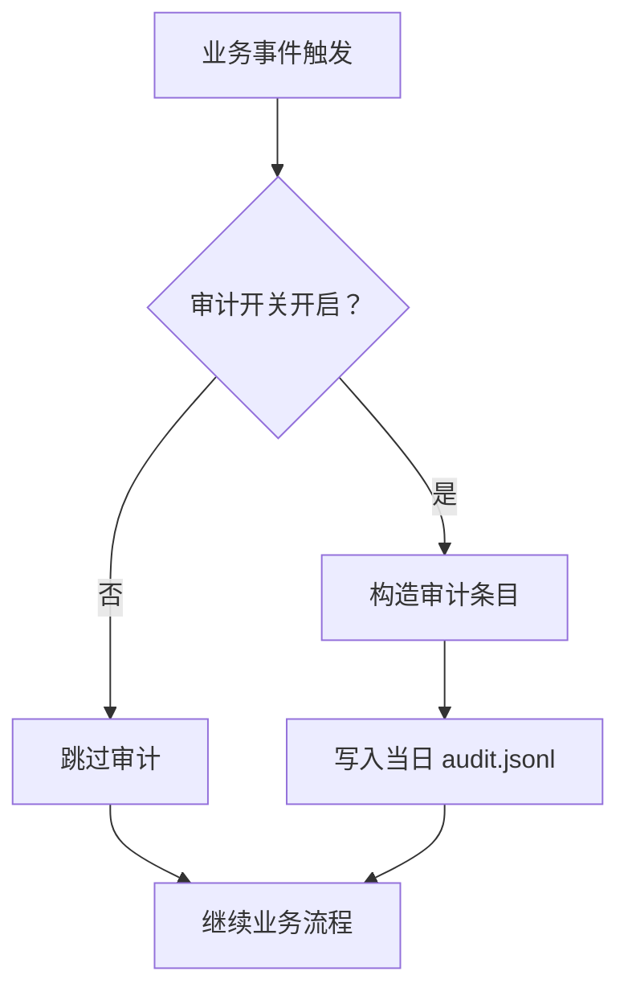
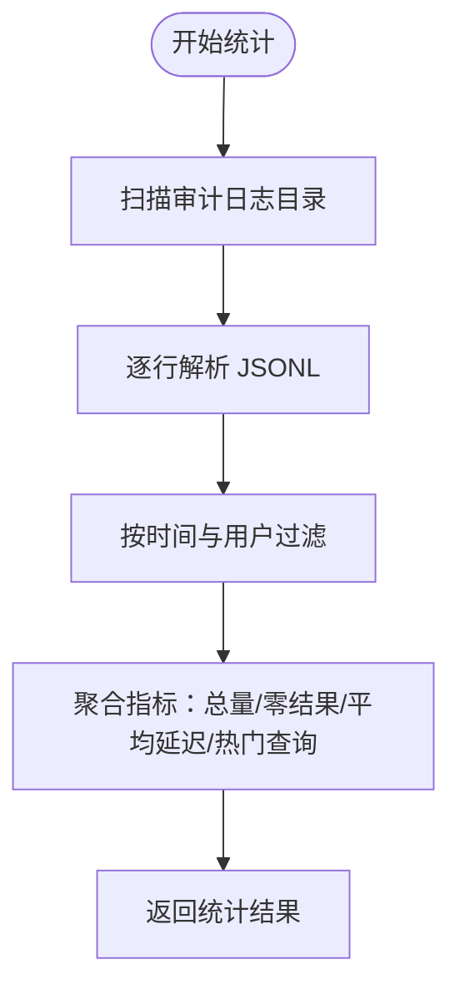
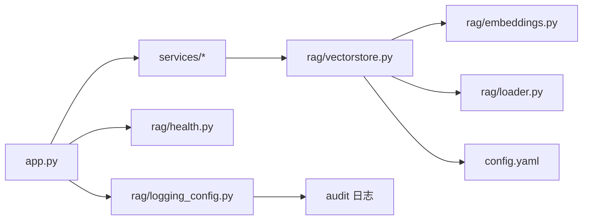

# 系统维护管理

<cite>
**本文引用的文件**
- [README.md](file://README.md)
- [config.yaml](file://config.yaml)
- [Dockerfile](file://Dockerfile)
- [docker-compose.yml](file://docker-compose.yml)
- [app.py](file://app.py)
- [scripts/clear_db.py](file://scripts/clear_db.py)
- [scripts/ingest.py](file://scripts/ingest.py)
- [rag/vectorstore.py](file://rag/vectorstore.py)
- [rag/health.py](file://rag/health.py)
- [rag/logging_config.py](file://rag/logging_config.py)
- [rag/embeddings.py](file://rag/embeddings.py)
- [rag/loader.py](file://rag/loader.py)
- [rag/preload.py](file://rag/preload.py)
- [services/analytics.py](file://services/analytics.py)
- [services/history.py](file://services/history.py)
</cite>

## 目录
1. [简介](#简介)
2. [项目结构](#项目结构)
3. [核心组件](#核心组件)
4. [架构总览](#架构总览)
5. [详细组件分析](#详细组件分析)
6. [依赖关系分析](#依赖关系分析)
7. [性能考量](#性能考量)
8. [故障排查指南](#故障排查指南)
9. [结论](#结论)
10. [附录](#附录)

## 简介
本操作手册面向系统运维人员，提供知识管理系统的全生命周期维护指南，涵盖系统清理脚本使用、向量数据库维护、缓存清理策略、健康检查机制配置、系统监控指标、异常告警设置、日志管理与审计跟踪、性能分析工具使用、定期维护任务、备份与恢复流程以及系统升级步骤。目标是帮助运维团队以标准化流程保障系统稳定、可追溯、可扩展。

## 项目结构
系统采用“UI 层 + 业务服务层 + 检索增强生成（RAG）引擎”的分层架构，配合容器化部署与持久化卷，实现可维护、可迁移与可观测。

**图表来源**
- [app.py:1-189](file://app.py#L1-L189)
- [services/analytics.py:1-122](file://services/analytics.py#L1-L122)
- [rag/vectorstore.py:1-209](file://rag/vectorstore.py#L1-L209)
- [rag/embeddings.py:1-48](file://rag/embeddings.py#L1-L48)
- [rag/loader.py:1-259](file://rag/loader.py#L1-L259)
- [rag/health.py:1-81](file://rag/health.py#L1-L81)
- [rag/preload.py:1-73](file://rag/preload.py#L1-L73)
- [rag/logging_config.py:1-129](file://rag/logging_config.py#L1-L129)
- [Dockerfile:1-68](file://Dockerfile#L1-L68)
- [docker-compose.yml:1-60](file://docker-compose.yml#L1-L60)
- [config.yaml:1-48](file://config.yaml#L1-L48)

**章节来源**
- [README.md:1-3](file://README.md#L1-L3)
- [Dockerfile:1-68](file://Dockerfile#L1-L68)
- [docker-compose.yml:1-60](file://docker-compose.yml#L1-L60)
- [config.yaml:1-48](file://config.yaml#L1-L48)

## 核心组件
- 应用入口与界面：Streamlit 应用负责登录、侧边栏、聊天面板与仪表盘展示，并初始化日志与预加载。
- 检索引擎：文档加载与分块、中文嵌入、向量库持久化与查询、健康检查。
- 业务服务：聊天历史持久化、会话管理、数据分析与导出。
- 基础设施：容器化部署、持久化卷、健康检查探针、配置文件。

**章节来源**
- [app.py:1-189](file://app.py#L1-L189)
- [rag/vectorstore.py:1-209](file://rag/vectorstore.py#L1-L209)
- [rag/loader.py:1-259](file://rag/loader.py#L1-L259)
- [rag/embeddings.py:1-48](file://rag/embeddings.py#L1-L48)
- [services/history.py:1-270](file://services/history.py#L1-L270)
- [services/analytics.py:1-122](file://services/analytics.py#L1-L122)
- [rag/health.py:1-81](file://rag/health.py#L1-L81)
- [rag/logging_config.py:1-129](file://rag/logging_config.py#L1-L129)

## 架构总览
系统通过 Docker 多阶段构建与 compose 编排，将应用、向量库、聊天历史与日志持久化至宿主机卷；Streamlit 作为前端入口，RAG 引擎提供检索增强问答能力；健康检查探针与审计日志支撑可观测性与合规。

**图表来源**
- [app.py:1-189](file://app.py#L1-L189)
- [rag/preload.py:1-73](file://rag/preload.py#L1-L73)
- [rag/vectorstore.py:1-209](file://rag/vectorstore.py#L1-L209)
- [rag/embeddings.py:1-48](file://rag/embeddings.py#L1-L48)
- [rag/loader.py:1-259](file://rag/loader.py#L1-L259)
- [services/history.py:1-270](file://services/history.py#L1-L270)
- [services/analytics.py:1-122](file://services/analytics.py#L1-L122)
- [rag/health.py:1-81](file://rag/health.py#L1-L81)
- [rag/logging_config.py:1-129](file://rag/logging_config.py#L1-L129)
- [Dockerfile:1-68](file://Dockerfile#L1-L68)
- [docker-compose.yml:1-60](file://docker-compose.yml#L1-L60)

## 详细组件分析

### 向量数据库维护（ChromaDB）
- 初始化与延迟加载：向量库客户端按需创建，集合按配置名称获取或创建，避免重复初始化。
- 文档入库：支持增量更新（同 ID 覆盖），入库前先删除同 ID 的旧块，确保一致性。
- 查询与过滤：支持元数据 where 过滤与 top_k 结果返回，便于按来源或主题筛选。
- 统计与清空：提供文档计数、来源文件数统计与清空集合的能力。
- 单例缓存：向量库实例与嵌入模型按配置键进行全局缓存，避免重复加载。

**图表来源**
- [rag/vectorstore.py:24-209](file://rag/vectorstore.py#L24-L209)
- [rag/embeddings.py:19-48](file://rag/embeddings.py#L19-L48)
- [rag/loader.py:22-27](file://rag/loader.py#L22-L27)

**章节来源**
- [rag/vectorstore.py:1-209](file://rag/vectorstore.py#L1-L209)
- [rag/embeddings.py:1-48](file://rag/embeddings.py#L1-L48)
- [rag/loader.py:1-259](file://rag/loader.py#L1-L259)

### 系统清理脚本（清空向量库）
- 功能：交互式清空 ChromaDB 当前集合中的全部文档块，防止误操作提供二次确认。
- 流程：加载配置 → 获取文档计数 → 用户确认 → 执行清空 → 记录日志。

**图表来源**
- [scripts/clear_db.py:17-38](file://scripts/clear_db.py#L17-L38)
- [rag/vectorstore.py:171-179](file://rag/vectorstore.py#L171-L179)
- [rag/logging_config.py:78-83](file://rag/logging_config.py#L78-L83)

**章节来源**
- [scripts/clear_db.py:1-38](file://scripts/clear_db.py#L1-L38)
- [rag/vectorstore.py:171-179](file://rag/vectorstore.py#L171-L179)
- [rag/logging_config.py:78-83](file://rag/logging_config.py#L78-L83)

### 文档入库脚本（增量更新）
- 功能：扫描知识目录，分块并入库，支持增量覆盖，统计来源文件。
- 流程：设置镜像环境变量 → 加载配置 → 扫描文档 → 分块 → 向量化 → 存储 → 统计入库结果。

**图表来源**
- [scripts/ingest.py:25-62](file://scripts/ingest.py#L25-L62)
- [rag/loader.py:131-197](file://rag/loader.py#L131-L197)
- [rag/vectorstore.py:89-112](file://rag/vectorstore.py#L89-L112)
- [rag/logging_config.py:78-83](file://rag/logging_config.py#L78-L83)

**章节来源**
- [scripts/ingest.py:1-62](file://scripts/ingest.py#L1-L62)
- [rag/loader.py:1-259](file://rag/loader.py#L1-L259)
- [rag/vectorstore.py:1-209](file://rag/vectorstore.py#L1-L209)
- [rag/logging_config.py:1-129](file://rag/logging_config.py#L1-L129)

### 健康检查机制
- 组件检查：LLM 连通性（模型列表）、向量库状态（文档计数）、嵌入模型可用性。
- 综合状态：聚合各组件状态，输出整体健康与版本信息。
- UI 展示：仪表盘展示向量库统计，异常时给出提示。

**图表来源**
- [rag/health.py:57-81](file://rag/health.py#L57-L81)
- [rag/health.py:15-41](file://rag/health.py#L15-L41)
- [rag/vectorstore.py:144-147](file://rag/vectorstore.py#L144-L147)
- [rag/embeddings.py:31-39](file://rag/embeddings.py#L31-L39)

**章节来源**
- [rag/health.py:1-81](file://rag/health.py#L1-L81)
- [app.py:162-173](file://app.py#L162-L173)

### 日志管理与审计跟踪
- 结构化日志：控制台彩色输出 + 文件完整日志，统一格式。
- 审计日志：按天切割 JSONL 文件，记录用户行为、查询、答案摘要、结果数与耗时。
- 开关控制：通过配置项启用/禁用审计日志。

**图表来源**
- [rag/logging_config.py:86-129](file://rag/logging_config.py#L86-L129)
- [config.yaml:38-40](file://config.yaml#L38-L40)

**章节来源**
- [rag/logging_config.py:1-129](file://rag/logging_config.py#L1-L129)
- [config.yaml:1-48](file://config.yaml#L1-L48)

### 性能分析与监控
- 数据采集：仪表盘从审计日志统计查询量、热门查询、零结果率、平均延迟等。
- 可视化：每日趋势、Top 查询、指标卡片。
- 建议：结合容器资源限制与并发参数优化吞吐与延迟。

**图表来源**
- [services/analytics.py:17-122](file://services/analytics.py#L17-L122)

**章节来源**
- [services/analytics.py:1-122](file://services/analytics.py#L1-L122)

### 缓存清理策略
- 向量库缓存：向量库实例与嵌入模型按配置键全局缓存，避免重复加载；清空向量库或重启应用可释放内存。
- 预加载缓存：RAGChain 预加载完成后常驻内存，可通过重置状态触发重新加载。
- 日志与审计：定期清理旧日志文件，避免磁盘膨胀。

**章节来源**
- [rag/vectorstore.py:181-209](file://rag/vectorstore.py#L181-L209)
- [rag/preload.py:66-73](file://rag/preload.py#L66-L73)
- [rag/logging_config.py:12-25](file://rag/logging_config.py#L12-L25)

## 依赖关系分析
- 组件耦合：应用层依赖业务服务与 RAG 引擎；RAG 引擎内部由加载器、嵌入函数与向量库组成；健康检查与日志贯穿各层。
- 外部依赖：OpenAI SDK（LLM）、sentence-transformers（嵌入）、ChromaDB（向量库）、Streamlit（UI）、PyMuPDF（PDF 解析）。
- 持久化：知识文档、向量库、聊天历史、日志分别挂载至独立卷，降低耦合并提升可维护性。

**图表来源**
- [app.py:1-189](file://app.py#L1-L189)
- [services/analytics.py:1-122](file://services/analytics.py#L1-L122)
- [rag/vectorstore.py:1-209](file://rag/vectorstore.py#L1-L209)
- [rag/embeddings.py:1-48](file://rag/embeddings.py#L1-L48)
- [rag/loader.py:1-259](file://rag/loader.py#L1-L259)
- [rag/health.py:1-81](file://rag/health.py#L1-L81)
- [rag/logging_config.py:1-129](file://rag/logging_config.py#L1-L129)
- [config.yaml:1-48](file://config.yaml#L1-L48)

**章节来源**
- [app.py:1-189](file://app.py#L1-L189)
- [rag/vectorstore.py:1-209](file://rag/vectorstore.py#L1-L209)
- [rag/loader.py:1-259](file://rag/loader.py#L1-L259)
- [rag/embeddings.py:1-48](file://rag/embeddings.py#L1-L48)
- [rag/health.py:1-81](file://rag/health.py#L1-L81)
- [rag/logging_config.py:1-129](file://rag/logging_config.py#L1-L129)
- [config.yaml:1-48](file://config.yaml#L1-L48)

## 性能考量
- 嵌入模型加载：首次加载约 400MB，建议在部署前预热或使用本地模型路径减少网络开销。
- 向量库写入：批量入库时注意磁盘 IO 与内存占用，合理设置分块大小与重叠长度。
- 查询性能：top_k 与元数据过滤会影响检索速度，建议在 UI 层控制默认参数。
- 预加载：后台线程加载 RAGChain，避免首次请求抖动；若模型或配置变更，需重置预加载状态。

[本节为通用性能建议，不直接分析具体文件]

## 故障排查指南
- 健康检查异常
  - LLM 连通性失败：检查 API Base 与 API Key，确认网络可达。
  - 向量库不可用：检查集合是否存在、磁盘空间与权限。
  - 嵌入模型加载失败：检查模型名称或本地路径，确认镜像环境变量设置。
- 日志定位
  - 查看系统日志与审计日志，定位用户行为与错误上下文。
- 清理与恢复
  - 清空向量库：使用清理脚本进行二次确认后执行。
  - 重新入库：更新知识文档后，运行入库脚本完成增量更新。
- 容器健康
  - 健康检查探针通过 Streamlit 内部端点检测，异常时重启容器或检查端口映射。

**章节来源**
- [rag/health.py:15-81](file://rag/health.py#L15-L81)
- [rag/logging_config.py:1-129](file://rag/logging_config.py#L1-L129)
- [scripts/clear_db.py:1-38](file://scripts/clear_db.py#L1-L38)
- [scripts/ingest.py:1-62](file://scripts/ingest.py#L1-L62)
- [Dockerfile:57-60](file://Dockerfile#L57-L60)

## 结论
本手册提供了从日常维护到系统升级的全流程指导。通过规范化的清理、入库、健康检查与日志审计流程，结合容器化与持久化卷，可显著提升系统的稳定性与可维护性。建议将定期维护任务纳入运维 SOP，并持续关注监控指标与告警阈值，确保系统长期可靠运行。

[本节为总结性内容，不直接分析具体文件]

## 附录

### A. 常用维护任务清单
- 定期清理向量库：在低峰期执行清理脚本，确认文档数量清零。
- 增量更新知识库：新增文档后运行入库脚本，核对入库数量与集合统计。
- 健康巡检：通过健康检查端点与仪表盘确认 LLM、向量库与嵌入模型状态。
- 日志与审计：检查系统日志与审计日志，清理过期文件，保留至少 30 天审计数据。
- 性能评估：基于仪表盘指标评估延迟与命中率，调整 top_k 与过滤条件。

**章节来源**
- [scripts/clear_db.py:1-38](file://scripts/clear_db.py#L1-L38)
- [scripts/ingest.py:1-62](file://scripts/ingest.py#L1-L62)
- [rag/health.py:57-81](file://rag/health.py#L57-L81)
- [services/analytics.py:17-122](file://services/analytics.py#L17-L122)
- [rag/logging_config.py:12-25](file://rag/logging_config.py#L12-L25)

### B. 备份与恢复流程
- 备份
  - 备份卷：知识文档、向量库、聊天历史、日志目录。
  - 备份配置：config.yaml。
- 恢复
  - 恢复卷与配置文件至相同路径。
  - 重新启动容器，确认健康检查通过。
  - 如需重建向量库，运行入库脚本完成索引重建。

**章节来源**
- [docker-compose.yml:20-30](file://docker-compose.yml#L20-L30)
- [config.yaml:1-48](file://config.yaml#L1-L48)

### C. 系统升级步骤
- 版本发布
  - 更新依赖与镜像，重新构建镜像。
- 升级演练
  - 在测试环境验证健康检查与功能。
- 生产升级
  - 停止旧容器，拉取新镜像，启动新容器。
  - 核对日志与健康状态，确认服务可用。
- 回滚策略
  - 若异常，回滚至上一镜像版本并恢复备份。

**章节来源**
- [Dockerfile:1-68](file://Dockerfile#L1-L68)
- [docker-compose.yml:1-60](file://docker-compose.yml#L1-L60)
- [rag/health.py:57-81](file://rag/health.py#L57-L81)