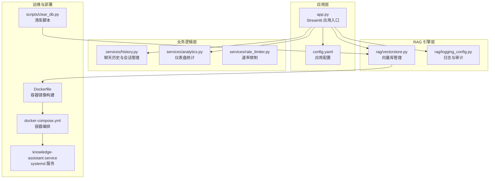
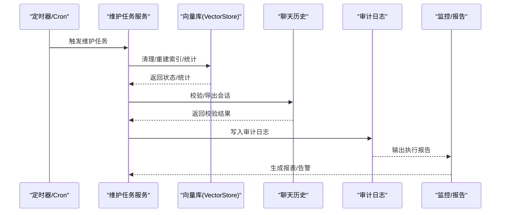
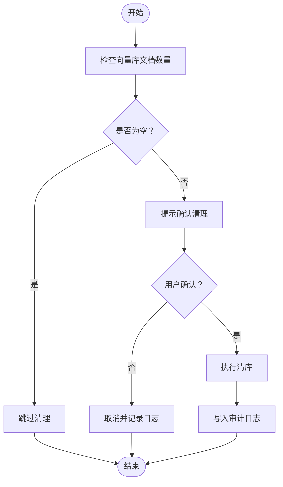
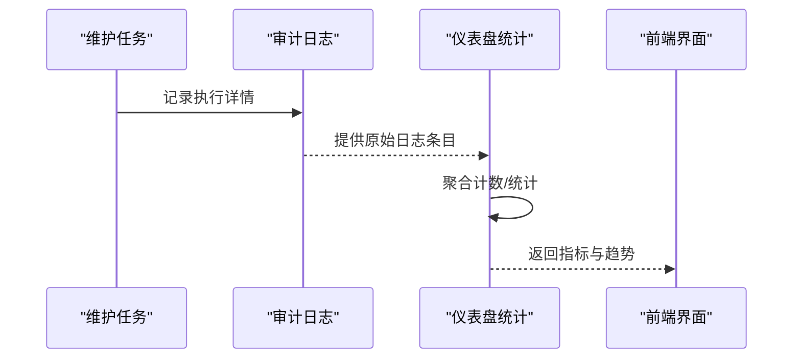
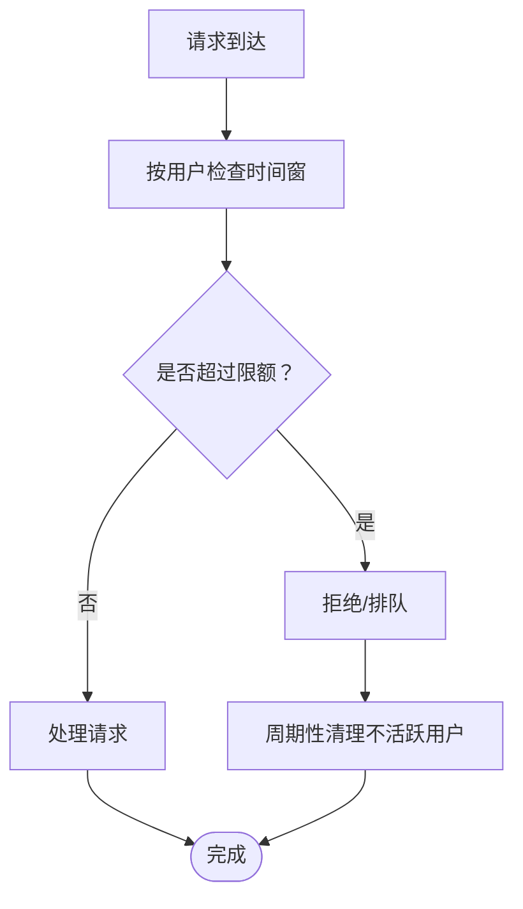
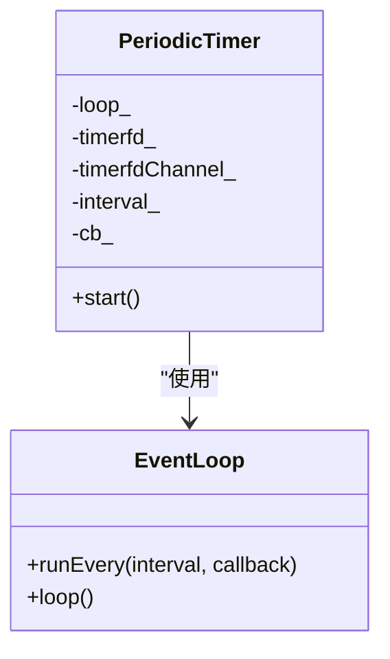
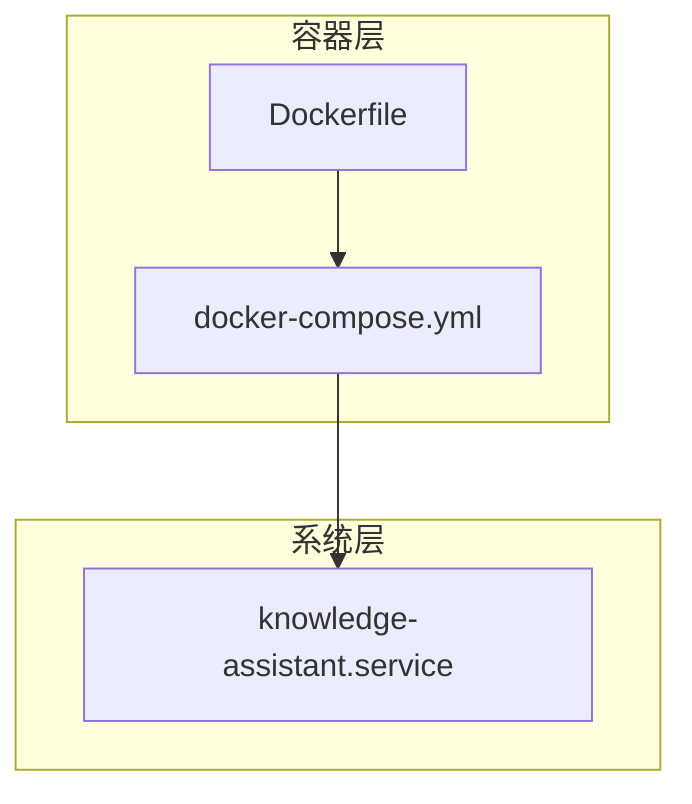
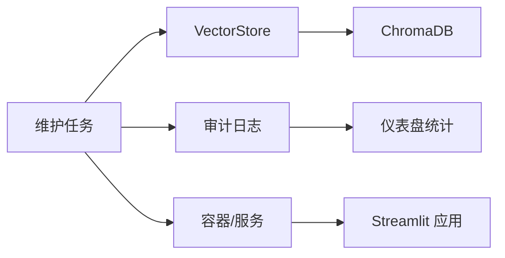

# 维护任务调度

<cite>
**本文引用的文件**
- [app.py](file://app.py)
- [config.yaml](file://config.yaml)
- [vectorstore.py](file://rag/vectorstore.py)
- [clear_db.py](file://scripts/clear_db.py)
- [analytics.py](file://services/analytics.py)
- [logging_config.py](file://rag/logging_config.py)
- [history.py](file://services/history.py)
- [knowledge-assistant.service](file://scripts/installer/linux/knowledge-assistant.service)
- [Dockerfile](file://Dockerfile)
- [docker-compose.yml](file://docker-compose.yml)
- [class_periodic_timer.md](file://knowledge/class_periodic_timer.md)
- [_channel__test_8cc.md](file://knowledge/_channel__test_8cc.md)
- [classmuduo_1_1net_1_1_timer.md](file://knowledge/classmuduo_1_1net_1_1_timer.md)
- [rate_limiter.py](file://services/rate_limiter.py)
</cite>

## 目录
1. [简介](#简介)
2. [项目结构](#项目结构)
3. [核心组件](#核心组件)
4. [架构总览](#架构总览)
5. [详细组件分析](#详细组件分析)
6. [依赖分析](#依赖分析)
7. [性能考虑](#性能考虑)
8. [故障排查指南](#故障排查指南)
9. [结论](#结论)
10. [附录](#附录)

## 简介
本指南面向运维与开发团队，围绕“维护任务调度”主题，提供一套可落地的自动化运维方案。内容涵盖定期维护任务的计划制定、任务优先级与执行时间安排、数据库清理、缓存刷新、索引重建等维护任务的自动化配置；同时给出任务执行监控、失败重试机制、执行报告生成；以及维护窗口管理、资源占用控制、对业务影响最小化的策略，并说明如何配置任务调度器、设置依赖关系、处理并发冲突。

## 项目结构
该项目采用“UI/业务逻辑/RAG检索引擎”的分层组织方式，维护任务主要涉及以下方面：
- 应用入口与配置：Streamlit 应用入口负责启动与会话状态管理，配置文件集中管理 LLM、嵌入模型、向量库、速率限制、审计日志等参数。
- 数据与持久化：向量库（ChromaDB）持久化在磁盘，聊天记录与审计日志分别存储在独立目录，便于维护任务的批量操作与清理。
- 运维与部署：Dockerfile 与 docker-compose.yml 提供容器化部署与健康检查；Linux systemd 服务文件提供系统级守护与重启策略。

**图表来源**
- [app.py](file://app.py)
- [config.yaml](file://config.yaml)
- [vectorstore.py](file://rag/vectorstore.py)
- [logging_config.py](file://rag/logging_config.py)
- [history.py](file://services/history.py)
- [analytics.py](file://services/analytics.py)
- [rate_limiter.py](file://services/rate_limiter.py)
- [Dockerfile](file://Dockerfile)
- [docker-compose.yml](file://docker-compose.yml)
- [knowledge-assistant.service](file://scripts/installer/linux/knowledge-assistant.service)
- [clear_db.py](file://scripts/clear_db.py)

**章节来源**
- [app.py](file://app.py)
- [config.yaml](file://config.yaml)
- [vectorstore.py](file://rag/vectorstore.py)
- [logging_config.py](file://rag/logging_config.py)
- [history.py](file://services/history.py)
- [analytics.py](file://services/analytics.py)
- [rate_limiter.py](file://services/rate_limiter.py)
- [Dockerfile](file://Dockerfile)
- [docker-compose.yml](file://docker-compose.yml)
- [knowledge-assistant.service](file://scripts/installer/linux/knowledge-assistant.service)
- [clear_db.py](file://scripts/clear_db.py)

## 核心组件
- 向量库管理器（VectorStore）：封装 ChromaDB 的客户端、集合、增删改查与统计信息，提供清库能力，是数据库清理与索引重建的关键入口。
- 日志与审计（logging_config）：统一日志输出、审计日志写入，为维护任务执行监控与报告生成提供数据基础。
- 仪表盘统计（analytics）：从审计日志聚合统计指标，用于评估维护任务对业务的影响。
- 聊天历史（history）：会话与消息持久化，便于维护任务执行后的数据一致性校验与导出。
- 速率限制（rate_limiter）：内存级速率限制与周期性清理，有助于在维护窗口内控制资源占用。
- 容器与服务（Dockerfile/docker-compose/systemd）：提供稳定的运行环境与健康检查，保障维护任务在受控环境中执行。

**章节来源**
- [vectorstore.py](file://rag/vectorstore.py)
- [logging_config.py](file://rag/logging_config.py)
- [analytics.py](file://services/analytics.py)
- [history.py](file://services/history.py)
- [rate_limiter.py](file://services/rate_limiter.py)
- [Dockerfile](file://Dockerfile)
- [docker-compose.yml](file://docker-compose.yml)
- [knowledge-assistant.service](file://scripts/installer/linux/knowledge-assistant.service)

## 架构总览
下图展示维护任务调度在系统中的位置与交互关系，强调“定时触发—任务执行—监控与报告—健康检查”的闭环。

[本图为概念流程图，不直接映射具体源码文件，故无“图表来源”标注]

## 详细组件分析

### 向量库维护（数据库清理、索引重建）
- 数据库清理：提供清库脚本，支持交互式确认与日志记录，适合在维护窗口内执行。
- 索引重建：通过切换集合、重新入库实现增量更新与索引重建，避免全量重建带来的长时间锁表。
- 统计与监控：提供统计接口，便于维护前后对比与报告生成。

**图表来源**
- [clear_db.py](file://scripts/clear_db.py)
- [vectorstore.py](file://rag/vectorstore.py)
- [logging_config.py](file://rag/logging_config.py)

**章节来源**
- [clear_db.py](file://scripts/clear_db.py)
- [vectorstore.py](file://rag/vectorstore.py)
- [logging_config.py](file://rag/logging_config.py)

### 审计日志与执行监控
- 审计日志：统一格式记录维护任务的执行结果、耗时、影响范围等，便于后续统计与溯源。
- 仪表盘统计：基于审计日志聚合查询量、平均响应时间、零结果查询等指标，评估维护任务对业务的影响。

**图表来源**
- [logging_config.py](file://rag/logging_config.py)
- [analytics.py](file://services/analytics.py)
- [app.py](file://app.py)

**章节来源**
- [logging_config.py](file://rag/logging_config.py)
- [analytics.py](file://services/analytics.py)
- [app.py](file://app.py)

### 速率限制与资源占用控制
- 内存速率限制：按用户维度限制每分钟请求数，定期清理不活跃用户，防止内存泄漏。
- 维护窗口内的资源控制：结合速率限制与维护任务的执行时间窗口，避免高峰时段的叠加压力。

**图表来源**
- [rate_limiter.py](file://services/rate_limiter.py)

**章节来源**
- [rate_limiter.py](file://services/rate_limiter.py)

### 定时调度与事件循环
- 事件循环与周期定时器：项目中包含基于事件循环的周期定时器实现，可用于维护任务的定时触发与回调执行。
- systemd 与容器健康检查：通过 systemd 服务与容器健康检查，确保维护任务在受控环境下稳定运行。

**图表来源**
- [class_periodic_timer.md](file://knowledge/class_periodic_timer.md)
- [_channel__test_8cc.md](file://knowledge/_channel__test_8cc.md)
- [classmuduo_1_1net_1_1_timer.md](file://knowledge/classmuduo_1_1net_1_1_timer.md)

**章节来源**
- [class_periodic_timer.md](file://knowledge/class_periodic_timer.md)
- [_channel__test_8cc.md](file://knowledge/_channel__test_8cc.md)
- [classmuduo_1_1net_1_1_timer.md](file://knowledge/classmuduo_1_1net_1_1_timer.md)

### 部署与运行环境
- Dockerfile：多阶段构建，设置非 root 用户、健康检查、暴露端口，保证运行时安全与稳定性。
- docker-compose：挂载知识库、向量库、聊天历史、日志等目录，便于维护任务对数据进行批量操作。
- systemd 服务：以服务形式托管应用，具备自动重启与资源限制，适合作为维护任务的运行载体。

**图表来源**
- [docker-compose.yml](file://docker-compose.yml)
- [Dockerfile](file://Dockerfile)
- [knowledge-assistant.service](file://scripts/installer/linux/knowledge-assistant.service)

**章节来源**
- [docker-compose.yml](file://docker-compose.yml)
- [Dockerfile](file://Dockerfile)
- [knowledge-assistant.service](file://scripts/installer/linux/knowledge-assistant.service)

## 依赖分析
- 组件耦合关系
  - 维护任务与向量库：清库与索引重建直接依赖 VectorStore 的接口。
  - 维护任务与审计日志：所有维护任务均需写入审计日志，形成强依赖。
  - 维护任务与监控：仪表盘统计依赖审计日志，形成弱依赖。
  - 运维工具链：清库脚本依赖 VectorStore；systemd 与容器健康检查保障运行稳定性。
- 外部依赖
  - ChromaDB：作为向量库后端，直接影响维护任务的执行成本与停机时间。
  - Streamlit：应用入口，承载会话状态与前端展示，维护任务需避免对其造成显著影响。

[本图为概念依赖图，不直接映射具体源码文件，故无“图表来源”标注]

**章节来源**
- [vectorstore.py](file://rag/vectorstore.py)
- [logging_config.py](file://rag/logging_config.py)
- [analytics.py](file://services/analytics.py)
- [Dockerfile](file://Dockerfile)
- [docker-compose.yml](file://docker-compose.yml)
- [knowledge-assistant.service](file://scripts/installer/linux/knowledge-assistant.service)

## 性能考虑
- 清库与索引重建
  - 优先选择在低峰时段执行，避免与业务高峰期重叠。
  - 对于大规模数据，建议分批处理或使用增量更新策略，减少锁表时间。
- 审计日志与统计
  - 审计日志写入采用追加模式，注意磁盘空间与滚动策略。
  - 统计聚合在服务端进行，建议限制统计窗口大小，避免内存膨胀。
- 速率限制
  - 合理设置每分钟请求数与清理间隔，防止内存泄漏与突发流量冲击。
- 容器与服务
  - 使用健康检查与自动重启，确保维护任务执行环境的稳定性。
  - 非 root 用户运行，降低权限风险。

[本节为通用性能指导，不直接分析具体文件，故无“章节来源”标注]

## 故障排查指南
- 清库失败
  - 检查向量库连接与权限，确认目标集合存在且可访问。
  - 查看审计日志与系统日志，定位异常原因。
- 统计异常
  - 确认审计日志目录存在且可写，核对日期文件命名规则。
  - 检查统计函数的输入参数与过滤条件。
- 速率限制问题
  - 检查清理间隔与用户不活跃超时设置，确认内存中用户记录未无限增长。
- 容器与服务
  - 查看 systemd 服务状态与日志，确认健康检查通过。
  - 检查 docker-compose 挂载目录权限与磁盘空间。

**章节来源**
- [clear_db.py](file://scripts/clear_db.py)
- [analytics.py](file://services/analytics.py)
- [rate_limiter.py](file://services/rate_limiter.py)
- [knowledge-assistant.service](file://scripts/installer/linux/knowledge-assistant.service)
- [docker-compose.yml](file://docker-compose.yml)

## 结论
通过将维护任务与应用配置、日志审计、容器与服务治理相结合，可以构建一套稳定、可控、可观测的自动化运维体系。建议在低峰时段执行数据库清理与索引重建，配合审计日志与仪表盘统计进行效果验证，并利用速率限制与健康检查保障业务连续性。

[本节为总结性内容，不直接分析具体文件，故无“章节来源”标注]

## 附录

### 维护任务清单与优先级建议
- 高优先级
  - 数据库清理（清库脚本）
  - 索引重建（增量更新）
- 中优先级
  - 统计报告生成（每日）
  - 日志滚动与归档
- 低优先级
  - 历史会话导出
  - 系统资源健康检查

[本节为通用建议，不直接分析具体文件，故无“章节来源”标注]

### 维护窗口与资源占用控制
- 维护窗口：建议选择业务低峰时段（如凌晨），并预留缓冲时间。
- 资源占用：结合速率限制与事件循环定时器，控制并发与CPU/IO占用。
- 并发冲突：通过互斥锁或队列化执行，避免多个维护任务同时访问共享资源。

[本节为通用策略，不直接分析具体文件，故无“章节来源”标注]