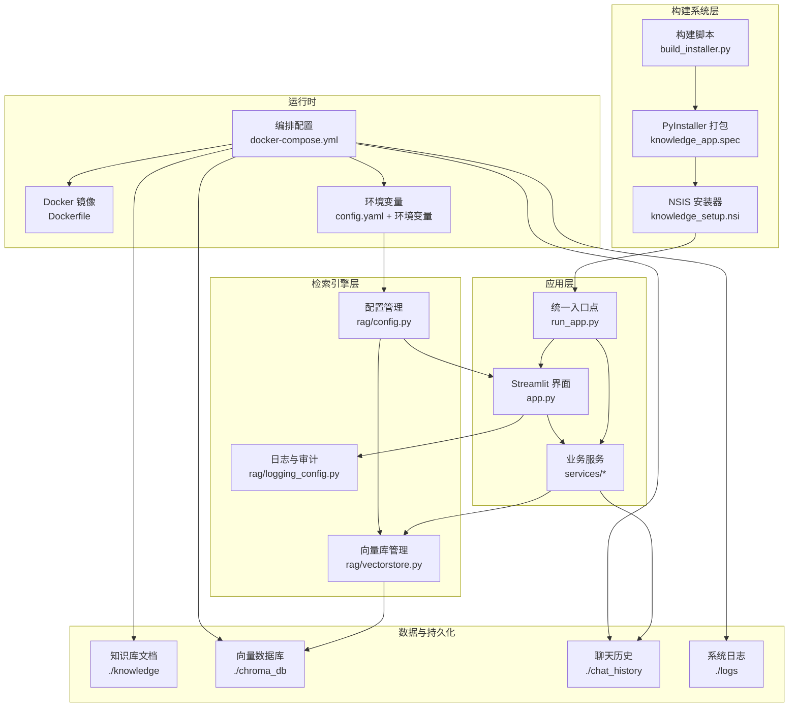
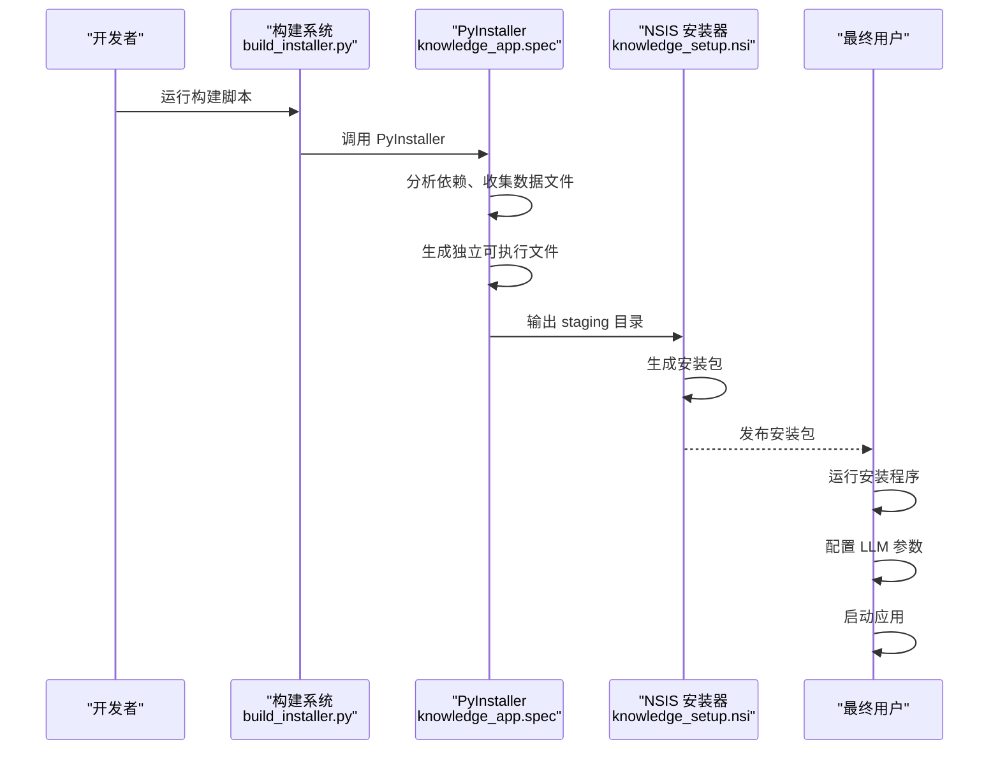
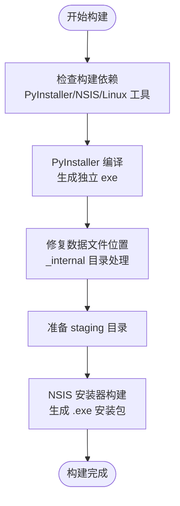
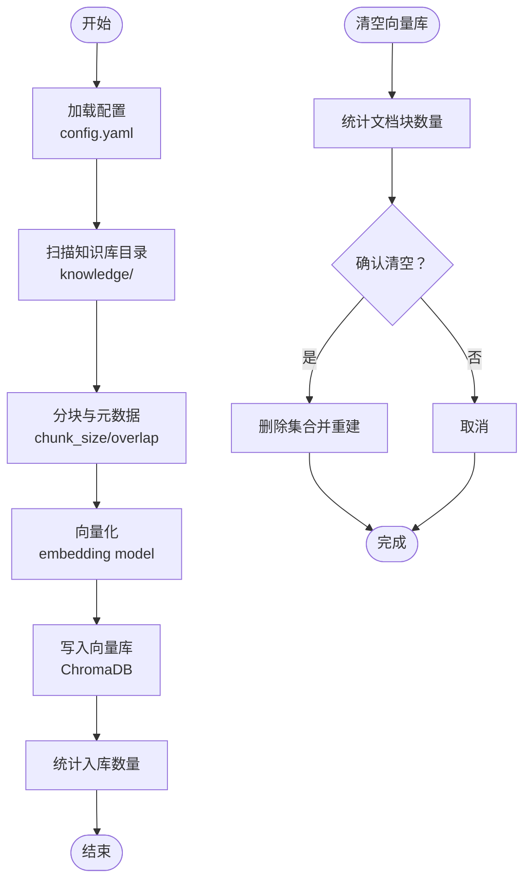
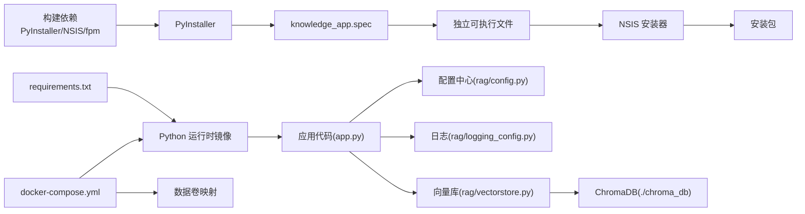

# 部署与运维

<cite>
**本文引用的文件**
- [README.md](file://README.md)
- [Dockerfile](file://Dockerfile)
- [docker-compose.yml](file://docker-compose.yml)
- [config.yaml](file://config.yaml)
- [requirements.txt](file://requirements.txt)
- [app.py](file://app.py)
- [run_app.py](file://run_app.py)
- [knowledge_app.spec](file://knowledge_app.spec)
- [scripts/build_installer.py](file://scripts/build_installer.py)
- [scripts/build_windows.py](file://scripts/build_windows.py)
- [scripts/build_linux.py](file://scripts/build_linux.py)
- [scripts/prepare_linux_staging.py](file://scripts/prepare_linux_staging.py)
- [scripts/prepare_offline.py](file://scripts/prepare_offline.py)
- [scripts/ingest.py](file://scripts/ingest.py)
- [scripts/clear_db.py](file://scripts/clear_db.py)
- [scripts/installer/linux/launch.sh](file://scripts/installer/linux/launch.sh)
- [scripts/installer/windows/launch.bat](file://scripts/installer/windows/launch.bat)
- [scripts/installer/windows/knowledge_setup.nsi](file://scripts/installer/windows/knowledge_setup.nsi)
- [scripts/installer/windows/write_config.py](file://scripts/installer/windows/write_config.py)
- [scripts/hooks/runtime_hook_chromadb.py](file://scripts/hooks/runtime_hook_chromadb.py)
- [rag/config.py](file://rag/config.py)
- [rag/logging_config.py](file://rag/logging_config.py)
- [rag/vectorstore.py](file://rag/vectorstore.py)
- [services/analytics.py](file://services/analytics.py)
- [services/rate_limiter.py](file://services/rate_limiter.py)
</cite>

## 更新摘要
**所做更改**
- 新增 PyInstaller + NSIS 现代化构建系统章节
- 更新安装器构建流程，从 wheel 打包迁移到 PyInstaller + NSIS
- 新增 run_app.py 统一入口点说明
- 更新 Windows 安装包构建和配置流程
- 新增 Linux 离线安装包构建说明
- 更新构建脚本和安装器相关文档

## 目录
1. [简介](#简介)
2. [项目结构](#项目结构)
3. [核心组件](#核心组件)
4. [架构总览](#架构总览)
5. [详细组件分析](#详细组件分析)
6. [依赖分析](#依赖分析)
7. [性能考虑](#性能考虑)
8. [故障排除指南](#故障排除指南)
9. [结论](#结论)
10. [附录](#附录)

## 简介
本指南面向运维工程师与平台管理员，提供知识库智能问答系统的全生命周期部署与运维操作手册。内容涵盖：
- Docker 容器化与多容器编排
- **PyInstaller + NSIS 现代化构建系统**
- **run_app.py 统一入口点**
- Linux/Windows 安装部署脚本
- 系统配置管理与环境变量覆盖
- 文档入库自动化与向量库维护
- 健康检查与系统清理
- 生产环境最佳实践、性能调优与监控告警
- 故障排除、备份恢复与版本升级流程

## 项目结构
该项目采用"Streamlit 应用 + RAG 检索引擎 + 向量数据库"的三层架构，配合配置中心、日志与审计、速率限制与分析仪表盘等模块，形成可独立运行、可容器化部署、可扩展的问答系统。

**更新** 新增 PyInstaller + NSIS 构建系统，run_app.py 作为统一入口点

**图表来源**
- [run_app.py:1-274](file://run_app.py#L1-L274)
- [knowledge_app.spec:1-217](file://knowledge_app.spec#L1-L217)
- [scripts/build_installer.py:1-129](file://scripts/build_installer.py#L1-L129)
- [scripts/installer/windows/knowledge_setup.nsi:1-138](file://scripts/installer/windows/knowledge_setup.nsi#L1-L138)

**章节来源**
- [README.md:1-3](file://README.md#L1-L3)
- [Dockerfile:1-68](file://Dockerfile#L1-L68)
- [docker-compose.yml:1-60](file://docker-compose.yml#L1-L60)
- [run_app.py:1-274](file://run_app.py#L1-L274)
- [knowledge_app.spec:1-217](file://knowledge_app.spec#L1-L217)

## 核心组件
- **统一入口点**：run_app.py 作为 PyInstaller 打包的统一入口点，处理冻结模式检测、路径修复、环境变量设置、模型检测与 Streamlit 启动。
- **PyInstaller 规格文件**：knowledge_app.spec 定义了完整的打包配置，包括数据文件、隐藏导入、二进制依赖和运行时钩子。
- **NSIS 安装器**：knowledge_setup.nsi 提供 Windows 平台的图形化安装体验，支持 LLM 配置向导和一键安装。
- 应用入口与界面：Streamlit 应用负责登录、侧边栏、聊天面板与仪表盘渲染，并在启动时初始化会话状态与预加载链路。
- 配置中心：基于 Pydantic 的配置模型，支持 YAML 加载与环境变量替换，提供全局单例访问。
- 日志与审计：统一日志输出与审计日志写入，支持按日期切分的 JSONL 文件。
- 向量库：基于 ChromaDB 的持久化向量存储，支持集合切换、增量入库、检索与统计。
- 业务服务：包含分析仪表盘与速率限制器，提供统计数据聚合与请求节流。
- 部署工具：Dockerfile 与 docker-compose.yml 提供容器化与编排；Linux/Windows 启动脚本提供本地安装运行方式。

**章节来源**
- [run_app.py:1-274](file://run_app.py#L1-L274)
- [knowledge_app.spec:1-217](file://knowledge_app.spec#L1-L217)
- [scripts/installer/windows/knowledge_setup.nsi:1-138](file://scripts/installer/windows/knowledge_setup.nsi#L1-L138)
- [app.py:1-184](file://app.py#L1-L184)
- [rag/config.py:1-184](file://rag/config.py#L1-L184)
- [rag/logging_config.py:1-129](file://rag/logging_config.py#L1-L129)
- [rag/vectorstore.py:1-209](file://rag/vectorstore.py#L1-L209)
- [services/analytics.py:1-122](file://services/analytics.py#L1-L122)
- [services/rate_limiter.py:1-71](file://services/rate_limiter.py#L1-L71)

## 架构总览
系统以 Streamlit 作为前端入口，通过服务层调用 RAG 检索引擎，检索引擎依赖配置中心与日志模块，最终与向量库进行交互。PyInstaller + NSIS 构建系统提供现代化的打包和安装解决方案，docker-compose 将应用容器与可选的本地推理服务进行网络隔离与资源编排。

**更新** 新增 PyInstaller + NSIS 构建系统架构

**图表来源**
- [scripts/build_installer.py:93-129](file://scripts/build_installer.py#L93-L129)
- [scripts/build_windows.py:37-174](file://scripts/build_windows.py#L37-L174)
- [scripts/installer/windows/knowledge_setup.nsi:1-138](file://scripts/installer/windows/knowledge_setup.nsi#L1-L138)

## 详细组件分析

### PyInstaller + NSIS 现代化构建系统

**更新** 新增 PyInstaller + NSIS 构建系统章节

- **构建流程**：从传统的 wheel 打包迁移到 PyInstaller + NSIS 现代化构建系统，提供更好的跨平台兼容性和用户体验。
- **统一入口点**：run_app.py 作为所有平台的统一入口点，处理冻结模式检测、路径修复、环境变量设置和 Streamlit 启动。
- **规格文件配置**：knowledge_app.spec 定义了完整的打包配置，包括数据文件、隐藏导入、二进制依赖和运行时钩子。
- **安装器支持**：NSIS 安装器提供 Windows 平台的图形化安装体验，支持 LLM 配置向导和一键安装。

**图表来源**
- [scripts/build_installer.py:61-91](file://scripts/build_installer.py#L61-L91)
- [scripts/build_windows.py:54-174](file://scripts/build_windows.py#L54-L174)
- [scripts/installer/windows/knowledge_setup.nsi:137-174](file://scripts/installer/windows/knowledge_setup.nsi#L137-L174)

**章节来源**
- [run_app.py:1-274](file://run_app.py#L1-L274)
- [knowledge_app.spec:1-217](file://knowledge_app.spec#L1-L217)
- [scripts/build_installer.py:1-129](file://scripts/build_installer.py#L1-L129)
- [scripts/build_windows.py:1-174](file://scripts/build_windows.py#L1-L174)
- [scripts/installer/windows/knowledge_setup.nsi:1-138](file://scripts/installer/windows/knowledge_setup.nsi#L1-L138)

### run_app.py 统一入口点

**更新** 新增 run_app.py 统一入口点说明

- **冻结模式检测**：自动检测 PyInstaller 打包模式，设置相应的路径和环境变量。
- **路径修复**：处理 _internal 目录的 DLL 搜索路径问题，确保所有依赖库正确加载。
- **环境变量设置**：统一设置 MODEL_ROOT、SENTENCE_TRANSFORMERS_HOME 等关键环境变量。
- **模型检测**：检测本地模型（embedding 和 reranker），避免首次启动时的网络下载。
- **目录管理**：确保运行时需要的目录（data/chroma_db、model 等）存在。
- **Streamlit 启动**：通过 stcli.main() 启动 Streamlit 服务，配置服务器参数。

**章节来源**
- [run_app.py:174-274](file://run_app.py#L174-L274)
- [run_app.py:64-136](file://run_app.py#L64-L136)
- [run_app.py:212-239](file://run_app.py#L212-L239)

### Windows 安装包构建与配置

**更新** 更新 Windows 安装包构建流程

- **PyInstaller 编译**：使用 knowledge_app.spec 编译应用为独立 exe 目录。
- **数据文件修复**：将 _internal 目录中的数据文件复制到正确位置。
- **模型复制**：可选复制本地模型到安装包中，支持快速调试模式。
- **NSIS 安装器**：生成 Windows 安装包，支持 LLM 配置向导。
- **配置写入**：通过 --write-config 参数写入 LLM 配置到 config.yaml。

**章节来源**
- [scripts/build_windows.py:37-174](file://scripts/build_windows.py#L37-L174)
- [scripts/installer/windows/knowledge_setup.nsi:46-104](file://scripts/installer/windows/knowledge_setup.nsi#L46-L104)
- [scripts/installer/windows/write_config.py:11-41](file://scripts/installer/windows/write_config.py#L11-L41)

### Linux 离线安装包构建

**更新** 新增 Linux 离线安装包构建说明

- **Python Standalone**：在 Linux 上解压 Python standalone 运行时。
- **离线依赖安装**：使用本地 wheels 目录离线安装 Python 依赖。
- **系统集成**：创建 systemd 服务、启动脚本和配置文件。
- **包格式支持**：同时支持 .deb 和 .rpm 包格式。
- **路径配置**：更新 config.yaml 中的系统路径，保持模型路径的运行时检测。

**章节来源**
- [scripts/build_linux.py:20-253](file://scripts/build_linux.py#L20-L253)
- [scripts/prepare_linux_staging.py:20-161](file://scripts/prepare_linux_staging.py#L20-L161)

### Docker 容器化与编排
- 多阶段构建：分离构建依赖与运行时镜像，减少镜像体积并提升安全性。
- 非 root 用户运行：降低容器权限风险。
- 健康检查：通过内部健康端点检测应用可用性。
- 端口暴露与环境变量注入：默认监听 8501，支持通过环境变量覆盖 LLM API 配置。
- 数据卷挂载：知识库文档、向量库、聊天历史与日志持久化至宿主机。
- 可选本地推理服务：注释中提供 vLLM 服务示例，便于本地推理加速。

**章节来源**
- [Dockerfile:1-68](file://Dockerfile#L1-68)
- [docker-compose.yml:1-60](file://docker-compose.yml#L1-60)

### 配置管理与环境变量覆盖
- YAML 配置：集中管理 LLM、嵌入模型、向量库、知识库、速率限制、UI 等参数。
- 环境变量替换：支持 ${ENV_VAR} 与 ${ENV_VAR:-默认值} 语法，优先级高于配置文件。
- 运行时热重载：提供强制重新加载配置的接口，便于动态调整。

**章节来源**
- [config.yaml:1-46](file://config.yaml#L1-46)
- [rag/config.py:16-44](file://rag/config.py#L16-44)
- [rag/config.py:118-131](file://rag/config.py#L118-131)
- [rag/config.py:146-150](file://rag/config.py#L146-150)

### 日志与审计
- 结构化日志：控制台彩色输出与文件落盘，便于开发调试与生产审计。
- 审计日志：按日期切分 JSONL 文件，记录用户行为、查询摘要、检索结果数与耗时。
- 开关控制：通过配置项启用/禁用审计日志。

**章节来源**
- [rag/logging_config.py:46-75](file://rag/logging_config.py#L46-75)
- [rag/logging_config.py:86-129](file://rag/logging_config.py#L86-129)
- [config.yaml:37-37](file://config.yaml#L37-37)

### 向量库与文档入库
- 向量库管理：封装 ChromaDB 客户端、集合创建与切换、文档增删改查、统计查询。
- 文档入库：扫描知识库目录，分块、向量化后写入向量库，支持增量覆盖。
- 清理维护：提供清空向量库的脚本，便于重新导入或问题排查。

**图表来源**
- [scripts/ingest.py:25-58](file://scripts/ingest.py#L25-58)
- [rag/vectorstore.py:89-112](file://rag/vectorstore.py#L89-112)
- [scripts/clear_db.py:17-34](file://scripts/clear_db.py#L17-34)

**章节来源**
- [scripts/ingest.py:1-62](file://scripts/ingest.py#L1-62)
- [rag/vectorstore.py:1-209](file://rag/vectorstore.py#L1-209)
- [scripts/clear_db.py:1-38](file://scripts/clear_db.py#L1-38)

### 速率限制与分析仪表盘
- 速率限制：基于内存的滑动窗口限流，按用户维度统计近一分钟内的请求次数，周期性清理不活跃用户。
- 分析仪表盘：从审计日志聚合查询总量、热门查询、零结果率、平均延迟等指标，默认仅统计当前用户，管理员可切换全局视图。

**章节来源**
- [services/rate_limiter.py:1-71](file://services/rate_limiter.py#L1-71)
- [services/analytics.py:1-122](file://services/analytics.py#L1-122)

### Linux/Windows 安装与启动
- Linux：前台启动脚本，设置国内镜像，使用内置 Python 执行 Streamlit 应用。
- Windows：批处理脚本，自动创建数据目录、复制初始知识库、执行 Streamlit 应用并暂停等待。

**章节来源**
- [scripts/installer/linux/launch.sh:1-24](file://scripts/installer/linux/launch.sh#L1-24)
- [scripts/installer/windows/launch.bat:1-46](file://scripts/installer/windows/launch.bat#L1-46)

## 依赖分析
- 运行时依赖：Streamlit、ChromaDB、OpenAI SDK、Sentence Transformers、Pydantic、Loguru 等。
- **构建依赖**：PyInstaller、NSIS、fpm（Linux）、Ruby（Linux）等。
- 依赖解析：requirements.txt 明确版本约束，Dockerfile 在构建阶段安装系统依赖并复制运行时包。
- 配置依赖：应用通过配置中心统一读取 LLM、嵌入模型、向量库与 UI 参数，避免硬编码。

**更新** 新增构建依赖说明

**图表来源**
- [requirements.txt:1-11](file://requirements.txt#L1-11)
- [Dockerfile:25-45](file://Dockerfile#L25-45)
- [app.py:15-17](file://app.py#L15-17)
- [docker-compose.yml:20-30](file://docker-compose.yml#L20-30)
- [knowledge_app.spec:14-170](file://knowledge_app.spec#L14-L170)

**章节来源**
- [requirements.txt:1-11](file://requirements.txt#L1-11)
- [Dockerfile:1-68](file://Dockerfile#L1-68)
- [docker-compose.yml:1-60](file://docker-compose.yml#L1-60)
- [scripts/build_installer.py:10-18](file://scripts/build_installer.py#L10-L18)

## 性能考虑
- 向量库性能
  - 合理设置分块大小与重叠，平衡召回与上下文长度。
  - 使用合适的嵌入模型与集合命名，避免频繁切换集合导致重复加载。
  - 定期清理无效或重复文档，保持集合规模可控。
- LLM 与推理
  - 通过环境变量覆盖 LLM API 基础地址与密钥，确保低延迟与高可用。
  - 如需本地推理，可参考 docker-compose 注释中的 vLLM 示例，结合 GPU 资源进行加速。
- **构建性能优化**
  - **PyInstaller 编译**：使用 --clean 和 --noconfirm 参数加速编译过程。
  - **模型缓存**：run_app.py 自动检测本地模型，避免首次启动时的网络下载。
  - **依赖优化**：knowledge_app.spec 中的 excludes 列表减小安装包体积。
- UI 与并发
  - Streamlit 默认开启跨域与 CSRF 保护关闭，生产环境建议根据网络拓扑调整。
  - 合理设置最大并发与令牌上限，避免长对话导致内存压力。
- 日志与审计
  - 审计日志按天切分，建议结合外部日志收集系统进行集中存储与分析。

**更新** 新增构建性能优化建议

**章节来源**
- [config.yaml:4-46](file://config.yaml#L4-46)
- [rag/config.py:48-116](file://rag/config.py#L48-116)
- [rag/vectorstore.py:181-209](file://rag/vectorstore.py#L181-209)
- [docker-compose.yml:34-55](file://docker-compose.yml#L34-55)
- [knowledge_app.spec:157-170](file://knowledge_app.spec#L157-170)
- [run_app.py:218-235](file://run_app.py#L218-235)

## 故障排除指南
- 应用无法启动
  - 检查容器健康检查端点与端口映射是否正确。
  - 查看容器日志，确认配置文件是否存在且可读。
- **构建系统问题**
  - **PyInstaller 失败**：检查 knowledge_app.spec 中的数据文件路径和隐藏导入配置。
  - **NSIS 安装失败**：确认 makensis 在 PATH 中，检查 staging 目录结构。
  - **DLL 加载失败**：验证 run_app.py 中的 _patch_dll_search_path 函数是否正确执行。
  - **ChromaDB 动态导入问题**：检查 runtime_hook_chromadb.py 是否正确拦截 pkgutil.iter_modules。
- 向量库异常
  - 使用清空脚本清理集合后重新入库，确认文档目录与权限。
  - 检查嵌入模型下载与本地路径配置。
- 审计日志缺失
  - 确认审计开关已启用，检查日志目录权限与磁盘空间。
- 速率限制误伤
  - 检查用户维度的请求频率，适当提高阈值或延长清理周期。
- 本地安装问题
  - Linux：确认内置 Python 路径与端口占用。
  - Windows：确认数据目录创建与初始知识库复制成功。

**更新** 新增构建系统故障排除指南

**章节来源**
- [Dockerfile:57-67](file://Dockerfile#L57-67)
- [scripts/clear_db.py:17-34](file://scripts/clear_db.py#L17-34)
- [scripts/ingest.py:35-57](file://scripts/ingest.py#L35-57)
- [rag/logging_config.py:106-129](file://rag/logging_config.py#L106-129)
- [services/rate_limiter.py:19-43](file://services/rate_limiter.py#L19-43)
- [scripts/installer/linux/launch.sh:17-25](file://scripts/installer/linux/launch.sh#L17-25)
- [scripts/installer/windows/launch.bat:10-24](file://scripts/installer/windows/launch.bat#L10-24)
- [scripts/build_windows.py:62-76](file://scripts/build_windows.py#L62-76)
- [scripts/installer/windows/knowledge_setup.nsi:141-148](file://scripts/installer/windows/knowledge_setup.nsi#L141-148)
- [run_app.py:98-123](file://run_app.py#L98-123)
- [scripts/hooks/runtime_hook_chromadb.py:37-47](file://scripts/hooks/runtime_hook_chromadb.py#L37-47)

## 结论
本指南提供了从容器化部署到日常运维的完整方案。通过 **PyInstaller + NSIS 现代化构建系统**、**run_app.py 统一入口点**、docker-compose 快速编排、配置中心灵活覆盖、向量库自动化入库与清理、健康检查与审计日志，以及速率限制与分析仪表盘，系统可在生产环境中稳定运行并持续优化。

**更新** 新增现代化构建系统带来的改进

## 附录

### A. PyInstaller + NSIS 现代化构建系统
- **构建工具链**：PyInstaller 用于 Python 应用打包，NSIS 用于 Windows 安装器制作。
- **统一入口点**：run_app.py 处理所有平台的启动逻辑，确保一致性。
- **规格文件**：knowledge_app.spec 定义完整的打包配置，包括数据文件、隐藏导入和二进制依赖。
- **安装器特性**：支持 LLM 配置向导、一键安装、快捷方式创建和卸载支持。

**章节来源**
- [scripts/build_installer.py:1-129](file://scripts/build_installer.py#L1-129)
- [run_app.py:1-274](file://run_app.py#L1-274)
- [knowledge_app.spec:1-217](file://knowledge_app.spec#L1-217)
- [scripts/installer/windows/knowledge_setup.nsi:1-138](file://scripts/installer/windows/knowledge_setup.nsi#L1-138)

### B. Docker 容器化部署步骤
- 构建镜像：使用 Dockerfile 构建多阶段镜像。
- 启动服务：使用 docker-compose 启动应用容器，挂载知识库、向量库、聊天历史与日志目录。
- 环境变量：通过环境变量覆盖 LLM API 地址与密钥，实现无代码变更部署。

**章节来源**
- [Dockerfile:1-68](file://Dockerfile#L1-68)
- [docker-compose.yml:1-60](file://docker-compose.yml#L1-60)

### C. 多容器编排要点
- 网络隔离：将应用与可选推理服务置于同一网桥网络，便于通信。
- 资源限制：如启用本地推理，合理分配 GPU 资源并设置模型路径。
- 数据持久化：确保关键目录映射到宿主机，避免容器重建导致数据丢失。

**章节来源**
- [docker-compose.yml:57-60](file://docker-compose.yml#L57-60)

### D. 系统配置管理
- 配置文件：config.yaml 支持环境变量替换，推荐在部署时通过环境变量注入敏感信息。
- 运行时覆盖：通过环境变量覆盖 LLM API 基础地址与密钥，便于多环境切换。

**章节来源**
- [config.yaml:1-46](file://config.yaml#L1-46)
- [rag/config.py:16-44](file://rag/config.py#L16-44)
- [rag/config.py:118-131](file://rag/config.py#L118-131)

### E. 文档入库自动化
- 入库流程：扫描知识库目录，分块、向量化后写入向量库，支持增量覆盖。
- 触发方式：可手动执行入库脚本，或在 CI/CD 中集成自动化任务。

**章节来源**
- [scripts/ingest.py:1-62](file://scripts/ingest.py#L1-62)
- [rag/vectorstore.py:89-112](file://rag/vectorstore.py#L89-112)

### F. 系统清理与维护
- 清空向量库：在确认风险后执行清空脚本，重新导入知识库。
- 日志清理：结合日志轮转策略与磁盘配额，避免日志膨胀影响系统性能。

**章节来源**
- [scripts/clear_db.py:1-38](file://scripts/clear_db.py#L1-38)
- [rag/logging_config.py:22-25](file://rag/logging_config.py#L22-25)

### G. 健康检查机制
- 健康检查：容器内通过健康检查端点探测应用可用性，失败时自动重启。
- 监控告警：建议结合外部监控系统对容器状态、日志与向量库容量进行告警。

**章节来源**
- [Dockerfile:57-67](file://Dockerfile#L57-67)

### H. 生产环境最佳实践
- 安全加固：使用非 root 用户运行、最小权限原则、HTTPS 代理与密钥管理。
- 性能优化：合理设置分块参数、选择合适嵌入模型、启用本地推理加速。
- 可靠性：多副本部署、持久化存储、备份策略与回滚预案。
- **构建优化**：使用 PyInstaller 的 excludes 列表减小安装包体积，优化 DLL 搜索路径。

**更新** 新增构建优化最佳实践

**章节来源**
- [knowledge_app.spec:157-170](file://knowledge_app.spec#L157-170)
- [run_app.py:98-123](file://run_app.py#L98-123)

### I. 版本升级流程
- 镜像升级：更新 Dockerfile 或 docker-compose 中的镜像标签，进行滚动升级。
- 配置迁移：在升级前备份 config.yaml，验证环境变量替换逻辑。
- 数据迁移：如向量库结构变更，先导出再导入，或执行迁移脚本。
- **安装包升级**：使用新的 PyInstaller + NSIS 构建系统生成的安装包进行升级。

**更新** 新增安装包升级流程

**章节来源**
- [scripts/build_installer.py:93-129](file://scripts/build_installer.py#L93-129)

### J. 备份与恢复策略
- 备份对象：知识库文档、向量库、聊天历史、审计日志与配置文件。
- 恢复流程：停止服务后恢复对应目录，启动服务并验证入库与检索功能。
- **安装包备份**：备份生成的安装包，便于快速回滚到之前的版本。

**更新** 新增安装包备份建议

**章节来源**
- [scripts/prepare_offline.py:127-167](file://scripts/prepare_offline.py#L127-167)

### K. 运行时钩子与依赖修复
- **ChromaDB 钩子**：runtime_hook_chromadb.py 修复 chromadb 动态导入问题。
- **DLL 搜索路径**：run_app.py 中的 _patch_dll_search_path 函数修复 Windows DLL 加载问题。
- **元数据补丁**：run_app.py 中的 _patch_importlib_metadata 函数处理 PyInstaller 打包后的元数据缺失问题。

**更新** 新增运行时钩子说明

**章节来源**
- [scripts/hooks/runtime_hook_chromadb.py:1-50](file://scripts/hooks/runtime_hook_chromadb.py#L1-50)
- [run_app.py:16-61](file://run_app.py#L16-61)
- [run_app.py:78-123](file://run_app.py#L78-123)