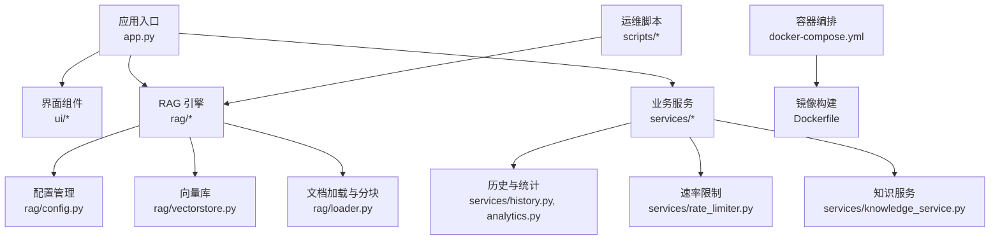
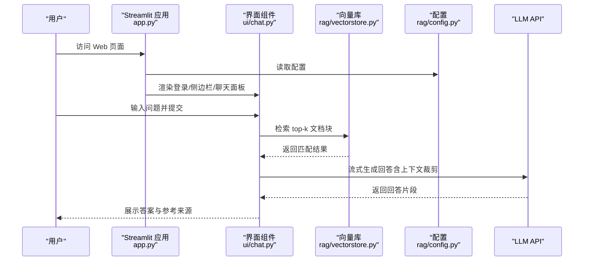
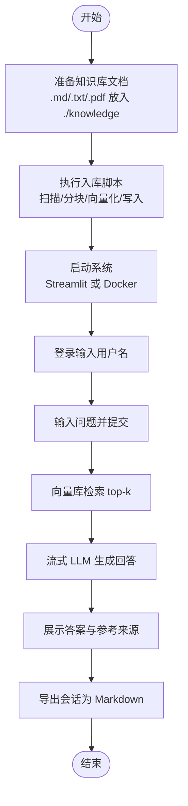
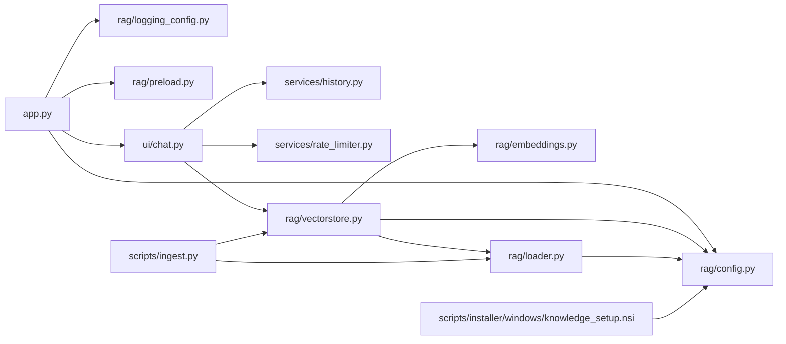

# 快速开始

<cite>
**本文引用的文件**
- [README.md](file://README.md)
- [AGENTS.md](file://AGENTS.md)
- [CLAUDE.md](file://CLAUDE.md)
- [app.py](file://app.py)
- [config.yaml](file://config.yaml)
- [requirements.txt](file://requirements.txt)
- [Dockerfile](file://Dockerfile)
- [docker-compose.yml](file://docker-compose.yml)
- [scripts/ingest.py](file://scripts/ingest.py)
- [rag/config.py](file://rag/config.py)
- [rag/vectorstore.py](file://rag/vectorstore.py)
- [rag/loader.py](file://rag/loader.py)
- [ui/chat.py](file://ui/chat.py)
- [services/knowledge_service.py](file://services/knowledge_service.py)
- [scripts/installer/windows/knowledge_setup.nsi](file://scripts/installer/windows/knowledge_setup.nsi)
</cite>

## 目录
1. [简介](#简介)
2. [项目结构](#项目结构)
3. [核心组件](#核心组件)
4. [架构总览](#架构总览)
5. [详细组件解析](#详细组件解析)
6. [依赖关系分析](#依赖关系分析)
7. [性能注意事项](#性能注意事项)
8. [故障排除指南](#故障排除指南)
9. [结论](#结论)
10. [附录](#附录)

## 简介
本指南面向首次接触“知识管理系统”的用户，提供从环境准备、依赖安装、Docker 部署到系统启动与首次使用的完整操作步骤；并给出智能问答、文档入库等核心功能的使用示例，以及常见配置项与参数说明、故障排除方法，帮助您快速上手。

## 项目结构
该系统采用“Streamlit 界面 + RAG 检索引擎 + 业务服务层”的分层架构，核心模块如下：
- 应用入口与界面：app.py、ui/*（登录、侧边栏、聊天面板、主题）
- RAG 引擎：rag/*（配置、嵌入、向量库、文档加载、预加载、健康检查、日志）
- 业务服务：services/*（统计、历史、速率限制、知识服务）
- 运维脚本：scripts/*（文档入库、清库、离线打包、Windows 安装器）
- 配置与容器：config.yaml、requirements.txt、Dockerfile、docker-compose.yml

图表来源
- [app.py](file://app.py)
- [rag/config.py](file://rag/config.py)
- [rag/vectorstore.py](file://rag/vectorstore.py)
- [rag/loader.py](file://rag/loader.py)
- [ui/chat.py](file://ui/chat.py)
- [services/knowledge_service.py](file://services/knowledge_service.py)
- [docker-compose.yml](file://docker-compose.yml)
- [Dockerfile](file://Dockerfile)

章节来源
- [README.md](file://README.md)
- [AGENTS.md](file://AGENTS.md)
- [CLAUDE.md](file://CLAUDE.md)

## 核心组件
- 配置管理：通过 Pydantic 校验与环境变量替换，集中管理 LLM、Embedding、向量库、知识库、速率限制、UI 等配置。
- 文档加载与分块：支持 .md/.txt/.pdf，按标题层级与语义边界切分，保留元数据。
- 向量库：基于 ChromaDB 的持久化存储，支持集合切换、增删改查、统计与清空。
- 检索链：检索 top-k、距离阈值过滤、上下文裁剪、流式 LLM 生成与降级。
- 界面与交互：登录、侧边栏、聊天面板、反馈、仪表盘、导出会话。
- 业务服务：会话历史持久化、统计报表、速率限制、文档预览。

章节来源
- [rag/config.py](file://rag/config.py)
- [rag/loader.py](file://rag/loader.py)
- [rag/vectorstore.py](file://rag/vectorstore.py)
- [ui/chat.py](file://ui/chat.py)
- [services/knowledge_service.py](file://services/knowledge_service.py)

## 架构总览
下图展示了从浏览器到 LLM 的典型请求链路，以及文档入库与向量库的关系。

图表来源
- [app.py](file://app.py)
- [ui/chat.py](file://ui/chat.py)
- [rag/vectorstore.py](file://rag/vectorstore.py)
- [rag/config.py](file://rag/config.py)

## 详细组件解析

### 环境与依赖准备
- Python 环境要求：建议使用 Python 3.10+（详见技术栈说明）。
- 安装依赖：先安装生产依赖，如需测试可额外安装开发依赖。
- 离线模型：推荐通过 model_root 配置本地模型路径，嵌入模型与重排序模型均支持 `local_files_only` 离线加载。

章节来源
- [requirements.txt](file://requirements.txt)
- [AGENTS.md](file://AGENTS.md)
- [CLAUDE.md](file://CLAUDE.md)

### Docker 部署（推荐）
- 构建镜像：使用多阶段构建，包含构建依赖与运行时依赖，镜像内非 root 用户运行。
- 健康检查：通过 Streamlit 内核健康端点进行探测。
- 端口暴露：默认 8501。
- 数据卷挂载：知识库文档、向量库、聊天记录、审计日志持久化。
- 环境变量覆盖：可通过 compose 覆盖 LLM API 配置。

章节来源
- [Dockerfile](file://Dockerfile)
- [docker-compose.yml](file://docker-compose.yml)

### 本地启动（非容器）
- 启动 Web 界面：使用 Streamlit 运行应用入口。
- 初始化：应用启动时会后台预加载检索链，首次加载约需 15 秒。
- 登录：进入聊天页面前需完成登录（用户名即会话隔离维度）。

章节来源
- [app.py](file://app.py)
- [ui/chat.py](file://ui/chat.py)

### 首次使用全流程
- 准备知识库文档：将 .md/.txt/.pdf 放入知识库目录（默认 ./knowledge）。
- 文档入库：执行入库脚本，扫描目录、分块、向量化并写入向量库。
- 启动系统：运行 Streamlit 应用或使用 Docker Compose。
- 提交问题：在聊天面板输入问题，系统自动检索并流式生成回答。
- 查看来源：回答末尾显示参考来源清单。
- 导出会话：支持导出当前会话为 Markdown 文件。

图表来源
- [scripts/ingest.py](file://scripts/ingest.py)
- [rag/loader.py](file://rag/loader.py)
- [rag/vectorstore.py](file://rag/vectorstore.py)
- [ui/chat.py](file://ui/chat.py)

章节来源
- [scripts/ingest.py](file://scripts/ingest.py)
- [rag/loader.py](file://rag/loader.py)
- [rag/vectorstore.py](file://rag/vectorstore.py)
- [ui/chat.py](file://ui/chat.py)

### 常见配置项与参数说明
- LLM 配置：API 基础地址、API Key、模型名、温度、最大输出、上下文窗口。
- Embedding 配置：模型名、本地路径（支持 ${MODEL_ROOT} 变量；为空则在线下载）。
- Reranker 配置：重排序模型名、本地路径（Cross-Encoder 二次精排）。
- 向量库配置：持久化目录、集合名、top_k、距离阈值（非归一化嵌入默认 10000）。
- 知识库配置：文档目录、分块大小、分块重叠。
- 速率限制：是否启用、每分钟最大请求数、最大输入长度。
- 多轮对话：最大对话轮次。
- 审计日志：是否启用。
- UI 配置：标题、副标题、公司名、公司网址、Logo 文本、默认主题（dark/light）。
- 管理员用户：用于仪表盘全局视图。

章节来源
- [config.yaml](file://config.yaml)
- [rag/config.py](file://rag/config.py)

### 使用示例
- 智能问答：在聊天面板输入问题，系统检索知识库并流式返回答案，附带参考来源。
- 文档入库：新增或更新知识库文档后，执行入库脚本完成增量更新。
- 仪表盘：管理员可查看全局统计，普通用户查看个人统计与热门查询。
- 导出会话：一键导出当前会话为 Markdown 文件，便于归档。

章节来源
- [ui/chat.py](file://ui/chat.py)
- [scripts/ingest.py](file://scripts/ingest.py)
- [app.py](file://app.py)

## 依赖关系分析
- 应用入口依赖配置与日志初始化，随后按需加载 UI、RAG 与服务模块。
- RAG 引擎内部通过配置模块读取参数，向量库与加载器相互协作完成入库与检索。
- 业务服务依赖历史与速率限制模块，为界面提供统计与风控能力。
- 运维脚本与安装器依赖配置文件，实现离线部署与系统集成。

图表来源
- [app.py](file://app.py)
- [rag/config.py](file://rag/config.py)
- [rag/vectorstore.py](file://rag/vectorstore.py)
- [rag/loader.py](file://rag/loader.py)
- [ui/chat.py](file://ui/chat.py)
- [scripts/ingest.py](file://scripts/ingest.py)
- [scripts/installer/windows/knowledge_setup.nsi](file://scripts/installer/windows/knowledge_setup.nsi)

章节来源
- [app.py](file://app.py)
- [rag/config.py](file://rag/config.py)
- [rag/vectorstore.py](file://rag/vectorstore.py)
- [rag/loader.py](file://rag/loader.py)
- [ui/chat.py](file://ui/chat.py)
- [scripts/ingest.py](file://scripts/ingest.py)
- [scripts/installer/windows/knowledge_setup.nsi](file://scripts/installer/windows/knowledge_setup.nsi)

## 性能注意事项
- 向量库检索优化：通过全局单例缓存 embedding 模型，减少重复加载；检索时复用 embedding 模型，避免二次实例化。
- 上下文裁剪：根据模型上下文窗口动态裁剪检索结果，提升响应速度与准确性。
- 流式生成与降级：优先流式输出，失败时自动降级为非流式，保证用户体验。
- 距离阈值过滤：通过距离阈值过滤低相关度结果，减少无效 LLM 调用。

章节来源
- [CLAUDE.md](file://CLAUDE.md)
- [rag/vectorstore.py](file://rag/vectorstore.py)
- [ui/chat.py](file://ui/chat.py)

## 故障排除指南
- 初始化失败：若系统初始化失败，界面会提示错误并提供重试按钮；请检查 LLM API 配置与网络连通性。
- 无结果回答：若检索不到相关内容，系统会提示"知识库中暂无匹配内容"（不进行兜底通用知识回答），请确认文档已入库或调整问法。
- PDF 解析失败：缺少 PDF 解析依赖时会报导入错误，请安装所需依赖后重试。
- 速率限制：当超过每分钟最大请求数或输入过长时，系统会提示限制信息；请降低频率或缩短输入。
- Docker 健康检查失败：检查容器端口映射、卷挂载与环境变量覆盖是否正确。
- Windows 安装器：安装时可配置 LLM API 信息，安装完成后可使用“编辑配置”修改。

章节来源
- [ui/chat.py](file://ui/chat.py)
- [rag/loader.py](file://rag/loader.py)
- [Dockerfile](file://Dockerfile)
- [docker-compose.yml](file://docker-compose.yml)
- [scripts/installer/windows/knowledge_setup.nsi](file://scripts/installer/windows/knowledge_setup.nsi)

## 结论
通过本快速开始指南，您可以完成从环境准备、依赖安装、Docker 部署到系统启动与首次使用的全流程操作；配合文档入库与智能问答示例，即可高效地构建与使用知识管理系统。遇到问题时，可依据故障排除指南定位并解决。

## 附录

### 常用命令速查
- 安装依赖：安装生产与开发依赖
- 运行测试：执行单元测试
- 文档入库：扫描并入库知识库文档
- 清空向量库：清空当前集合
- 启动 Web 界面：使用 Streamlit 运行应用入口
- 打包离线安装包：生成 Windows/Linux 安装包

章节来源
- [AGENTS.md](file://AGENTS.md)