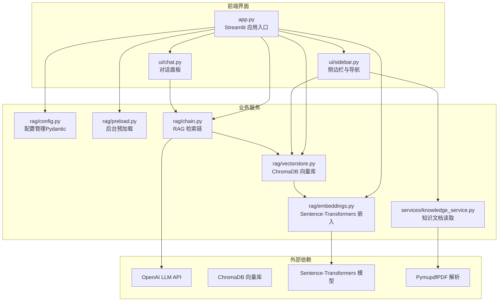
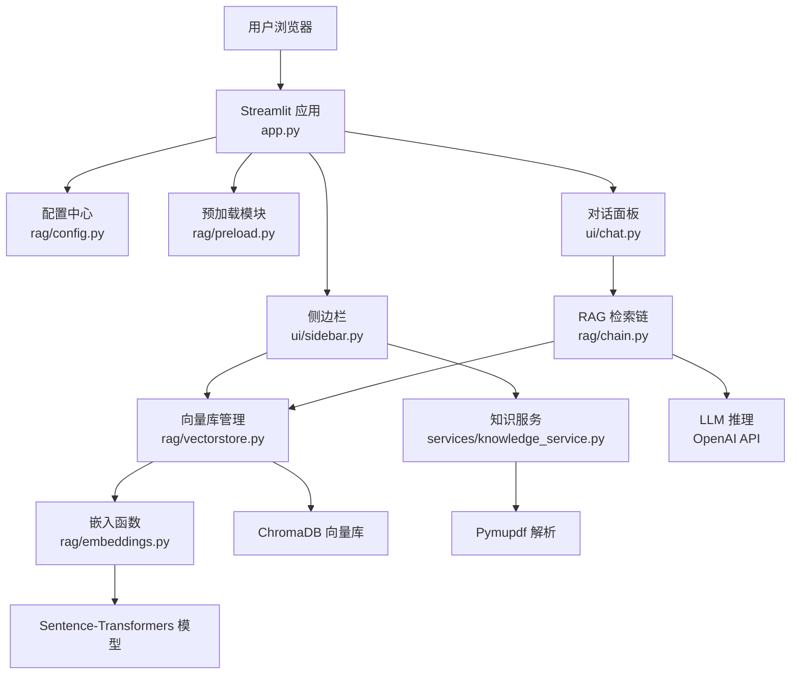
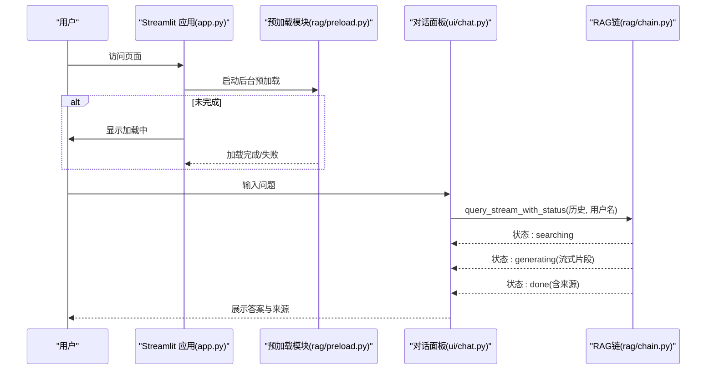
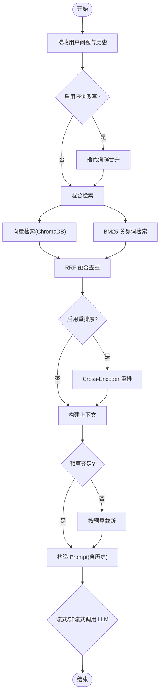
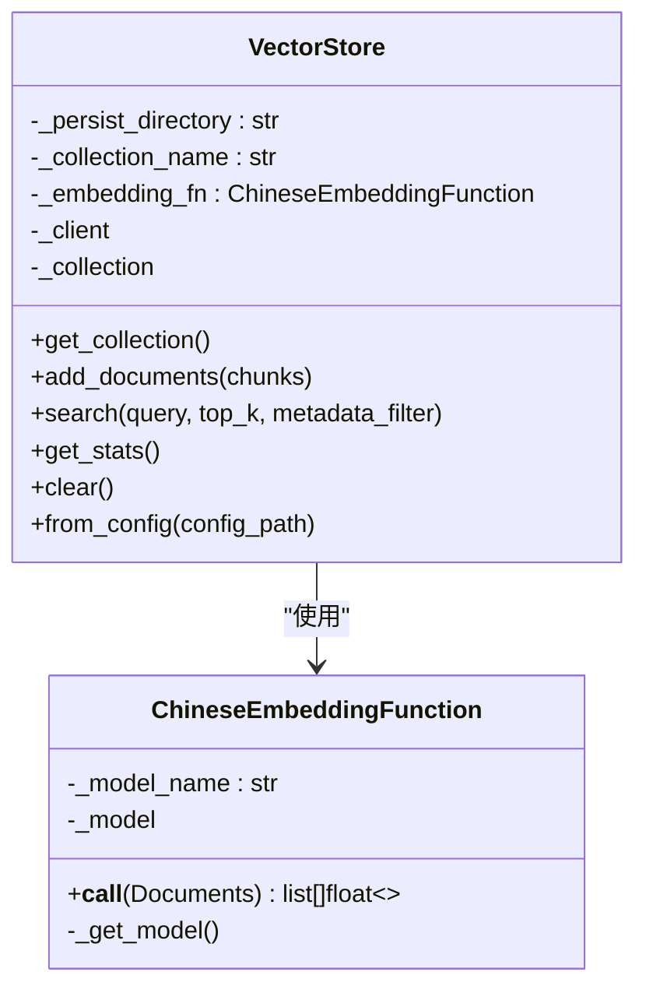
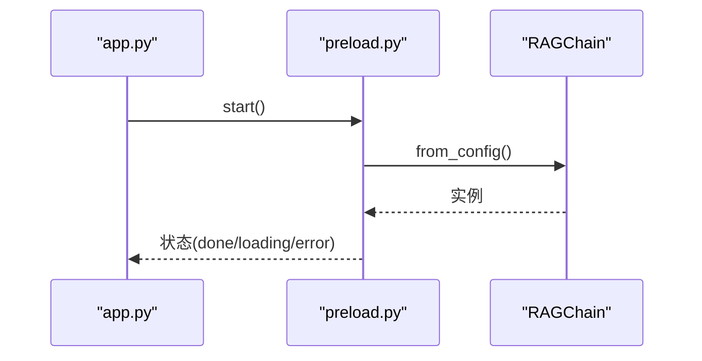
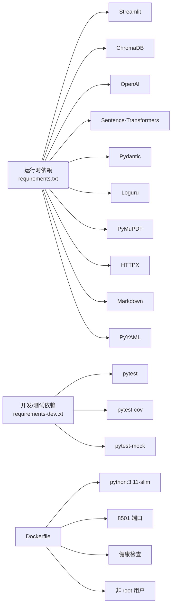

# 技术栈

<cite>
**本文引用的文件**
- [requirements.txt](file://requirements.txt)
- [requirements-dev.txt](file://requirements-dev.txt)
- [Dockerfile](file://Dockerfile)
- [app.py](file://app.py)
- [config.yaml](file://config.yaml)
- [rag/config.py](file://rag/config.py)
- [rag/embeddings.py](file://rag/embeddings.py)
- [rag/vectorstore.py](file://rag/vectorstore.py)
- [rag/chain.py](file://rag/chain.py)
- [rag/preload.py](file://rag/preload.py)
- [ui/chat.py](file://ui/chat.py)
- [ui/sidebar.py](file://ui/sidebar.py)
- [services/knowledge_service.py](file://services/knowledge_service.py)
- [tests/test_chain.py](file://tests/test_chain.py)
- [tests/test_embeddings.py](file://tests/test_embeddings.py)
- [tests/test_vectorstore.py](file://tests/test_vectorstore.py)
</cite>

## 目录
1. [简介](#简介)
2. [项目结构](#项目结构)
3. [核心组件](#核心组件)
4. [架构总览](#架构总览)
5. [详细组件分析](#详细组件分析)
6. [依赖关系分析](#依赖关系分析)
7. [性能考量](#性能考量)
8. [故障排查指南](#故障排查指南)
9. [结论](#结论)
10. [附录](#附录)

## 简介
本技术栈文档面向知识管理系统，系统采用"Streamlit Web 界面 + RAG 检索增强 + ChromaDB 向量数据库 + Sentence-Transformers 嵌入模型 + Cross-Encoder 重排序模型 + OpenAI LLM API"的组合方案，围绕中文技术文档的知识问答场景设计。本文从技术选型原因、版本与兼容性、整体架构、关键组件与数据流、依赖关系、性能与可靠性、以及运维部署等方面进行系统化说明，帮助开发者快速理解并开展二次开发。

## 项目结构
- 项目采用"前端界面（Streamlit）+ 业务服务（RAG/向量库/配置/预加载）+ 知识服务（文档读取/历史/限流）+ 测试与脚本"的分层组织方式，核心入口为 Streamlit 应用，通过模块化拆分实现高内聚、低耦合。支持离线部署，嵌入模型与重排序模型可通过本地路径加载。

图表来源
- [app.py:1-189](file://app.py#L1-L189)
- [ui/chat.py:1-190](file://ui/chat.py#L1-L190)
- [ui/sidebar.py:1-192](file://ui/sidebar.py#L1-L192)
- [rag/config.py:1-184](file://rag/config.py#L1-L184)
- [rag/preload.py:1-73](file://rag/preload.py#L1-L73)
- [rag/vectorstore.py:1-209](file://rag/vectorstore.py#L1-L209)
- [rag/embeddings.py:1-48](file://rag/embeddings.py#L1-L48)
- [rag/chain.py:1-590](file://rag/chain.py#L1-L590)
- [services/knowledge_service.py:1-46](file://services/knowledge_service.py#L1-L46)

章节来源
- [app.py:1-189](file://app.py#L1-L189)
- [ui/chat.py:1-190](file://ui/chat.py#L1-L190)
- [ui/sidebar.py:1-192](file://ui/sidebar.py#L1-L192)
- [rag/config.py:1-184](file://rag/config.py#L1-L184)
- [rag/preload.py:1-73](file://rag/preload.py#L1-L73)
- [rag/vectorstore.py:1-209](file://rag/vectorstore.py#L1-L209)
- [rag/embeddings.py:1-48](file://rag/embeddings.py#L1-L48)
- [rag/chain.py:1-590](file://rag/chain.py#L1-L590)
- [services/knowledge_service.py:1-46](file://services/knowledge_service.py#L1-L46)

## 核心组件
- Streamlit Web 框架：提供交互式 Web 界面，负责登录、侧边栏导航、对话面板、仪表盘与导出等功能。
- RAG 检索链：实现“检索（向量+BM25）→ 重排序（Cross-Encoder）→ 构建 Prompt → LLM 生成”的完整流程，支持多轮对话与流式输出。
- ChromaDB 向量数据库：持久化存储文档向量与元数据，提供高效相似度检索与集合管理。
- Sentence-Transformers 嵌入模型：提供中文语义向量化能力，支持在线/离线模型加载（通过 local_files_only 参数）。
- Cross-Encoder 重排序模型：基于 BAAI/bge-reranker-base 的二次精排，类级别缓存避免重复加载。
- OpenAI LLM API：作为大语言模型推理后端，支持流式与非流式调用、指数退避重试。
- 配置与预加载：通过 Pydantic 校验配置，集中管理 LLM、嵌入、向量库、知识库、限流与 UI；后台线程预加载链路，提升首屏体验。
- 知识服务：提供 PDF/Markdown/TXT 文档读取、会话历史管理、限流与审计日志等辅助能力。

章节来源
- [app.py:1-189](file://app.py#L1-L189)
- [rag/chain.py:1-590](file://rag/chain.py#L1-L590)
- [rag/vectorstore.py:1-209](file://rag/vectorstore.py#L1-L209)
- [rag/embeddings.py:1-48](file://rag/embeddings.py#L1-L48)
- [rag/config.py:1-184](file://rag/config.py#L1-L184)
- [rag/preload.py:1-73](file://rag/preload.py#L1-L73)
- [services/knowledge_service.py:1-46](file://services/knowledge_service.py#L1-L46)

## 架构总览
系统采用“前端 Web + 后端服务 + 向量数据库 + 大模型 API”的分层架构。前端通过 Streamlit 渲染界面，后端通过 RAG 链路完成检索与生成，向量库负责语义检索，嵌入模型负责语义编码，LLM API 负责生成回答。

图表来源
- [app.py:1-189](file://app.py#L1-L189)
- [ui/chat.py:1-190](file://ui/chat.py#L1-L190)
- [ui/sidebar.py:1-192](file://ui/sidebar.py#L1-L192)
- [rag/config.py:1-184](file://rag/config.py#L1-L184)
- [rag/preload.py:1-73](file://rag/preload.py#L1-L73)
- [rag/chain.py:1-590](file://rag/chain.py#L1-L590)
- [rag/vectorstore.py:1-209](file://rag/vectorstore.py#L1-L209)
- [rag/embeddings.py:1-48](file://rag/embeddings.py#L1-L48)
- [services/knowledge_service.py:1-46](file://services/knowledge_service.py#L1-L46)

## 详细组件分析

### Streamlit Web 界面与控制流
- 登录与会话：未登录时渲染登录页，登录后进入侧边栏与对话面板。
- 预加载与初始化：后台线程预加载 RAGChain，避免首次请求卡顿；若加载失败，提供重试机制。
- 对话面板：支持输入校验、速率限制、会话历史注入、流式输出与反馈收集。
- 侧边栏：提供导航、会话管理、知识库文档浏览、历史记录、系统状态与操作按钮。

图表来源
- [app.py:1-189](file://app.py#L1-L189)
- [rag/preload.py:1-73](file://rag/preload.py#L1-L73)
- [ui/chat.py:1-190](file://ui/chat.py#L1-L190)
- [rag/chain.py:1-590](file://rag/chain.py#L1-L590)

章节来源
- [app.py:1-189](file://app.py#L1-L189)
- [ui/chat.py:1-190](file://ui/chat.py#L1-L190)
- [ui/sidebar.py:1-192](file://ui/sidebar.py#L1-L192)
- [rag/preload.py:1-73](file://rag/preload.py#L1-L73)

### RAG 检索链与处理逻辑
- 检索策略：向量检索（ChromaDB）+ BM25 关键词检索，使用 RRF 融合去重与排序。
- 重排序：Cross-Encoder 模型对候选结果进行二次精排，类级别缓存避免重复加载。
- 上下文构建：估算 token 预算，拼接检索结果与历史，自动截断以适配 LLM 上下文窗口。
- LLM 调用：支持流式与非流式，带指数退避重试与审计日志。
- 查询改写：对短查询结合历史进行指代消解，提升检索质量。

图表来源
- [rag/chain.py:1-590](file://rag/chain.py#L1-L590)

章节来源
- [rag/chain.py:1-590](file://rag/chain.py#L1-L590)

### 向量库与嵌入模型
- 向量库：基于 ChromaDB 的持久化客户端，支持集合创建/切换、文档增删、检索与统计。
- 嵌入函数：封装 Sentence-Transformers，支持在线/离线模型加载，延迟初始化避免冷启动。
- 全局缓存：VectorStore 单例缓存，相同配置仅加载一次嵌入模型，降低资源消耗。

图表来源
- [rag/vectorstore.py:1-209](file://rag/vectorstore.py#L1-L209)
- [rag/embeddings.py:1-48](file://rag/embeddings.py#L1-L48)

章节来源
- [rag/vectorstore.py:1-209](file://rag/vectorstore.py#L1-L209)
- [rag/embeddings.py:1-48](file://rag/embeddings.py#L1-L48)

### 配置与预加载
- 配置：使用 Pydantic 校验，支持 YAML 加载与环境变量替换，集中管理 LLM、嵌入、向量库、知识库、限流与 UI。
- 预加载：后台线程加载 RAGChain，状态持久于模块级字典，避免 Streamlit rerun 导致的重置。

图表来源
- [app.py:1-189](file://app.py#L1-L189)
- [rag/preload.py:1-73](file://rag/preload.py#L1-L73)
- [rag/chain.py:584-590](file://rag/chain.py#L584-L590)

章节来源
- [rag/config.py:1-184](file://rag/config.py#L1-L184)
- [rag/preload.py:1-73](file://rag/preload.py#L1-L73)

## 依赖关系分析
- 运行时依赖：Streamlit、ChromaDB、OpenAI SDK、Sentence-Transformers、Pydantic、Loguru、PyMuPDF、HTTPX、Markdown、PyYAML。
- 开发与测试依赖：pytest、pytest-cov、pytest-mock。
- 镜像与容器：基于 Python 3.11 slim，多阶段构建，健康检查与非 root 用户运行，暴露 8501 端口。

图表来源
- [requirements.txt:1-11](file://requirements.txt#L1-L11)
- [requirements-dev.txt:1-5](file://requirements-dev.txt#L1-L5)
- [Dockerfile:1-68](file://Dockerfile#L1-L68)

章节来源
- [requirements.txt:1-11](file://requirements.txt#L1-L11)
- [requirements-dev.txt:1-5](file://requirements-dev.txt#L1-L5)
- [Dockerfile:1-68](file://Dockerfile#L1-L68)

## 性能考量
- 首屏加载：通过后台预加载与模块级缓存，避免首次请求的模型加载开销。
- 检索效率：向量检索 + BM25 + RRF 融合，兼顾语义与关键词召回；BM25 索引按文档数量动态重建。
- 上下文控制：基于字符/token 估算与预算分配，防止超出 LLM 上下文窗口。
- LLM 调用：支持流式输出，显著改善用户体验；非流式作为降级路径，配合指数退避重试提升稳定性。
- 向量库优化：集合级别的去重与增量更新，减少重复入库；统计接口便于监控与容量规划。

## 故障排查指南
- 初始化失败：检查 LLM API 配置与网络连通性；可在前端点击“重试加载”触发重新预加载。
- 无检索结果：确认知识库文档已入库、分块参数合理、阈值设置适当；查看向量库统计信息。
- LLM 调用异常：关注流式/非流式降级路径与重试日志；核对模型名称与密钥。
- 模型加载缓慢：推荐使用离线本地模型（通过 model_root 配置路径），嵌入模型与重排序模型均支持 `local_files_only` 离线加载；首次在线下载约需 15 秒，后续通过缓存复用。
- PDF 读取失败：确认 PyMuPDF 安装与文件权限；回退为纯文本/Markdown。

章节来源
- [ui/chat.py:1-190](file://ui/chat.py#L1-L190)
- [rag/chain.py:408-590](file://rag/chain.py#L408-L590)
- [rag/embeddings.py:1-48](file://rag/embeddings.py#L1-L48)
- [services/knowledge_service.py:1-46](file://services/knowledge_service.py#L1-L46)

## 结论
本技术栈围绕中文技术文档问答场景，通过 Streamlit 提供易用界面，RAG 链路实现高质量检索与生成，ChromaDB 与 Sentence-Transformers 构建稳定高效的语义检索基础，OpenAI LLM API 提供强大的生成能力。配合完善的配置、预加载与测试体系，系统具备良好的可维护性与扩展性。

## 附录

### 版本与兼容性
- Python：3.11（容器镜像使用 python:3.11-slim）
- Streamlit：1.40.2
- ChromaDB：0.5.23
- OpenAI SDK：1.58.1
- Sentence-Transformers：3.3.1
- Pydantic：2.10.3
- Loguru：0.7.3
- PyMuPDF：1.25.0
- HTTPX：0.28.1
- Markdown：3.7
- PyYAML：6.0.2
- 开发与测试：pytest、pytest-cov、pytest-mock

章节来源
- [requirements.txt:1-11](file://requirements.txt#L1-L11)
- [requirements-dev.txt:1-5](file://requirements-dev.txt#L1-L5)
- [Dockerfile:1-68](file://Dockerfile#L1-L68)

### 配置要点
- LLM：API Base、API Key、模型、温度、最大 Token、上下文窗口。
- 模型根目录：离线部署时通过环境变量 MODEL_ROOT 指定模型根路径（默认 ./model）。
- LLM：API Base、API Key、模型、温度、最大 Token、上下文窗口。
- 嵌入：模型名、本地路径（可使用 ${MODEL_ROOT} 变量）。
- 重排序：模型名、本地路径（Cross-Encoder 二次精排）。
- 向量库：持久化目录、集合名、Top-K、距离阈值（非归一化嵌入需设较大值如 10000）。
- 知识库：文档目录、分块大小与重叠。
- 速率限制：开关、每分钟请求数、输入长度上限。
- 多轮对话：最大轮次。
- 审计日志：开关。
- UI：标题、副标题、公司名、公司网址、Logo 文本、默认主题。

章节来源
- [config.yaml:1-46](file://config.yaml#L1-L46)
- [rag/config.py:1-184](file://rag/config.py#L1-L184)

### 测试策略
- 单元测试覆盖：BM25 检索、RRF 融合、Token 估算、上下文构建、向量库增删查改、嵌入函数延迟加载等。
- 测试目标：保证检索与生成链路的正确性、健壮性与边界行为。

章节来源
- [tests/test_chain.py:1-160](file://tests/test_chain.py#L1-L160)
- [tests/test_vectorstore.py:1-146](file://tests/test_vectorstore.py#L1-L146)
- [tests/test_embeddings.py:1-30](file://tests/test_embeddings.py#L1-L30)