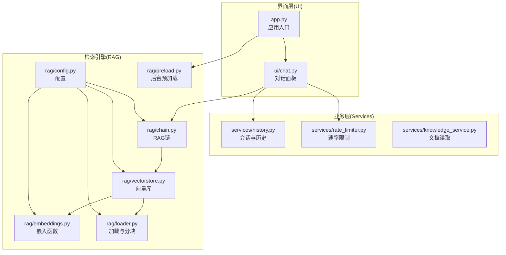
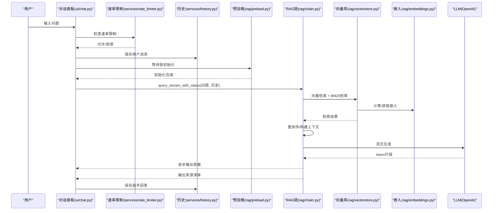
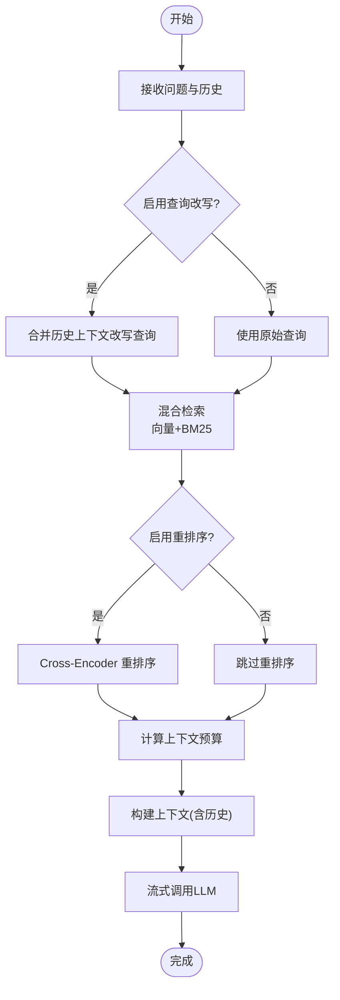
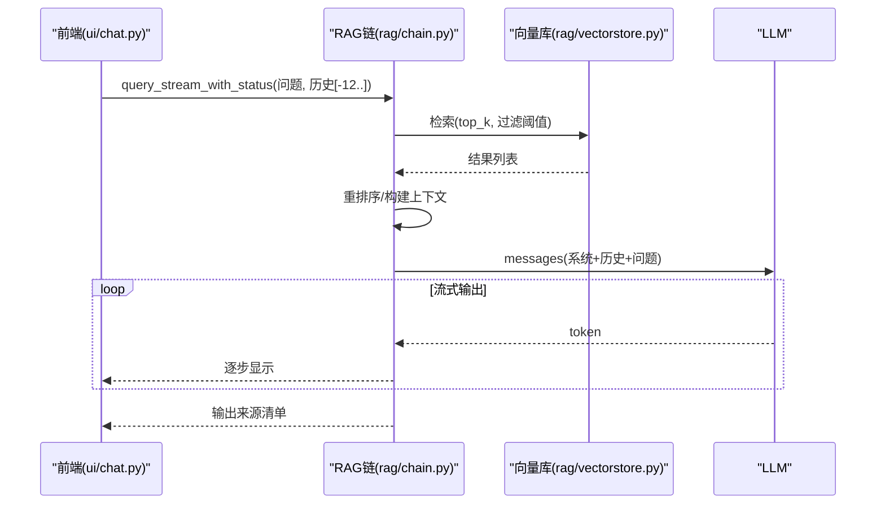
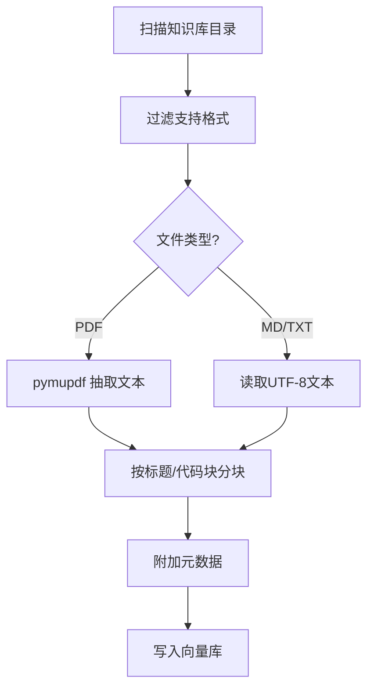
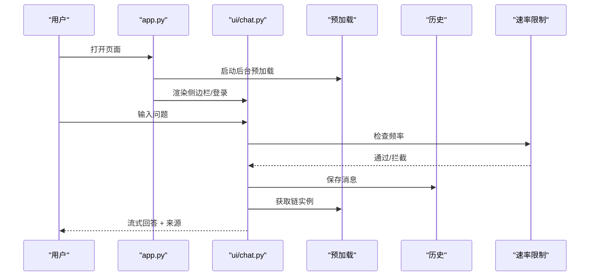
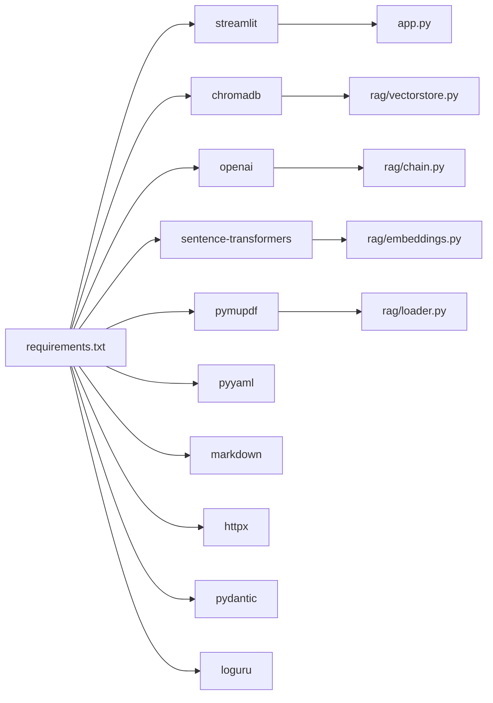

# 核心特性

<cite>
**本文引用的文件**
- [README.md](file://README.md)
- [app.py](file://app.py)
- [config.yaml](file://config.yaml)
- [rag/config.py](file://rag/config.py)
- [rag/chain.py](file://rag/chain.py)
- [rag/vectorstore.py](file://rag/vectorstore.py)
- [rag/embeddings.py](file://rag/embeddings.py)
- [rag/loader.py](file://rag/loader.py)
- [rag/preload.py](file://rag/preload.py)
- [ui/chat.py](file://ui/chat.py)
- [services/history.py](file://services/history.py)
- [services/rate_limiter.py](file://services/rate_limiter.py)
- [services/knowledge_service.py](file://services/knowledge_service.py)
- [requirements.txt](file://requirements.txt)
</cite>

## 目录
1. [简介](#简介)
2. [项目结构](#项目结构)
3. [核心组件](#核心组件)
4. [架构总览](#架构总览)
5. [详细组件分析](#详细组件分析)
6. [依赖分析](#依赖分析)
7. [性能考虑](#性能考虑)
8. [故障排查指南](#故障排查指南)
9. [结论](#结论)
10. [附录](#附录)

## 简介
本系统是一个“诊断知识管理系统”，通过大模型与对话交互的方式，帮助用户查询公共接口、参数说明与代码示例。系统围绕以下核心特性展开：
- RAG 检索增强生成：结合向量检索与关键词检索，融合重排序与上下文构建，实现精准回答。
- 智能问答：支持多轮对话、查询改写、上下文记忆与流式生成。
- 多模态文档支持：原生支持 Markdown、纯文本与 PDF 文档，自动分块与元数据保留。
- 实时对话界面：基于 Streamlit 的 Web 界面，提供即时反馈与来源标注。

系统目标是让用户以自然语言提问，即可获得来自知识库的权威答案与参考来源，显著提升研发与运维效率。

**章节来源**
- [README.md:1-3](file://README.md#L1-L3)

## 项目结构
系统采用“UI 层 + 业务层 + 检索引擎”三层架构：
- UI 层：Streamlit 页面与组件（登录、侧边栏、聊天面板、主题）。
- 业务层：历史记录、速率限制、知识服务等。
- 检索引擎：RAG 链、向量库、嵌入模型、文档加载与分块。

**图表来源**
- [app.py:54-100](file://app.py#L54-L100)
- [ui/chat.py:19-73](file://ui/chat.py#L19-L73)
- [rag/chain.py:160-590](file://rag/chain.py#L160-L590)
- [rag/vectorstore.py:24-209](file://rag/vectorstore.py#L24-L209)
- [rag/embeddings.py:19-48](file://rag/embeddings.py#L19-L48)
- [rag/loader.py:22-259](file://rag/loader.py#L22-L259)
- [rag/config.py:48-184](file://rag/config.py#L48-L184)
- [rag/preload.py:22-73](file://rag/preload.py#L22-L73)
- [services/history.py:19-270](file://services/history.py#L19-L270)
- [services/rate_limiter.py:45-71](file://services/rate_limiter.py#L45-L71)
- [services/knowledge_service.py:16-46](file://services/knowledge_service.py#L16-L46)

**章节来源**
- [app.py:54-100](file://app.py#L54-L100)
- [config.yaml:1-46](file://config.yaml#L1-L46)

## 核心组件
- RAG 检索链：负责混合检索、重排序、上下文构建与流式 LLM 调用。
- 向量库：ChromaDB 持久化，支持集合切换、统计与文档增删。
- 嵌入函数：SentenceTransformers 中文向量模型，支持在线/离线加载。
- 文档加载与分块：递归扫描知识库目录，按标题与代码块边界切分，保留元数据。
- 预加载：后台线程加载 RAGChain，避免首屏卡顿。
- 会话与历史：按用户与会话隔离的 JSON 存储，支持导出。
- 速率限制：基于内存的时间窗计数，防刷与资源保护。
- 知识服务：读取文档全文（含 PDF），用于预览与调试。

**章节来源**
- [rag/chain.py:160-590](file://rag/chain.py#L160-L590)
- [rag/vectorstore.py:24-209](file://rag/vectorstore.py#L24-L209)
- [rag/embeddings.py:19-48](file://rag/embeddings.py#L19-L48)
- [rag/loader.py:22-259](file://rag/loader.py#L22-L259)
- [rag/preload.py:22-73](file://rag/preload.py#L22-L73)
- [services/history.py:19-270](file://services/history.py#L19-L270)
- [services/rate_limiter.py:45-71](file://services/rate_limiter.py#L45-L71)
- [services/knowledge_service.py:16-46](file://services/knowledge_service.py#L16-L46)

## 架构总览
系统通过“预加载 + RAG 链 + 向量库”的组合实现“所问即所得”。用户在前端输入问题，系统先进行检索与重排序，再构建上下文并调用 LLM，最终以流式方式返回答案与来源。

**图表来源**
- [ui/chat.py:96-190](file://ui/chat.py#L96-L190)
- [services/rate_limiter.py:45-71](file://services/rate_limiter.py#L45-L71)
- [services/history.py:193-221](file://services/history.py#L193-L221)
- [rag/preload.py:22-73](file://rag/preload.py#L22-L73)
- [rag/chain.py:408-508](file://rag/chain.py#L408-L508)
- [rag/vectorstore.py:57-143](file://rag/vectorstore.py#L57-L143)
- [rag/embeddings.py:41-48](file://rag/embeddings.py#L41-L48)

## 详细组件分析

### RAG 检索增强生成
- 混合检索：向量检索（ChromaDB）+ BM25 关键词检索，使用 RRF 融合去重与重排。
- 查询改写：对短查询结合历史上下文进行指代消解，提升检索质量。
- 上下文构建：估算 token 预算，自动裁剪与截断，保证不超过 LLM 上下文窗口。
- 重排序：Cross-Encoder（BAAI/bge-reranker-base）二次精排，提高相关性。
- 流式生成：OpenAI Chat Completions 流式输出，支持指数退避重试与降级非流式。
- 多轮对话：自动注入最近若干轮对话历史，控制历史长度避免溢出。

**图表来源**
- [rag/chain.py:213-235](file://rag/chain.py#L213-L235)
- [rag/chain.py:236-299](file://rag/chain.py#L236-L299)
- [rag/chain.py:300-331](file://rag/chain.py#L300-L331)
- [rag/chain.py:376-407](file://rag/chain.py#L376-L407)
- [rag/chain.py:408-508](file://rag/chain.py#L408-L508)

**章节来源**
- [rag/chain.py:160-590](file://rag/chain.py#L160-L590)

### 智能问答与多轮对话
- 多轮对话：自动截断最近 6 轮历史，每条内容限制长度，避免上下文溢出。
- 上下文记忆：通过“来源”与“标题”元数据，帮助用户识别回答出处。
- 流式体验：前端逐片显示回答，同时显示“检索中/生成中”状态。
- 反馈机制：用户可对回答进行点赞/点踩，记录审计日志。

**图表来源**
- [ui/chat.py:136-190](file://ui/chat.py#L136-L190)
- [rag/chain.py:390-407](file://rag/chain.py#L390-L407)
- [rag/chain.py:408-508](file://rag/chain.py#L408-L508)

**章节来源**
- [ui/chat.py:96-190](file://ui/chat.py#L96-L190)
- [rag/chain.py:390-407](file://rag/chain.py#L390-L407)

### 多模态文档支持
- 支持格式：Markdown(.md)、纯文本(.txt)、PDF(.pdf)。
- 加载策略：PDF 使用 pymupdf 抽取文本；文本直接读取 UTF-8。
- 分块策略：按标题与代码块边界切分，保留上下文；支持重叠避免语义断裂。
- 元数据：记录来源路径、标题、块索引、文件类型等，便于溯源与导出。

**图表来源**
- [rag/loader.py:131-198](file://rag/loader.py#L131-L198)
- [rag/loader.py:101-119](file://rag/loader.py#L101-L119)
- [rag/loader.py:29-89](file://rag/loader.py#L29-L89)

**章节来源**
- [rag/loader.py:131-198](file://rag/loader.py#L131-L198)
- [services/knowledge_service.py:16-46](file://services/knowledge_service.py#L16-L46)

### 实时对话界面
- 登录与主题：统一设置页面标题、图标与主题色。
- 预加载提示：首次进入显示“系统初始化中”，完成后进入对话。
- 会话管理：自动命名首个问题为会话标题，支持多会话与导出。
- 速率限制：在前端给出友好提示，避免频繁请求。
- 审计反馈：点赞/点踩记录审计日志，便于后续优化。

**图表来源**
- [app.py:54-100](file://app.py#L54-L100)
- [ui/chat.py:19-73](file://ui/chat.py#L19-L73)
- [rag/preload.py:22-73](file://rag/preload.py#L22-L73)
- [services/history.py:193-221](file://services/history.py#L193-L221)
- [services/rate_limiter.py:45-71](file://services/rate_limiter.py#L45-L71)

**章节来源**
- [app.py:54-100](file://app.py#L54-L100)
- [ui/chat.py:19-73](file://ui/chat.py#L19-L73)

## 依赖分析
系统依赖主要集中在检索与生成两大块：
- 检索：ChromaDB（向量库）、SentenceTransformers（中文嵌入）、BM25（内置实现）。
- 生成：OpenAI SDK（流式 Chat Completions）。
- UI：Streamlit（Web 界面）。
- 配置与工具：Pydantic（配置校验）、PyYAML（配置解析）、Loguru（日志）。

**图表来源**
- [requirements.txt:1-11](file://requirements.txt#L1-L11)
- [rag/vectorstore.py:10-16](file://rag/vectorstore.py#L10-L16)
- [rag/embeddings.py:12-17](file://rag/embeddings.py#L12-L17)
- [rag/chain.py:12-18](file://rag/chain.py#L12-L18)
- [rag/loader.py:7-16](file://rag/loader.py#L7-L16)
- [app.py:11-13](file://app.py#L11-L13)

**章节来源**
- [requirements.txt:1-11](file://requirements.txt#L1-L11)

## 性能考虑
- 首屏加载：后台线程预加载 RAGChain，减少用户等待时间。
- 检索效率：向量检索 + BM25 混合，RRF 融合兼顾召回与精度；BM25 延迟初始化并与向量库同步。
- 上下文控制：基于字符/token 估算，动态裁剪避免溢出；历史仅保留最近若干轮。
- 生成鲁棒性：流式调用失败自动降级为非流式；指数退避重试提升成功率。
- 存储与并发：ChromaDB 持久化；嵌入模型类级缓存；会话隔离避免竞争。

[本节为通用性能建议，无需特定文件引用]

## 故障排查指南
- 初始化失败：若“系统初始化中”长时间停留或报错，检查 LLM API 配置与网络连通性；点击“重试加载”触发重新预加载。
- 无结果回答：确认知识库文档已入库且内容足够；尝试更具体或不同表述；查看“知识库状态”统计。
- 速率限制：出现“请求过于频繁”提示时，等待窗口结束或降低提问频率。
- PDF 解析：缺少 pymupdf 依赖会导致 PDF 读取失败，按提示安装依赖后重试。
- 审计与反馈：点赞/点踩会记录审计日志，便于定位问题与优化。

**章节来源**
- [ui/chat.py:24-45](file://ui/chat.py#L24-L45)
- [rag/preload.py:33-49](file://rag/preload.py#L33-L49)
- [rag/loader.py:101-119](file://rag/loader.py#L101-L119)
- [services/rate_limiter.py:45-71](file://services/rate_limiter.py#L45-L71)

## 结论
本系统通过“RAG 检索增强生成 + 多模态文档支持 + 实时对话界面”的组合，实现了高准确率、强可解释性的智能问答体验。其核心优势在于：
- 检索与生成解耦，易于扩展与优化；
- 多轮对话与上下文记忆，满足复杂问题求解；
- 流式输出与可视化反馈，显著提升交互体验；
- 预加载与缓存策略，保障性能与稳定性。

[本节为总结性内容，无需特定文件引用]

## 附录

### 使用示例与效果展示
- 示例 1：接口调用
  - 问法：如何调用某个公共接口？
  - 效果：系统返回接口说明、参数列表与示例代码，并标注来源文档。
- 示例 2：多轮追问
  - 问法：上一个问题中提到的参数如何设置？
  - 效果：系统自动注入历史，改写查询后再次检索，给出针对性回答。
- 示例 3：PDF 文档
  - 问法：某份 PDF 中的流程图如何实现？
  - 效果：系统从 PDF 文本中检索相关内容，结合上下文生成可执行方案。

[本节为概念性示例，无需特定文件引用]