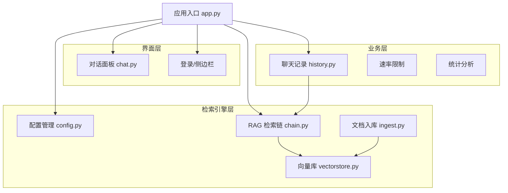
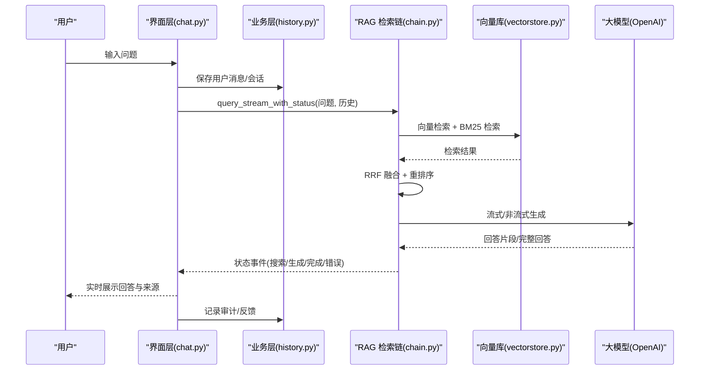
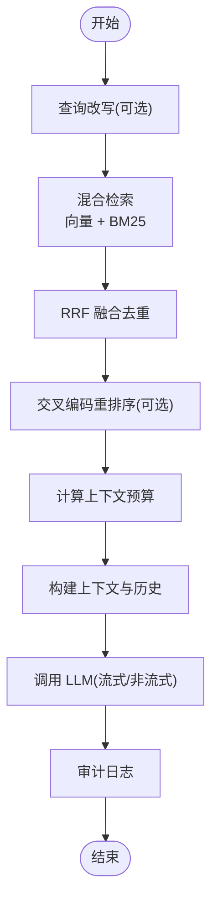
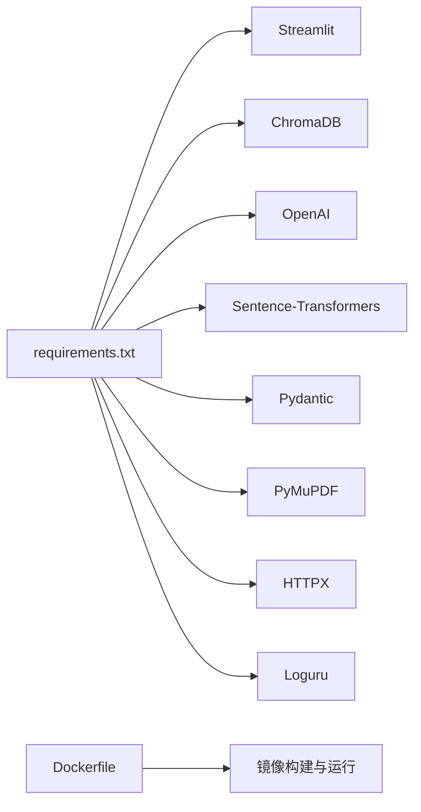

# 项目介绍

<cite>
**本文引用的文件**
- [README.md](file://README.md)
- [知识库说明](file://knowledge/README.md)
- [应用入口 app.py](file://app.py)
- [配置管理 config.py](file://rag/config.py)
- [RAG 检索链 chain.py](file://rag/chain.py)
- [向量库 vectorstore.py](file://rag/vectorstore.py)
- [对话面板 chat.py](file://ui/chat.py)
- [聊天记录 history.py](file://services/history.py)
- [文档入库 ingest.py](file://scripts/ingest.py)
- [Dockerfile](file://Dockerfile)
- [requirements.txt](file://requirements.txt)
- [配置文件 config.yaml](file://config.yaml)
- [示例知识文档：Acceptor 头文件](file://knowledge/_acceptor_8h.md)
- [示例知识文档：C++ 函数 API](file://knowledge/cpp-function-api.md)
</cite>

## 目录
1. [简介](#简介)
2. [项目结构](#项目结构)
3. [核心组件](#核心组件)
4. [架构总览](#架构总览)
5. [详细组件分析](#详细组件分析)
6. [依赖关系分析](#依赖关系分析)
7. [性能考量](#性能考量)
8. [故障排查指南](#故障排查指南)
9. [结论](#结论)
10. [附录](#附录)

## 简介
本项目是一个“诊断知识管理系统”，其核心目标是通过大模型实现智能问答，帮助用户以自然语言的方式快速定位和理解内部知识库中的信息，尤其是公共接口如何调用、参数说明以及示例代码等内容。系统采用 RAG（检索增强生成）架构，结合向量检索与关键词检索，提供稳定、可追溯、可审计的知识问答体验。

- 使命：让知识检索从“按文件名/关键词模糊查找”升级为“自然语言精准问答”，降低学习成本，提升研发效率。
- 价值体现：
  - 诊断知识管理：快速定位接口、类、函数、协议等技术资产。
  - 公共接口调用指导：提供参数说明、调用流程、注意事项。
  - 示例代码提供：在回答中直接引用具体来源，便于复制粘贴与验证。

项目发展历程与应用场景：
- 发展历程：从基础文档入库、向量化、检索，到引入多轮对话、交叉编码重排序、来源溯源与审计日志，逐步形成稳定的 RAG 管线。
- 应用场景：研发团队内部知识库问答、新员工入职培训、接口变更追踪、问题诊断辅助等。
- 预期收益：缩短问题定位时间、减少重复劳动、提升知识沉淀与复用率。

## 项目结构
项目采用“界面层 + 业务层 + 检索引擎层”的分层组织，配合配置驱动与持久化能力，形成可部署、可扩展的知识问答平台。

图表来源
- [应用入口 app.py:54-100](file://app.py#L54-L100)
- [对话面板 chat.py:19-73](file://ui/chat.py#L19-L73)
- [RAG 检索链 chain.py:160-191](file://rag/chain.py#L160-L191)
- [向量库 vectorstore.py:24-60](file://rag/vectorstore.py#L24-L60)
- [配置管理 config.py:102-116](file://rag/config.py#L102-L116)
- [文档入库 ingest.py:25-61](file://scripts/ingest.py#L25-L61)

章节来源
- [应用入口 app.py:54-100](file://app.py#L54-L100)
- [知识库说明:1-29](file://knowledge/README.md#L1-L29)

## 核心组件
- 配置中心：集中管理 LLM、Embedding、向量库、知识库、速率限制、UI 等配置，支持环境变量替换与热加载。
- 检索链：负责混合检索（向量 + BM25）、RRF 融合、交叉编码重排序、上下文预算与多轮历史注入、流式/非流式 LLM 调用与重试。
- 向量库：基于 ChromaDB 的持久化向量存储，支持集合切换、增量更新、统计查询。
- 界面层：Streamlit 构建的聊天界面，支持会话管理、来源展示、反馈收集、导出下载。
- 业务服务：历史记录持久化、会话管理、导出、仪表盘统计、速率限制与审计日志。

章节来源
- [配置管理 config.py:102-184](file://rag/config.py#L102-L184)
- [RAG 检索链 chain.py:160-590](file://rag/chain.py#L160-L590)
- [向量库 vectorstore.py:24-209](file://rag/vectorstore.py#L24-L209)
- [对话面板 chat.py:19-190](file://ui/chat.py#L19-L190)
- [聊天记录 history.py:19-270](file://services/history.py#L19-L270)

## 架构总览
系统以“配置驱动 + 检索增强 + 流式生成”为核心，围绕知识库进行“入库 → 向量化 → 检索 → 生成 → 展示 → 审计”的闭环。

图表来源
- [对话面板 chat.py:96-190](file://ui/chat.py#L96-L190)
- [RAG 检索链 chain.py:408-508](file://rag/chain.py#L408-L508)
- [向量库 vectorstore.py:124-143](file://rag/vectorstore.py#L124-L143)

## 详细组件分析

### 配置管理（config.py）
- 设计要点：Pydantic 校验 + 环境变量替换 + 单例缓存，确保配置一致性与运行时可切换。
- 关键点：
  - LLM：API Base、API Key、模型、温度、上下文窗口、最大输出长度。
  - Embedding：模型名、本地路径。
  - 向量库：持久化目录、集合名、TopK、距离阈值。
  - 知识库：文档目录、分块大小、重叠长度。
  - 速率限制：开关、每分钟请求上限、输入长度上限。
  - UI：标题、副标题、公司名、Logo、默认主题。
  - 多轮对话：最大轮次。
  - 审计：开关、管理员列表。

章节来源
- [配置管理 config.py:48-184](file://rag/config.py#L48-L184)
- [配置文件 config.yaml:4-46](file://config.yaml#L4-L46)

### RAG 检索链（chain.py）
- 设计要点：混合检索（向量 + BM25）+ RRF 融合 + Cross-Encoder 重排序 + 上下文预算 + 多轮历史注入 + 流式/非流式 LLM 调用 + 重试与降级。
- 关键点：
  - 系统提示词约束：仅依据知识库内容回答、格式要求、来源标注。
  - BM25 关键词检索：中文分词、IDF/TF 计算、评分排序。
  - RRF 融合：基于内容哈希去重，综合向量与 BM25 排名。
  - 上下文构建：按 token 预算裁剪，注入最近对话历史。
  - LLM 调用：OpenAI SDK，流式优先，失败指数退避重试，非流式降级。
  - 审计日志：记录检索数量、生成长度、耗时、结果预览等。

图表来源
- [RAG 检索链 chain.py:21-508](file://rag/chain.py#L21-L508)

章节来源
- [RAG 检索链 chain.py:160-590](file://rag/chain.py#L160-L590)

### 向量库（vectorstore.py）
- 设计要点：ChromaDB 持久化客户端 + 集合同名缓存 + 增量更新（按 ID 删除再插入）。
- 关键点：
  - 文档添加：支持批量、增量覆盖。
  - 检索：相似度查询 + 元数据过滤。
  - 统计：集合数量、不同来源文件数。
  - 集合切换：支持多知识库场景。

章节来源
- [向量库 vectorstore.py:24-209](file://rag/vectorstore.py#L24-L209)

### 界面层（chat.py）
- 设计要点：Streamlit 聊天面板 + 会话历史加载/保存 + 来源展示 + 反馈收集 + 导出。
- 关键点：
  - 初始化等待：预加载检索引擎，失败重试。
  - 速率限制：输入长度与 QPM 限制。
  - 多轮对话：注入最近若干轮历史。
  - 来源展示：在回答末尾列出参考来源。
  - 审计：记录反馈、查询摘要。

章节来源
- [对话面板 chat.py:19-190](file://ui/chat.py#L19-L190)

### 业务服务（history.py）
- 设计要点：按用户/会话隔离的 JSON 持久化；支持会话列表、标题更新、切换活跃会话；导出 Markdown/JSON。
- 关键点：
  - 会话管理：创建、切换、标题更新。
  - 历史加载：支持按会话与按日期两种格式兼容。
  - 导出：Markdown 格式便于归档与分享。

章节来源
- [聊天记录 history.py:19-270](file://services/history.py#L19-L270)

### 文档入库（ingest.py）
- 设计要点：扫描知识库目录、分块、向量化、入库 ChromaDB；支持增量覆盖。
- 关键点：
  - 支持 .md/.txt/.pdf；PDF 使用 PyMuPDF 解析。
  - 统计来源文件数量与入库块数。
  - 与配置联动，读取 chunk_size/chunk_overlap 等参数。

章节来源
- [文档入库 ingest.py:25-61](file://scripts/ingest.py#L25-L61)

### 应用入口（app.py）
- 设计要点：Streamlit 页面配置、主题应用、登录态管理、侧边栏与页面切换、仪表盘统计与导出。
- 关键点：
  - 预加载检索链，保持会话内复用。
  - 登录页与聊天页切换。
  - 管理员仪表盘：查询量、活跃用户、零结果、平均延迟、好评差评、日趋势、知识库状态、会话导出。

章节来源
- [应用入口 app.py:54-184](file://app.py#L54-L184)

## 依赖关系分析
- 运行时依赖：Streamlit、ChromaDB、OpenAI SDK、Sentence-Transformers、Pydantic、PyMuPDF、HTTPX、Loguru 等。
- 镜像构建：多阶段 Dockerfile，离线模型支持，健康检查与非 root 用户运行。
- 端口与暴露：Streamlit 默认端口 8501，容器健康检查通过本地探活。

图表来源
- [requirements.txt:1-11](file://requirements.txt#L1-L11)
- [Dockerfile:1-68](file://Dockerfile#L1-L68)

章节来源
- [requirements.txt:1-11](file://requirements.txt#L1-L11)
- [Dockerfile:1-68](file://Dockerfile#L1-L68)

## 性能考量
- 检索性能
  - 向量检索：通过距离阈值过滤低相关度，减少上下文拼接与 LLM 负担。
  - BM25 补充：在向量检索无结果时兜底，提升召回。
  - RRF 融合：避免重复文档，兼顾语义与关键词。
- 上下文预算
  - 基于字符与 token 估算，动态裁剪内容，防止超出 LLM 上下文窗口。
- LLM 调用
  - 优先流式输出，实时展示；失败时指数退避重试，最终非流式降级。
- 向量库
  - 增量更新：按 ID 删除再插入，避免重复；集合切换支持多知识库。
- 预加载与缓存
  - Reranker 模型类级别缓存，避免重复加载。
  - 向量库实例按配置缓存，embedding 模型仅加载一次。

章节来源
- [RAG 检索链 chain.py:170-590](file://rag/chain.py#L170-L590)
- [向量库 vectorstore.py:181-209](file://rag/vectorstore.py#L181-L209)

## 故障排查指南
- 初始化失败
  - 现象：界面显示“系统初始化失败”。
  - 排查：检查 LLM API 配置与网络连通性；点击“重试加载”触发预加载。
- 无匹配结果
  - 现象：回答“知识库中暂无相关内容”。
  - 排查：确认文档已入库、分块合理、问题表述清晰；尝试更具体或不同问法。
- LLM 调用异常
  - 现象：生成回答时报错。
  - 排查：查看审计日志详情；检查模型名、API Key、网络代理；关注重试与降级流程。
- 会话与导出
  - 现象：找不到历史或导出为空。
  - 排查：确认当前活跃会话、会话标题是否正确更新；导出按钮位于仪表盘页。
- 向量库状态
  - 现象：仪表盘显示状态异常。
  - 排查：检查 chroma_db 目录权限与磁盘空间；查看集合数量与文件数统计。

章节来源
- [对话面板 chat.py:24-45](file://ui/chat.py#L24-L45)
- [RAG 检索链 chain.py:408-508](file://rag/chain.py#L408-L508)
- [聊天记录 history.py:246-270](file://services/history.py#L246-L270)
- [应用入口 app.py:157-168](file://app.py#L157-L168)

## 结论
本项目以“RAG + 多轮对话 + 可追溯来源 + 审计日志”为核心，构建了一个面向企业内部知识库的智能问答平台。它不仅解决了传统知识管理中“难找、难记、难用”的痛点，还通过可视化仪表盘与导出能力，提升了知识沉淀与复用的效率。对于非技术用户，系统提供了简洁直观的对话界面；对于技术用户，系统具备完善的配置、日志与可观测性，便于运维与优化。

## 附录

### 知识文档示例与格式建议
- 示例一：C++ 类头文件 API 说明，包含命名空间、类、源码片段与更新时间。
- 示例二：函数 API 文档，包含函数签名、简介、参数、返回值、详细说明、使用示例与备注。
- 格式建议：遵循知识库文档目录的 Markdown 规范，便于入库与向量化。

章节来源
- [示例知识文档：Acceptor 头文件:1-95](file://knowledge/_acceptor_8h.md#L1-L95)
- [示例知识文档：C++ 函数 API:1-42](file://knowledge/cpp-function-api.md#L1-L42)
- [知识库说明:11-29](file://knowledge/README.md#L11-L29)