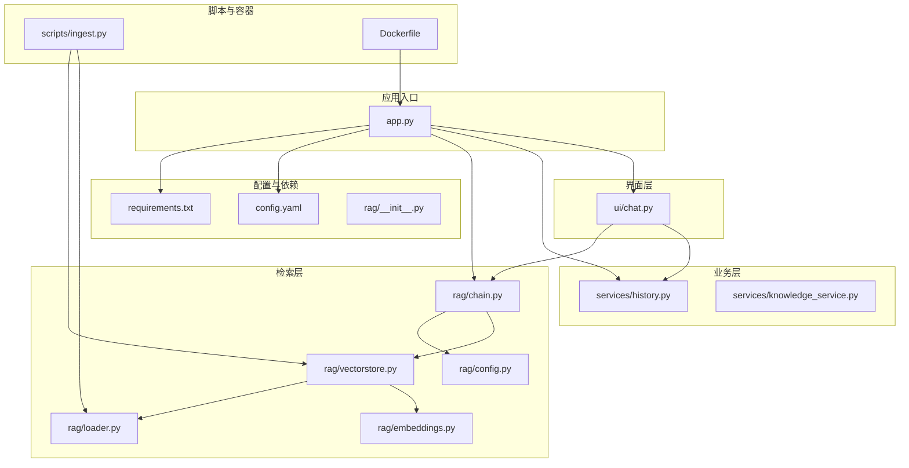
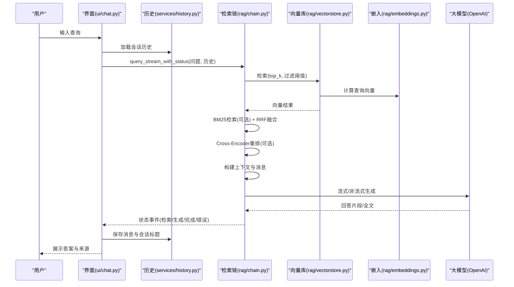
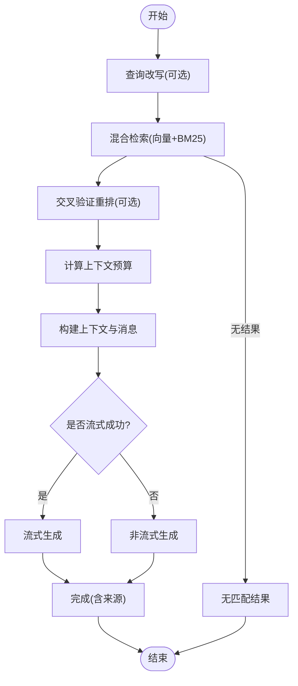
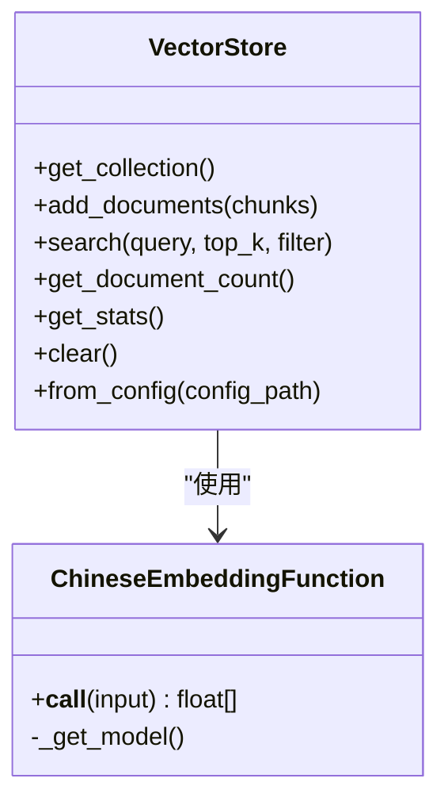
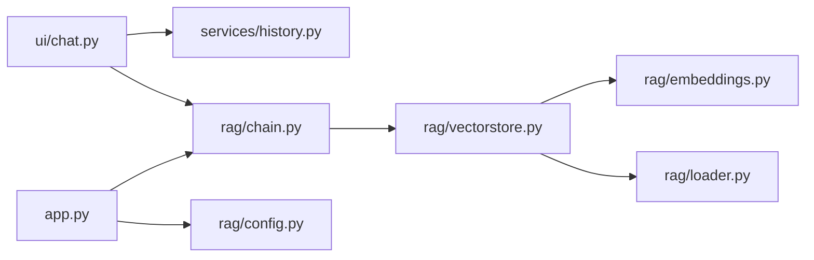

# 项目概述

<cite>
**本文引用的文件**
- [README.md](file://README.md)
- [app.py](file://app.py)
- [config.yaml](file://config.yaml)
- [requirements.txt](file://requirements.txt)
- [Dockerfile](file://Dockerfile)
- [rag/__init__.py](file://rag/__init__.py)
- [rag/config.py](file://rag/config.py)
- [rag/chain.py](file://rag/chain.py)
- [rag/vectorstore.py](file://rag/vectorstore.py)
- [rag/embeddings.py](file://rag/embeddings.py)
- [rag/loader.py](file://rag/loader.py)
- [scripts/ingest.py](file://scripts/ingest.py)
- [services/history.py](file://services/history.py)
- [services/knowledge_service.py](file://services/knowledge_service.py)
- [ui/chat.py](file://ui/chat.py)
</cite>

## 目录
1. [简介](#简介)
2. [项目结构](#项目结构)
3. [核心组件](#核心组件)
4. [架构总览](#架构总览)
5. [详细组件分析](#详细组件分析)
6. [依赖分析](#依赖分析)
7. [性能考虑](#性能考虑)
8. [故障排查指南](#故障排查指南)
9. [结论](#结论)
10. [附录](#附录)

## 简介
本项目是一个“知识管理系统”，旨在通过大模型实现“以对话方式询问公共接口如何调用，并提供示例代码”的智能问答能力。系统采用 RAG（检索增强生成）技术，结合向量检索与关键词检索，对知识库中的文档进行混合检索与重排序，最终由 LLM 生成结构化的回答，包含接口说明、参数解释与代码示例。

- 项目背景与目标：面向团队内部的 API 知识库，提供即问即答、可溯源的智能问答体验，降低沟通成本，提升研发效率。
- 解决的问题：传统知识库难以支持自然语言检索、缺乏上下文感知与多轮对话；本系统通过 RAG 技术实现“精准检索 + 结构化生成”。
- 核心价值主张：可快速上手、可扩展、可运维，支持多轮对话、会话持久化、审计日志与仪表盘统计。

**章节来源**
- [README.md:1-3](file://README.md#L1-L3)

## 项目结构
项目采用“界面层(ui/) + 业务层(services/) + 检索层(rag/)”的分层架构，配合脚本与容器化部署工具，形成完整的知识管理闭环。

**图表来源**
- [app.py:1-184](file://app.py#L1-L184)
- [ui/chat.py:1-190](file://ui/chat.py#L1-L190)
- [services/history.py:1-270](file://services/history.py#L1-L270)
- [services/knowledge_service.py:1-46](file://services/knowledge_service.py#L1-L46)
- [rag/config.py:1-184](file://rag/config.py#L1-L184)
- [rag/chain.py:1-590](file://rag/chain.py#L1-L590)
- [rag/vectorstore.py:1-209](file://rag/vectorstore.py#L1-L209)
- [rag/embeddings.py:1-48](file://rag/embeddings.py#L1-L48)
- [rag/loader.py:1-259](file://rag/loader.py#L1-L259)
- [scripts/ingest.py:1-62](file://scripts/ingest.py#L1-L62)
- [Dockerfile:1-68](file://Dockerfile#L1-L68)
- [config.yaml:1-46](file://config.yaml#L1-L46)
- [requirements.txt:1-11](file://requirements.txt#L1-L11)
- [rag/__init__.py:1-4](file://rag/__init__.py#L1-L4)

**章节来源**
- [app.py:1-184](file://app.py#L1-L184)
- [ui/chat.py:1-190](file://ui/chat.py#L1-L190)
- [services/history.py:1-270](file://services/history.py#L1-L270)
- [services/knowledge_service.py:1-46](file://services/knowledge_service.py#L1-L46)
- [rag/config.py:1-184](file://rag/config.py#L1-L184)
- [rag/chain.py:1-590](file://rag/chain.py#L1-L590)
- [rag/vectorstore.py:1-209](file://rag/vectorstore.py#L1-L209)
- [rag/embeddings.py:1-48](file://rag/embeddings.py#L1-L48)
- [rag/loader.py:1-259](file://rag/loader.py#L1-L259)
- [scripts/ingest.py:1-62](file://scripts/ingest.py#L1-L62)
- [Dockerfile:1-68](file://Dockerfile#L1-L68)
- [config.yaml:1-46](file://config.yaml#L1-L46)
- [requirements.txt:1-11](file://requirements.txt#L1-L11)
- [rag/__init__.py:1-4](file://rag/__init__.py#L1-L4)

## 核心组件
- 应用入口与界面
  - app.py：Streamlit 应用入口，负责页面配置、主题应用、登录态与会话初始化、仪表盘渲染与聊天页渲染。
  - ui/chat.py：聊天面板渲染与交互，包含输入处理、速率限制、会话历史加载、流式回答与反馈收集。
- 检索与生成链路
  - rag/chain.py：RAG 检索链，支持混合检索（向量+BM25）、RRF 融合、交叉验证重排、上下文预算与多轮注入、流式/非流式 LLM 调用。
  - rag/vectorstore.py：ChromaDB 向量库管理，提供集合创建、增删改查、统计与全局单例缓存。
  - rag/embeddings.py：中文嵌入函数封装，支持在线/离线模型加载。
  - rag/loader.py：文档加载与分块，支持 .md/.txt/.pdf，按标题与语义边界切分，保留元数据。
- 业务与持久化
  - services/history.py：按用户/会话隔离的聊天历史持久化与导出。
  - services/knowledge_service.py：知识库文档读取服务（含 PDF 提取）。
- 配置与脚本
  - rag/config.py：Pydantic 驱动的配置模型，支持环境变量替换与全局单例。
  - config.yaml：默认配置文件，定义 LLM、Embedding、向量库、知识库、速率限制、UI 等。
  - scripts/ingest.py：文档入库脚本，扫描知识库目录，分块、向量化并写入向量库。
- 容器化与版本
  - Dockerfile：多阶段构建镜像，健康检查与非 root 运行。
  - requirements.txt：Python 依赖清单。
  - rag/__init__.py：版本号声明。

**章节来源**
- [app.py:1-184](file://app.py#L1-L184)
- [ui/chat.py:1-190](file://ui/chat.py#L1-L190)
- [rag/chain.py:1-590](file://rag/chain.py#L1-L590)
- [rag/vectorstore.py:1-209](file://rag/vectorstore.py#L1-L209)
- [rag/embeddings.py:1-48](file://rag/embeddings.py#L1-L48)
- [rag/loader.py:1-259](file://rag/loader.py#L1-L259)
- [services/history.py:1-270](file://services/history.py#L1-L270)
- [services/knowledge_service.py:1-46](file://services/knowledge_service.py#L1-L46)
- [rag/config.py:1-184](file://rag/config.py#L1-L184)
- [config.yaml:1-46](file://config.yaml#L1-L46)
- [scripts/ingest.py:1-62](file://scripts/ingest.py#L1-L62)
- [Dockerfile:1-68](file://Dockerfile#L1-L68)
- [requirements.txt:1-11](file://requirements.txt#L1-L11)
- [rag/__init__.py:1-4](file://rag/__init__.py#L1-L4)

## 架构总览
系统整体工作流分为“知识入库”和“问答推理”两条主线：

**图表来源**
- [ui/chat.py:96-190](file://ui/chat.py#L96-L190)
- [rag/chain.py:408-508](file://rag/chain.py#L408-L508)
- [rag/vectorstore.py:124-143](file://rag/vectorstore.py#L124-L143)
- [rag/embeddings.py:41-47](file://rag/embeddings.py#L41-L47)

## 详细组件分析

### RAG 检索链（rag/chain.py）
- 设计要点
  - 混合检索：向量检索（ChromaDB）+ BM25 关键词检索，使用 RRF 融合去重与重排。
  - 上下文预算：基于系统提示、问题、历史与最大输出估算可用 token，动态裁剪上下文。
  - 多轮注入：最近若干轮对话历史注入到消息序列，提升上下文连贯性。
  - 重排优化：Cross-Encoder 模型对候选结果进行二次精排，提高相关性。
  - 生成策略：优先流式输出，失败时回退至非流式；统一审计日志与错误状态。
- 关键流程（查询改写 → 检索 → 重排 → 构建上下文 → LLM 生成 → 溯源）

**图表来源**
- [rag/chain.py:213-235](file://rag/chain.py#L213-L235)
- [rag/chain.py:236-299](file://rag/chain.py#L236-L299)
- [rag/chain.py:300-331](file://rag/chain.py#L300-L331)
- [rag/chain.py:376-407](file://rag/chain.py#L376-L407)
- [rag/chain.py:408-508](file://rag/chain.py#L408-L508)

**章节来源**
- [rag/chain.py:160-590](file://rag/chain.py#L160-L590)

### 向量库与嵌入（rag/vectorstore.py, rag/embeddings.py）
- VectorStore
  - 单例缓存：相同配置仅创建一次实例，避免重复加载嵌入模型。
  - 增量更新：按文档 ID 删除旧块后写入新块，支持知识库热更新。
  - 统计与切换：提供集合统计、切换与清空能力。
- ChineseEmbeddingFunction
  - 延迟加载：首次使用时加载模型，支持在线/离线路径。
  - 编码输出：返回浮点向量列表，供 ChromaDB 存储。

**图表来源**
- [rag/vectorstore.py:24-209](file://rag/vectorstore.py#L24-L209)
- [rag/embeddings.py:19-48](file://rag/embeddings.py#L19-L48)

**章节来源**
- [rag/vectorstore.py:1-209](file://rag/vectorstore.py#L1-L209)
- [rag/embeddings.py:1-48](file://rag/embeddings.py#L1-L48)

### 文档加载与分块（rag/loader.py）
- 支持格式：.md/.txt/.pdf，按标题与语义边界切分，保留元数据（来源、标题、块索引、类型）。
- PDF 提取：使用 pymupdf/fitz 读取文本，按页拼接。
- 元数据导出：提供文件元数据列表，便于 UI 展示与管理。

**章节来源**
- [rag/loader.py:1-259](file://rag/loader.py#L1-L259)

### 配置与环境（rag/config.py, config.yaml）
- 配置模型：LLM、Embedding、向量库、知识库、速率限制、UI、审计日志、管理员列表等。
- 环境变量替换：支持 ${VAR} 与 ${VAR:-默认值} 语法，便于容器化部署。
- 全局单例：避免重复解析配置，提供 reload 与 dict 兼容接口。

**章节来源**
- [rag/config.py:1-184](file://rag/config.py#L1-L184)
- [config.yaml:1-46](file://config.yaml#L1-L46)

### 应用入口与界面（app.py, ui/chat.py）
- app.py
  - 初始化主题、日志、会话状态与预加载链。
  - 登录态判断与侧边栏渲染，支持仪表盘与聊天页切换。
- ui/chat.py
  - 首次加载阻塞等待链初始化，失败时提供重试。
  - 会话历史加载、消息渲染、输入校验、速率限制、反馈收集。
  - 通过链路流式事件驱动 UI 更新，展示检索中/生成中/完成/错误状态。

**章节来源**
- [app.py:1-184](file://app.py#L1-L184)
- [ui/chat.py:1-190](file://ui/chat.py#L1-L190)

### 业务与持久化（services/history.py, services/knowledge_service.py）
- 历史服务
  - 按用户/会话隔离存储，支持会话列表、切换、标题更新与消息持久化。
  - 兼容旧版按日期的历史文件，保证迁移平滑。
  - 提供 Markdown/JSON 导出能力。
- 知识服务
  - 读取文档全文（含 PDF），用于预览与导出。

**章节来源**
- [services/history.py:1-270](file://services/history.py#L1-L270)
- [services/knowledge_service.py:1-46](file://services/knowledge_service.py#L1-L46)

### 文档入库脚本（scripts/ingest.py）
- 扫描知识库目录，加载并分块文档，向量化后写入向量库。
- 增量更新：同源文档块先删除再写入，避免重复。
- 统计来源文件数量，输出入库结果。

**章节来源**
- [scripts/ingest.py:1-62](file://scripts/ingest.py#L1-L62)

### 容器化与运行（Dockerfile, requirements.txt）
- 多阶段构建：builder 阶段安装依赖，runtime 阶段最小化镜像并以非 root 用户运行。
- 健康检查：通过 Streamlit 内核健康端点探测。
- 端口暴露与启动命令：默认监听 8501，禁用 CORS/XSRF。

**章节来源**
- [Dockerfile:1-68](file://Dockerfile#L1-L68)
- [requirements.txt:1-11](file://requirements.txt#L1-L11)

## 依赖分析
- 外部依赖
  - Streamlit：Web 界面框架。
  - ChromaDB：向量数据库。
  - sentence-transformers：中文嵌入模型。
  - OpenAI SDK：大模型调用。
  - PyMuPDF：PDF 文本提取。
  - Pydantic/YAML/loguru：配置、日志与校验。
- 内部模块耦合
  - ui/chat.py 依赖 services/history.py 与 rag/chain.py。
  - rag/chain.py 依赖 rag/vectorstore.py 与 rag/config.py。
  - rag/vectorstore.py 依赖 rag/embeddings.py 与 rag/loader.py。
  - app.py 依赖 rag/config.py 与 rag/preload（预加载链）。

**图表来源**
- [ui/chat.py:1-190](file://ui/chat.py#L1-L190)
- [services/history.py:1-270](file://services/history.py#L1-L270)
- [rag/chain.py:1-590](file://rag/chain.py#L1-L590)
- [rag/vectorstore.py:1-209](file://rag/vectorstore.py#L1-L209)
- [rag/embeddings.py:1-48](file://rag/embeddings.py#L1-L48)
- [rag/loader.py:1-259](file://rag/loader.py#L1-L259)
- [app.py:1-184](file://app.py#L1-L184)
- [rag/config.py:1-184](file://rag/config.py#L1-L184)

**章节来源**
- [requirements.txt:1-11](file://requirements.txt#L1-L11)
- [rag/chain.py:14-18](file://rag/chain.py#L14-L18)
- [rag/vectorstore.py:10-15](file://rag/vectorstore.py#L10-L15)
- [rag/embeddings.py:12-16](file://rag/embeddings.py#L12-L16)
- [rag/loader.py:12-15](file://rag/loader.py#L12-L15)

## 性能考虑
- 检索性能
  - 向量检索：合理设置 top_k 与距离阈值，避免无关结果污染。
  - BM25 索引：与向量库文档数量同步，避免重复构建。
  - RRF 融合：减少重复文档，提升召回质量。
- 生成性能
  - 流式输出优先，失败回退非流式，降低首字节延迟。
  - 上下文预算控制：避免超出模型上下文窗口导致失败。
- 存储与加载
  - 向量库持久化目录与集合名称固定，避免频繁重建。
  - 嵌入模型延迟加载并缓存，减少重复初始化开销。
- 速率限制
  - 针对输入长度与 QPM 进行限制，防止突发流量影响稳定性。

[本节为通用建议，无需特定文件引用]

## 故障排查指南
- 初始化失败
  - 现象：聊天页显示“系统初始化失败”。
  - 排查：检查 config.yaml 中 LLM API 配置与网络连通性；点击重试加载。
  - 参考：ui/chat.py 预加载错误分支与重试按钮。
- 无匹配结果
  - 现象：回答提示“知识库中暂无相关内容”。
  - 排查：确认文档已入库（scripts/ingest.py）；调整问法或增加文档。
  - 参考：rag/chain.py 检索无结果的处理。
- LLM 调用异常
  - 现象：生成阶段报错或空内容。
  - 排查：检查 API Base/Key 与模型名称；查看审计日志；观察重试机制。
  - 参考：rag/chain.py 流式/非流式回退逻辑。
- 向量库状态异常
  - 现象：仪表盘提示向量库状态获取失败。
  - 排查：确认 chroma_db 目录存在且可写；检查集合名称与持久化路径。
  - 参考：app.py 仪表盘状态获取与异常捕获。
- PDF 读取失败
  - 现象：PDF 文档无法读取。
  - 排查：安装 pymupdf；确认文件编码与页数。
  - 参考：rag/loader.py PDF 读取与异常处理。

**章节来源**
- [ui/chat.py:24-45](file://ui/chat.py#L24-L45)
- [rag/chain.py:440-454](file://rag/chain.py#L440-L454)
- [rag/chain.py:476-495](file://rag/chain.py#L476-L495)
- [app.py:157-168](file://app.py#L157-L168)
- [rag/loader.py:101-118](file://rag/loader.py#L101-L118)

## 结论
本项目通过“文档入库 → 向量检索 → 混合检索与重排 → LLM 生成”的完整链路，实现了面向团队 API 知识库的智能问答系统。其优势在于：
- 易于部署：Dockerfile 与脚本化入库，降低运维门槛。
- 可靠稳定：流式/非流式双通道、重试与审计日志保障。
- 可扩展：模块化设计，支持多轮对话、来源溯源与仪表盘统计。
建议后续方向：引入查询改写与意图识别、多模态支持（图片/表格）、可视化检索效果与反馈闭环。

[本节为总结性内容，无需特定文件引用]

## 附录

### 快速开始指南
- 准备知识文档
  - 将 .md/.txt/.pdf 文件放入 knowledge/ 目录。
- 入库
  - 运行入库脚本，扫描并写入向量库。
- 启动应用
  - 使用 Streamlit 启动 app.py，默认端口 8501。
- 使用流程
  - 登录后进入聊天页，输入问题，查看带来源的结构化回答与示例代码。
  - 支持多轮对话、会话切换与导出。

**章节来源**
- [scripts/ingest.py:25-62](file://scripts/ingest.py#L25-L62)
- [Dockerfile:62-67](file://Dockerfile#L62-L67)
- [app.py:54-86](file://app.py#L54-L86)
- [ui/chat.py:19-73](file://ui/chat.py#L19-L73)